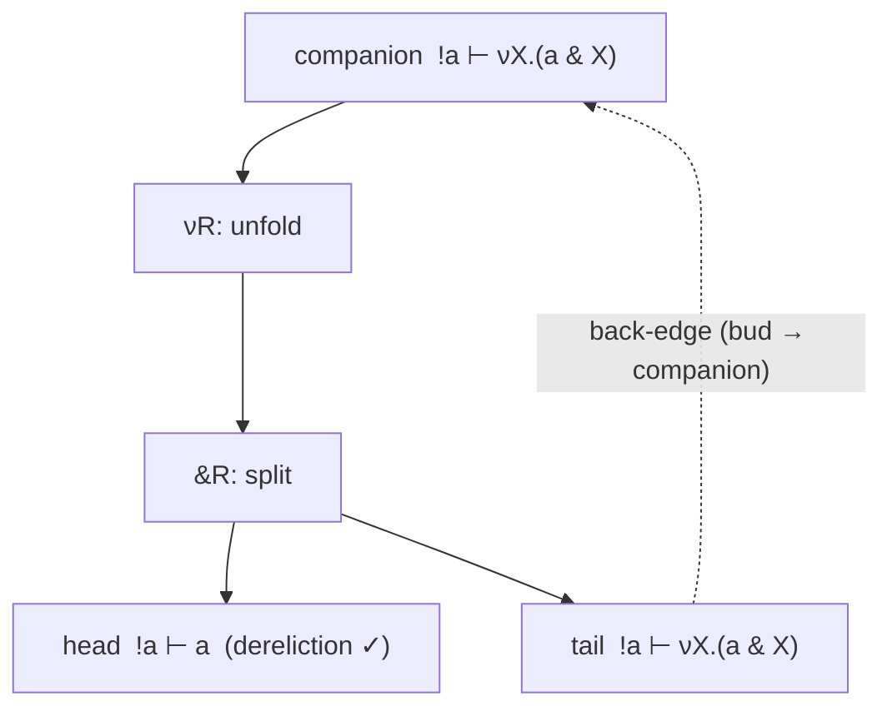

The previous chapter built data from the bottom up and always bottomed out.
This chapter goes the other way: data that **never ends**. A sensor that emits
a reading at every step, forever. A server that is always ready to answer. A
stream of packets with no last packet.

You cannot build such a thing in finitely many steps, so it is not a *least*
fixed point. It is the **greatest** one, written `ν`. And proving something
about it forces a genuinely new idea into the logic: a proof that closes a
**loop**.

## The largest solution

Recall the fixed-point equation from Chapter 22: `X = F(X)` can have many
solutions. The least, `μX.F`, held only the finite values. The **greatest**,
`νX.F`, holds *all* solutions — including the infinite ones.

Take the body `F(X) = a & X`, read as "an `a` available now, **and** the same
thing again." The greatest fixed point

$$\Box a \;:=\; \nu X.\,(a \mathbin{\&} X)$$

is a **signal**: an `a` you can take now, and after which the identical signal
remains. There is no base case and no last step. It is available forever.

In source you write it exactly like `μ`, with `nu`:

```
nu X. (a & X)          % a signal: an a now, and forever after
nu X. (a * X)          % a stream that spends a fresh linear a at every step
```

`ν` is a **negative** connective (like `&` and `⊸`): its right rule is
invertible, its left rule needs focus — the mirror image of `μ`.

$$
\frac{\Gamma \;;\; \Delta \vdash F[\nu X.F / X]}
     {\Gamma \;;\; \Delta \vdash \nu X.F}\;\nu R
\qquad\qquad
\frac{\Gamma \;;\; \Delta,\; F[\nu X.F / X] \vdash C}
     {\Gamma \;;\; \Delta,\; \nu X.F \vdash C}\;\nu L
$$

The rules are the same Knaster–Tarski unfolding as before. The difference is
entirely in how you *use* them — because now unfolding never stops.

## The problem: unfolding forever

Try to prove `!a ⊢ νX.(a & X)` — "from a reusable `a`, the signal is available
forever." Unfold the goal with `νR`:

$$!a \vdash a \mathbin{\&} (\nu X.(a \mathbin{\&} X)).$$

Split the `&` (right rule, `&R`) into two goals:

- the **head**, `!a ⊢ a` — take one `a` now, by dereliction;
- the **tail**, `!a ⊢ νX.(a & X)` — the signal again.

But the tail is *identical to where we started*. Unfold it and you get the same
two goals, forever. A naive proof search runs off the end of the world.

The head branch, at least, is ordinary: it is just dereliction, `!a ⊢ a`, which
you have proven since Chapter 5. Prove it live — this is the part of every
unfold that actually delivers a value:

```{prove}
goal: !a |- a
title: The head of each signal unfold — dereliction
hint: A single dereliction step turns the reusable !a into a usable a, then id closes it.
id: ch23-dereliction
rules: id, dereliction, copy, absorption
```

The tail is the real problem. We need a way to say "and the rest is the same
argument I already made" — without writing it out infinitely.

## The idea: close the loop

The trick is a **cyclic proof**. Instead of unfolding the tail forever, we
notice it is identical to an *ancestor* in the proof tree — the very sequent we
started from — and we close the branch by pointing back to that ancestor. The
repeated leaf is called a **bud**; the ancestor it points to is the
**companion**.



The proof tree is now *finite* — it has a back-edge instead of an infinite
branch — but it stands for an infinite unfolding. This is **coinduction**: you
justify a forever-property by showing that after making progress, you are back
in a situation you already know how to handle.

Turning cyclic proofs on is a search option (`cyclicProofs`). With it, proving
`!a ⊢ νX.(a & X)` succeeds with exactly **one** back-edge; without it, the
search hits its depth limit and gives up. The signal is genuinely coinductive.

## The danger: loops that cheat

A back-edge is powerful enough to be dangerous. What stops a proof from closing
a loop that proves something *false*? Consider `a ⊢ νX.X` — "from one throwaway
`a`, produce a value that is forever nothing in particular." Unfold `νX.X` and
you get `a ⊢ νX.X` right back: a perfect loop. If we accepted it, we would have
silently thrown the linear `a` away — and linear logic forbids discarding
resources. This is **coinductive weakening**, and it is unsound.

So cyclic proofs are kept honest by a small **guard condition** — a trusted
checker that inspects every back-edge and accepts it only if two things hold:

1. **Empty and conserved.** The *linear* resources at the bud must exactly
   match those at the companion **and be empty**. Persistent (`!`) resources are
   unconstrained. This is what rejects `a ⊢ νX.X`: the linear `a` is still
   sitting there at the bud, never consumed, so the loop is refused.
2. **Progress.** The cycle must pass through at least one real unfold on the
   fixed point — a `νR` on a `ν` (or, dually, a `μL` on a `μ`). A loop that
   spins without ever unfolding makes no progress and is refused.

The emptiness half is the subtle one, and it is why the signal above works
while `a ⊢ νX.X` fails. A forever-signal can only be *sustained* by a
persistent resource: the `!a` lives in the reusable zone, feeds one `a` to each
head by dereliction, and survives to the next turn — leaving the linear pool
empty at the bud, exactly as the guard demands. A one-shot linear `a` cannot
promise a value forever, and the guard makes that impossible to fake.

```{quiz, id=ch23-q1}
Q: Why does the guard condition insist the *linear* pool be **empty** at the back-edge, not merely unchanged?
- [x] A linear resource that is conserved but never consumed around an infinite loop is silently discarded — coinductive weakening — which breaks linearity; only persistent resources may sustain the cycle.
- [ ] Empty pools are faster to compare than non-empty ones.
- [ ] Linear resources are not allowed anywhere in coinductive proofs.
- [ ] The succedent must be empty too, so the pool is emptied to match.
explanation: If a linear `a` rode the cycle unchanged forever, it would never actually be used — the proof would have discarded it for free. That is weakening, which linear logic forbids. Requiring the pool to be empty at the bud means the ongoing value must come from the persistent zone (e.g. `!a`), which is exactly what a genuine signal looks like.
```

## Untrusted search, trusted check

Notice the division of labor. The proof *search* is free to guess a back-edge
however it likes — it is untrusted. Soundness rests entirely on the small guard
checker, which re-derives every back-edge from the finished, kernel-verified
tree. A buggy or adversarial search cannot smuggle an unsound loop past it. This
is the same discipline the whole system uses everywhere: a tiny trusted core
decides truth; everything else merely proposes. The guard checker is
adversarially fuzzed against five distinct classes of forged back-edge — a
deleted progress step, a flipped rule side, a retagged principal, a tampered
resource, a changed conclusion — and rejects them all.

## A surprise: the bang is a greatest fixed point

Here is a beautiful payoff. The reusable resource `!A` from Chapter 5 — the one
with its own special rules for copying and discarding — turns out to be
*definable* as a greatest fixed point. It is a signal that offers `A` forever.

The tempting definition is the naive signal `νX.(A & X)`. It is almost right:
it gives you **dereliction** (`!a ⊢ a`, take one copy). But it *cannot* give you
**contraction** (`!a ⊢ a ⊗ a`, take two independent copies at once), because a
linear `&` only ever hands back one of its sides — it cannot duplicate. The
folklore encoding, copied around in the literature's shorthand, quietly fails in
the linear setting.

The honest encoding carries a multiplicative body:

$$!A \;:=\; \nu X.\,\big(A \mathbin{\&} (I \mathbin{\&} (X \otimes X))\big).$$

The `X ⊗ X` is the crucial piece: unfolding the left `ν` splits into *two*
independent copies of the signal — that is contraction. The `I` alternative is
the weakening case (take *no* copies). With this body, all three exponential
laws — dereliction `!a ⊢ a`, contraction `!a ⊢ !a ⊗ !a`, and weakening
`!a ⊢ I` — are provable and machine-checked, and all three *fail* for the naive
encoding. The exponential was a fixed point all along; you just had to write the
body that lets it duplicate.

```{quiz, id=ch23-q2}
Q: In the encoding `!A = νX.(A & (I & (X ⊗ X)))`, which part of the body provides contraction — the ability to produce two independent copies of the resource?
- [x] The `X ⊗ X`: unfolding splits the signal into two independent recursive copies, which is exactly duplication.
- [ ] The outer `A`: it can be read twice.
- [ ] The `I`: the unit lets you copy for free.
- [ ] The `&`: additive conjunction duplicates its resource.
explanation: A linear `&` never duplicates — it hands back exactly one chosen side, which is why the naive `νX.(A & X)` gives only dereliction. The multiplicative `X ⊗ X` is what genuinely produces two independent copies of the fixed point, encoding contraction. The `I` alternative covers weakening (zero copies).
```

```{exercise, title=Signal or number?}
For each fixed point, say whether it is a *least* (μ) or *greatest* (ν) fixed
point in spirit — finite data, or forever-data — and why:

1. `νX.(tick & X)` — a clock.
2. `μX.(I ⊕ X)` — a natural number.
3. `νX.(response & X)` sustained by `!server` — an always-on service.
```

```{solution}
1. **Greatest (ν).** A clock ticks forever with no final tick — an infinite
   object, so the greatest fixed point. Proven coinductively with a back-edge.
2. **Least (μ).** A number is reached from zero in finitely many successors —
   finite data, the least fixed point. Proven by finite unfolding (Chapter 22).
3. **Greatest (ν).** "Always answering" is a forever-property. Crucially it is
   sustained by the persistent `!server`; a one-shot linear resource could not
   keep answering, and the guard's emptiness condition would reject the loop.
```

## What you learned

- A **greatest fixed point** `νX.F` is the *largest* solution of `X = F(X)`,
  including infinite objects: a signal `νX.(a & X)`, a stream `νX.(a * X)`.
- `ν` is negative: `νR` is invertible, `νL` needs focus — the mirror of `μ`.
  Both unfold by the same Knaster–Tarski identity.
- Proving a forever-property needs a **cyclic proof**: a **bud** leaf closes
  back to a **companion** ancestor, making a finite tree stand for an infinite
  unfolding. This is **coinduction**.
- A **guard condition** keeps loops sound: the linear pool must be **empty and
  conserved** at the back-edge (only persistent resources may sustain a cycle —
  no coinductive weakening), and the cycle must make **progress** through a real
  `νR`/`μL` unfold.
- The **search is untrusted**; a small, adversarially-fuzzed **guard checker**
  in the trusted core certifies every back-edge from the finished proof.
- The exponential is a greatest fixed point:
  `!A = νX.(A & (I & (X ⊗ X)))`, where `X ⊗ X` supplies contraction and `I`
  supplies weakening — the naive `νX.(A & X)` gives only dereliction.

## Going deeper

- [[theory/0042_cyclic-proofs-fixed-points|THY_0042: fixed points and cyclic proofs]] — the guard condition in full (the global trace condition), the empty-pool audit, and the corrected exponential encoding with its machine-checked proofs.
- [[theory/0041_execution-tree-checker|THY_0041: the execution-tree checker]] — the forward-execution sibling of the same untrusted-search / trusted-check discipline.
- [[documentation/architecture|the prover architecture]] — where the guard checker sits relative to the kernel, and how cyclic proofs become kernel-verifiable end to end.
