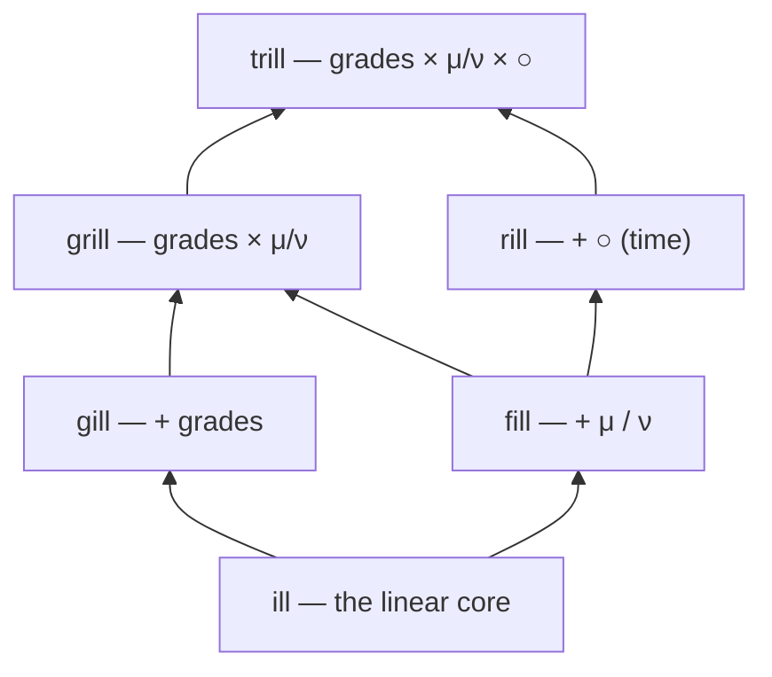

By now the book has three separate powers, each earned in its own part:

- **Grades** (Part III) — count and measure resource use with a pluggable
  algebra: the graded bang `!_k`, and gill's swappable grade modalities.
- **Fixed points** (this part, Chapters 22–23) — inductive `μ` and coinductive
  `ν` data, with cyclic proofs for forever-properties.
- **Time** (Chapter 24) — the next modality `○`, resources that arrive a tick
  from now.

A natural question: can you have all three *at once*? A stream of events where
each event carries a cost, and the tail is only available after a tick? That
needs grades, a fixed point, and `○` in a single formula. This chapter answers
yes — and the interesting part is *how cheaply* the answer comes.

## Stacking the axes

Two new calculi assemble the combinations:

- **grill** = grades × fixed points. It takes gill's whole graded surface and
  adds `μ`/`ν`. Now you can write a *graded* signal or a *costed* stream.
- **trill** = grades × fixed points × time. It takes grill and adds `○`. All
  three axes, one calculus. trill is to grill exactly what rill (Chapter 24) is
  to fill.

Neither is built by hand. Each is declared by *extension*: grill says "I am
gill, plus `μ`/`ν`"; trill says "I am grill, plus `○`". The surface syntax,
rules, and machinery of the parent flow in automatically.



## A graded signal

In grill you can annotate the recursive occurrence of a signal with a grade.
Here `!!_d A` is gill's transport modality — "an `A` carried at distance `d`",
the graded modality you met in Part III; take `d = 0` for the simplest case.
A **graded coinductive signal** is

$$!a \;\vdash\; \nu X.\,(a \mathbin{\&} \; !!_0\, X).$$

The persistent `a` supplies the head at every unrolling; `!!_0 X` is the graded
tail. This proves coinductively — one back-edge — and is kernel- and
guard-verified, *exactly* as the plain signal `νX.(a & X)` was in Chapter 23.
The grade rides along the cycle without disturbing the guard condition: the
`νR` unfold still supplies the progress, and the linear pool is still empty at
the bud.

Dually, a **graded inductive stream** `μX.(a ⊕ !!_0 X)` proves *finitely* from a
suitable `a`, just as its ungraded cousin did — `μ` induces, `ν` coinduces, and
the grade is simply carried.

## All three at once

trill puts the last axis on top. A **graded, timed signal** — available at
every tick, forever, with a cost on the tail — is

$$!a \;\vdash\; \nu X.\,\big(a \mathbin{\&} \bigcirc(!!_0\, X)\big).$$

Read it left to right: `ν` makes it forever (coinduction), `○` gates each turn
behind a tick (time), `!!_0` prices the tail (grade). One formula, three axes,
and it proves with a single back-edge — kernel-verified.

The axes do not interfere. Grade *slides through* time, for instance:

$$\bigcirc(!!_0\, a) \;\vdash\; !!_0\,(\bigcirc a)$$

is provable — pushing a cost across a tick, or pulling it back, is sound in both
directions. The tick does not care what grade a resource carries; the grade does
not care whether a resource is delayed. They are genuinely orthogonal.

```{quiz, id=ch25-q1}
Q: The graded timed signal `νX.(a & ○(!!_0 X))` combines which three features, in which roles?
- [x] `ν` = forever (coinduction), `○` = gated one tick at a time (temporal guard), `!!_0` = a grade/cost on the recurring tail.
- [ ] `ν` = the cost, `○` = the recursion, `!!_0` = the timing.
- [ ] All three do the same thing; the redundancy is for emphasis.
- [ ] `ν` and `○` conflict, so `!!_0` is needed to reconcile them.
explanation: Each connective owns one axis. `ν` is the greatest fixed point that makes the signal infinite; `○` delays each recurrence by a tick (and, as in Chapter 24, acts as the syntactic guard for the coinductive loop); `!!_0` is gill's graded modality pricing the tail. They stack without interaction — the point of the whole chapter.
```

## Why it costs almost nothing

Here is the engineering punchline, and it is the deep one. Making grill and
trill did **not** change the proof engine. Not the search, not the kernel, not
the guard checker. The combined calculi are almost entirely *declarations*.

The reason is that every feature is **gated by declared data**, not by engine
code:

- A connective's `@category` decides which machinery it wakes. `μ`/`ν` are
  category `fixpoint`, which arms the cyclic-proof roles. `○` is category
  `modality` — a category the engine assigns *no* special role, so it never
  even touches the fixed-point machinery.
- The tick fires only on a rule flagged as a whole-context transform; grades
  activate only when the calculus supplies a grade algebra; the cyclic engine
  activates only when the fixed-point roles are set.

Each axis is switched on independently by data. Combining them is therefore
*additive*: turn on two sets of declarations and you get both, with no new
interaction code to write. The generic engine was parametric over these roles
from the start — it reads them as data and never names a specific calculus. Two
axes, three axes, in any combination, ride the same untrusted-search /
trusted-check path you have seen since Part II.

New calculus, new combination, essentially zero new trusted code. That
modularity is not an accident; it is the thing the whole architecture was built
to make true. The non-recursive, non-graded, non-timed core is still exactly the
ILL you started with — prove a piece of it live to feel the continuity:

```{prove}
goal: !(a -o b), a |- b
title: The ordinary ILL core, unchanged underneath every axis
hint: Dereliction turns !(a -o b) into a usable a -o b, then loli_l applies it to a.
id: ch25-core
rules: id, loli_l, dereliction, copy
```

## Cut still eliminates

There is a soundness question lurking. When you compose features, does the
central metatheorem — that **cut is admissible**, the guarantee that composing
two proofs never proves anything new — still hold?

It does, per calculus, and it is checked. A fuzzer builds random cut instances
across `ill`, `fill`, `gill`, `grill`, and `trill` — including the hard cases:
**coinductive cut** (composing two forever-proofs), **graded coinductive cut**,
and graded temporal cut — and confirms that whenever `Γ ⊢ A` and `A, Δ ⊢ C` are
provable cut-free, so is `Γ, Δ ⊢ C`, with every result kernel-verified. Even
when cut-elimination *cannot* reduce a proof to a finite one — because it is
genuinely coinductive — the composed proof is still a valid cyclic proof. The
axes compose at the level of the metatheory, not just the syntax.

## What the fences forbid

Composition never loosens the guarantees. Each axis keeps its refusals, and they
stack too:

- **No coinductive weakening.** A linear resource still cannot ride a `ν`-cycle:
  `a ⊢ νX.X` is refused, graded or not (`!!_5 a ⊢ νX.(!!_2 X)` fails as well).
- **No grade manufacture.** Distance is not possession: `!!_1 a ⊢ a` is refused
  — a resource carried *near* is not a resource you *hold*.
- **`○` still does not collapse.** `○a ⊬ a` and `a ⊬ ○a`, and the tick never
  duplicates (`○a ⊬ ○(a ⊗ a)`) or smuggles a bare resource across.

Add features, keep every guardrail. That is the test of a real composition, and
it passes.

```{exercise, title=Read the formula}
Describe, in one plain-English sentence each, what these trill formulas mean.
Name the axis each connective contributes.

1. `μX.(done ⊕ ○X)`
2. `νX.(ping & ○(!!_1 X))`
```

```{solution}
1. **"Eventually done."** `μ` (least fixed point → finite, it *will* terminate)
   of "either finish now (`done`), or wait a tick and check again (`○X`)." This
   is a stream/event that fires after finitely many ticks. Axes: fixed point
   (`μ`) + time (`○`); no grade.
2. **"Ping forever, one tick apart, each recurrence costing one unit."** `ν`
   (greatest fixed point → infinite, forever available) of "a `ping` now, and
   after one tick (`○`) the same signal at grade 1 (`!!_1`)." Axes: fixed point
   (`ν`) + time (`○`) + grade (`!!_1`) — all three.
```

## What you learned

- **grill** combines grades with fixed points; **trill** adds the next-time
  modality on top — all three axes (grades × `μ/ν` × `○`) in one calculus.
- Each is built by **extension** (`grill = gill + μ/ν`, `trill = grill + ○`),
  inheriting the parent's syntax, rules, and machinery.
- A graded signal `νX.(a & !!_0 X)` and a graded timed signal
  `νX.(a & ○(!!_0 X))` prove coinductively — one back-edge, kernel-verified —
  just like the plain signal, with grade and time simply carried along.
- The axes are **orthogonal**: grade slides through time
  (`○(!!_0 a) ⊢ !!_0(○ a)`), and neither disturbs the coinductive guard.
- Combining them costs **almost no new engine code**, because every feature is
  **gated by declared `@category` data**, not by engine branches — the generic
  engine was parametric over these roles all along.
- **Cut remains admissible** across all five calculi — including coinductive and
  graded-coinductive cut — and every soundness fence (no coinductive weakening,
  no grade manufacture, `○` non-collapsing) still holds under composition.

## Going deeper

- [[theory/0044_graded-mumall-unification|THY_0044: the graded μMALL unification]] — the three-axis design, the compositionality argument by role-gating, and the per-instance cut-admissibility evidence.
- [[theory/0022_fenced-grade-algebras|THY_0022: fenced grade algebras]] — how grades are supplied as swappable data, the axis this chapter stacks onto fixed points.
- [[theory/0042_cyclic-proofs-fixed-points|THY_0042: fixed points and cyclic proofs]] — the coinductive machinery that grades and time ride on unchanged.
