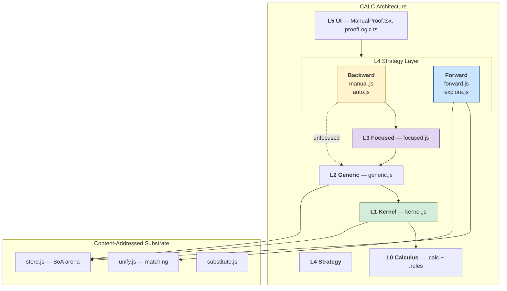
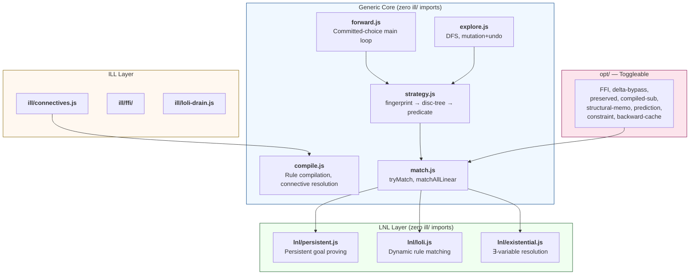

# Prover Architecture

CALC's prover is structured as five layers. Each layer uses only the API of the layer below. No layer reimplements functionality from a lower layer.



The backward prover (L1-L3) and forward engine (L4c/d) share the content-addressed substrate and implement the same ILL derivation rules with different search strategies. The forward engine is a committed-choice strategy that eliminates search; the backward prover explores alternatives with backtracking. Both are strategies within one focused proof calculus (Chaudhuri & Pfenning 2006). See:
- `doc/documentation/backward-prover.md` — backward prover layers
- `doc/documentation/forward-chaining-engine.md` — forward engine modules

## File Structure

```
lib/prover/                      # Backward proof search
├── kernel.js                    # L1: verifyStep, verifyTree
├── generic.js                   # L2: connective, tryIdentity, applyRule, applicableRules
├── focused.js                   # L3: findInvertible, chooseFocus, prove (Andreoli)
├── strategy/
│   ├── manual.js                # L4a: interactive proof (getApplicableActions, applyAction)
│   └── auto.js                  # L4b: automated backward search (wraps L3.prove)
├── context.js                   # shared: multiset operations { [hash]: count }
├── state.js                     # shared: FocusedProofState class
├── pt.js                        # shared: ProofTree class
├── rule-interpreter.js          # shared: builds rule specs from .rules descriptors
├── generic-term.js              # proof term extraction from backward proof trees
├── guided-term.js               # forward trace → complete ILL proof terms
├── check-term.js                # proof term type checker (trusted kernel extension)
└── index.js                     # convenience re-exports

lib/engine/                      # Forward execution engine (L4c/L4d)
├── optimizer.js                 # profile-driven engine config (bare/fast/evm)
├── match.js                     # pattern matching + persistent proving
├── strategy.js                  # rule selection: strategy stack builder
├── forward.js                   # committed-choice main loop
├── explore.js                   # exhaustive DFS exploration + mutation/undo
├── backchain.js                 # backward chaining for persistent antecedents
├── state-ops.js                 # state mutation: consume/produce/mutateState
├── compile.js                   # rule compilation (de Bruijn slots, metavar analysis)
├── rule-analysis.js             # pattern roles, compiled substitution recipes
├── constraint.js                # EqNeqSolver (union-find with forbid list)
├── disc-tree.js                 # discrimination tree indexing
├── lnl/                         # Linear-Non-Linear framework
│   ├── persistent.js            # persistent goal proving
│   ├── loli.js                  # dynamic rule matching
│   └── existential.js           # existential resolution
├── ill/                         # ILL-specific
│   ├── backchain-ill.js         # ILL backward prover defaults
│   ├── binlit-theory.js         # binary number equational theory
│   ├── connectives.js           # ILL connective configuration
│   ├── loli-drain.js            # persistent-trigger loli optimization
│   └── ffi/                     # foreign function interface (arithmetic, etc.)
├── opt/                         # extracted optimization modules (toggleable)
│   ├── backward-cache.js        # backward proof cache
│   ├── ffi.js                   # FFI-accelerated persistent proving + compiled steps
│   ├── delta-bypass.js          # direct child extraction for flat patterns
│   ├── structural-memo.js       # control-hash subtree memoization
│   ├── prediction.js            # threaded code dispatch (Opt_H)
│   └── constraint.js            # solver integration (feed + SAT filter)
├── convert.js                   # .ill → content-addressed hashes
└── index.js                     # loader + API

lib/kernel/                      # Content-addressed AST substrate
├── store.js                     # SoA TypedArray arena (tags, arities, children)
├── unify.js                     # pattern matching (matchIndexed) + unification
├── substitute.js                # substitution (applyIndexed, subCompiled)
├── ast.js                       # AST construction helpers
└── sequent.js                   # sequent structure
```

## Design Principles

**De Bruijn trust model.** L1 is the trusted kernel — small enough to read in one sitting. Upper layers produce proof trees; the kernel verifies them independently. Bugs in L2–L4 produce failed or slow proofs, never wrong proofs.

**Generate, don't hardcode.** Polarity, invertibility, and rule application are all generated from `.rules` files via `rule-interpreter.js`. Adding a new connective to `.rules` requires zero prover code changes.

**Stacking.** Each layer extends the one below by adding *strategy*, not *mechanism*. Layer N calls Layer N-1's API, never reaches into its internals.

## L0 — Calculus Object

Generated from `ill.calc` + `ill.rules` at load time. The calculus object is the single source of truth for all layers:

```javascript
calculus = {
  rules:       { tensor_r: { descriptor, invertible, pretty, ... }, ... }
  polarity:    { tensor: 'positive', loli: 'negative', ... }
  invertible:  { tensor_r: false, tensor_l: true, loli_r: true, ... }
  AST:         { tensor: (a,b) => hash, ... }
  parse:       "A * B" → hash
  render:      hash → "A * B" | "A \\otimes B"
  isPositive:  tag → boolean
  isNegative:  tag → boolean
}
```

Properties generated from `.rules`:

| Property | Generated by |
|---|---|
| `polarity` | `meta/focusing.js:inferPolarityFromRules` |
| `invertible` | `meta/focusing.js:inferInvertibilityFromRule` |
| `rules[name].descriptor` | `rules2-parser.js:parseRules2` |
| `parser`, `renderer` | `calculus/index.js` from `@ascii`/`@latex`/`@prec` annotations |

## L1 — Kernel (Proof Checker)

Given a proof tree, answers "is this valid?" No search, no strategy, no heuristics.

```javascript
createKernel(calculus) → {
  verifyStep(conclusion, rule, premises) → { valid, error? }
  verifyTree(tree) → { valid, errors[] }
}
```

Rule verification uses `rule-interpreter.js` to compute expected premises from the rule descriptor, then compares against the actual premises.

**Proof term checker** (`check-term.js`): Trusted kernel extension for Curry-Howard proof terms. Verifies `Gamma; Delta |- t : A` via per-rule checker map generated from descriptors at load time. Includes focused loli_l (2-subterm) for guided execution terms. See `doc/documentation/proof-terms.md`.

## L2 — Generic Prover (Search Primitives)

Provides logic-independent search primitives. All functions are unfocused — no polarity filtering.

```javascript
createGenericProver(calculus) → {
  // Helpers
  connective(h)                    // formula hash → tag (null for atoms)
  isPositive(tag), isNegative(tag) // polarity checks
  ruleName(h, side)                // formula + side → rule name
  ruleIsInvertible(tag, side)      // invertibility check

  // Core
  tryIdentity(seq, focusPos, focusIdx) // identity axiom via unification
  applyRule(seq, position, index, spec) // single rule application → premises
  computeChildDelta(premise, delta)     // merge premise linear into delta
  addDeltaToSequent(seq, delta, copy)   // inject delta into sequent

  // Search
  applicableRules(seq, specs, alts)     // enumerate ALL applicable rules
  tryRuleAndRecurse(...)                // apply rule + recurse into premises
}
```

Context threading uses Hodas-Miller lazy splitting: resources flow into the first premise, whatever remains flows to the next.

## L3 — Focused Discipline

Restricts L2's rule enumeration using Andreoli's focusing. Contains only focusing-specific logic.

```javascript
createProver(calculus) → {
  findInvertible(seq)   // find formula with invertible rule
  chooseFocus(seq)      // choose focus targets
  prove(seq, opts)      // focused proof search with phases:
                        //   0: identity, 0.5: copy, 1: inversion,
                        //   2: focus choice, 3: focused decomposition
  // + re-exports L2 helpers
}
```

**Phase structure:**
- **Inversion:** eagerly apply invertible rules (negative R, positive L)
- **Focus:** choose a formula to focus on (positive R, negative L)
- **Decomposition:** apply focused rules until blur or identity
- **Blur:** transition back to inversion when hitting an invertible formula during focus

Polarity assignments come from the calculus object. L3 contains zero logic-specific code.

## L4 — Strategy Layer

Multiple strategies coexist, all built on L3/L2:

**L4a — Manual (interactive):** `strategy/manual.js`
- `getApplicableActions(state, { mode })` — `'focused'` delegates to L3, `'unfocused'` to L2
- `applyAction(state, action, userInput?)` — state transition with optional context split
- Focus actions: `Focus_L` / `Focus_R`

**L4b — Auto (automated backward search):** `strategy/auto.js`
- Wraps L3's `prove()` with goal normalization

**L4c/L4d — Forward Engine:** `lib/engine/`

The forward engine has its own internal three-layer architecture (Generic → LNL → ILL), separate from the backward proof search (L1–L3). It implements committed-choice forward chaining (multiset rewriting) with a compilation pipeline:



**Layer discipline:** `compile.js` and `lnl/` have zero `ill/` imports — the compilation and matching logic is fully calculus-agnostic, parameterized by a connective table (`tag → { category, arity, polarity }`) and `matchOpts` callbacks. `forward.js`/`explore.js`/`backchain.js` retain ILL defaults as composition-layer fallbacks. See `doc/documentation/forward-chaining-engine.md` for full details.

**Profile-driven optimization.** All engine optimizations live in `lib/engine/opt/` as independently toggleable modules. The `optimizer.js` resolves a profile (`bare`/`fast`/`evm`) into an engine context with the appropriate strategy stack at startup — no runtime branching in hot loops. The `bare` profile disables all optimizations and serves as the correctness baseline. See `doc/documentation/optimization-architecture.md`.

**Program-aware indexing (auto-detected).** The strategy stack includes a fingerprint layer that detects dominant discriminating predicates from rule structure. For EVM, `code(PC, OPCODE)` is the discriminator — 40 of 44 rules have a ground opcode child. The fingerprint layer resolves these in O(1). This is auto-detected by `detectFingerprintConfig()` from rule patterns; no program-specific code exists. The disc-tree layer (general-purpose trie) handles all remaining rules. See `doc/documentation/strategy-layers.md`.

**Persistent proving.** Persistent antecedents (`!C` in `A * B * !C -o { D }`) are resolved in two levels: (1) state lookup — check if the fact already exists in `state.persistent`, (2) backward prove — FFI as O(1) fast path, then clause resolution via `backchain.js` as fallback. FFI handles arithmetic (inc, plus, neq, mul) and is conceptually an optimization within backward proving, not a separate mechanism.

**Mutation+undo.** During DFS exploration, state is mutated in-place via FactSet + Arena and restored after each child subtree returns. Snapshots are taken only at terminal nodes. See `doc/documentation/explore-optimizations.md`.

## L5 — UI Layer

Pure view. `proofLogic.ts` is a thin type adapter; `ManualProof.tsx` renders the proof tree and delegates all logic to L4a.

## Genericity

| Layer | Logic-independent | Logic-specific |
|---|---|---|
| **L1 kernel** | Tree verification structure | Rule matching (generated by `rule-interpreter.js`) |
| **L2 generic** | Backtracking, depth limit, Hodas-Miller threading | Which rules exist (from calculus object) |
| **L3 focused** | Phase alternation, blur condition, focus protocol | Polarity assignments (from calculus object) |
| **L4 backward** | Manual UI protocol, auto search | None |
| **L4 forward** | Strategy stack, matching, mutation+undo, connective table | ILL defaults as composition-layer fallbacks in forward.js/explore.js |
| **L5 UI** | Components, rendering, interaction | None |

Adding a new connective (e.g., temporal `○`/`●`) requires only `.calc` + `.rules` changes. All backward layers pick it up automatically.

Adding new forward rules requires only `.ill` changes. The strategy stack auto-detects whether fingerprint indexing is available from rule structure — no code changes needed for program-specific optimizations.

## Proof State

```javascript
ProofState = {
  conclusion: Sequent,      // what we're proving
  rule: string | null,      // applied rule (null = open goal)
  premises: ProofState[],   // child states
  proven: boolean,          // is this subtree complete?
  focus: { position, index, hash } | null,  // L3 focus state
  delta: Multiset,          // remaining linear resources
}
```

## Backward vs Forward

The backward prover and forward engine implement the same ILL proof calculus with different search strategies. Every forward step (consume linear facts, prove persistent goals, produce results) corresponds to a sequence of ILL inference rules: `copy` → `forall_l`× → `loli_l` → `tensor_r` → `monad_l`. The forward engine eliminates the combinatorial search over which derivation to pick — it is an oracle/strategy, not a separate proof system.

This follows from Chaudhuri & Pfenning (2006): forward and backward chaining are two polarities of the same focused proof search framework. The polarity assignment determines which strategy handles which fragment. CALC's architecture reflects this — both live at L4 (strategy layer).

| | Backward (L1–L3) | Forward (L4c/L4d) |
|---|---|---|
| **State** | Sequent `{ contexts, succedent }` | Flat multiset `{ linear: {h: count}, persistent: {h: true} }` |
| **Matching** | Unification (bidirectional) | Pattern matching (one-way, matchIndexed) |
| **Execution** | Proof tree construction | Multiset rewriting (consume/produce facts) |
| **Indexing** | Rule enumeration from sequent | Strategy stack (fingerprint → disc-tree → predicate) |
| **Derivation rules** | All ILL connectives | Same rules, search-free (committed choice) |
| **Shared** | Store, unify.js, substitute.js | Store, unify.js, substitute.js |

The difference is operational, not logical: the forward engine's flat multiset state is a sequent without succedent tracking (the monad commits), its one-way matching is unification where all terms are ground, and its multiset rewriting produces proof trees whose shape is determined (no search needed).

See `doc/documentation/forward-optimization-roadmap.md` for profiling history (181ms → ~1ms).

## Lax Monad `{A}` — Optimization Boundary

The monadic type `{S}` marks an **optimization boundary** in `lib/prover/bridge.js`. When L3's inversion phase encounters `{S}` as succedent, `monad_r` fires. By default (`opts.forward = 'full'`), all linear resources transfer to the forward engine, which runs to quiescence as a committed-choice strategy. `rightFocus` then decomposes the succedent against the residual state.

The monad itself is a genuine logical connective (CLF, Watkins et al. 2004) — a polarity shift from negative (async) to positive (sync). But the decision to hand execution to a separate engine at this boundary is a strategy choice, not a logical necessity. With `opts.forward = 'guided'`, the forward engine runs as an oracle and the proof term decomposes into standard ILL inference steps. With `opts.forward = 'off'`, the backward prover handles the monadic fragment directly (intractable for large programs, but theoretically equivalent).

Connective table (`ill/connectives.js`) maps tag → `{ category, arity, polarity }`, mirroring `.calc` annotations (`@category`, `@polarity`). `compile.js:resolveConnectives()` inverts this for O(1) role→tag dispatch. The generic engine queries structural categories (`multiplicative`, `exponential`, `monad`, etc.), never connective names. See `doc/documentation/lax-monad.md` for full details.

## Open Research

| Question | Notes |
|---|---|
| Metaproofs over execution trees | Property verification: conservation, safety, reachability, deadlock-freedom |
| Generic structural interpreter per family | Different families (LNL, display, adjoint) need parameterized interpreter |
| Ceptre stages | Named rule subsets running to quiescence with inter-stage transitions |

## References

- HOL Light kernel: ~400 lines, abstract `thm` type ([Harrison](https://www.cl.cam.ac.uk/~jrh13/papers/hollight.pdf))
- Isabelle layering: kernel → tactics → Sledgehammer ([Paulson](https://arxiv.org/pdf/1907.02836))
- Foundational Proof Certificates: focusing as proof format ([Miller](https://dl.acm.org/doi/10.1145/2503887.2503894))
- Hodas-Miller lazy splitting ([1994](https://www.sciencedirect.com/science/article/pii/S0890540184710364))
- Chaudhuri, Pfenning & Price: A Logical Characterization of Forward and Backward Chaining in the Inverse Method ([IJCAR 2006](https://www.cs.cmu.edu/~fp/papers/ijcar06.pdf))
- Sterling-Harper proof refinement logics ([2017](https://arxiv.org/abs/1703.05215))
