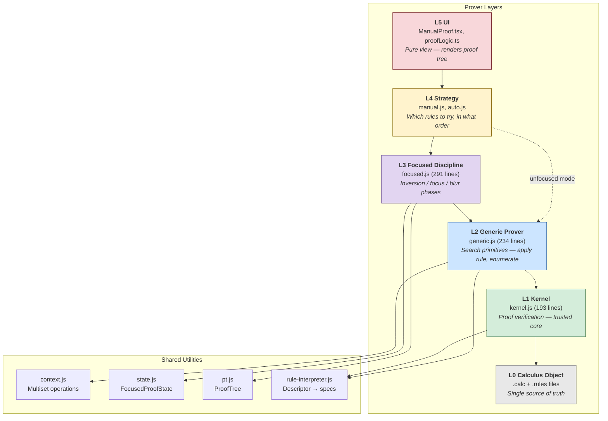
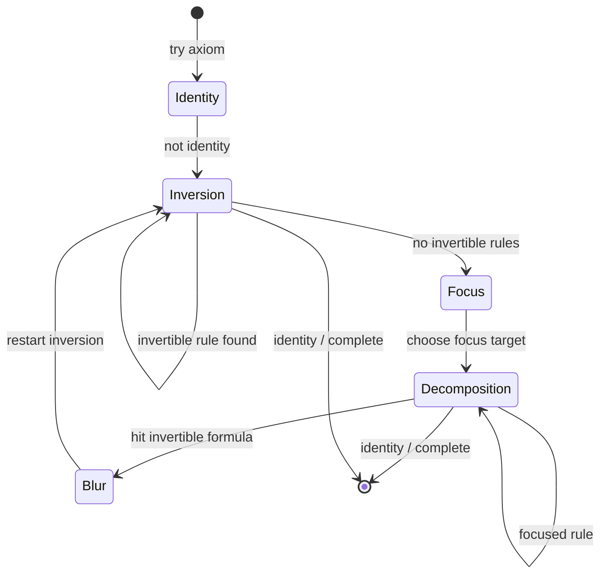
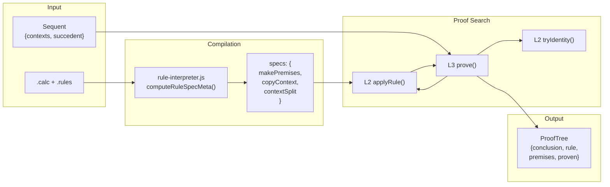

# Backward Prover Architecture

The backward prover searches for proofs of ILL sequents. It is structured as five layers with strict upward-only dependency and shared utilities.



## Layer Responsibilities

### L0 — Calculus Object

Generated from `.calc` + `.rules` files at load time. Single source of truth for all layers.

```javascript
calculus = {
  rules:      { tensor_r: { descriptor, invertible, ... }, ... },
  polarity:   { tensor: 'positive', loli: 'negative', ... },
  isPositive: tag => boolean,
  isNegative: tag => boolean,
  parse:      "A * B" => hash,
  render:     hash => "A \\otimes B",
}
```

### L1 — Kernel (Proof Checker)

The trusted core. Answers "is this proof tree valid?" — never searches.

```javascript
createKernel(calculus) => {
  verifyStep(conclusion, ruleName, premises) => { valid, error? }
  verifyTree(tree) => { valid, errors[] }
}
```

193 lines. Can be read in one sitting. Bugs here are security bugs; bugs in L2-L4 are completeness/performance bugs.

### L2 — Generic Prover (Search Primitives)

Logic-independent search utilities. No polarity awareness.

```javascript
createGenericProver(calculus) => {
  connective(h)                     // hash => tag (null for atoms)
  isPositive(tag), isNegative(tag)  // polarity (delegates to calculus)
  ruleName(h, side)                 // formula + side => rule name
  tryIdentity(seq, pos, idx)        // identity axiom
  applyRule(seq, pos, idx, spec)    // single rule application => premises
  applicableRules(seq, specs, alts) // enumerate ALL applicable rules
}
```

Context threading uses Hodas-Miller lazy splitting: resources flow into the first premise, whatever remains flows to the next.

### L3 — Focused Discipline

Restricts L2's search using Andreoli's focusing. Three phases:



- **Inversion**: eagerly apply all invertible rules (negative right, positive left)
- **Focus**: choose a formula to focus on (positive right, negative left)
- **Decomposition**: apply focused rules until blur or identity
- **Blur**: transition back to inversion when hitting an invertible formula during focus

### L4 — Strategy

**L4a Manual** (`manual.js`): Interactive proof. `getApplicableActions(state, {mode})` delegates to L3 (focused) or L2 (unfocused). Focus actions: `Focus_L` / `Focus_R`.

**L4b Auto** (`auto.js`): Wraps L3's `prove()` with goal normalization.

## Data Flow



## Design Patterns

**Vertical stratification.** Each layer has one job. L3 never reimplements L2 logic — it calls `applyRule()`.

**Cascading delegation.** Upper layers compose lower layers' APIs. No layer reaches into another's internals.

**Data over code.** Polarity, invertibility, rules — all tables in the calculus object, queried by L2/L3. Zero logic-specific code in the prover.

**Two-phase compilation.** `computeRuleSpecMeta()` runs at build time, producing JSON-serializable data. `buildRuleSpecsFromMeta()` creates closures at runtime. Browser loads precomputed metadata from `ill.json`.

**Immutable state objects.** `FocusedProofState` transitions create new instances. Multisets are externally immutable. ProofTree is immutable once created.

**Factored recursion.** `tryRuleAndRecurse()` extracts the "apply rule + recurse into premises" pattern to avoid duplication across phases.
