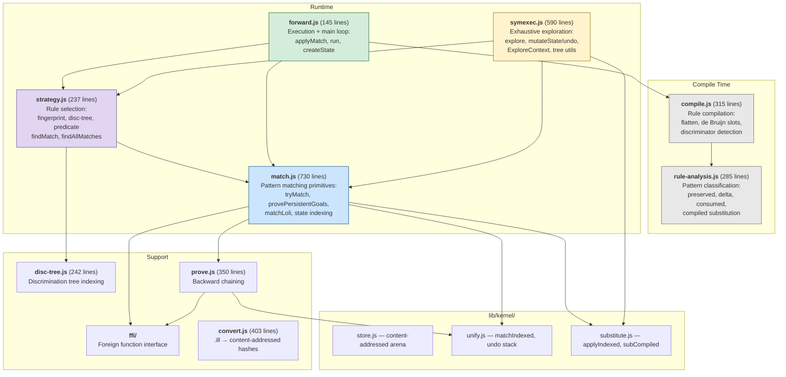
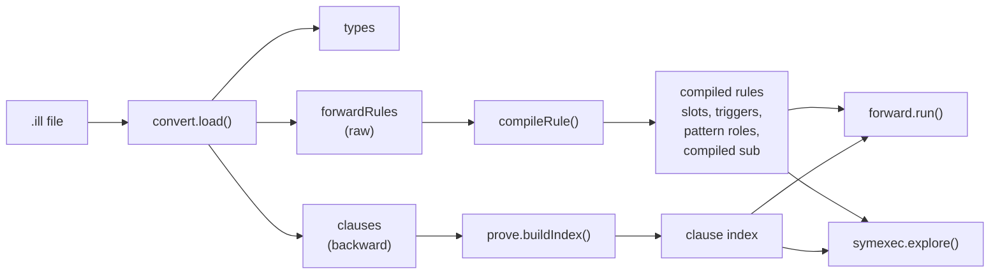
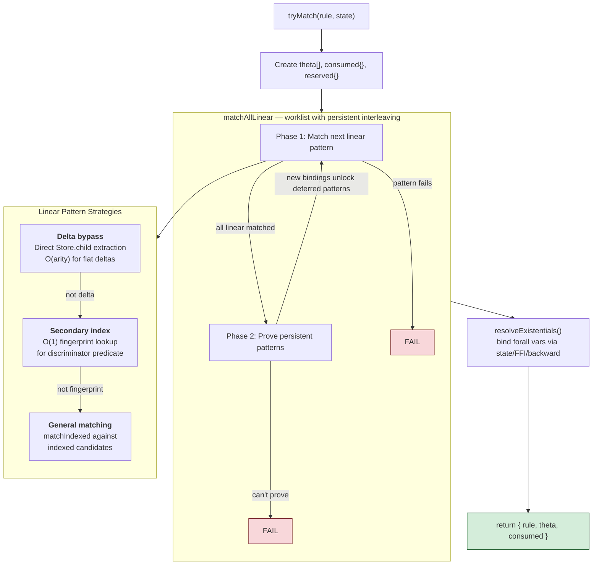
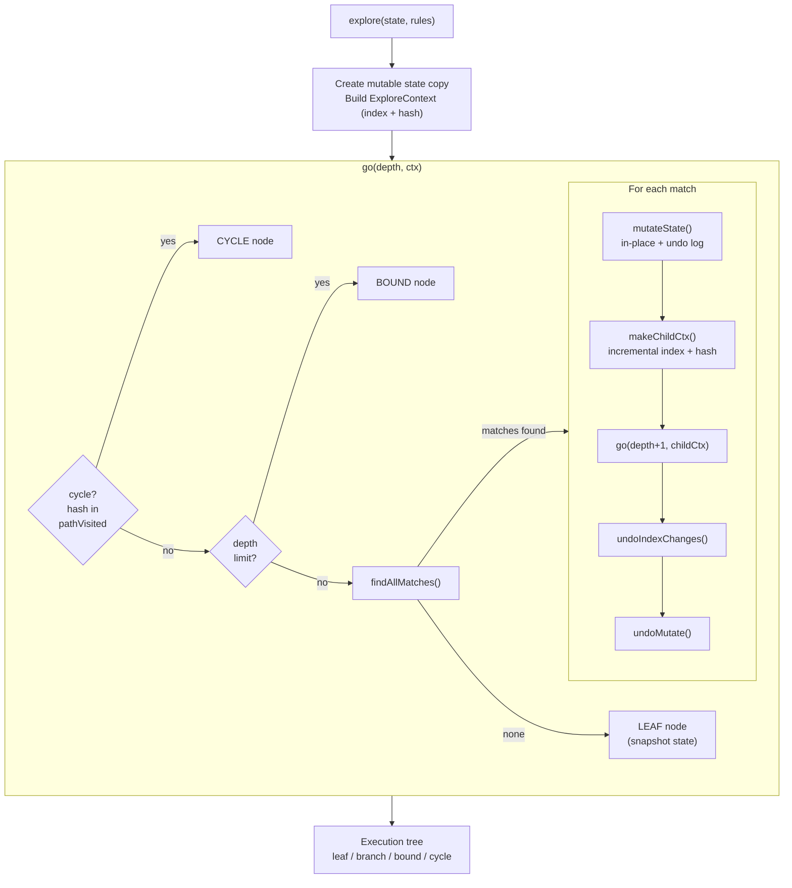

# Forward Chaining Engine

The forward engine executes ILL programs by multiset rewriting. A state (multiset of linear + persistent facts) is transformed by rules until quiescence. Conceptually a CHR-like runtime with exhaustive exploration (CHR-v).

## Module Architecture



## Data Flow: .ill to Execution



## Matching Pipeline

`tryMatch(rule, state, calc)` — "can this rule fire against this state?"



## Persistent Proving

Persistent antecedents (e.g. `!inc PC PC'`, `!neq X Y`) must be proved, not consumed. Two conceptual levels:


FFI is an optimization of backward proving — arithmetic predicates like `inc`, `plus`, `neq` have O(1) native implementations that bypass the full clause resolution pipeline.

## Strategy Stack

Rule selection uses a layered strategy stack. Each layer claims rules it can index efficiently; unclaimed rules fall through.


The fingerprint layer is **program-agnostic** — it auto-detects any dominant discriminating predicate from rule structure. For EVM, `code(PC, OPCODE)` is the discriminator (40/44 rules have a ground opcode child). For other programs, a different predicate may be detected, or the fingerprint layer is skipped entirely.

## Execution Modes

### Single-Path: `forward.run()`

Committed choice — fires first matching rule, one execution path:

```
while steps < maxSteps:
  m = findMatch(state, rules, calc)      // strategy stack
  if !m: m = matchFirstLoli(state, calc) // loli fallback
  if !m: return QUIESCENT
  state = applyMatch(state, m)           // immutable: new state
```

### Exhaustive: `symexec.explore()`

DFS over all execution paths with mutation + undo:



**Core invariant:** When `go()` returns, state, stateIndex, and pathVisited are in their original state.

## Rule Compilation Pipeline

`compileRule(rule)` transforms a raw rule into an optimized compiled form:

```mermaid
flowchart LR
    RAW["Raw rule<br/>{name, hash,<br/>antecedent,<br/>consequent}"]

    RAW --> F1["flattenTensor<br/>→ linear[] + persistent[]"]
    F1 --> F2["Extract triggers<br/>+ discriminator"]
    F2 --> F3["Collect persistent<br/>output vars"]
    F3 --> F4["De Bruijn slot<br/>assignment"]
    F4 --> F5["analyzeDeltas<br/>preserved/consumed/delta"]
    F5 --> F6["computePatternRoles<br/>per-position metadata"]
    F6 --> F7["compileSubstitution<br/>O(1) recipes"]
    F7 --> F8["expandConsequentChoices<br/>pre-expand with/oplus"]

    F8 --> COMPILED["Compiled rule"]
```



## Loli Continuations

Guarded loli continuations (e.g. `!eq V 0 -o { stack SH 1 }`) become linear facts in state. `matchLoli` uses the same persistent proving pipeline as `tryMatch`:

1. Extract trigger → `flattenTensor` → linear + persistent components
2. Match linear triggers against state (via matchIndexed)
3. Prove persistent triggers (state lookup → backward prove [FFI | clauses])
4. Guard succeeds → loli fires, body produced. Guard fails → null (stuck leaf).

## Optimization Summary

| Stage | What | Speedup | Technique |
|-------|------|---------|-----------|
| Strategy stack | Rule selection | 12.7x | O(1) fingerprint + disc-tree vs O(R) scan |
| Incremental context | State hashing + indexing | 1.7x | O(delta) XOR hash + incremental index |
| Mutation + undo | State management | 1.8x | In-place mutation, undo log, snapshot only at terminals |
| Index + Set undo | Index management | 1.25x | Mutable index + undo, mutable pathVisited |
| Direct FFI bypass | Persistent proving | 1.2x | O(1) FFI call inside backward prove |
| De Bruijn theta | Substitution lookup | 2.1x | Compile-time slot assignment, O(1) access |
| Delta bypass | Linear matching | ~8% | Direct Store.child extraction for flat patterns |
| Compiled substitution | Consequent production | ~8% | Store.put recipe vs generic applyIndexed |
| Disc-tree | Catch-all rule selection | ~0% at 44 rules | Trie over preorder traversals |
| Flat undo log | State undo | ~13% | Flat array vs object allocation |
| Numeric tagId | Tag comparison | ~2% | Numeric comparison vs string |
| Unified loli matching | Soundness fix | 62x | Dead branches → stuck leaves |

Total: **181ms → ~1ms** median for the 210-node multisig execution tree (43 rules).

## CHR Correspondence

The forward engine implements a fragment of CHR (Constraint Handling Rules):

| CHR | CALC Forward Engine |
|-----|---------------------|
| Simpagation `H1 \ H2 <=> G \| B` | Forward rule: preserved + consumed → produced |
| Removed heads (H2) | Linear facts in `state.linear` |
| Kept heads (H1) | Persistent facts in `state.persistent` |
| Guard evaluation | Persistent proving (state lookup → backward) |
| CHR-v disjunctive body | oplus in consequent (`expandChoiceItem` forking) |
| Propagation history | N/A (lolis are self-deleting linear facts) |
| omega_r occurrence iteration | Strategy stack (fingerprint → disc-tree → predicate) |
| Committed choice | `forward.run()` |
| CHR-v backtracking search | `symexec.explore()` with mutation + undo |

Soundness: Betz & Fruhwirth (2013) — every CHR derivation corresponds to a valid ILL proof.

## Design Decisions

**TREAT-like, not Rete.** No cached partial matches. Full re-evaluation per step. Correct for linear logic's non-monotonicity.

**Strategy stack over Rete network.** Layered indexing auto-detected from rule structure. Each layer claims rules; unclaimed fall through.

**Mutation + undo over immutable state.** DFS mutates one shared state in-place, restoring after each child. Only terminals snapshot.

**De Bruijn indexed theta.** Metavars get compile-time slot indices. Theta is a flat array.

**State lookup before backward proving.** Check if a persistent fact is already known before attempting to prove it via FFI or clause resolution.

**FFI as backward prove optimization.** FFI (arithmetic) is conceptually a fast path within backward proving, not a separate proving mechanism.
