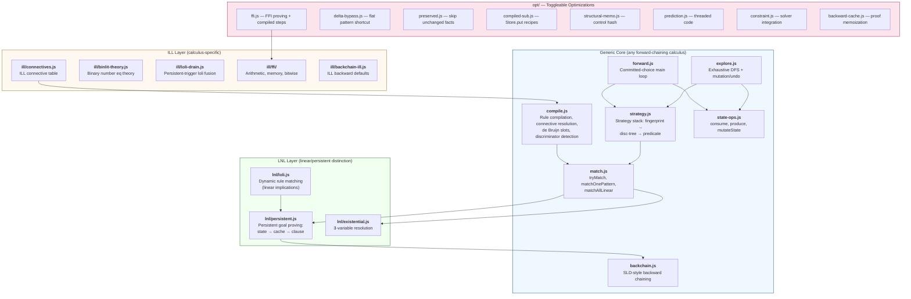
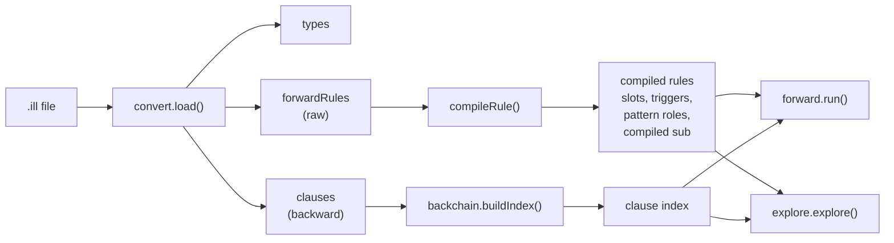
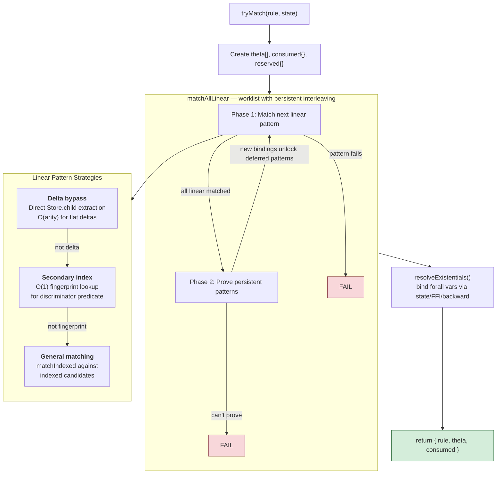
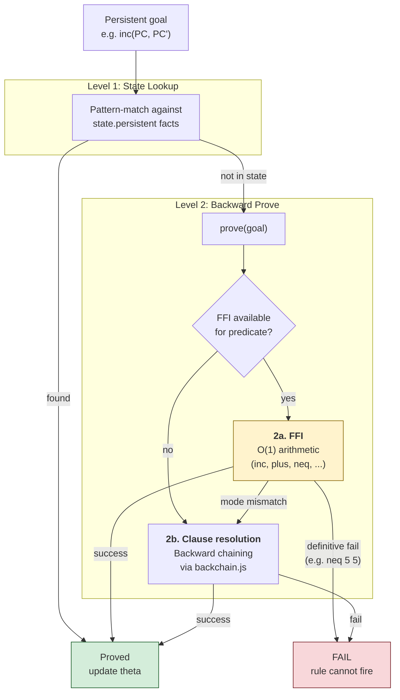
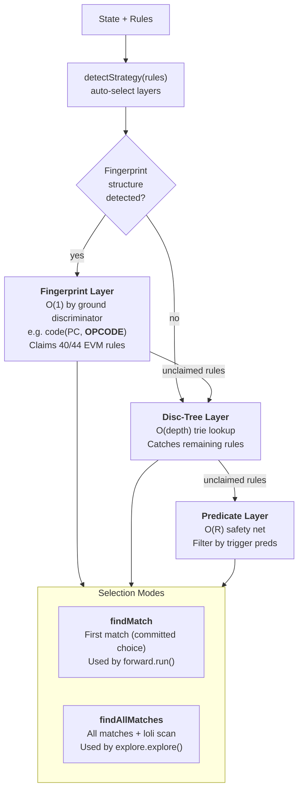
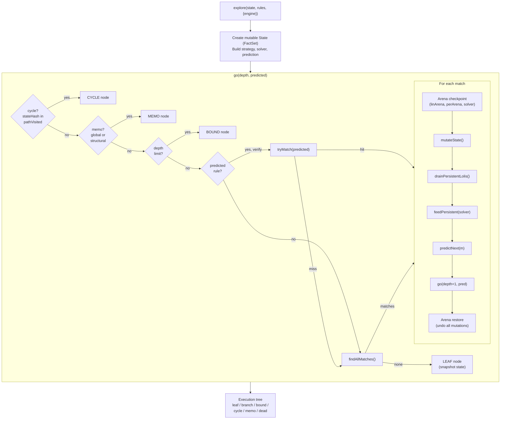

# Forward Chaining Engine

The forward engine executes programs by multiset rewriting. A state (multiset of linear + persistent facts) is transformed by rules until quiescence. Conceptually a CHR-like runtime with exhaustive exploration (CHR-v).

## Three-Layer Architecture

The engine is structured as three layers with an orthogonal optimization axis. Each layer is a composable brick — testable and replaceable independently.



**Layer discipline:**
- **Generic core** (`compile.js`, `match.js`, `strategy.js`, `state-ops.js`, `fact-set.js`): zero `ill/` imports. Parameterized by connective table and `matchOpts` callbacks.
- **LNL layer** (`lnl/`): zero `ill/` imports. Receives configuration via `matchOpts`.
- **Execution entry points** (`forward.js`, `explore.js`, `backchain.js`): import ILL defaults as fallbacks when `calc?.connectives` is absent. These are composition-layer wiring, not structural violations.
- **ILL layer** (`ill/`): calculus-specific logic. Only imported by execution entry points and `opt/ffi.js`.

### Connective Table

The engine never queries tag names — it queries structural categories. `ill/connectives.js` provides the ILL connective table:

```js
// tag → { category, arity, polarity }
{
  tensor: { category: 'multiplicative', arity: 2, polarity: 'positive' },
  loli:   { category: 'multiplicative', arity: 2, polarity: 'negative' },
  bang:   { category: 'exponential',    arity: 1 },
  one:    { category: 'multiplicative', arity: 0 },
  monad:  { category: 'monad',          arity: 1 },
  oplus:  { category: 'additive',       arity: 2, polarity: 'positive' },
  with:   { category: 'additive',       arity: 2, polarity: 'negative' },
  exists: { category: 'quantifier',     arity: 1, polarity: 'positive' },
  zero:   { category: 'additive',       arity: 0 },
}
```

`compile.js:resolveConnectives(ct)` inverts this table for O(1) structural role lookups: `product` (multiplicative, arity 2, positive), `implication` (multiplicative, arity 2, negative), `exponential` (arity 1), `computation` (monad), etc. Adding a new calculus means providing a parallel table with that calculus's tags.

### matchOpts Composition

Engine behavior is configured via callback composition at run start — no module-level mutable state:

```js
matchOpts = {
  provePersistent,     // (patterns, idx, theta, slots, state, calc, evidence) → idx
  matchDynamicRule,    // (factHash, state, calc, matchOpts) → match | null
  dynamicRuleTag,      // tag name for state-resident rules (e.g., 'loli')
  connectives,         // resolved connective roles from resolveConnectives()
  canonicalize,        // hash → hash (equational theory normalization)
  ffiParsedModes,      // pred → mode string[] (for output variable detection)
  useCompiledSteps,    // boolean — enable FFI compiled persistent step fast path
  optimizePreserved,   // boolean — skip preserved facts in produce
  evidence,            // boolean — collect proof evidence per persistent goal
}
```

## Data Flow: .ill to Execution



## Matching Pipeline

`tryMatch(rule, state, calc)` — "can this rule fire against this state?"



## Persistent Proving

Persistent antecedents (e.g. `!inc PC PC'`, `!neq X Y`) must be proved, not consumed. Two conceptual levels:



FFI is an optimization of backward proving — arithmetic predicates like `inc`, `plus`, `neq` have O(1) native implementations that bypass the full clause resolution pipeline.

## Strategy Stack

Rule selection uses a layered strategy stack. Each layer claims rules it can index efficiently; unclaimed rules fall through.



The fingerprint layer is **program-agnostic** — it auto-detects any dominant discriminating predicate from rule structure. For EVM, `code(PC, OPCODE)` is the discriminator (40/44 rules have a ground opcode child). For other programs, a different predicate may be detected, or the fingerprint layer is skipped entirely.

## Execution Modes

### Single-Path: `forward.run()`

Committed choice — fires first matching rule, one execution path:

```
while steps < maxSteps:
  m = findMatch(state, rules, calc)      // strategy stack
  if !m: m = matchFirstLoli(state, calc) // loli fallback
  if !m: return QUIESCENT
  state = applyMatch(state, m)           // immutable: new state
```

### Exhaustive: `explore.explore()`

DFS over all execution paths with mutation + undo via FactSet Arena:



**Core invariant:** When `go()` returns, state (FactSet) and solver are in their original state via Arena undo.

Optimization modules called in the hot loop (`go`): `drainPersistentLolis` (ill/loli-drain.js), `feedPersistent` + `filterAltsBySAT` (opt/constraint.js), `predictNext` (opt/prediction.js), `computeControlHash` + `recordMemo` (opt/structural-memo.js). All imported directly — no runtime dispatch. See `doc/documentation/optimization-architecture.md`.

## Rule Compilation Pipeline

`compileRule(rule, { connectives, getModes })` transforms a raw rule into an optimized compiled form. Requires a connective table; `getModes` is optional (Mercury/Prolog-style `+`/`-` mode annotations for output variable detection):

```mermaid
flowchart LR
    RAW["Raw rule<br/>{name, hash,<br/>antecedent,<br/>consequent}"]

    RAW --> F1["flattenAntecedent<br/>→ linear[] + persistent[]"]
    F1 --> F2["Extract triggers<br/>+ discriminator"]
    F2 --> F3["Collect persistent<br/>output vars"]
    F3 --> F4["De Bruijn slot<br/>assignment"]
    F4 --> F5["analyzeDeltas<br/>preserved/consumed/delta"]
    F5 --> F6["computePatternRoles<br/>per-position metadata"]
    F6 --> F7["compileSubstitution<br/>O(1) recipes"]
    F7 --> F8["expandConsequentChoices<br/>pre-expand with/oplus"]

    F8 --> COMPILED["Compiled rule"]
```



## Loli Continuations

Guarded loli continuations (e.g. `!eq V 0 -o { stack SH 1 }`) become linear facts in state. `matchLoli` uses the same persistent proving pipeline as `tryMatch`:

1. Extract trigger → `flattenAntecedent` → linear + persistent components
2. Match linear triggers against state (via matchIndexed)
3. Prove persistent triggers (state lookup → backward prove [FFI | clauses])
4. Guard succeeds → loli fires, body produced. Guard fails → null (stuck leaf).

## Optimization Summary

All optimizations live in `lib/engine/opt/` as toggleable modules. See `doc/documentation/optimization-architecture.md` for the profile system and module details.

| Stage | What | Speedup | Module |
|-------|------|---------|--------|
| Strategy stack | Rule selection | 12.7x | `opt/fingerprint.js`, `opt/disc-tree-opt.js` |
| Mutation + undo | State management | 1.8x | Core (FactSet + Arena) |
| Direct FFI bypass | Persistent proving | 1.2x | `opt/ffi.js` |
| De Bruijn theta | Substitution lookup | 2.1x | Core (compile.js) |
| Delta bypass | Linear matching | ~8% | `opt/delta-bypass.js` |
| Compiled substitution | Consequent production | ~8% | `opt/compiled-sub.js` |
| Preserved skip | Skip unchanged facts | ~6-16% | `opt/preserved.js` |
| Disc-tree | Catch-all rule selection | ~0% at 44 rules | `opt/disc-tree-opt.js` |
| EqNeq solver | Branch pruning | ~10% (symbolic) | `opt/constraint.js` |
| Structural memo | Isomorphic subtree reuse | 4.4x (symmetric) | `opt/structural-memo.js` |
| Loli drain | Eager persistent-loli fusion | ~2% | `ill/loli-drain.js` |
| Prediction (Opt_H) | Skip findAllMatches | ~3% | `opt/prediction.js` |

Total: **181ms → ~5ms** for the symbolic multisig (477 nodes, memo enabled).

## CHR Correspondence

The forward engine implements a fragment of CHR (Constraint Handling Rules):

| CHR | CALC Forward Engine |
|-----|---------------------|
| Simpagation `H1 \ H2 <=> G \| B` | Forward rule: preserved + consumed → produced |
| Removed heads (H2) | Linear facts in `state.linear` |
| Kept heads (H1) | Persistent facts in `state.persistent` |
| Guard evaluation | Persistent proving (state lookup → backward) |
| CHR-v disjunctive body | oplus in consequent (`expandChoiceItem` forking) |
| Propagation history | N/A (lolis are self-deleting linear facts) |
| omega_r occurrence iteration | Strategy stack (fingerprint → disc-tree → predicate) |
| Committed choice | `forward.run()` |
| CHR-v backtracking search | `explore.explore()` with mutation + undo |

Soundness: Betz & Fruhwirth (2013) — every CHR derivation corresponds to a valid ILL proof.

## Design Decisions

**TREAT-like, not Rete.** No cached partial matches. Full re-evaluation per step. Correct for linear logic's non-monotonicity.

**Strategy stack over Rete network.** Layered indexing auto-detected from rule structure. Each layer claims rules; unclaimed fall through.

**Mutation + undo over immutable state.** DFS mutates one shared state in-place via FactSet + Arena, restoring after each child. Only terminals snapshot.

**De Bruijn indexed theta.** Metavars get compile-time slot indices. Theta is a flat array.

**State lookup before backward proving.** Check if a persistent fact is already known before attempting to prove it via FFI or clause resolution.

**FFI as backward prove optimization.** FFI (arithmetic) is conceptually a fast path within backward proving, not a separate proving mechanism.

**Optimizations as toggleable modules.** All optimizations live in `lib/engine/opt/` (generic) or `lib/engine/ill/` (ILL-specific) and are controlled by profile flags resolved at engine creation. The `bare` profile (all off) serves as the correctness baseline. No runtime branching in hot loops — function pointers are resolved once. See `doc/documentation/optimization-architecture.md`.

**Connective table, not hardcoded names.** The generic engine queries structural categories (`multiplicative`, `additive`, `exponential`, `monad`, `quantifier`) and structural properties (`arity`, `polarity`) — never connective names. `resolveConnectives(ct)` inverts the table once at startup for O(1) role→tag dispatch.

**matchOpts callback composition.** Engine behavior is configured via callbacks assembled at run start — `provePersistent`, `matchDynamicRule`, `canonicalize`, etc. Eliminates module-level mutable flags (the old `_noFFI` pattern). Each execution mode (committed-choice, exhaustive, evidence-collecting) composes its own callback set.

## Theoretical Foundations

| Foundation | What it justifies | Engine implementation |
|---|---|---|
| Benton LNL (1995) | `!` as comonad from adjunction F⊣G; linear/persistent split | `flattenAntecedent` separates `linear[]`/`persistent[]`; persistent never consumed |
| CHR / CHR-v (Frühwirth) | Simpagation rules; committed choice vs exhaustive search | `forward.run()` = committed choice; `explore.explore()` = CHR-v |
| Betz & Frühwirth (2013) | Every CHR derivation = valid ILL proof | `preserved` analysis = simpagation H1; tensor spine = H1⊗H2 |
| Mercury/Prolog modes | `+`/`-` mode declarations for output variable detection | `collectOutputVars(h, getModes)` callback in compile.js |
| CLF (Watkins et al.) | `{A}` monad as phase boundary (backward→forward) | `unwrapComputation` strips monad; `bridge.js` switches execution mode |
| Andreoli focusing | Polarity-driven phase alternation | Connective table carries polarity; `ILL_CONNECTIVES` matches Andreoli classification |
| Celf architecture | Generic kernel → linear extension → monad layer | Generic core → LNL → ILL three-layer split |

Soundness: Betz & Frühwirth (2013) — every CHR derivation corresponds to a valid ILL proof.
