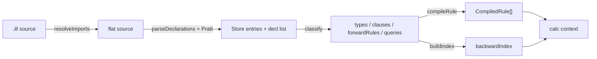

# Loader & Precompile

## Public API (`lib/engine/index.js`)

```js
const mde = require('./lib/engine');

// Source load — parse .ill file(s) to calc context
const calc = mde.load('program.ill');

// Source load with auto-caching — writes binary on miss, reads on hit
const calc = mde.load('program.ill', { cache: '/tmp/program.bin' });

// Explicit precompile — writes binary cache
mde.precompile('program.ill', '/tmp/program.bin');

// Load from precompiled binary
const calc = mde.loadPrecompiled('/tmp/program.bin');
```

All paths return the same **calc context**:

```
{ types: Map<name, hash>,
  clauses: Map<name, { hash, premises }>,
  queries: Map<name, hash>,
  forwardRules: CompiledRule[],
  prove(goal, opts),
  exec(state, opts) }
```

## Data Flow



### Source load path (`convert.load`)

1. **`resolveImports`** — inline `#import(path)` directives recursively (dedup via Set)
2. **`expandHexNotation`** — rewrite `N_XX` hex literals to binary
3. **`parseDeclarations`** — split source into name/body/premise declarations
4. **`_exprParser`** (Pratt) — parse each body/premise to content-addressed Store hash
5. **Classify** — `hasMonad(hash)` → forward rule, has premises → clause, else → type

### Precompiled load path (`loadPrecompiled`)

1. **`fs.readFileSync`** → raw Buffer
2. **`deserialize`** → snapshot object (SoA arrays + metadata JSON)
3. **`Store.restore`** — bulk memcpy arrays, rebuild DEDUP/string/bigint tables, restore dynamic tags
4. **`_deserializeCompiledRules`** — convert Array fields back to Set (freevars, persistentDeps)
5. **`_buildCalc`** — build backward index, return calc context

## Binary Format (`lib/engine/store-binary.js`)

Little-endian, CRC32-checked. ~65 KB for multisig program.

| Section | Layout |
|---|---|
| Header (20B) | magic `CALC` (u32), version (u16), endian (u8), reserved (u8), nodeCount (u32), strCount (u32), bigCount (u32) |
| SoA arrays | tags (u8[N]), arities (u8[N]), padding to 4B align, child0..3 (u32[N] each) |
| DEDUP | hashes (u32[N]) — content hash per node for rebuilding DEDUP map |
| Strings | per entry: length (u16) + utf8 bytes |
| BigInts | per entry: sign (u8) + byteLen (u16) + LE bytes |
| Tag registry | tagCount (u16), per tag: nameLen (u16) + utf8 |
| Metadata | metaLen (u32) + JSON bytes (types, clauses, forwardRules, compiledRules, queries) |
| Footer (4B) | CRC32 of everything above |

## Store Snapshot/Restore (`lib/kernel/store.js`)

**`snapshot(metadata)`** — copies SoA slices (1-based → 0-based), precomputes DEDUP hashes, copies string/bigint/tag tables. Returns plain object ready for `serialize()`.

**`restore(data)`** — clears dynamic tags (>= `PRED_BOUNDARY`), re-registers snapshot tags, bulk memcpy into SoA arrays, rebuilds DEDUP map + string/bigint tables. O(N) where N = nodeCount.

Content-addressing is preserved: `Store.put(tag, children)` after restore returns the same ID as before snapshot.

## Compiled Rules in Cache

Forward rules are compiled (`compile.js`) at cache-write time and stored in metadata JSON. This avoids recompilation on load (~2.4ms saved).

**Gotcha — Set serialization**: `linearMeta[p].freevars` and `.persistentDeps` are JavaScript `Set` objects. `JSON.stringify(new Set(...))` produces `{}`, silently dropping entries. The `_serializeCompiledRules`/`_deserializeCompiledRules` helpers convert Set↔Array at the serialization boundary.

## Import Resolution

`resolveImports(source, basePath)` inlines `#import(path)` directives recursively. A `Set` of resolved absolute paths prevents circular imports.

Import chain example: `multisig.ill → evm.ill → bin.ill`.

**Limitation**: precompiling only the SDK (e.g. `evm.ill`) and then loading a user program does not skip re-parsing imports — `#import(evm.ill)` in the user file triggers a full re-parse regardless of Store state. Incremental import-skipping is not yet implemented.

## Performance (multisig_nocall_solc_symbolic, 689 nodes, warm)

| Path | Load | Explore | Total |
|---|---|---|---|
| Source (Pratt parser) | ~13.5ms | ~10ms | ~23.5ms |
| Full precompiled | ~2.6ms | ~10ms | ~12.6ms |
| Before (tree-sitter) | ~51ms | ~10ms | ~61ms |
