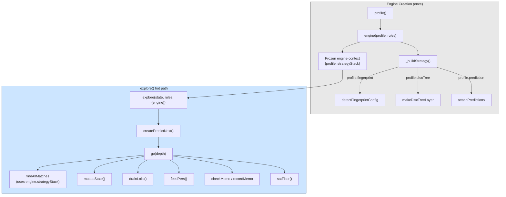

# Optimization Architecture

The forward engine accumulated ~12 optimizations over 16 stages (see `forward-optimization-roadmap.md`). These were originally interleaved directly in `match.js`, `explore.js`, `strategy.js`, and `state-ops.js` — making the core logic hard to read, test, or toggle independently.

Phase 1 of TODO_0066 extracted all optimizations into `lib/engine/opt/` modules, controlled by a profile system in `optimizer.js`. Optimizations are resolved as function pointers at engine creation time — no runtime branching in hot loops.

## Design Principles

**Resolve once, call direct.** Profile flags are checked once at engine startup. The hot path sees only direct function calls, never `if (profile.X)` checks. V8's monomorphic inline caches stay happy.

**Import, don't parameterize.** Extracted modules import their dependencies directly (e.g., `loli-drain.js` imports `mutateState` from `state-ops.js`). Passing functions as parameters creates polymorphic call sites that defeat V8 optimization. This was learned empirically: passing `mutateState` as a parameter caused a 70% regression on `solc_symbolic`.

**Closures over context objects.** When a module needs captured state (e.g., prediction needs `bytecodeElems` and `discIndex`), return a closure that captures the values directly. Property lookups on context objects in hot loops are measurably slower than closed-over variables. The prediction module (`createPredictNext`) returns `function(m) { ... }` or `null`, not `{ predict(m) { this.discIndex[...] } }`.

**Core stays readable.** After extraction, `explore.js` dropped from ~500 to 333 lines. The `go()` function reads as a clean DFS algorithm — cycle check, memo check, match, branch — with optimizations delegated to imported functions.

## Module Map

```
lib/engine/
├── optimizer.js            # Profile resolution + engine creation
├── match.js                # Core matching
├── strategy.js             # Strategy stack builder
├── forward.js              # Single-path execution
├── explore.js              # DFS exploration
├── state-ops.js            # State mutation: consume/produce/mutateState
├── compile.js              # Rule compilation
├── constraint.js           # EqNeqSolver data structure
├── backward-cache.js       # Backward proof cache (toggleable)
├── constraint-feed.js      # Solver integration: feedPers, satFilter
├── delta-bypass.js         # Direct child extraction for flat patterns
├── preserved.js            # Skip re-producing unchanged facts
├── disc-tree.js            # Discrimination tree indexing
├── lnl/loli-drain.js       # Persistent-trigger loli fusion (LNL-generic)
└── opt/                    # Extracted optimization modules
    ├── ffi.js              # FFI-accelerated persistent proving + compiled steps
    ├── compiled-clauses.js # Compiled clause dispatch (zero-subgoal → direct lookup)
    ├── existential-compile.js # Compiled ∃-chain (per-goal FFI fast path)
    ├── structural-memo.js  # Control-hash memoization
    ├── prediction.js       # Threaded code dispatch / Opt_H
    └── fingerprint.js      # Fingerprint detection + layer factory
```

## Profiles

Three built-in profiles in `optimizer.js`:

| Profile | Flags | Use case |
|---------|-------|----------|
| `bare` | All off | Correctness baseline. Tests that the engine works without any optimization. |
| `fast` | `ffi`, `compiledSub`, `preserved` | Default for general use. Enables the highest-impact, lowest-risk optimizations. |
| `evm` | All on | Full optimization stack. Default when `CALC_PROFILE` is unset. |

Selection: `CALC_PROFILE` env var > explicit argument > default (`evm`).

```javascript
// optimizer.js
const PROFILES = {
  bare: { ffi: false, discTree: false, ... },
  fast: { ffi: true,  compiledSub: true, preserved: true, ... },
  evm:  { ffi: true,  discTree: true, deltaBypass: true, preserved: true,
           compiledSub: true, fingerprint: true,
           loliDrain: true, structuralMemo: true, prediction: true, solver: true },
};
```

## Flag → Module → What It Controls

| Flag | Module | What it does |
|------|--------|--------------|
| `ffi` | `opt/ffi.js` | FFI-accelerated persistent proving (inc, plus, neq, mul). Without this, all persistent goals use state lookup → clause resolution. Also enables compiled existential chain (`opt/existential-compile.js`) and compiled clause dispatch (`opt/compiled-clauses.js`). |
| `discTree` | `disc-tree.js` | Discrimination tree layer in the strategy stack. Without this, the predicate layer (linear scan with predicate filtering) is the catch-all. |
| `deltaBypass` | `delta-bypass.js` | Direct `Store.child()` extraction for flat delta patterns. Bypasses full `matchIndexed` decomposition. |
| `preserved` | `preserved.js` | Skip consuming and re-producing facts that appear unchanged in consequent. |
| `compiledSub` | `rule-analysis.js` | Precompiled `Store.put` recipes for consequent instantiation. Bypasses recursive `applyIndexed`. |
| `fingerprint` | `opt/fingerprint.js` | O(1) fingerprint layer in strategy stack. Auto-detects discriminating predicates from rule structure. |
| `loliDrain` | `lnl/loli-drain.js` | Eagerly fires persistent-trigger lolis before DFS continuation. Safe because they consume only themselves. |
| `structuralMemo` | `opt/structural-memo.js` | Control-hash memoization: `hash(PC, SH)` detects isomorphic subtrees. |
| `prediction` | `opt/prediction.js` | Threaded code dispatch. Predicts next rule from substitution, skips `findAllMatches`. |
| `solver` | `constraint.js` + `constraint-feed.js` | EqNeq constraint solver for branch pruning. Feeds persistent facts to solver, filters UNSAT alternatives. |

## Data Flow



## Testing

Three test commands verify correctness across profiles:

```bash
npm run test:all                                          # evm (default)
CALC_PROFILE=bare npm run test:all -- --timeout 120000    # bare (no opts)
CALC_PROFILE=fast npm run test:all                        # fast (partial opts)
```

The `bare` profile is the correctness baseline. If a test passes on `bare` but fails on `evm`, the bug is in an optimization module. If it fails on `bare`, the bug is in core logic.

## Performance

Benchmark after extraction (vs pre-refactor baseline, 30 iterations):

| Benchmark | Change | Status |
|-----------|--------|--------|
| solc_symbolic (477 nodes) | +0.6% | Within noise |
| multisig (84 nodes) | -10.8% | Within noise |

Zero measurable regression from the module reorganization. V8 inlines across CommonJS module boundaries for monomorphic call sites.

### V8 Deoptimization Lessons

Two patterns caused regression during extraction and had to be fixed:

1. **Function-as-parameter.** Passing `mutateState` to `drainLolis` as a parameter created a polymorphic call site. Fix: import directly.

2. **Context object in hot loop.** `predictNext(m, ctx)` with `ctx.discIndex[...]` lookups was slower than a closure capturing `discIndex` directly. Fix: `createPredictNext()` returns a closure.

## Cache Semantics

Three caching mechanisms with different invalidation strategies:

| Cache | Location | Key | Invalidation | Soundness |
|---|---|---|---|---|
| **Backward cache** | `backward-cache.js` | `(pred, input_args...)` | Cleared at start of each `run()`/`explore()` call | Sound iff cleared per-run. Persistent context is monotonically growing within a DFS path. Cached successes remain valid on all paths (persistent facts never retract). Cached failures are conservative — re-proving on miss is correct, never false positive. Arena undo retracts persistent facts on backtrack, but cache is keyed on inputs not persistent state. |
| **Tabling cache** | `lnl/persistent.js` | `(goal_hash)` | Cleared with backward cache (same `lnlClearCache()` call) | Same invariant as backward cache — cleared per run |
| **Compose disk cache** | `compose.js` | `(rule_hash_pair)` | Stable across runs (content-addressed, deterministic) | Sound because input rules are immutable content-addressed hashes — same inputs always produce same composed output |

## Constraint Feed (`constraint-feed.js`)

The constraint solver integration has two functions:

**`feedPers(solver, perArena, checkpoint)`** — reads newly-added persistent facts from the Arena undo log (INSERT operations between checkpoint and cursor) and feeds their hashes to the EqNeqSolver. Called after each `mutateState()` in the DFS loop.

**`satFilter(solver, alts, theta, slots)`** — SAT-filters oplus alternatives. For each alternative, tentatively adds its persistent consequents to the solver and checks satisfiability. Returns indices of surviving (SAT) alternatives. Uses solver checkpoint/restore so filtering is non-destructive.

The EqNeqSolver itself (`constraint.js`) is a data structure — union-find with forbid list for `eq`/`neq` constraints. The constraint-feed module handles lifecycle integration with the DFS loop.

## Zig Portability

All opt/ modules use explicit parameters (state, theta, slots, etc.) and return simple values. No closures, no `this`, no hidden state. This maps directly to `*const fn(...)` function pointers in Zig. The profile becomes a compile-time struct of function pointers, resolved at engine initialization.
