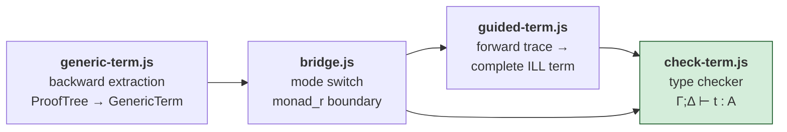
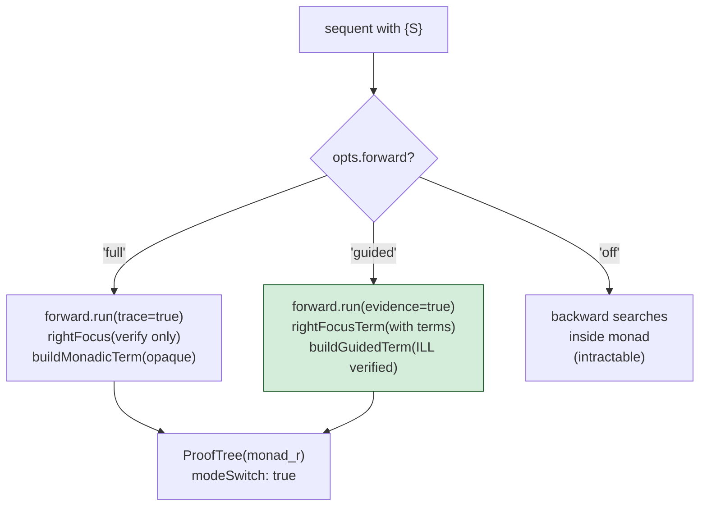

# Proof Term Pipeline

Proof terms flow through four stages, controlled by three execution profiles. The pipeline implements the Curry-Howard correspondence for ILL with the CLF lax monad.

## Stages



### Stage 1: Backward Extraction (`generic-term.js`)

`extractTerm(proofTree)` walks a completed ProofTree post-hoc, building GenericTerm objects. One constructor per inference rule (Harper-Honsell-Plotkin LF adequacy). Term shapes are derived from rule descriptors:

- `side='l'` → first arg is principal `z`
- `binding='eigenvariable'` → fresh variable `a`
- `binding='metavar'` → witness term `s`
- `premises[i].linear` → bound variables scoped over sub-proof

Also provides `buildMonadicTerm(trace, rfTerm)` for the `full` profile: wraps forward trace entries as opaque CLF let-chain with `monad_r(evidence)`.

### Stage 2: Bridge (`bridge.js`)

`executeModeSwitch(seq, engineCalc, opts)` is the single integration point where the execution profile is checked. Everything upstream (inversion, focus, identity, copy) is identical.



**rightFocus** decomposes the succedent `S` against residual state after quiescence:
- `tensor(A,B)` → greedy left-to-right
- `one` → linear must be empty
- `bang(A)` → check persistent
- `atom/pred` → consume from linear

**rightFocusTerm** does the same but also builds proof terms: `tensor_r`, `one_r`, `promotion(id(a))`, `id(x)`.

### Stage 3: Guided Construction (`guided-term.js`)

`buildGuidedTerm(trace, rfTerm)` folds right-to-left over enriched trace entries, producing a complete ILL proof term. Each forward step becomes:

```
copy(ruleHash,
  loli_l(antecedentProof,
    monad_l(result,
      consequentDecomp(continuation))))
```

Where:
- `copy` — fetches the rule from persistent gamma (the .ill program rule)
- `loli_l` — applies linear implication (focused 2-subterm variant)
- `antecedentProof` — `tensor_r` tree of `id(consumed)` + `promotion(evidence)`
- `monad_l` — unwraps monadic body
- `consequentDecomp` — `tensor_l`/`bang_l` chain binding produced facts

**Loli matches** (linear implications from state, not program rules) use the same structure minus the `copy` wrapper, since the loli is consumed from delta, not copied from gamma.

### Stage 4: Type Checking (`check-term.js`)

`createChecker(calculus)` returns `{ check, expand }`:
- `check(term, sequent)` — entry point, constructs `Gamma; Delta` from sequent
- `expand(hash)` — converts Store hashes to plain `{ tag, children, hash }` trees (once)

Internally, `buildCheckerMap(calculus)` generates one checker function per rule from descriptors. Each checker validates context splitting (linear variables consumed exactly once) and recursive subterm typing.

**Focused loli_l**: The checker handles both the standard 1-premise variant (from descriptor) and the focused 2-subterm variant (from guided execution). Dispatch is by subterm count.

## Three Execution Profiles

| Profile | Forward engine | Term quality | Verifiability |
|---|---|---|---|
| `full` (default) | runs fully | opaque `monad_r(evidence)` | kernel: `unverified: 'modeSwitch'` |
| `guided` | runs with evidence | complete ILL term | check-term.js: full recursion |
| `off` | not used | standard backward term | kernel: full verification |

## Unverified Escape Hatches

Two constructors in the term language mark unverified steps:

| Constructor | Source | Meaning |
|---|---|---|
| `unreachable(reason)` | Dead branches in proof trees | Branch cannot be reached (e.g., `zero_l`) |
| `ffi(name, args, result)` | FFI axiom in persistent proving | Arithmetic shortcut, not verified by check-term |

In `full` profile, the entire monadic fragment is unverified (kernel returns `unverified: 'modeSwitch'`). In `guided` profile, the only unverified gaps are FFI axioms — every other step has a checkable ILL derivation.

## Known Gap: loli_match (C2)

The `loli_match` handler in check-term.js (line 232) handles dynamic loli rules — linear implications matched from state during forward execution. This is the proof-term analogue of `lnl/loli.js:matchLoli`. The handler exists but coverage of complex guard structures (tensor of bang + linear, nested exists) is limited. Tracked as C2 in audit findings.

## Dual Verification Paths

| Verifier | Scope | How |
|---|---|---|
| `kernel.js:verifyStep` | Backward proof steps | Subset check on conclusion vs premises |
| `check-term.js:check` | Complete proof terms | Type checking `Γ; Δ ⊢ t : A` |

`check-term.js` is strictly stronger — it verifies full context splitting and resource tracking. `kernel.js` is a weaker but faster step-by-step check. Both are in the trusted base.

Note: `check-term.js` is currently test-only (not invoked in production paths).

## Key Files

| File | Role |
|---|---|
| `lib/prover/generic-term.js` | `extractTerm` — backward proof tree → generic term, `buildMonadicTerm` — opaque forward term |
| `lib/prover/bridge.js` | `executeModeSwitch` — profile dispatch, `rightFocus`/`rightFocusTerm` — succedent decomposition |
| `lib/prover/guided-term.js` | `buildGuidedTerm` — forward trace → complete ILL term |
| `lib/prover/check-term.js` | `createChecker` → `{ check, expand }` — type checker |
| `doc/documentation/proof-terms.md` | Constructor catalog and typing rules |
