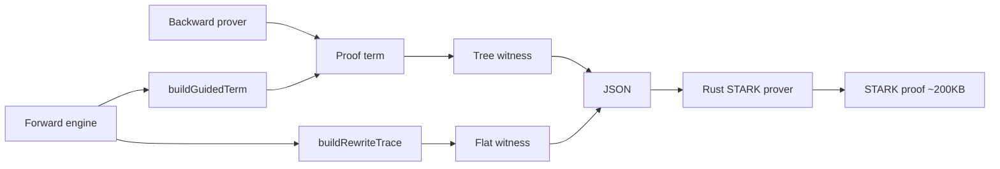

# ZK Proof Certification

CALC proofs can be verified in zero knowledge using STARK proofs. The ZK subsystem takes a proof term (from the backward prover or forward engine) and produces a cryptographic proof that the term is valid — without revealing the proof itself.

The core insight: the ZK circuit verifies `checkTerm(proofTerm, sequent)` — proof term type-checking. It does NOT replicate the forward engine or backward prover. Those are strategies for *finding* proof terms. The circuit only certifies that a *found* term is valid.

The architecture is **calculus-agnostic**. The Rust verifier contains zero ILL-specific code. Tags, rule specs, and witness data are derived from `.calc`/`.rules` descriptors at witness generation time. The same compiled binary verifies proofs from any calculus defined in CALC.

## Technology Stack

| Component | Choice |
|---|---|
| STARK toolkit | Plonky3 v0.4.1 |
| Multi-chip framework | OpenVM stark-backend v1.3.0 (Cantina audit, Feb 2026) |
| Recursive verifier | openvm-native-recursion v1.5.0 |
| Field | BabyBear (31-bit prime, quartic extension ~2^124) |
| Language | Rust (verifier/prover), JS (witness generation) |

## Two Verification Paths



### Tree Path (ILL Proof Terms)

Verifies full derivation trees: `checkTerm(term, sequent)`. Produced by backward prover, forward engine (via `buildGuidedTerm`), or manual prover. Each proof term node maps to one chip row in DFS pre-order.

- NOT IVC-compatible (obligation nonce threading crosses subtree boundaries)
- Chunked via ObligBoundaryChip + CtxBoundaryChip at obligation-depth boundaries
- Best for backward proofs (search IS tree construction)

### Flat Path (Rewriting Certificates)

Verifies forward execution traces: each step records (rule, consumed facts, produced facts). Resource accounting only — no derivation tree structure.

- IVC-compatible (each step is self-contained, chunk at any step boundary)
- 10x fewer rows, 32x smaller witness than tree path
- Forward-only — does not apply to backward proofs

### Coexistence

Both paths share the same STARK infrastructure (buses, prover, verifier). The `format` field in the witness JSON dispatches at runtime. The monad boundary (`monad_r`) is the natural seam: backward proof above (tree-path STARK) + forward certificate below (flat-path IVC). A complete proof of `Γ; Δ ⊢ {A}` can use both.

### Custom Chips (Performance Optimization)

Custom chips replace O(clause_depth) backward clause proof subtrees with O(1) lookups for specific predicates. For the 279-step solc benchmark: 1.74M → 338 active rows (99.98% reduction).

| Mechanism | What it does |
|---|---|
| FactRomAir + FACT_BUS | ROM membership for all predicate facts |
| PredicateRomAir + PRED_BUS | In-circuit arithmetic verification (plus/mul/inc) |
| Uint256ArithChip + BYTE_CHECK_BUS | 256-bit arithmetic (8-limb decomposition, carry propagation) |
| FactAxiomChip (width 32) | Replaces clause proof subtrees — variable-width CONTEXT_BUS |

Custom chips are opt-in (`customChips` set in witness generation). Without them, the noFFI general path works for any calculus, any predicates — it just produces more rows.

## Bus Architecture (14 Buses)

All inter-chip communication goes through LogUp buses. Two types: `PermutationCheckBus` (multiset equality — both sides must balance) and `LookupBus` (every demand must have a matching supply in a ROM).

### Universal Buses (any sequent calculus)

| ID | Name | Type | Tuple | Purpose |
|---|---|---|---|---|
| 0 | OBLIG_BUS | PermCheck | (nonce, type_hash, lax) | Obligation produce/consume — every proof step gets/fulfills goals |
| 2 | FORMULA_BUS | Lookup | (hash, tag, child0, child1) | Formula decomposition — ROM prevents forged connective tags |

### Structural Buses (substructural logics)

| ID | Name | Type | Tuple | Purpose |
|---|---|---|---|---|
| 1 | CONTEXT_BUS | PermCheck | (hash) | Linear resource tracking — multiset equality enforces linearity |
| 3 | DISCARD_BUS | Lookup | (nonce) | zero_l discard authorization — prevents unauthorized resource discarding |
| 4 | GAMMA_BUS | Lookup | (hash) | Cartesian zone membership — unlimited copies for persistent facts |

### Pattern Matching Buses

| ID | Name | Type | Tuple | Purpose |
|---|---|---|---|---|
| 5 | SUBST_TREE_BUS | PermCheck | (subst_id, old_hash, new_hash) | Links SubstChip parent→child rows during loli pattern matching |
| 6 | FREEVAR_BUS | Lookup | (subst_id, freevar_hash, ground_value) | Freevar consistency — each freevar maps to exactly one ground value |

### Custom Chip Buses

| ID | Name | Type | Tuple | Purpose |
|---|---|---|---|---|
| 7 | CANON_CONS_BUS | Lookup | (cons_hash, canon_cons) | Canonical loli body form (flat path) |
| 8 | FACT_BUS | Lookup | (goal_hash) | Verified predicate fact membership |
| 9 | PRED_BUS | Lookup | (pred_hash) | Predicate semantic verification (arithmetic) |
| 10 | BYTE_CHECK_BUS | Lookup | (byte_value) | 8-bit range check for 256-bit limbs |

### PV Binding Buses (cryptographic PV→trace anchoring)

| ID | Name | Type | Tuple | Purpose |
|---|---|---|---|---|
| 11 | OBLIG_PV_BIND_BUS | PermCheck | (discriminator, goal_hash, lax) | Binds obligation PVs to trace |
| 12 | CTX_PV_BIND_BUS | PermCheck | (discriminator, hash) | Binds context PVs to trace |
| 13 | FLAT_PV_BIND_BUS | PermCheck | (discriminator, hash) | Binds flat-path PVs to trace |

## Chip Inventory

### Generic RuleChip (auto-generated from RuleSpec)

A single parameterized AIR chip handles 23/24 ILL rules. `RuleSpec` describes bus interactions declaratively; `ColumnLayout::compute(spec)` auto-computes column indices. Adding a rule = adding a RuleSpec. Adding a calculus = deriving specs from `.rules` descriptors.

```rust
pub struct RuleSpec {
    pub name: String,
    pub tag: Option<u32>,           // connective tag for FORMULA_BUS
    pub arity: u8,                  // children of principal formula
    pub oblig_receive: bool,        // receive from OBLIG_BUS?
    pub premises: Vec<PremiseSpec>, // obligations to produce
    pub ctx_receive: bool,          // receive principal from CONTEXT_BUS?
    pub ctx_sends: Vec<CtxSend>,    // send to CONTEXT_BUS
    pub formula_lookup: bool,       // look up in FORMULA_BUS?
    pub gamma_lookup: bool,         // look up in GAMMA_BUS?
    pub fact_lookup: bool,          // look up in FACT_BUS?
    pub is_identity: bool,          // hash serves both OBLIG and CONTEXT
}
```

Example instances (widths vary 2–9): `id` (4), `tensor_r`/`with_r` (8), `tensor_l` (4), `loli_r` (7), `loli_l`/`oplus_l` (9), `one_r` (4), `copy` (2), `bang_r`/`monad_r` (6).

### Specialized Chips

| Chip | Width | Purpose |
|---|---|---|
| InitChip | 3 main + 5 prep | Initial sequent: context + root obligation. PVs bind the proof to a specific sequent. |
| DupChip | 2 | Additive context duplication (with_r, oplus_l branching). Receive 1, send 2. |
| ZeroLChip | 6 | Ex falso quodlibet. Authorizes `num_discards` via DISCARD_BUS. |
| DiscardChip | 3 | Consumes one linear resource with DISCARD_BUS authorization. |
| SubstChip | 16 | Loli pattern matching: tree-walk verification via SUBST_TREE_BUS + FREEVAR_BUS. Handles root/internal/freevar/unwrap row types. |
| FactAxiomChip | 32 | Custom chip: replaces clause proof subtrees. Variable-width CONTEXT_BUS (0–6 consumed + 0–6 produced). |
| Uint256ArithChip | 65 main + 101 prep | 256-bit arithmetic: 32-limb (8-bit) decomposition, carry propagation, BYTE_CHECK_BUS range checks. |

### ROM Chips (preprocessed, VK-committed)

| Chip | Prep width | Bus | Purpose |
|---|---|---|---|
| FormulaRomAir | 5 | FORMULA_BUS | Formula decomposition supply (hash, tag, c0, c1, is_active) |
| GammaRomAir | 2 | GAMMA_BUS | Persistent zone membership |
| FreevarRomAir | 4 | FREEVAR_BUS | Freevar→ground binding (chunk-local) |
| FactRomAir | 3 | FACT_BUS | Verified predicate fact membership |
| PredicateRomAir | 13 | PRED_BUS | Arithmetic constraints: `is_plus*(a+b-c)=0`, `is_mul*(a*b-c)=0`, `is_inc*(a+1-b)=0` |
| ByteCheckRomAir | 1 | BYTE_CHECK_BUS | 256-entry [0..255] range check |
| CanonConsRomAir | 3 | CANON_CONS_BUS | Loli body canonical form (flat path) |

### Flat-Path Chips

| Chip | Width | Purpose |
|---|---|---|
| FlatInitChip | 4 | Send initial linear context to CONTEXT_BUS. PV binding via FLAT_PV_BIND_BUS. |
| FlatStepChip | 43 | Per forward step: consume/produce facts, verify rule structure + substitution. Degree-4 constraints (needs log_blowup=2). |
| FlatFinalChip | 4 | Receive remaining context from CONTEXT_BUS. PV binding via FLAT_PV_BIND_BUS. |

### Boundary Chips (tree-path chunking)

| Chip | Width | Purpose |
|---|---|---|
| ObligBoundaryChip | 8 | Inter-chunk obligation handoff. Running-sum PV→trace binding via OBLIG_PV_BIND_BUS. |
| CtxBoundaryChip | 6 | Inter-chunk context handoff. Running-sum + per-element PV binding via CTX_PV_BIND_BUS. |

## Witness Generation Pipeline (JS)

### Tree Path

```javascript
const { generateWitness, deriveZkTags, deriveZkRuleSpecs } = require('./lib/zk/witness');

const tags = deriveZkTags(calculus);        // connective → integer from .calc definition order
const ruleSpecs = deriveZkRuleSpecs(calculus, tags);  // .rules descriptors → RuleSpec structs
const witness = generateWitness(proofTerm, sequent, {
  calculus,
  customChips: new Set(['inc', 'plus', 'arr_get', ...])  // optional, enables FactAxiomChip
});
// → { tags, rule_specs, chips: { init, id, tensor_r, ... }, formula_rom, gamma_rom, ... }
```

**Algorithm**: iterative DFS walk (trampoline) of the proof term. At each node: determine rule → emit one chip row to the appropriate accumulator → update live delta (linear context) → advance nonce counter. Special handling for additive branching (DupChip rows), zero_l (DiscardChip rows), loli matches (SubstChip rows), custom chips (FactAxiomChip rows).

### Flat Path

```javascript
const { generateFlatWitness, generateChunkedFlatWitness } = require('./lib/zk/flat-witness');

const witness = generateFlatWitness(trace, sequent, { calculus });
// → { format: 'flat', chips: { flat_init, flat_step, flat_final, subst }, formula_rom, gamma_rom, ... }

// For IVC chunking:
const chunks = generateChunkedFlatWitness(trace, sequent, { calculus, maxRowsPerChunk: 1 << 20 });
```

**Algorithm**: one FlatStepChip row per forward step. Tensor spine intermediates computed for FORMULA_BUS verification. Loli matches emit SubstChip rows. ROMs normalized across chunks for constant VK.

### Tag Derivation

`deriveZkTags(calculus)` assigns 1-indexed integers to formula connectives in `.calc` definition order (excluding `atom`). `freevar` is appended as `maxTag + 1` (Store built-in, not a calculus connective). Example for ILL: tensor=1, loli=2, one=3, zero=4, with=5, oplus=6, bang=7, monad=8, exists=9, forall=10, freevar=11.

### Rule Spec Derivation

`deriveZkRuleSpecs(calculus, tags)` maps `.rules` descriptors to RuleSpec structs. Same source of truth as the backward prover and forward engine. Hard-coded special rules: `id`, `copy`, `ffi`, `fact_axiom`, `loli_l_inv`.

## Proving Pipeline (Rust)

### Entry Point

```rust
use sequent_certifier::bridge::prove_json;

let json = std::fs::read_to_string("witness.json").unwrap();
prove_json(&json);  // dispatches on format field: "flat" → flat path, else → tree path
```

### Bridge Flow (`bridge.rs`, 1191 lines)

1. Deserialize witness JSON → `WitnessJson` or `FlatWitnessJson`
2. Read `tags` map (runtime, no hardcoded ILL knowledge)
3. Read `rule_specs` → construct `RuleChip::new(spec)` instances
4. For each chip section: deserialize rows → `RowMajorMatrix<BabyBear>` padded to next power of 2
5. Construct ROM chips: split preprocessed columns from main trace (num_lookups)
6. Push all `Arc<dyn AnyRap<_>>` + trace matrices into vectors
7. Call `BabyBearPoseidon2Engine::run_simple_test_fast(chips, traces)` → keygen + prove + verify

### Key Bridge Functions

| Function | Purpose |
|---|---|
| `prove_json(json)` | Format dispatch |
| `prove_witness(w)` | Tree-path prove+verify |
| `prove_flat_witness(w)` | Flat-path prove+verify |
| `prove_chunked_tree_witness(chunks)` | Parallel tree chunk proving |
| `prove_chunked_flat_witness(chunks)` | Parallel flat chunk proving |
| `normalize_tree_witnesses(ws)` | Union all preprocessed data for shared VK |
| `prove_witnesses_shared_keygen(ws)` | Single keygen + rayon parallel proving |

### Shared Keygen Protocol

For N witnesses to share one VK (IVC, symbolic paths), all preprocessed traces must be identical. `normalize_tree_witnesses` unions:
- Rule chip names (missing ones get empty rows)
- Init chip rows (per-witness `is_active` stays in main trace)
- All ROM entries (formula, gamma, fact, freevar, pred, uint256) — per-witness `num_lookups` varies in main trace only

### Recursive Composition

Uses `openvm-native-recursion` DSL to verify chunk STARKs inside a recursive STARK:

1. Build `MultiStarkVerificationAdvice` from shared VK
2. `VerifierProgram::build(advice, fri_params)` → compilation to BabyBear program
3. Execute via OpenVM metered interpreter
4. The composition program checks: each chunk STARK valid + PV continuity (`ctx_out[i] == ctx_in[i+1]`) + obligation continuity + VK identity
5. Outer recursive STARK commits: init PVs + final boundary PVs + VK hash

## Soundness Model

### What Each Bus Enforces

| Layer | Bus(es) | Guarantee |
|---|---|---|
| Universal | OBLIG_BUS | Every obligation produced is consumed exactly once with matching (nonce, type, lax) |
| Universal | FORMULA_BUS | Formula decompositions match VK-committed ROM — no forged tags or children |
| Structural | CONTEXT_BUS | Multiset equality: every linear resource introduced is consumed the right number of times |
| Structural | DISCARD_BUS | Only zero_l can authorize discarding linear resources |
| Structural | GAMMA_BUS | Copy can only use facts actually in the persistent zone |
| Matching | SUBST_TREE + FREEVAR | Substitution is structurally correct (same tags) and consistent (each freevar has one ground value) |
| Custom | FACT_BUS + PRED_BUS | Predicate facts are ROM-committed; arithmetic predicates satisfy field constraints |
| Binding | PV_BIND buses | Public values are cryptographically anchored to trace via LogUp multiset equality |

### Cryptographic Parameters

- LogUp extension field: BabyBear quartic (~2^124). False positive per bus: ≤ n/|F_ext|.
- FRI: configurable. Currently `new_for_testing(3)` (fast, insecure). Production: ~100-bit security (TODO_0118).
- ROM commitments: preprocessed columns committed via Poseidon2 at keygen → part of VK.

### Trust Boundaries

- **VK-committed**: formula ROM, gamma ROM, fact ROM, pred ROM, freevar ROM, init chip sequent data → prover cannot forge after keygen
- **Custom chip soundness**: FactAxiomChip trusts ROM entries. PredicateRomAir verifies arithmetic in-circuit. Array/memory predicates rely on ROM membership (VK-committed).
- **noFFI default**: all persistent goals produce backward clause proof terms verified by standard RuleChips. Zero trusted axioms. Full adversarial soundness.

## Performance

### Solc Benchmark (279-step EVM, MultisigNoCall)

| Metric | Tree path | Flat path |
|---|---|---|
| Trace rows | 6,267 | 596 |
| Witness size | 858 KB | 27 KB |
| Active chips | 13 | 5–7 |
| STARK prove+verify (release) | 2.56s | 2.81s |

### Custom Chip Impact (Tree Path)

| Configuration | Active rows |
|---|---|
| noFFI (clause proofs expanded) | ~1.74M |
| With custom chips | 338 |
| Reduction | 99.98% |

### 31-Path Symbolic Pipeline (8 cores, release)

| Stage | Time |
|---|---|
| Exploration (FFI) | 65ms |
| Witness generation (31 fixtures) | 320ms |
| STARK proving (shared keygen) | 81s wall (~2.6s avg/path) |
| Recursive composition (3 chunks) | ~110s |
| **Total** | **~195s (~3.3 min)** |

Production FRI estimate: 3–5x slowdown → ~10–15 min total.

### Scaling Characteristics

- Release vs debug: 67x speedup for STARK proving
- Shared keygen vs independent: 22x speedup (ROM normalization eliminates structural variance)
- STARK proving: O(N log N) in trace rows
- Recursive composition: ~37s per verified proof (bottleneck at >200 paths)
- Custom chips: fact_axiom rows are 75–81% of all rows across symbolic paths

## File Structure

### JS (witness generation)

```
lib/zk/
├── witness.js           # Tree: generateWitness, deriveZkTags, deriveZkRuleSpecs,
│                        #   generateChunkedTreeWitness, extractUint256PredMeta
└── flat-witness.js      # Flat: generateFlatWitness, generateChunkedFlatWitness

lib/prover/
├── guided-term.js       # buildGuidedTerm — forward trace → ILL proof term (with custom chip annotations)
├── rewrite-trace.js     # buildRewriteTrace, checkRewriteTrace
└── check-term.js        # checkTerm — proof term type-checker (reference implementation)
```

### Rust (STARK verifier)

```
zk/sequent-certifier/
├── src/
│   ├── lib.rs           # Re-exports: bridge, buses, chips, rule
│   ├── bridge.rs        # JSON → trace matrices → STARK prover (1191 lines)
│   │                    #   prove_json, prove_witness, prove_flat_witness,
│   │                    #   normalize_tree_witnesses, prove_witnesses_shared_keygen
│   ├── buses.rs         # 14 bus constants (IDs 0–13)
│   ├── rule/mod.rs      # RuleSpec, ColumnLayout, generic RuleChip AIR (359 lines)
│   └── chips/
│       ├── init.rs            # InitChip (tree, width 3+5prep)
│       ├── dup.rs             # DupChip (additive duplication, width 2)
│       ├── zero_l.rs          # ZeroLChip (ex falso, width 6)
│       ├── discard.rs         # DiscardChip (DISCARD_BUS lookup, width 3)
│       ├── subst.rs           # SubstChip (pattern matching, width 16)
│       ├── fact_axiom.rs      # FactAxiomChip (custom chip, width 32)
│       ├── uint256_arith.rs   # Uint256ArithChip (256-bit ops, width 65+101prep)
│       ├── formula_rom.rs     # FormulaRomAir (1+5prep)
│       ├── simple_rom.rs      # SimpleRomAir (generic ROM base, 1+2prep)
│       ├── gamma_rom.rs       # GammaRomAir (= SimpleRomAir on GAMMA_BUS)
│       ├── fact_rom.rs        # FactRomAir (= SimpleRomAir on FACT_BUS)
│       ├── freevar_rom.rs     # FreevarRomAir (chunk-local, 1+4prep)
│       ├── pred_rom.rs        # PredicateRomAir (arithmetic constraints, 1+13prep)
│       ├── byte_check_rom.rs  # ByteCheckRomAir (256-entry range check)
│       ├── canon_cons_rom.rs  # CanonConsRomAir (loli body canonical form, 1+3prep)
│       ├── flat_init.rs       # FlatInitChip (flat path, width 4)
│       ├── flat_step.rs       # FlatStepChip (flat path, width 43)
│       ├── flat_final.rs      # FlatFinalChip (flat path, width 4)
│       ├── oblig_boundary.rs  # ObligBoundaryChip (tree chunking, width 8)
│       └── ctx_boundary.rs    # CtxBoundaryChip (tree chunking, width 6)
├── src/bin/
│   └── prove_symbolic.rs      # CLI: shared keygen + parallel proving
└── tests/
    ├── fixtures/              # 57 JSON witness fixtures
    ├── s1–s5_*.rs             # Infrastructure spike tests
    ├── p1f_e2e.rs             # E2E fixture tests (16)
    ├── p2_*.rs                # Per-rule tests (flat, loli, monad, oplus, with, exponential, etc.)
    ├── p3_forgery.rs          # Tamper/forgery rejection tests
    ├── p4a_*.rs               # Chunking + composition tests
    ├── p5_spike_recursive_proof.rs  # Recursive STARK proof test
    └── p6_*.rs                # Phase 6: soundness, shared keygen, symbolic e2e, custom chips,
                               #   uint256, chunked tree, tree composition, tree recursive proof,
                               #   symbolic composition
```

## Usage

### Generate and verify (tree path)

```javascript
// JS: generate witness
const witness = generateWitness(proofTerm, sequent, { calculus });
fs.writeFileSync('witness.json', JSON.stringify(witness));
```

```rust
// Rust: verify
let json = std::fs::read_to_string("witness.json").unwrap();
prove_json(&json);
```

### Generate and verify (flat path)

```javascript
const witness = generateFlatWitness(trace, sequent, { calculus });
fs.writeFileSync('witness.json', JSON.stringify(witness));
```

### Symbolic multi-path proving

```bash
# Prove 31 symbolic execution paths with shared keygen + parallel proving
cargo run --bin prove_symbolic --release -- fixtures/solc_symbolic_*.json
```

### Run tests

```bash
npm test -- --grep "zk"                    # JS witness tests
cd zk && cargo test --release              # All Rust STARK tests
cd zk && cargo test --release --test p6_symbolic_e2e  # Symbolic e2e only
```

## References

- TODO_0084: full design history with soundness proofs, findings, and phase details
- TODO_0086: zone-agnostic bus architecture (generalizing structural buses beyond ILL's two-zone shape)
- TODO_0118: on-chain verification pipeline (production FRI, Groth16 wrapper, Solidity verifier)
- Plonky3: github.com/Plonky3/Plonky3
- OpenVM stark-backend: github.com/openvm-org/stark-backend
- ZKSMT (Luick et al., USENIX Security 2024): IVC for SMT proof checking
