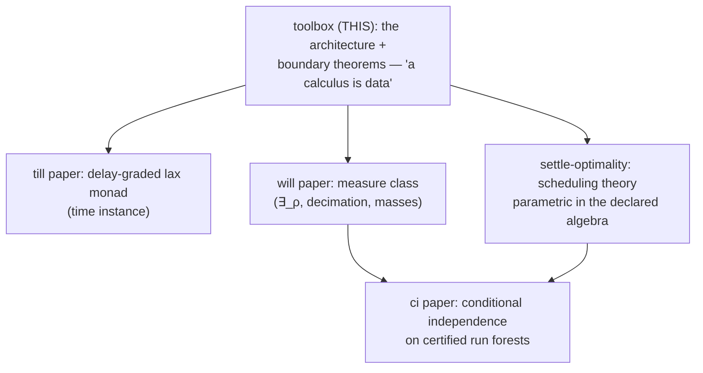

# A Calculus Is Data

**Working title.** "A Calculus Is Data: A Certifying Toolbox for Timed,
Graded, Spatial Linear Logics." Alternatives kept alive: "Zones, Grades,
and Checkers as Calculus Data"; "The Data/Engine Boundary in a
Certifying Linear-Logic Engine" (if a theory venue wants the boundary
theorems foregrounded).

**Status: COMPLETE DRAFT** (markdown master; scaffolded and drafted
2026-09-08 — every section is draft-grade prose; pending Denis's
framing/title gate, the [verify] citation pass, and polish; LaTeX at
venue choice). This is
the TRUNK paper of the CALC arc — the architecture and its boundary
metatheorems; the till, gill (settle-optimality), will, and ci papers
are instance papers that cash out individual extension points. Marker
conventions: ⟨decide⟩ needs a decision recorded here first;
⟨could-add⟩ is optional draft material. The formal centerpiece
(routed-column equivalence) lives in §4, COMPILED from THY_0033 §1
(2026-09-08) — §4 is now the proofs' single source of truth and
THY_0033 §1 the pointer stub.

**One-line thesis.** In CALC, a proof calculus is a *declaration
package* — connectives, inference rules, zone structure, grade
algebras, surface grammar, even the kernel's step checkers are data
loaded from `.calc`/`.rules`/prelude files — and the generic engine's
four faces (backward focused search, forward committed execution,
exhaustive exploration, certified replay) are proved or machine-checked
adequate for every declaration that passes the load fences. The
contribution is not configurability (Maude, K, and logical frameworks
are configurable); it is the **theorem-guarded data/engine boundary**:
each extension point ships either a soundness metatheorem, a per-instance
machine-checked conformance contract, or a *proven impossibility* that
marks where data ends — and the instance family (ILL → till → gill →
will → sill) demonstrates that extending the logic is writing files,
not patching the engine.

---

## 0. Internal ledger — provenance, sources, gates

NOT for the eventual PDF. This section is the draft's control panel.

**Provenance.** Scaffolded autonomously 2026-09-08 on Denis's
direction ("the core paper about calc — everything else builds on top").
The held-disposition decision it executes is recorded in THY_0033
frontmatter `paper:` (2026-09-04: routed-column equivalence HELD for
this paper; standalone workshop note considered and declined).

**Source-of-truth map** (compile FROM these; never fork their content):

| paper section | source | status |
|---|---|---|
| §2 engine & four faces | `doc/documentation/architecture.md` (L0–L5), `lib/` docstrings, layer-DAG test | DRAFTED 2026-09-08 |
| §3 declaring a calculus | THY_0032 (mode preorders → contextStructure), `lib/meta/focusing.js` (polarity inference), `earley-grammar.js` (sorted templates, TODO_0268 §5c) | DRAFTED 2026-09-08 — incl. the focusing-inference story (§3.3), written from the focusing.js mechanism (context flow → polarity; polarity × side → invertibility) |
| §4 zones as data | **THY_0033 §1** (referee-grain proofs: Defs 1–3, Lemmas A/B, U/R theorem, one-pool corollary) | COMPILED 2026-09-08 — proofs moved here (§4 is the single source of truth; THY_0033 §1 is the pointer stub), sill walkthrough added |
| §5 grades as data | settle-optimality §1.1/§8 (dioid contract, C4 split), THY_0022 (fences), `grade-conformance.test.js`, gill's by-sort registry | DRAFTED 2026-09-08; deep theorems stay in the gill paper, cited as parametric |
| §6 certificates | TODO_0294/0295/0298 landings: `fire-check.js`, `draw-check.js`, `sld-check.js`, elaborators; forgery arms in `fuzz-till.js` | DRAFTED 2026-09-08 (writing it produced the TCB import-fence test in `layer-dag.test.js` — the §6.3 boundary is now machine-checked); polish pass pending |
| §7 boundary theorems | THY_0034 (broadcast no-go), THY_0033 §3 (axis-confounding), fence inventory | DRAFTED 2026-09-08 (fence-inventory table ⟨could-add⟩) |
| §8 instance family | CLAUDE.md directory tree + git history (diff shapes) | DRAFTED 2026-09-08 — table + five instance paragraphs + composition mechanisms |
| §9 related work | THY_0033/0034 reference blocks, settle-optimality §12, hq research 0138 Part A | DRAFTED 2026-09-08 — six groups, [verify] flags standing |
| §10 claims | this scaffold §10 | drafted below |

**Gates, in order:**
1. Denis reads this scaffold and confirms the trunk framing + title
   direction (⟨decide⟩ items inline). ← THE OPEN GATE
2. ~~Compile pass §4~~ DONE 2026-09-08 (THY_0033 §1 moved in, stub +
   COMPILED frontmatter there).
3. ~~§6 write~~ DRAFTED 2026-09-08 (+ the TCB import-fence test).
   ~~Remaining ⟨write⟩s~~ ALL DRAFTED 2026-09-08 (§1 intro, §2 faces,
   §3 incl. the inference story, §5, §7, §8 instance paragraphs, §9).
   Remaining before venue: Denis gate (1), [verify] citations, the
   ⟨could-add⟩ fence table, polish pass, LaTeX.
4. The other papers' venue outcomes inform this one's (a systems venue
   wants §8 fat; a theory venue wants §4/§7 fat).

**Honest weak points (reviewer-facing, keep updated):**
1. "Everything is data" has a one-time-generalization asterisk per
   extension point (the P4 pool plumbing, the timed layer itself). The
   money table's two engine columns keep this honest; a referee who
   diffs the repo must find exactly what the table says.
2. No binding/HOAS metatheory — CALC terms are first-order and
   content-addressed. §10's not-claimed list owns this vs LF-family
   frameworks.
3. The adequacy schema (§1) is a *schema*, discharged per extension
   point at different grains (referee-grain proof for zones;
   machine-checked contract for grades; TCB argument for checkers). A
   referee may want one uniform formal statement — the defense is that
   the per-point grain IS the discipline (contract where instances
   vary, theorem where structure is fixed), but say so explicitly.
4. Performance is not claimed and not benchmarked against Maude/K/Celf;
   one paragraph on the content-addressed store + compiled clauses
   exists to preempt "is it usable", nothing more.

---

## 1. Introduction

**Status: DRAFTED** (2026-09-08).

Every substantial extension of a proof-theoretic engine tends to
become an engine fork. Add a modality and the focusing discipline
needs new cases; add a context zone and the resource manager grows a
second bookkeeper; add a grade algebra and the scheduler learns its
arithmetic; add a probabilistic construct and the trusted checker
learns to sample. The promise that "the logic is data" is as old as
logical frameworks — but it is usually kept only for the *formula*
layer. The layers that make substructural logics interesting to
execute — linear context management, temporal scheduling, measure
aggregation, certification — are exactly the layers that resist being
data, because their soundness arguments seem to depend on the specific
logic.

CALC is a linear-logic toolbox built on the opposite bet: that the
resource, scheduling, and certification layers can be generic if — and
only if — the **data/engine boundary is guarded by theorems**. The
reader has seen configurable rewriting engines (Maude, K) and logical
frameworks (LF/Twelf, λProlog, Celf); the claim here is NOT "another
one." Configurability without a boundary discipline yields engines
where a new declaration can be accepted and silently mis-run.
The discipline is this paper's subject:

**The adequacy schema (the paper's spine).** Let `D` be a declaration
package (family + `.calc` + `.rules` + preludes) passing all load
fences. Then the engine's four faces are adequate for the calculus
`C(D)` that `D` presents:

- **(i) backward**: focused proof search is sound and complete for
  `C(D)`-derivability (focusing behavior *inferred* from rule
  descriptors, §3);
- **(ii) forward**: `settle` produces a temporally focused `C(D)`
  derivation (the committed scheduler is a canonical-form normalizer,
  not an extra-logical policy — settle-optimality §5.3);
- **(iii) exploration**: `settleExplore`'s leaves are the committed
  worlds, outcome-complete under tied-contention (settle-optimality
  §8.4), with the frontier and trace measures over them;
- **(iv) certification**: every emitted derivation kernel-checks
  against `C(D)`'s own rules, with the checkers themselves bound by
  `D` (§6) and TCB = kernel + canon + clause-only backchainer.

Each extension point of `D` discharges its component of the schema by
one of three instruments, and the paper is organized by them:

1. a **metatheorem** where the structure is uniform across instances
   (zones: the routed-column equivalence, §4);
2. a **machine-checked conformance contract** where instances genuinely
   vary (grade algebras: C1–C4 per algebra, §5; sort fences f1–f4);
3. a **proven impossibility** marking where data ends (conservation
   cannot ride stamps — the broadcast no-go; transport cannot be a
   grade coercion, §7) — negative results are part of the toolbox: the
   engine refuses loudly at load rather than mis-running.

**Contributions** (statement of record in §10): (1) the architecture —
one generic engine, four faces over one declared rule set, with the
layering itself a tested invariant; (2) the boundary discipline —
metatheorem / conformance contract / impossibility per extension
point, as a methodology; (3) the routed-column equivalence (§4) — the
theorem that makes sequent zones declarations; (4) checkers as
calculus data (§6) — the certification judgment is part of the
declaration, with a machine-fenced TCB; (5) the instance family (§8) —
five calculi, each new capability a set of files, the claim checkable
against version history. Evidence discipline throughout: every claim
names its test.

## 2. One engine, four faces

**Status: DRAFTED** (2026-09-08).

The engine is layered twice — vertically by proof-search role,
horizontally by genericity — and both layerings are enforced by tests,
not convention.

**Vertically**, the backward prover is the classical cake: L1 is the
kernel (a proof *checker*: tree verification with rule matching
generated from the declared rule descriptors), L2 the search
primitives (backtracking, Hodas–Miller resource threading), L3 the
Andreoli focusing discipline (phase alternation and the focus
protocol, with polarities supplied by the calculus object — inferred,
§3.3), L4 the strategies (manual proof UI protocol, automatic search)
and, beside them, the forward engine (matching, committed-choice
loop, exhaustive exploration, the timed scheduler), L5 the UI. The
logic-specific column of every layer is *empty or injected*: adding a
connective touches `.calc`/`.rules` only, and all backward layers pick
it up from the calculus object; the forward strategy stack detects
applicable optimizations from rule structure.

**Horizontally**, the layer DAG `lib/ ↛ family/ ↛ calculus/`: the
generic engine imports no structural family, the family imports no
calculus. Family machinery (the LNL family: persistent-goal proving,
loli matching, existential resolution — the linear/persistent
distinction itself) reaches the engine only as data
(`cc.family.engine`); calculus machinery reaches it only through the
assembly-point config. `tests/engine/layer-dag.test.js` scans every
import and fails loudly on a violation — the architecture is a tested
invariant. (The same file carries the TCB import fence of §6.3: the
fence idiom pays twice.)

All faces share one **content-addressed store**: formulas are hashes,
structural equality is pointer equality, and every artifact — rule,
state, certificate — is a value in the same store. On top of this sit
the four faces, driven by ONE declared rule set:

1. **prove** — backward focused search for the sequent judgment;
2. **settle** — forward committed execution under the declared grade
   algebra (the timed scheduler);
3. **explore / frontier** — exhaustive branching on genuine conflicts,
   Pareto frontier and trace measures over the leaves;
4. **certify** — elaboration of forward runs into kernel-checked proof
   trees (§6).

The signature of the architecture is the loop between faces 2 and 4:
Ceptre-family systems run forward only, framework provers run
backward only — here a forward run is *elaborated back into* the
backward kernel's judgment and verified against the same declared
rules that produced it. A discrepancy between the two faces is
therefore a loud error, not a philosophical gap.

## 3. Declaring a calculus

**Status: DRAFTED** (2026-09-08).

### 3.1 The declaration package

A calculus is a directory: a `.calc` file (connectives, types,
surface syntax, zone structure), one or more `.rules` files (inference
rules in sequent notation), preludes (theories as logic programs), and
one executable assembly point (the config that composes declared
pieces with family bindings and — where the calculus wants them —
step checkers and oracles). Inheritance is by reference, never by
copy: `@extends` chains resolve across calculus directories (will
extends gill extends till's surface; the meta-parser resolves sibling
dirs), and a calculus loads a *list* of rules files, so a shared
fragment is shared, not duplicated. Surface syntax is declared per
connective as `@ascii` templates and compiled by ONE grammar-emission
mechanism (operator/prefix/circumfix/graded forms normalize into
sorted template records for the Earley parser), with per-input
ambiguity detection available as a strict mode — new syntax is a
declared template, never a new parser family.

### 3.2 Context structure is derived

The sequent's zone structure is not configured — it is *computed* from
the sequent constructor's `@position_modes` (one mode per position)
and the per-zone `@structural` rules (exchange, contraction,
weakening). `deriveContextStructure` reads these and produces the
engine's entire zone discipline: which zone is the copy source, which
are consumable, which is primary (the first no-contraction zone in
position order), which are wrapper-routed aux zones (§4). The engine
contains no `'linear'`/`'cartesian'` literals in its logic — a
grep-clean claim, and the reason a two-zone, three-zone, or four-zone
calculus is the same engine. A declared structural policy the engine
cannot honor is a load error, not an annotation silently ignored.

### 3.3 Focusing is inferred, not annotated

The most compact instance of the paper's thesis. Andreoli's focusing
discipline needs every connective classified by polarity, and every
rule by invertibility. In CALC neither is declared: both are *computed
from the declared rules themselves* (`lib/meta/focusing.js`).

The inference reads each connective's right-introduction rule and
classifies its **context flow** — how the conclusion's linear context
relates to the premises':

- context **empty** (the rule demands an empty linear zone — units) or
  **split** across premises (multiplicative combination) → the
  connective is **positive**;
- context **preserved** into a single premise or **copied** to all
  premises (additive combination) → **negative**.

Invertibility then follows from polarity and side by the focusing
discipline itself: positive-left and negative-right rules are
invertible (asynchronous), positive-right and negative-left are not
(synchronous). The classical polarity table of linear logic —
`tensor`/`oplus`/`one`/`bang` positive, `loli`/`with`/`monad` negative
— is *recovered as a computation* over the declared rules rather than
transcribed from the literature. The payoff is twofold. First, a new
connective (a graded modality, a located wrapper, a drawn-token
binder) receives a correct focused search discipline the moment its
rules are declared — no engine case analysis. Second, the inference
doubles as a lint: rules whose context flow contradicts their
connective's inferred polarity surface at load, when the mistake is a
mis-declared rule rather than a search-time incompleteness. Unpolarized
synthetic atoms (`at`, `drawn`, sill's `loc`) are the deliberate
escape: no right rule, no polarity, never focused on — which is
exactly the zone-correctness clause (a) that §4's equivalence needs.

### 3.4 Sorts and datasorts

Refinement sorts are declaration-layer machinery twice over:
presence-gated by the calculus (`cc.sorts` — ILL stays sortless) and
by the program (no declarations, no discipline). Subsort edges are
persistent facts; the loader materializes the reflexive-transitive
closure at load, so in-logic sort premises are total fact lookups.
Datasorts extend the same discipline to recursive structural
refinements, compiled to deterministic tree automata with exact
load-time mass solving — every ill-formed shape a *named* load error
(the fences f1–f4). The measure-theoretic payload is the will paper's;
here the point is the placement: all of it is prelude + declaration
machinery, none of it engine cases.

## 4. Zones as data — the routed-column equivalence

**Status: COMPILED** from THY_0033 §1 (2026-09-08); this section is now
the single source of truth for the proofs (THY_0033 §1 is a pointer
stub).

A calculus may declare consumable zones beyond the primary one
(`deriveContextStructure`: the first no-contraction zone in position
order is primary; the rest are AUX). An aux zone's membership is
decided by its **wrapper connective** — the constructor whose
`@category` names the zone (sill: `loc`/`located`). The theorem of
this section is why declaring such a zone is sound *without any
per-zone resource management in the engine*.

**Definition 1 (routed zone structure).** A *routed zone structure*
over a calculus C is a set of consumable zones Z = {z₀, z₁, …, z_k},
all linear-policy (exchange only — no contraction, no weakening),
together with, for each aux zone zᵢ (i ≥ 1), a unary *wrapper*
connective wᵢ such that the wᵢ are pairwise distinct constructors and
no wᵢ-headed formula is well-formed content of any other zone. The
**routing function** r maps a formula A to zᵢ if head(A) = wᵢ for some
i ≥ 1, and to z₀ otherwise. r is total and deterministic by
construction (*hash-disjointness*: head tags are disjoint, so the
preimages r⁻¹(zᵢ) partition the formula language; operationally
`Seq.routeZone` is a tag lookup).

**Definition 2 (the two calculi; U and R).** S_N is the N-zone sequent
calculus: sequents Γ; Δ₀; …; Δ_k ⊢ C with one column per consumable
zone, and per-zone linearity (each occurrence in Δᵢ consumed exactly
once, within its column). A sequent is **routed** if every A ∈ Δᵢ has
r(A) = zᵢ. S_1 is the calculus over sequents Γ; P ⊢ C with ONE
consumable pool P, the same rules read pool-wise, and per-pool
linearity. Define U(Γ; Δ₀; …; Δ_k ⊢ C) = Γ; Δ₀ ⊎ … ⊎ Δ_k ⊢ C
(forget columns) and R(Γ; P ⊢ C) = Γ; P↾r⁻¹(z₀); …; P↾r⁻¹(z_k) ⊢ C
(rebuild columns by routing).

**Lemma A (routing is a ⊎-homomorphism; U, R are inverse).** For
multisets P, Q: (P ⊎ Q)↾r⁻¹(z) = P↾r⁻¹(z) ⊎ Q↾r⁻¹(z), since routing is
per-element. Consequently R ∘ U = id on routed sequents (each column's
elements route back to it, by routedness) and U ∘ R = id on pooled
sequents (the restrictions partition P, by totality of r). Moreover the
pool splits P = P₁ ⊎ P₂ of U(s) correspond bijectively to the column-
wise splits Δᵢ = Δᵢ¹ ⊎ Δᵢ² of a routed s — restriction in one
direction, union in the other, inverse by the homomorphism equation. ∎

**Definition 3 (zone-correct rule).** A rule instance of S_N is
*zone-correct* if (i) every formula it introduces into a consumable
column Δᵢ satisfies r(A) = zᵢ, and (ii) every formula it consumes from
Δᵢ satisfies r(A) = zᵢ. A calculus is zone-correct if all its rule
instances over routed premises are.

**Lemma B (routing invariance).** In a zone-correct calculus, every
sequent in an S_N derivation whose endsequent is routed is routed.
*Proof.* Induction on the derivation, root upward. Rules touch columns
in three ways: splitting a column across premises (routedness is
inherited — a sub-multiset of a routed column is routed), moving a
formula between sequents unchanged (routed by (ii) at the source and
(i) at the target), and introducing/eliminating a principal formula
(routed by (i)). Structural exchange permutes within a column. ∎

**Discharging zone-correctness.** Clause (i) holds for every boundary
the implementation constructs — parsing, rule-interpreter premise
construction, `addDelta`, the copy axiom, `stripToken` — because each
PLACES formulas by calling the router (this is what "routing at
construction boundaries" means; the sites are THY_0032 §3's inventory).
Clause (ii) is the load-bearing one and is discharged by the focusing
discipline, not by routing alone: an aux wrapper must either (a) have
NO sequent rules, so the identity axiom is its only consumer and
identity is zone-correct by tag-routing (`stripToken` routes the
token's own zone), or (b) have explicit rules whose focused hypothesis
position only ever matches wᵢ-headed formulas. sill's `loc` satisfies
(a): it is unpolarized (the at/drawn precedent), so no gill rule's
focused hypothesis can be loc-headed, and rules with bare metavariable
hypotheses do not exist in the focused fragment. A future wrapper WITH
sequent rules must re-establish (b) explicitly.

**Theorem (routed-column equivalence).** For a zone-correct calculus
with a routed zone structure, U induces a bijection between S_N
derivations of a routed endsequent s and S_1 derivations of U(s), with
R inducing its inverse; corresponding derivations use the same rule
instances at the same positions. Consequently provability coincides,
and per-zone linearity is equivalent to per-pool linearity (zone
membership of every consumed occurrence is recoverable by r, so a
per-pool-linear derivation is per-zone-linear under R and vice versa).
*Proof.* Both directions by induction on the derivation. (⇒) Apply U to
every sequent. Each S_N rule instance becomes an S_1 instance of the
same rule: column splits map to pool splits (Lemma A), consumed and
introduced formulas are the same occurrences, side conditions are
formula-level and untouched. (⇐) Apply R to every sequent. The
endsequent R(U(s)) = s is routed; by Lemma B every rebuilt sequent is
routed, so each pool split maps to the unique corresponding column
split (Lemma A's bijection), and each S_1 instance becomes the S_N
instance over the routed columns — zone-correctness (ii) guarantees the
consumed formula sits in the column the S_N rule consumes from. The two
constructions are inverse because U and R are inverse on the sequents
and the rule-instance correspondence is the identity on rule names,
principal formulas, and splits. ∎

**Corollary (implementation).** The search may thread ONE union pool
(leftover threading, kernel pool accounting, focusing, affine boundary
discharge all run pool-wise, unchanged) and materialize zone columns by
routing only at construction boundaries — columns are views of the
pool, the mode discipline made visible, not a second resource manager.
Pool-splitting rules (⊗R distributing Δ ⊎ Λ) need no side condition
because aux zones are linear-policy like the primary: Lemma A's split
bijection is the whole story. This is why the acceptance criterion
"adding a third declared zone requires no kernel edits" holds in its
honest reading: the union-pool plumbing was a ONE-TIME,
zone-count-agnostic change; each further zone is data (position mode +
structural rules + wrapper), and the engine is routing.

Boundaries that route: sequent parsing, rule-interpreter premise
construction, `addDelta`, the copy axiom, `stripToken`, the bridge
(`sequentToState` feeds ALL consumable zones into the forward linear
pool — wrapped facts are ordinary linear facts in their own tag group,
so the forward engine needs no third FactSet; per-fiber linearity of
`A @@ L` is automatic because the place is part of the fact identity).

**The instance.** sill declares the third zone in its entirety with:

```
seq: ... @position_modes "cartesian linear located linear" ...
loc: #1 @@ #2.   % @category located — the zone's wrapper
```

plus per-position `@structural` rules — the whole of "adding a zone"
is these declarations. `loc` is unpolarized and has no sequent rules
(clause (a) above), per-fiber linearity of `A @@ L` falls out of fact
identity, and the engine diff for the zone itself is empty.

**Which β are admitted.** Aux zones must be linear-policy (no
contraction, no weakening) — a policy the engine would not honor is a
loud load error, not a silent annotation. Weakening-only (affine)
zones remain future work; the rule-level `@affine` discharge
(THY_0027) is the existing mechanism for affine behavior, and Lemma
B's induction gains only a weakening case — the open engineering is
the end-of-derivation discharge story, not the equivalence.

## 5. Grades as data

**Status: DRAFTED** (2026-09-08).

Where zones get a metatheorem, grade algebras get the second
instrument: a **machine-checked conformance contract**, because here
the instances genuinely vary. The timed scheduler is generic over a
declared *scheduling dioid* — values with composition `⊗` (delay
accumulation), merge `⊔` (activation join), and a comparison — and its
correctness theorems are parametric in four conditions checked PER
ALGEBRA by a conformance harness
(`tests/engine/grade-conformance.test.js`): C1 the order is total, C2
composition is isotone, C3 composition is inflationary, C4 merge is
the order's join — refined by the C4 split into C4a (merge is an
upper bound; all core lemmas need it) and C4b (merge is selective;
needed only by whole-bind rescue and by the coalesce/acceleration
optimizations, making C4b exactly coalesce-safety). An algebra is not
believed; it is tested at its registration.

Algebras are registered **by grade sort** (gill: `delay` → the time
dioid, `dist` → the distance dioid, `weight` → the mass semiring), and
aggregation is routed as a *policy pair* `(⊕, realization)`: the order
class realizes `⊕ = min` by the committed frontier scheduler with its
branch-and-bound prune; the measure class realizes `⊕ = +` by will's
execution modes (exact enumeration or unbiased sampling). A scheduler
face an algebra cannot carry is fenced at load — `weightGrades` never
reaches the timed layer, because summing alternatives under pruning
would silently discard mass. Product stamps (sill's time × dist) ride
the same machinery through the lexicographic completion of the
componentwise order, sound by the transfer lemma under strict primary
isotonicity — with the Pareto frontier of the *partial* product order
recovered in the exploration face, dominance derived from the join
rather than declared.

The deep theorems — per-firing optimality, confluence, σ*-optimality,
the temporally-focused presentation, frontier adequacy under
tied-contention — live in the settle-optimality paper and are cited
here as *parametric in the declared algebra*. This paper claims the
parametricity and the contract, not the scheduling theory: the point
is that till's time, gill's distance, and sill's product are three
REGISTRATIONS, not three schedulers.

## 6. Execution as certificates — checkers as calculus data

**Status: DRAFTED** (2026-09-08; polish pass pending).

### 6.1 Step judgments are declared, not built in

A committed forward run is not a trusted log. Every settle run
ELABORATES into a proof tree in the calculus's own sequent judgment,
and the kernel verifies that tree — full verification, no `unverified`
escape hatch: an elaboration failure with a bound checker is an
engine/elaborator disagreement and THROWS. The bridge between the two
worlds is a pair of *step judgments*: `@fire` (one timed firing) and
`@draw` (one collapse event). Their checkers are **part of the
declaration package**: the calculus assembly point binds them by rule
name (`calculus.stepCheckers`, wired in the loader kit's
`makeSequentLoader` via `fire:`/`draw:` options, together with frozen
configs naming the theory predicates the checker may use — `le`, `lt`,
`sub`, the stamp tag). The kernel routes tree nodes to these checkers
and *knows nothing about firings or draws*; a calculus that binds no
draw checker structurally lacks the judgment — presence-gating, not an
unsound default.

### 6.2 Non-circularity: re-derive, never replay

The checkers never run the engine. A fire node carries only the
event-record witness; `fire-check` re-derives the entire step from the
program's *declarative rule record* plus the declared theory:

- consumed/read multisets = the rule's antecedent patterns under the
  recorded θ (bag equality, ground after substitution);
- the activation `a` obeys the forced-join discipline (THY_0018 §5):
  every input/read stamp and after-bound is `⊑ a` (theory `le`) AND `a`
  is *attained* — a member of that stamp set (the join is never a free
  choice);
- the done stamp `u` is checked by `sub(u, d, a)` — the same partial
  residual `⊖` that the monad-left rule uses. There is no signed
  subtraction in the theory, so an illegal step is *underivable*, not
  merely rejected (THY_0022's fence philosophy at the judgment level);
- produced = consequent patterns stamped at `u` (bag equality);
  persistent goals are membership in the cartesian zone or theory
  derivations.

Worked example (the referee's two minutes): rule `job: a * b -o {c}@3`,
inputs `a@0`, `b@2`. The record claims activation 2, done 5, produced
`c@5`. The checker bag-matches `{a@0, b@2}` against the antecedent
under θ; proves `le(0,2)`, `le(2,2)` and attainment (2 is `b`'s stamp);
derives `sub(5,3,2)` from the numeric prelude clauses; bag-matches
`{c@5}`. Every theory call is CLAUSE-ONLY (`useFFI: false` at each call
site) — the numeric FFI is never on the verification path, so the
checker takes the *semantics* (the clauses) rather than the
*optimization* (the FFI), the toolbox's FFI principle applied to its
own trust story.

`draw-check` is the same shape for the measure class: sort and member
against `program.sorts`; the witness tree determines the minted
`drawn` tokens (one per ground head, at the head's declared sort —
composite iterated ∃_ρ checked as one node; an evar subterm is a
dropped wave: no choice, no token, no factor); the recorded weight,
when present, must equal `Π ρ` over contributing heads re-derived from
`program.priors` — **weight is data re-derived from the program, never
trusted**. Token-free OPEN records certify ∃-L with *syntactic*
eigenvariable freshness (the evar occurs nowhere else in the
conclusion) — no `unverified: ['binding']` degradation. Clause-derived
persistent goals carry SLD certificates: the emitted clause derivation
is *checked* against the program's clauses (`sld-check`), not trusted.

### 6.3 The TCB, stated and fenced

Trusted: the kernel, its rule interpreter and context discipline, the
two step checkers, the SLD checker, the equational-theory canon, and
the numeric prelude CLAUSES under the clause-only backchainer.
Excluded: the forward engine, its optimization layer, its oracles (the
datasort mass solver, acceleration, coalescing), and all FFI. The
elaborators are *also* excluded — they only construct candidate trees;
the kernel's verdict is the authority.

This boundary is now machine-checked like everything else in the
toolbox: the layer-DAG test suite carries a **certificate-checker
import fence** (`tests/engine/layer-dag.test.js`) pinning that the six
TCB modules directly import only `lib/kernel/*`, `lib/prover/*`, and
exactly four *named* engine-side modules used for pure helpers —
deliberate definition-sharing (`splitBody` is the SAME body-splitting
function the decimation driver uses; duplicating it in the checker
would reintroduce the definition-drift bug class that checkers exist
to catch). The honest grain: at those four points the boundary is
function-granular (only pure decomposition is called), and the fence
makes any new engine-side import a loud test failure.

One carve-out stated plainly: the Group-B axiom class (`sha3_compute`
etc.) is extralogical-with-explicit-spec — no inductive clause exists
or is intended; property-tested against its spec, and outside the
certified fragment by construction.

### 6.4 Run-level certificates, and the adversary

The step judgments compose into run-level certificates, each a verdict
with a soundness direction: `certifyRun` (any settle run → one
kernel-checked tree), `certifyCollapse` (a decimation run,
post-hoc-grounded; the drawn tokens ride the endsequent and `Π ρ` over
them is the run mass on bias-free programs), `certifyContention` /
`tiedContention` (the scheduler theorems' hypotheses as machine
verdicts — T2-applicability and frontier adequacy respectively), and
`certifyCI` (conditional independence on the run's derivation forest —
the ci paper's face; soundness-only: `separated` certifies, refusal
carries a witness).

The discipline is tested adversarially: the fuzzers carry *forgery
arms* that mutate emitted records (rule names, stamps, weights,
witnesses) and require rejection. This is not decoration — the arm
FOUND a real forgery hole (a possessed-loli fire record accepted under
any name; 2026-09-04), which is simultaneously the honest war story
and the evidence that the adversarial harness pays for itself.

## 7. The boundary theorems — what cannot be data

**Status: DRAFTED** (2026-09-08).

A toolbox that only reports successes invites the suspicion that its
extension points are wide open and its soundness informal. The
opposite is the case: two of the sharpest results in the arc are
*impossibilities*, and they are load-bearing — they say precisely why
certain tempting declarations are refused rather than accepted and
mis-run.

**The broadcast no-go** (THY_0034; settle-optimality §8.5). May a
declared grade algebra carry a conservation quantity — fuel, cost,
usage — with additive merge? The algebraic contract barely objects
(C1–C3 and C4a all hold on `(ℚ≥0, +, +, ≤)`); the refutation is
semantic. The timed semantics *duplicates* stamp values at four sites:
one done-stamp broadcast to every output, reads joining the activation
without consuming, preserved catalysts re-emitting their stamp,
persistent contraction. Duplication is sound for readiness — an upper
bound is freely copyable — and fatal for any conserved measure: two
outputs book the summed input cost twice, n readers pay n times from
zero consumption. **Stamp values are cartesian; conserved values are
linear.** Idempotent merge is thereby the *definition* of the stamp
slot's boundary, and every role of a usage quantity factors into
existing machinery: accounting → trace measures over the event
multiset, gating → linear tokens (conservation is what the multiset
was already for), preference → the chooser, timing feedback →
term-computed delays.

**Axis-confounding** (THY_0033 §3). May a grade morphism coerce the
distance axis into the time axis, so that transport "takes time"
algebraically? Lawful coercions exist in abundance (graded-monad
morphisms) — and are semantically wrong: a coercion feeds each hop's
cost into both axes and collapses the two objectives the product
exists to keep apart. Transport is a *rule* (`!dist L L' T D` feeding
a `@(T ~ D)` delay), never a coercion. The boundary here is not
algebraic legality but the separation of concerns the declarations
encode.

**Fences as philosophy.** The impossibilities generalize to a design
rule visible at every extension point: *presence-gating* (a calculus
that does not bind the mass solver structurally lacks recursive
datasorts; no draw checker, no draw judgment), *named load errors*
over silent degradation (an unhonorable structural policy, an
ill-fenced sort system, a weight algebra at the scheduler — all refuse
with their names), and *conservative certifiers* (refusal is never
refutation; every certificate is sound, every refusal carries its
reason). ⟨could-add at draft: the one-page fence inventory table —
fence → what it protects → its test.⟩

## 8. The instance family

**Status: DRAFTED** (2026-09-08).

The evidence table (each row checkable against version history; the
engine columns name the ONE-TIME generalizations and the per-instance
count):

| instance | adds | declared as data | one-time generic-engine work | per-instance engine edits |
|---|---|---|---|---|
| **ILL** | the base calculus | connectives, rules, polarity (inferred), EVM/arith theories | the engine itself | — (defines the baseline) |
| **till** | time: graded lax monad `{A}@d`, windows, cohorts | grade sorts (delay/count/weight), rules, numeric prelude | the timed layer, generic over `cc.grades` (TODO_0265) | 0 in `lib/` (config + `calculus/till/`) |
| **gill** | grade registry, transport comonad `!!_d` | by-sort algebra registry, haul rules (same ⊖ premise), dist tower | none (registry is config composition) | 0 |
| **will** | measure class: ∃_ρ, priors, datasorts, decimation | `@w` priors, binder sorts, drawn-token rules, draw-checker binding; mass solver as calculus-BOUND oracle (`cc.datasortMasses`) | decimate driver (generic, opt-in D4) | 0 in `lib/` (will-bound machinery in `calculus/will/lib/`) |
| **sill** | third zone `A @@ L`, product stamps | 4-ary `@position_modes` + `@structural`, loc wrapper, place fence, product algebra | P4: one union pool, zone-count-agnostic (TODO_0285) | 0 per-zone |

**ILL** is the baseline: intuitionistic linear logic with the standard
connective set, polarities inferred (§3.3), plus the domain layer that
stress-tested the architecture from the start — EVM bytecode symbolic
execution over binary-arithmetic theories, with ZK witness extraction
riding the certified traces. The lesson ILL taught the toolbox is the
FFI principle (every foreign function is an optimization over declared
clauses, never a semantics) and the equational-theory plug (pluggable
cross-tag matching), both of which every later instance inherits.

**till** adds time. Its signature declaration is the graded lax monad
`{A}@d` — a delay-graded computation type whose forward reading is
scheduling: rules fire at the join of their inputs' stamps plus a
declared delay. The whole timed layer entered the engine ONCE, generic
over the declared algebra (`cc.grades`); till itself is the time
*registration* plus rules, windows, cohort discipline, and the
numeric prelude. Its paper proves the delay-graded monad
proof-theoretically exact (cut admissibility, adequacy).

**gill** generalizes the grade: algebras registered by sort (§5) and
the transport comonad `!!_d A` — the monad's spatial dual, same
residual premise `⊖`, giving shortest-path computation as logic
(the depot benchmark certifies its runs). Engine delta: none — the
registry is config composition. Its paper is the settle-optimality
paper: the scheduling theory parametric in the declared dioid.

**will** adds the measure class: the `∃_ρ` binder (`exists X: s @w.
A`), constructor priors, recursive datasorts with exact load-time
masses, and the decimation driver (wave-function-collapse execution:
propagate, then draw min-entropy-first). The mass solver is
calculus-BOUND oracle machinery (`cc.datasortMasses`) — a calculus
without the binding structurally lacks recursive datasorts — and the
draw checker re-derives every draw from the declared sort system
(§6.2). Its paper proves exactness and unbiasedness of the execution
modes; the ci paper builds conditional-independence certification on
its run forests.

**sill** adds space: the located modality `A @@ L` as a third
consumable zone (`Γ; Δ; Λ ⊢ C`), declared in two lines (§4), and the
time × dist product stamp scheduled lex-committed / Pareto-explored.
It is the acceptance artifact for both §4 (a zone is a declaration)
and §5 (a product is a registration): the per-zone engine diff is
empty, and the per-fiber linearity of located facts falls out of fact
identity rather than new bookkeeping.

Two composition mechanisms close the loop: cross-calculus `@extends`
(will inherits gill's surface, gill till's — resolved by the
meta-parser across directories, never copied) and rules-file lists
(will loads `[gill.rules, will.rules]` — the shared fragment is shared
by reference). The family layer (`family/lnl/`) sits below all five:
one structural regime, declared once, composed into every config.

## 9. Related work

**Status: DRAFTED** (2026-09-08; [verify] = confirm citation details
at venue time).

**Executable linear logic.** The nearest ancestors run our forward
face. Ceptre (Martens, AIIDE 2015) made linear multiset rewriting a
*language*, with a stage discipline for interactive systems — but no
backward prover shares its rules, runs are not certificates, and the
structural regime is fixed. CLF (Watkins–Cervesato–Pfenning–Walker,
2002 [verify]) and its implementation Celf
(Schack-Nielsen–Schürmann, IJCAR 2008) are the type-theoretic
lineage: concurrent computation inside a dependent framework's lax
monad — LolliMon (López–Pfenning–Polakow–Watkins, PPDP 2005 [verify])
already combined backward search with monadic forward chaining, and
CALC's lax-monad bridge is that idea made operational policy. What
none of this line has: declared grade algebras and zones, committed
timed scheduling with optimality theorems, and execution that
elaborates into kernel-checked derivations. CALC trades the
HOAS/dependency axis for first-order content-addressed terms and
spends the savings on those three.

**Calculus-description tooling.** The Calculus Toolbox (Balco–Kurz
[verify]) — this paper's naming inspiration — compiles display-calculus
descriptions to Isabelle scaffolding and a UI: generation-time
tooling, where CALC is a certifying *runtime*. Belnap's display logic
(JPL 1982) is the classical theory ancestor of "the calculus is a
parameter," and the display-calculus tradition achieves generality we
do not attempt (§10); our §4 equivalence is the narrower, engine-shaped
statement that wrapper-routed zones cost nothing.

**Generic rewriting engines.** Maude (Clavel et al.) and K (Roşu et
al.) are deeply configurable rewriting-logic platforms — but the
structural regime (AC multiset, evaluation strategies) is
framework-level rather than a declared, theorem-guarded parameter; no
focused backward search runs over the same rules; certification
routes through external provers rather than an in-system kernel whose
checkers the object logic itself binds.

**Metatheory frameworks.** Twelf (Pfenning–Schürmann), Beluga
(Pientka–Dunfield), Abella (Gacek), λProlog (Miller–Nadathur) put
judgments-as-data on firm ground with binding metatheory — the axis we
deliberately do not compete on. None runs committed resource-aware
execution, and their adequacy statements are about representation,
where ours (§1) is about the four executable faces.

**Zone and mode relatives.** Benton's LNL (CSL 1994) is the family
our structural layer declares; adjoint logic
(Reed; Pruiksma–Pfenning) and the fibrational treatment of
Licata–Shulman–Riley (FSCD 2017) give general mode theories;
subexponentials (Nigam–Miller, PPDP 2011) and HyLL
(Despeyroux–Chaudhuri) parameterize the exponential and hybridize
worlds. These generalize *logics*; §4's contribution is orthogonal —
an implementation metatheorem saying when the *engine* needs no
per-zone generalization at all.

**Semiring lineage.** Dyna (Eisner et al.), provenance semirings
(Green–Karvounarakis–Tannen), and semiring dynamic programming
(Goodman; Huang) made aggregation-as-data standard on the monotone
side; the gill paper's related-work section is the record. Cited here
for the parallel: grade registration (§5) is to scheduling what
semiring parameterization is to monotone inference — with the
linear-consumption boundary (where that parallel breaks) being
precisely the settle-optimality paper's subject.

## 10. Claims (statement of record, draft)

1. **The architecture**: one generic engine, four faces (backward
   focused search / committed timed execution / exhaustive exploration
   / certified replay) over one declared rule set; layers enforced by
   test; calculi are declaration packages. Novel as a COMBINATION —
   each face exists somewhere; no system runs all four off one
   declaration and closes the loop by elaborating runs back into the
   proof judgment.
2. **The theorem-guarded data/engine boundary**: every extension point
   ships metatheorem / machine-checked contract / proven
   impossibility. The discipline itself — including publishing the
   impossibilities and fencing loudly — is the paper's methodological
   claim.
3. **The routed-column equivalence** (§4, from THY_0033 §1): N-zone
   sequent calculi with wrapper-routed aux zones ≡ one-pool with
   routing; zones become declarations. The formal centerpiece.
4. **Checkers as calculus data** (§6): the certification judgment
   itself is part of `D`; TCB excludes the engine, its oracles, and
   all FFI.
5. **The instance family** (§8): five calculi, each new capability =
   files + at most one one-time zone/algebra-agnostic generalization;
   the money table as checkable evidence.

**Not claimed**: binding/HOAS metatheory (LF family); display-calculus
generality beyond wrapper-routed linear-policy zones; performance
supremacy; the scheduling/measure/CI theory itself (instance papers).

## 11. The paper arc (for the reader and for us)



The instance papers do not WAIT for this one (three predate it); the
trunk framing is retroactive and honest: they each prove theorems about
one extension point of the architecture stated here.

## 12. Venue ⟨decide⟩

The Ceptre precedent (Martens: strange-loop-adjacent + academic paper)
suggests: a systems/tool track (e.g. a PL conference tool paper, or a
journal system description) with §4/§7 as the formal backbone — OR a
full theory-venue paper if §4 + §6 + §7 are foregrounded. Decision
deferred until the gill paper's venue lands (shared referee pool
considerations). LaTeX at venue choice, per house style.
