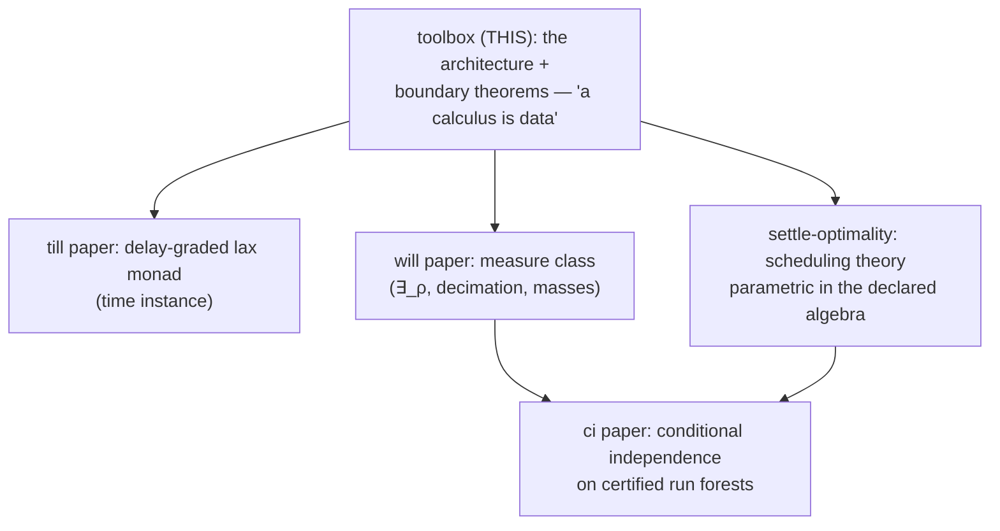

# A Calculus Is Data

**Working title.** "A Calculus Is Data: A Certifying Toolbox for Timed,
Graded, Spatial Linear Logics." Alternatives kept alive: "Zones, Grades,
and Checkers as Calculus Data"; "The Data/Engine Boundary in a
Certifying Linear-Logic Engine" (if a theory venue wants the boundary
theorems foregrounded).

**Status: SCAFFOLD** (markdown master; assembled 2026-09-08). This is
the TRUNK paper of the CALC arc — the architecture and its boundary
metatheorems; the till, gill (settle-optimality), will, and ci papers
are instance papers that cash out individual extension points. Sections
marked ⟨compile⟩ have their content already written elsewhere in the
repo and need editorial compilation, not research; ⟨write⟩ needs fresh
prose; ⟨decide⟩ needs a decision recorded here first. The formal
centerpiece (routed-column equivalence) is deliberately NOT duplicated
here yet — THY_0033 §1 is its single source of truth until the compile
pass (avoiding divergence; see §4).

**One-line thesis.** In CALC, a proof calculus is a *declaration
package* — connectives, inference rules, zone structure, grade
algebras, surface grammar, even the kernel's step checkers are data
loaded from `.calc`/`.rules`/prelude files — and the generic engine's
four faces (backward focused search, forward committed execution,
exhaustive exploration, certified replay) are proved or machine-checked
adequate for every declaration that passes the load fences. The
contribution is not configurability (Maude, K, and logical frameworks
are configurable); it is the **theorem-guarded data/engine boundary**:
each extension point ships either a soundness metatheorem, a per-instance
machine-checked conformance contract, or a *proven impossibility* that
marks where data ends — and the instance family (ILL → till → gill →
will → sill) demonstrates that extending the logic is writing files,
not patching the engine.

---

## 0. Internal ledger — provenance, sources, gates

NOT for the eventual PDF. This section is the scaffold's control panel.

**Provenance.** Scaffolded autonomously 2026-09-08 on Denis's
direction ("the core paper about calc — everything else builds on top").
The held-disposition decision it executes is recorded in THY_0033
frontmatter `paper:` (2026-09-04: routed-column equivalence HELD for
this paper; standalone workshop note considered and declined).

**Source-of-truth map** (compile FROM these; never fork their content):

| paper section | source | status |
|---|---|---|
| §2 engine & four faces | `doc/documentation/architecture.md` (L0–L5), `lib/` docstrings, layer-DAG test | ⟨compile⟩ |
| §3 declaring a calculus | THY_0032 (mode preorders → contextStructure), `lib/meta/focusing.js` (polarity inference), `earley-grammar.js` (sorted templates, TODO_0268 §5c) | ⟨compile⟩ + ⟨write⟩ (the inference story is under-documented) |
| §4 zones as data | **THY_0033 §1** (referee-grain proofs: Defs 1–3, Lemmas A/B, U/R theorem, one-pool corollary) | ⟨compile⟩ — the centerpiece |
| §5 grades as data | settle-optimality §1.1/§8 (dioid contract, C4 split), THY_0022 (fences), `grade-conformance.test.js`, gill's by-sort registry | ⟨compile⟩; deep theorems stay in the gill paper, cited as parametric |
| §6 certificates | TODO_0294/0295/0298 landings: `fire-check.js`, `draw-check.js`, `sld-check.js`, elaborators; forgery arms in `fuzz-till.js` | ⟨write⟩ (no single prose source yet — the TCB statement exists only in CLAUDE.md compressed form) |
| §7 boundary theorems | THY_0034 (broadcast no-go), THY_0033 §3 (axis-confounding), fence inventory | ⟨compile⟩ |
| §8 instance family | CLAUDE.md directory tree + git history (diff shapes) | ⟨write⟩ (the money table below is the draft) |
| §9 related work | THY_0033/0034 reference blocks, settle-optimality §12, hq research 0138 Part A | ⟨write⟩ + [verify] flags |
| §10 claims | this scaffold §10 | drafted below |

**Gates, in order:**
1. Denis reads this scaffold and confirms the trunk framing + title
   direction (⟨decide⟩ items inline).
2. Compile passes §4 (move THY_0033 §1 in, leave a pointer stub there —
   the frontmatter `paper:` field then flips from HELD to COMPILED).
3. ⟨write⟩ sections (§6 first — it is the most novel and least
   documented).
4. The other papers' venue outcomes inform this one's (a systems venue
   wants §8 fat; a theory venue wants §4/§7 fat).

**Honest weak points (reviewer-facing, keep updated):**
1. "Everything is data" has a one-time-generalization asterisk per
   extension point (the P4 pool plumbing, the timed layer itself). The
   money table's two engine columns keep this honest; a referee who
   diffs the repo must find exactly what the table says.
2. No binding/HOAS metatheory — CALC terms are first-order and
   content-addressed. §10's not-claimed list owns this vs LF-family
   frameworks.
3. The adequacy schema (§1) is a *schema*, discharged per extension
   point at different grains (referee-grain proof for zones;
   machine-checked contract for grades; TCB argument for checkers). A
   referee may want one uniform formal statement — the defense is that
   the per-point grain IS the discipline (contract where instances
   vary, theorem where structure is fixed), but say so explicitly.
4. Performance is not claimed and not benchmarked against Maude/K/Celf;
   one paragraph on the content-addressed store + compiled clauses
   exists to preempt "is it usable", nothing more.

---

## 1. Introduction ⟨write⟩

Opening move: the reader has seen configurable rewriting engines
(Maude, K) and logical frameworks (LF/Twelf, λProlog, Celf). The pitch
is NOT "another one" — it is the boundary discipline:

**The adequacy schema (the paper's spine).** Let `D` be a declaration
package (family + `.calc` + `.rules` + preludes) passing all load
fences. Then the engine's four faces are adequate for the calculus
`C(D)` that `D` presents:

- **(i) backward**: focused proof search is sound and complete for
  `C(D)`-derivability (focusing behavior *inferred* from rule
  descriptors, §3);
- **(ii) forward**: `settle` produces a temporally focused `C(D)`
  derivation (the committed scheduler is a canonical-form normalizer,
  not an extra-logical policy — settle-optimality §5.3);
- **(iii) exploration**: `settleExplore`'s leaves are the committed
  worlds, outcome-complete under tied-contention (settle-optimality
  §8.4), with the frontier and trace measures over them;
- **(iv) certification**: every emitted derivation kernel-checks
  against `C(D)`'s own rules, with the checkers themselves bound by
  `D` (§6) and TCB = kernel + canon + clause-only backchainer.

Each extension point of `D` discharges its component of the schema by
one of three instruments, and the paper is organized by them:

1. a **metatheorem** where the structure is uniform across instances
   (zones: the routed-column equivalence, §4);
2. a **machine-checked conformance contract** where instances genuinely
   vary (grade algebras: C1–C4 per algebra, §5; sort fences f1–f4);
3. a **proven impossibility** marking where data ends (conservation
   cannot ride stamps — the broadcast no-go; transport cannot be a
   grade coercion, §7) — negative results are part of the toolbox: the
   engine refuses loudly at load rather than mis-running.

Contributions list = §10, compressed.

## 2. One engine, four faces ⟨compile⟩

From `architecture.md`: the layer cake L1 (kernel/checker) → L2 (search
primitives) → L3 (Andreoli focusing) → L4 (strategies; forward engine)
→ L5 (UI), and the *horizontal* layer DAG `lib/ ↛ family/ ↛ calculus/`
— the engine imports no family, the family imports no calculus,
enforced by `tests/engine/layer-dag.test.js` (architecture as a tested
invariant, not a convention). The four faces (prove / settle / explore
/ certify) share one declared rule set and one content-addressed store
(formulas are hashes; O(1) equality). The family layer (`family/lnl/`)
is the reusable structural middle: persistent-goal proving, loli
matching, existential resolution — shared BY calculi, received by the
engine as data (`cc.family.engine`).

Key under-sold point to foreground: the SAME `.rules` file drives all
four faces. Ceptre-family systems run forward only; framework provers
run backward only; CALC's forward runs are *elaborated back into* the
backward kernel's judgment (§6). That loop is the architecture's
signature.

## 3. Declaring a calculus ⟨compile⟩ + ⟨write⟩

Anatomy of `D`: `@extends` chains (meta-parser; will extends gill
ACROSS calculus directories — surface inherited by reference, never
copied), connective declarations with `@ascii` templates (ONE grammar
emission mechanism — sorted templates; per-input ambiguity detection),
`@position_modes` + `@structural` per zone from which
`contextStructure` is DERIVED (THY_0032 — no 'linear'/'cartesian'
literals in engine logic), and rules in sequent notation compiled to
descriptors. Polarity and invertibility are *inferred* from rule
descriptors (`lib/meta/focusing.js`) — the focusing discipline is
computed from the declared rules, not annotated. ⟨write⟩: this
inference story deserves two pages; it is currently documented nowhere
prose-grade.

Refinement sorts and datasorts as declaration-layer machinery
(presence-gated twice; materialized closures; fences as named load
errors) — one compressed subsection, pointing to the will paper for
the measure-theoretic use.

## 4. Zones as data — the routed-column equivalence ⟨compile: THY_0033 §1⟩

The formal centerpiece. Statement shape (full referee-grain proofs in
THY_0033 §1, to be moved here in the compile pass):

- **Routed zone structure**: aux consumable zones with hash-disjoint
  wrapper connectives; routing function total and deterministic.
- **Theorem**: U (forget columns) / R (rebuild by routing) are inverse
  bijections on derivations; provability and per-zone linearity
  coincide between the N-zone and one-pool presentations.
- **Implementation corollary**: the engine threads ONE union pool;
  columns are router-materialized views. DECLARING a zone is calculus
  data; the pool plumbing is one-time and zone-count-agnostic.
- **Instance**: sill's `loc` zone (`Γ;Δ;Λ ⊢ C` as 4-ary
  `@position_modes` + per-position `@structural` in `sill.calc`) — the
  demonstration that the next zone costs zero engine edits.
- **Fences**: aux zones are linear-policy only (exchange, no
  contraction/weakening); a policy the engine would not honor is a
  loud load error. Affine (weakening-only) zones: future work, with
  rule-level `@affine` (THY_0027) as the existing mechanism.

## 5. Grades as data ⟨compile⟩

The scheduling-dioid contract (C1–C4, with the C4a/C4b split) as the
conformance boundary; algebras registered BY SORT (gill:
delay→tillGrades, dist→distGrades, weight→weightGrades) with
per-algebra machine-checked conformance
(`tests/engine/grade-conformance.test.js`) and class routing as policy
(`(⊕, realization)`: order class → committed scheduler + B&B; measure
class → will's execution modes; a scheduler face the algebra cannot
carry is fenced at load). Product stamps (sill's time×dist) ride the
lex order via the transfer lemma. The DEEP theorems (T1/T2, focusing,
frontier adequacy) live in the settle-optimality paper and are cited
here as *parametric in the declared algebra* — this paper claims the
parametricity and the contract, not the scheduling theory.

## 6. Execution as certificates — checkers as calculus data ⟨write⟩

The most novel under-documented material; needs fresh prose. Content:

- Forward runs ELABORATE into kernel-checked proof trees (`@fire` /
  `@draw` step judgments); elaboration failure with a bound checker is
  an engine/elaborator disagreement and THROWS — no `unverified`
  escape hatch.
- The checkers are BOUND BY THE CALCULUS (`calculus.stepCheckers` via
  the loader kit) — a calculus without a draw checker structurally
  lacks the judgment. The checker never imports the engine's oracles
  (mass solver, FFI): fire-check re-derives from PROGRAM RULE DATA +
  clause-only theory; draw-check walks the declared sort system.
- TCB statement: kernel + eq-theory canon + numeric prelude CLAUSES
  under the clause-only backchainer. FFI is never on the verification
  path (FFI-is-optimization principle, with the Group-B axiom-class
  carve-out stated honestly).
- SLD certificates for clause-derived persistent goals (checked, not
  trusted).
- Adversarial evidence: fuzz forgery arms (mutated records must be
  rejected — the loli-name forgery fix 2026-09-04 is an honest war
  story: the fuzzer FOUND a forgery hole; one-line fix; pinned).
- Run-level certificates: `certifyRun` (any settle run),
  `certifyCollapse` (decimation runs, mass factors on the
  endsequent), `certifyContention`/`tiedContention` (scheduler
  hypotheses as verdicts), `certifyCI` (conditional independence — the
  ci paper's face).

## 7. The boundary theorems — what cannot be data ⟨compile⟩

The negative space that makes the positive claims sharp:

- **The broadcast no-go** (THY_0034): stamp values are cartesian
  (broadcast to outputs, joined over reads, re-emitted by catalysts);
  conserved quantities are linear; no nontrivial conserved measure
  survives the stamp slot. Idempotent merge is the *definition* of the
  slot's boundary. The factorization routes usage to trace measures /
  linear tokens / chooser / term-computed delays.
- **Axis-confounding** (THY_0033 §3): transport-takes-time is a rule,
  never a grade coercion — lawful coercions exist and are semantically
  wrong (they collapse the objectives the product keeps apart).
- **The fence inventory as design philosophy**: presence-gating
  (calculus without the binding structurally lacks the concept), named
  load errors over silent degradation, conservative certifiers
  (refusal ≠ refutation). One table: fence → what it protects → test.

## 8. The instance family ⟨write; table drafted⟩

The money table (each row checkable against git history — keep it
honest; the engine columns name the ONE-TIME generalizations and the
per-instance count):

| instance | adds | declared as data | one-time generic-engine work | per-instance engine edits |
|---|---|---|---|---|
| **ILL** | the base calculus | connectives, rules, polarity (inferred), EVM/arith theories | the engine itself | — (defines the baseline) |
| **till** | time: graded lax monad `{A}@d`, windows, cohorts | grade sorts (delay/count/weight), rules, numeric prelude | the timed layer, generic over `cc.grades` (TODO_0265) | 0 in `lib/` (config + `calculus/till/`) |
| **gill** | grade registry, transport comonad `!!_d` | by-sort algebra registry, haul rules (same ⊖ premise), dist tower | none (registry is config composition) | 0 |
| **will** | measure class: ∃_ρ, priors, datasorts, decimation | `@w` priors, binder sorts, drawn-token rules, draw-checker binding; mass solver as calculus-BOUND oracle (`cc.datasortMasses`) | decimate driver (generic, opt-in D4) | 0 in `lib/` (will-bound machinery in `calculus/will/lib/`) |
| **sill** | third zone `A @@ L`, product stamps | 4-ary `@position_modes` + `@structural`, loc wrapper, place fence, product algebra | P4: one union pool, zone-count-agnostic (TODO_0285) | 0 per-zone |

Per instance: one paragraph + its two-line signature declaration +
what its instance paper proves. Cross-calculus `@extends` (will ⊃ gill
⊃ till surface) and rules-file LISTS (shared fragments by reference)
close the section.

## 9. Related work ⟨write⟩

Positioning one-liners (expand at draft; [verify] = confirm citation
details at venue time):

- **Ceptre** (Martens) — forward linear multiset rewriting + stage
  discipline as a language; no backward prover, no certificates, fixed
  structural regime. The nearest ancestor in spirit; the precedent
  track for venue.
- **CLF / Celf** (Watkins–Cervesato–Pfenning–Walker;
  Schack-Nielsen–Schürmann) — the type-theoretic ancestor: forward
  chaining inside a dependent framework's monad. CALC trades
  HOAS/dependency for first-order content-addressed terms + certified
  execution + declared algebras/zones.
- **Calculus Toolbox** (Balco–Kurz [verify]) — the naming inspiration:
  display calculi compiled to Isabelle + UI from a calculus
  description; generation-time tooling, not a certifying runtime
  engine.
- **Maude / K** — rewriting-logic engines, deeply configurable, but
  the structural regime (AC multiset) is framework-level, there is no
  focused backward search over the same rules, and certification goes
  through external provers.
- **Twelf / Beluga / Abella, λProlog** — judgments-as-data with
  binding metatheory; no committed timed execution, no resource
  scheduling. CALC does not compete on metatheory (§10 not-claimed).
- **Belnap's display calculi** — the classical "calculus as data"
  theory ancestor for §4's zone genericity.
- **Dyna / provenance semirings / semiring DP** — aggregation-as-data
  on the monotone side; the gill paper's §12 lineage, cited here for
  the grade-registry parallel.

## 10. Claims (statement of record, draft)

1. **The architecture**: one generic engine, four faces (backward
   focused search / committed timed execution / exhaustive exploration
   / certified replay) over one declared rule set; layers enforced by
   test; calculi are declaration packages. Novel as a COMBINATION —
   each face exists somewhere; no system runs all four off one
   declaration and closes the loop by elaborating runs back into the
   proof judgment.
2. **The theorem-guarded data/engine boundary**: every extension point
   ships metatheorem / machine-checked contract / proven
   impossibility. The discipline itself — including publishing the
   impossibilities and fencing loudly — is the paper's methodological
   claim.
3. **The routed-column equivalence** (§4, from THY_0033 §1): N-zone
   sequent calculi with wrapper-routed aux zones ≡ one-pool with
   routing; zones become declarations. The formal centerpiece.
4. **Checkers as calculus data** (§6): the certification judgment
   itself is part of `D`; TCB excludes the engine, its oracles, and
   all FFI.
5. **The instance family** (§8): five calculi, each new capability =
   files + at most one one-time zone/algebra-agnostic generalization;
   the money table as checkable evidence.

**Not claimed**: binding/HOAS metatheory (LF family); display-calculus
generality beyond wrapper-routed linear-policy zones; performance
supremacy; the scheduling/measure/CI theory itself (instance papers).

## 11. The paper arc (for the reader and for us)

The instance papers do not WAIT for this one (three predate it); the
trunk framing is retroactive and honest: they each prove theorems about
one extension point of the architecture stated here.

## 12. Venue ⟨decide⟩

The Ceptre precedent (Martens: strange-loop-adjacent + academic paper)
suggests: a systems/tool track (e.g. a PL conference tool paper, or a
journal system description) with §4/§7 as the formal backbone — OR a
full theory-venue paper if §4 + §6 + §7 are foregrounded. Decision
deferred until the gill paper's venue lands (shared referee pool
considerations). LaTeX at venue choice, per house style.
