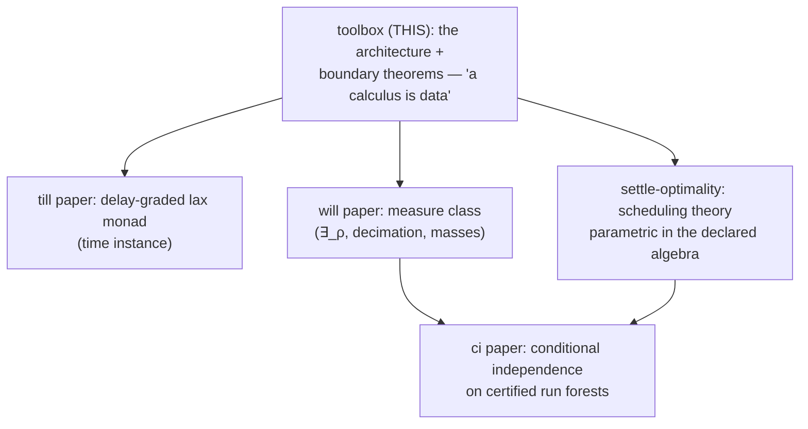

# A Calculus Is Data

**Working title.** "A Calculus Is Data: A Certifying Toolbox for Timed,
Graded, Spatial Linear Logics." Alternatives kept alive: "Zones, Grades,
and Checkers as Calculus Data"; "The Data/Engine Boundary in a
Certifying Linear-Logic Engine" (if a theory venue wants the boundary
theorems foregrounded).

**Status: SCAFFOLD → PARTIAL DRAFT** (markdown master; assembled
2026-09-08; §4 compiled and §6 drafted same day). This is
the TRUNK paper of the CALC arc — the architecture and its boundary
metatheorems; the till, gill (settle-optimality), will, and ci papers
are instance papers that cash out individual extension points. Sections
marked ⟨compile⟩ have their content already written elsewhere in the
repo and need editorial compilation, not research; ⟨write⟩ needs fresh
prose; ⟨decide⟩ needs a decision recorded here first. The formal
centerpiece (routed-column equivalence) is deliberately NOT duplicated
here yet — THY_0033 §1 is its single source of truth until the compile
pass (avoiding divergence; see §4).

**One-line thesis.** In CALC, a proof calculus is a *declaration
package* — connectives, inference rules, zone structure, grade
algebras, surface grammar, even the kernel's step checkers are data
loaded from `.calc`/`.rules`/prelude files — and the generic engine's
four faces (backward focused search, forward committed execution,
exhaustive exploration, certified replay) are proved or machine-checked
adequate for every declaration that passes the load fences. The
contribution is not configurability (Maude, K, and logical frameworks
are configurable); it is the **theorem-guarded data/engine boundary**:
each extension point ships either a soundness metatheorem, a per-instance
machine-checked conformance contract, or a *proven impossibility* that
marks where data ends — and the instance family (ILL → till → gill →
will → sill) demonstrates that extending the logic is writing files,
not patching the engine.

---

## 0. Internal ledger — provenance, sources, gates

NOT for the eventual PDF. This section is the scaffold's control panel.

**Provenance.** Scaffolded autonomously 2026-09-08 on Denis's
direction ("the core paper about calc — everything else builds on top").
The held-disposition decision it executes is recorded in THY_0033
frontmatter `paper:` (2026-09-04: routed-column equivalence HELD for
this paper; standalone workshop note considered and declined).

**Source-of-truth map** (compile FROM these; never fork their content):

| paper section | source | status |
|---|---|---|
| §2 engine & four faces | `doc/documentation/architecture.md` (L0–L5), `lib/` docstrings, layer-DAG test | ⟨compile⟩ |
| §3 declaring a calculus | THY_0032 (mode preorders → contextStructure), `lib/meta/focusing.js` (polarity inference), `earley-grammar.js` (sorted templates, TODO_0268 §5c) | ⟨compile⟩ + ⟨write⟩ (the inference story is under-documented) |
| §4 zones as data | **THY_0033 §1** (referee-grain proofs: Defs 1–3, Lemmas A/B, U/R theorem, one-pool corollary) | COMPILED 2026-09-08 — proofs moved here (§4 is the single source of truth; THY_0033 §1 is the pointer stub), sill walkthrough added |
| §5 grades as data | settle-optimality §1.1/§8 (dioid contract, C4 split), THY_0022 (fences), `grade-conformance.test.js`, gill's by-sort registry | ⟨compile⟩; deep theorems stay in the gill paper, cited as parametric |
| §6 certificates | TODO_0294/0295/0298 landings: `fire-check.js`, `draw-check.js`, `sld-check.js`, elaborators; forgery arms in `fuzz-till.js` | DRAFTED 2026-09-08 (writing it produced the TCB import-fence test in `layer-dag.test.js` — the §6.3 boundary is now machine-checked); polish pass pending |
| §7 boundary theorems | THY_0034 (broadcast no-go), THY_0033 §3 (axis-confounding), fence inventory | ⟨compile⟩ |
| §8 instance family | CLAUDE.md directory tree + git history (diff shapes) | ⟨write⟩ (the money table below is the draft) |
| §9 related work | THY_0033/0034 reference blocks, settle-optimality §12, hq research 0138 Part A | ⟨write⟩ + [verify] flags |
| §10 claims | this scaffold §10 | drafted below |

**Gates, in order:**
1. Denis reads this scaffold and confirms the trunk framing + title
   direction (⟨decide⟩ items inline). ← THE OPEN GATE
2. ~~Compile pass §4~~ DONE 2026-09-08 (THY_0033 §1 moved in, stub +
   COMPILED frontmatter there).
3. ~~§6 write~~ DRAFTED 2026-09-08 (+ the TCB import-fence test).
   Remaining ⟨write⟩: §1 intro prose, §3 inference story, §8 per-
   instance paragraphs, §9 expansion.
4. The other papers' venue outcomes inform this one's (a systems venue
   wants §8 fat; a theory venue wants §4/§7 fat).

**Honest weak points (reviewer-facing, keep updated):**
1. "Everything is data" has a one-time-generalization asterisk per
   extension point (the P4 pool plumbing, the timed layer itself). The
   money table's two engine columns keep this honest; a referee who
   diffs the repo must find exactly what the table says.
2. No binding/HOAS metatheory — CALC terms are first-order and
   content-addressed. §10's not-claimed list owns this vs LF-family
   frameworks.
3. The adequacy schema (§1) is a *schema*, discharged per extension
   point at different grains (referee-grain proof for zones;
   machine-checked contract for grades; TCB argument for checkers). A
   referee may want one uniform formal statement — the defense is that
   the per-point grain IS the discipline (contract where instances
   vary, theorem where structure is fixed), but say so explicitly.
4. Performance is not claimed and not benchmarked against Maude/K/Celf;
   one paragraph on the content-addressed store + compiled clauses
   exists to preempt "is it usable", nothing more.

---

## 1. Introduction ⟨write⟩

Opening move: the reader has seen configurable rewriting engines
(Maude, K) and logical frameworks (LF/Twelf, λProlog, Celf). The pitch
is NOT "another one" — it is the boundary discipline:

**The adequacy schema (the paper's spine).** Let `D` be a declaration
package (family + `.calc` + `.rules` + preludes) passing all load
fences. Then the engine's four faces are adequate for the calculus
`C(D)` that `D` presents:

- **(i) backward**: focused proof search is sound and complete for
  `C(D)`-derivability (focusing behavior *inferred* from rule
  descriptors, §3);
- **(ii) forward**: `settle` produces a temporally focused `C(D)`
  derivation (the committed scheduler is a canonical-form normalizer,
  not an extra-logical policy — settle-optimality §5.3);
- **(iii) exploration**: `settleExplore`'s leaves are the committed
  worlds, outcome-complete under tied-contention (settle-optimality
  §8.4), with the frontier and trace measures over them;
- **(iv) certification**: every emitted derivation kernel-checks
  against `C(D)`'s own rules, with the checkers themselves bound by
  `D` (§6) and TCB = kernel + canon + clause-only backchainer.

Each extension point of `D` discharges its component of the schema by
one of three instruments, and the paper is organized by them:

1. a **metatheorem** where the structure is uniform across instances
   (zones: the routed-column equivalence, §4);
2. a **machine-checked conformance contract** where instances genuinely
   vary (grade algebras: C1–C4 per algebra, §5; sort fences f1–f4);
3. a **proven impossibility** marking where data ends (conservation
   cannot ride stamps — the broadcast no-go; transport cannot be a
   grade coercion, §7) — negative results are part of the toolbox: the
   engine refuses loudly at load rather than mis-running.

Contributions list = §10, compressed.

## 2. One engine, four faces ⟨compile⟩

From `architecture.md`: the layer cake L1 (kernel/checker) → L2 (search
primitives) → L3 (Andreoli focusing) → L4 (strategies; forward engine)
→ L5 (UI), and the *horizontal* layer DAG `lib/ ↛ family/ ↛ calculus/`
— the engine imports no family, the family imports no calculus,
enforced by `tests/engine/layer-dag.test.js` (architecture as a tested
invariant, not a convention). The four faces (prove / settle / explore
/ certify) share one declared rule set and one content-addressed store
(formulas are hashes; O(1) equality). The family layer (`family/lnl/`)
is the reusable structural middle: persistent-goal proving, loli
matching, existential resolution — shared BY calculi, received by the
engine as data (`cc.family.engine`).

Key under-sold point to foreground: the SAME `.rules` file drives all
four faces. Ceptre-family systems run forward only; framework provers
run backward only; CALC's forward runs are *elaborated back into* the
backward kernel's judgment (§6). That loop is the architecture's
signature.

## 3. Declaring a calculus ⟨compile⟩ + ⟨write⟩

Anatomy of `D`: `@extends` chains (meta-parser; will extends gill
ACROSS calculus directories — surface inherited by reference, never
copied), connective declarations with `@ascii` templates (ONE grammar
emission mechanism — sorted templates; per-input ambiguity detection),
`@position_modes` + `@structural` per zone from which
`contextStructure` is DERIVED (THY_0032 — no 'linear'/'cartesian'
literals in engine logic), and rules in sequent notation compiled to
descriptors. Polarity and invertibility are *inferred* from rule
descriptors (`lib/meta/focusing.js`) — the focusing discipline is
computed from the declared rules, not annotated. ⟨write⟩: this
inference story deserves two pages; it is currently documented nowhere
prose-grade.

Refinement sorts and datasorts as declaration-layer machinery
(presence-gated twice; materialized closures; fences as named load
errors) — one compressed subsection, pointing to the will paper for
the measure-theoretic use.

## 4. Zones as data — the routed-column equivalence

**Status: COMPILED** from THY_0033 §1 (2026-09-08); this section is now
the single source of truth for the proofs (THY_0033 §1 is a pointer
stub).

A calculus may declare consumable zones beyond the primary one
(`deriveContextStructure`: the first no-contraction zone in position
order is primary; the rest are AUX). An aux zone's membership is
decided by its **wrapper connective** — the constructor whose
`@category` names the zone (sill: `loc`/`located`). The theorem of
this section is why declaring such a zone is sound *without any
per-zone resource management in the engine*.

**Definition 1 (routed zone structure).** A *routed zone structure*
over a calculus C is a set of consumable zones Z = {z₀, z₁, …, z_k},
all linear-policy (exchange only — no contraction, no weakening),
together with, for each aux zone zᵢ (i ≥ 1), a unary *wrapper*
connective wᵢ such that the wᵢ are pairwise distinct constructors and
no wᵢ-headed formula is well-formed content of any other zone. The
**routing function** r maps a formula A to zᵢ if head(A) = wᵢ for some
i ≥ 1, and to z₀ otherwise. r is total and deterministic by
construction (*hash-disjointness*: head tags are disjoint, so the
preimages r⁻¹(zᵢ) partition the formula language; operationally
`Seq.routeZone` is a tag lookup).

**Definition 2 (the two calculi; U and R).** S_N is the N-zone sequent
calculus: sequents Γ; Δ₀; …; Δ_k ⊢ C with one column per consumable
zone, and per-zone linearity (each occurrence in Δᵢ consumed exactly
once, within its column). A sequent is **routed** if every A ∈ Δᵢ has
r(A) = zᵢ. S_1 is the calculus over sequents Γ; P ⊢ C with ONE
consumable pool P, the same rules read pool-wise, and per-pool
linearity. Define U(Γ; Δ₀; …; Δ_k ⊢ C) = Γ; Δ₀ ⊎ … ⊎ Δ_k ⊢ C
(forget columns) and R(Γ; P ⊢ C) = Γ; P↾r⁻¹(z₀); …; P↾r⁻¹(z_k) ⊢ C
(rebuild columns by routing).

**Lemma A (routing is a ⊎-homomorphism; U, R are inverse).** For
multisets P, Q: (P ⊎ Q)↾r⁻¹(z) = P↾r⁻¹(z) ⊎ Q↾r⁻¹(z), since routing is
per-element. Consequently R ∘ U = id on routed sequents (each column's
elements route back to it, by routedness) and U ∘ R = id on pooled
sequents (the restrictions partition P, by totality of r). Moreover the
pool splits P = P₁ ⊎ P₂ of U(s) correspond bijectively to the column-
wise splits Δᵢ = Δᵢ¹ ⊎ Δᵢ² of a routed s — restriction in one
direction, union in the other, inverse by the homomorphism equation. ∎

**Definition 3 (zone-correct rule).** A rule instance of S_N is
*zone-correct* if (i) every formula it introduces into a consumable
column Δᵢ satisfies r(A) = zᵢ, and (ii) every formula it consumes from
Δᵢ satisfies r(A) = zᵢ. A calculus is zone-correct if all its rule
instances over routed premises are.

**Lemma B (routing invariance).** In a zone-correct calculus, every
sequent in an S_N derivation whose endsequent is routed is routed.
*Proof.* Induction on the derivation, root upward. Rules touch columns
in three ways: splitting a column across premises (routedness is
inherited — a sub-multiset of a routed column is routed), moving a
formula between sequents unchanged (routed by (ii) at the source and
(i) at the target), and introducing/eliminating a principal formula
(routed by (i)). Structural exchange permutes within a column. ∎

**Discharging zone-correctness.** Clause (i) holds for every boundary
the implementation constructs — parsing, rule-interpreter premise
construction, `addDelta`, the copy axiom, `stripToken` — because each
PLACES formulas by calling the router (this is what "routing at
construction boundaries" means; the sites are THY_0032 §3's inventory).
Clause (ii) is the load-bearing one and is discharged by the focusing
discipline, not by routing alone: an aux wrapper must either (a) have
NO sequent rules, so the identity axiom is its only consumer and
identity is zone-correct by tag-routing (`stripToken` routes the
token's own zone), or (b) have explicit rules whose focused hypothesis
position only ever matches wᵢ-headed formulas. sill's `loc` satisfies
(a): it is unpolarized (the at/drawn precedent), so no gill rule's
focused hypothesis can be loc-headed, and rules with bare metavariable
hypotheses do not exist in the focused fragment. A future wrapper WITH
sequent rules must re-establish (b) explicitly.

**Theorem (routed-column equivalence).** For a zone-correct calculus
with a routed zone structure, U induces a bijection between S_N
derivations of a routed endsequent s and S_1 derivations of U(s), with
R inducing its inverse; corresponding derivations use the same rule
instances at the same positions. Consequently provability coincides,
and per-zone linearity is equivalent to per-pool linearity (zone
membership of every consumed occurrence is recoverable by r, so a
per-pool-linear derivation is per-zone-linear under R and vice versa).
*Proof.* Both directions by induction on the derivation. (⇒) Apply U to
every sequent. Each S_N rule instance becomes an S_1 instance of the
same rule: column splits map to pool splits (Lemma A), consumed and
introduced formulas are the same occurrences, side conditions are
formula-level and untouched. (⇐) Apply R to every sequent. The
endsequent R(U(s)) = s is routed; by Lemma B every rebuilt sequent is
routed, so each pool split maps to the unique corresponding column
split (Lemma A's bijection), and each S_1 instance becomes the S_N
instance over the routed columns — zone-correctness (ii) guarantees the
consumed formula sits in the column the S_N rule consumes from. The two
constructions are inverse because U and R are inverse on the sequents
and the rule-instance correspondence is the identity on rule names,
principal formulas, and splits. ∎

**Corollary (implementation).** The search may thread ONE union pool
(leftover threading, kernel pool accounting, focusing, affine boundary
discharge all run pool-wise, unchanged) and materialize zone columns by
routing only at construction boundaries — columns are views of the
pool, the mode discipline made visible, not a second resource manager.
Pool-splitting rules (⊗R distributing Δ ⊎ Λ) need no side condition
because aux zones are linear-policy like the primary: Lemma A's split
bijection is the whole story. This is why the acceptance criterion
"adding a third declared zone requires no kernel edits" holds in its
honest reading: the union-pool plumbing was a ONE-TIME,
zone-count-agnostic change; each further zone is data (position mode +
structural rules + wrapper), and the engine is routing.

Boundaries that route: sequent parsing, rule-interpreter premise
construction, `addDelta`, the copy axiom, `stripToken`, the bridge
(`sequentToState` feeds ALL consumable zones into the forward linear
pool — wrapped facts are ordinary linear facts in their own tag group,
so the forward engine needs no third FactSet; per-fiber linearity of
`A @@ L` is automatic because the place is part of the fact identity).

**The instance.** sill declares the third zone in its entirety with:

```
seq: ... @position_modes "cartesian linear located linear" ...
loc: #1 @@ #2.   % @category located — the zone's wrapper
```

plus per-position `@structural` rules — the whole of "adding a zone"
is these declarations. `loc` is unpolarized and has no sequent rules
(clause (a) above), per-fiber linearity of `A @@ L` falls out of fact
identity, and the engine diff for the zone itself is empty.

**Which β are admitted.** Aux zones must be linear-policy (no
contraction, no weakening) — a policy the engine would not honor is a
loud load error, not a silent annotation. Weakening-only (affine)
zones remain future work; the rule-level `@affine` discharge
(THY_0027) is the existing mechanism for affine behavior, and Lemma
B's induction gains only a weakening case — the open engineering is
the end-of-derivation discharge story, not the equivalence.

## 5. Grades as data ⟨compile⟩

The scheduling-dioid contract (C1–C4, with the C4a/C4b split) as the
conformance boundary; algebras registered BY SORT (gill:
delay→tillGrades, dist→distGrades, weight→weightGrades) with
per-algebra machine-checked conformance
(`tests/engine/grade-conformance.test.js`) and class routing as policy
(`(⊕, realization)`: order class → committed scheduler + B&B; measure
class → will's execution modes; a scheduler face the algebra cannot
carry is fenced at load). Product stamps (sill's time×dist) ride the
lex order via the transfer lemma. The DEEP theorems (T1/T2, focusing,
frontier adequacy) live in the settle-optimality paper and are cited
here as *parametric in the declared algebra* — this paper claims the
parametricity and the contract, not the scheduling theory.

## 6. Execution as certificates — checkers as calculus data ⟨write⟩

**Status: DRAFTED** (2026-09-08; polish pass pending).

### 6.1 Step judgments are declared, not built in

A committed forward run is not a trusted log. Every settle run
ELABORATES into a proof tree in the calculus's own sequent judgment,
and the kernel verifies that tree — full verification, no `unverified`
escape hatch: an elaboration failure with a bound checker is an
engine/elaborator disagreement and THROWS. The bridge between the two
worlds is a pair of *step judgments*: `@fire` (one timed firing) and
`@draw` (one collapse event). Their checkers are **part of the
declaration package**: the calculus assembly point binds them by rule
name (`calculus.stepCheckers`, wired in the loader kit's
`makeSequentLoader` via `fire:`/`draw:` options, together with frozen
configs naming the theory predicates the checker may use — `le`, `lt`,
`sub`, the stamp tag). The kernel routes tree nodes to these checkers
and *knows nothing about firings or draws*; a calculus that binds no
draw checker structurally lacks the judgment — presence-gating, not an
unsound default.

### 6.2 Non-circularity: re-derive, never replay

The checkers never run the engine. A fire node carries only the
event-record witness; `fire-check` re-derives the entire step from the
program's *declarative rule record* plus the declared theory:

- consumed/read multisets = the rule's antecedent patterns under the
  recorded θ (bag equality, ground after substitution);
- the activation `a` obeys the forced-join discipline (THY_0018 §5):
  every input/read stamp and after-bound is `⊑ a` (theory `le`) AND `a`
  is *attained* — a member of that stamp set (the join is never a free
  choice);
- the done stamp `u` is checked by `sub(u, d, a)` — the same partial
  residual `⊖` that the monad-left rule uses. There is no signed
  subtraction in the theory, so an illegal step is *underivable*, not
  merely rejected (THY_0022's fence philosophy at the judgment level);
- produced = consequent patterns stamped at `u` (bag equality);
  persistent goals are membership in the cartesian zone or theory
  derivations.

Worked example (the referee's two minutes): rule `job: a * b -o {c}@3`,
inputs `a@0`, `b@2`. The record claims activation 2, done 5, produced
`c@5`. The checker bag-matches `{a@0, b@2}` against the antecedent
under θ; proves `le(0,2)`, `le(2,2)` and attainment (2 is `b`'s stamp);
derives `sub(5,3,2)` from the numeric prelude clauses; bag-matches
`{c@5}`. Every theory call is CLAUSE-ONLY (`useFFI: false` at each call
site) — the numeric FFI is never on the verification path, so the
checker takes the *semantics* (the clauses) rather than the
*optimization* (the FFI), the toolbox's FFI principle applied to its
own trust story.

`draw-check` is the same shape for the measure class: sort and member
against `program.sorts`; the witness tree determines the minted
`drawn` tokens (one per ground head, at the head's declared sort —
composite iterated ∃_ρ checked as one node; an evar subterm is a
dropped wave: no choice, no token, no factor); the recorded weight,
when present, must equal `Π ρ` over contributing heads re-derived from
`program.priors` — **weight is data re-derived from the program, never
trusted**. Token-free OPEN records certify ∃-L with *syntactic*
eigenvariable freshness (the evar occurs nowhere else in the
conclusion) — no `unverified: ['binding']` degradation. Clause-derived
persistent goals carry SLD certificates: the emitted clause derivation
is *checked* against the program's clauses (`sld-check`), not trusted.

### 6.3 The TCB, stated and fenced

Trusted: the kernel, its rule interpreter and context discipline, the
two step checkers, the SLD checker, the equational-theory canon, and
the numeric prelude CLAUSES under the clause-only backchainer.
Excluded: the forward engine, its optimization layer, its oracles (the
datasort mass solver, acceleration, coalescing), and all FFI. The
elaborators are *also* excluded — they only construct candidate trees;
the kernel's verdict is the authority.

This boundary is now machine-checked like everything else in the
toolbox: the layer-DAG test suite carries a **certificate-checker
import fence** (`tests/engine/layer-dag.test.js`) pinning that the six
TCB modules directly import only `lib/kernel/*`, `lib/prover/*`, and
exactly four *named* engine-side modules used for pure helpers —
deliberate definition-sharing (`splitBody` is the SAME body-splitting
function the decimation driver uses; duplicating it in the checker
would reintroduce the definition-drift bug class that checkers exist
to catch). The honest grain: at those four points the boundary is
function-granular (only pure decomposition is called), and the fence
makes any new engine-side import a loud test failure.

One carve-out stated plainly: the Group-B axiom class (`sha3_compute`
etc.) is extralogical-with-explicit-spec — no inductive clause exists
or is intended; property-tested against its spec, and outside the
certified fragment by construction.

### 6.4 Run-level certificates, and the adversary

The step judgments compose into run-level certificates, each a verdict
with a soundness direction: `certifyRun` (any settle run → one
kernel-checked tree), `certifyCollapse` (a decimation run,
post-hoc-grounded; the drawn tokens ride the endsequent and `Π ρ` over
them is the run mass on bias-free programs), `certifyContention` /
`tiedContention` (the scheduler theorems' hypotheses as machine
verdicts — T2-applicability and frontier adequacy respectively), and
`certifyCI` (conditional independence on the run's derivation forest —
the ci paper's face; soundness-only: `separated` certifies, refusal
carries a witness).

The discipline is tested adversarially: the fuzzers carry *forgery
arms* that mutate emitted records (rule names, stamps, weights,
witnesses) and require rejection. This is not decoration — the arm
FOUND a real forgery hole (a possessed-loli fire record accepted under
any name; 2026-09-04), which is simultaneously the honest war story
and the evidence that the adversarial harness pays for itself.

## 7. The boundary theorems — what cannot be data ⟨compile⟩

The negative space that makes the positive claims sharp:

- **The broadcast no-go** (THY_0034): stamp values are cartesian
  (broadcast to outputs, joined over reads, re-emitted by catalysts);
  conserved quantities are linear; no nontrivial conserved measure
  survives the stamp slot. Idempotent merge is the *definition* of the
  slot's boundary. The factorization routes usage to trace measures /
  linear tokens / chooser / term-computed delays.
- **Axis-confounding** (THY_0033 §3): transport-takes-time is a rule,
  never a grade coercion — lawful coercions exist and are semantically
  wrong (they collapse the objectives the product keeps apart).
- **The fence inventory as design philosophy**: presence-gating
  (calculus without the binding structurally lacks the concept), named
  load errors over silent degradation, conservative certifiers
  (refusal ≠ refutation). One table: fence → what it protects → test.

## 8. The instance family ⟨write; table drafted⟩

The money table (each row checkable against git history — keep it
honest; the engine columns name the ONE-TIME generalizations and the
per-instance count):

| instance | adds | declared as data | one-time generic-engine work | per-instance engine edits |
|---|---|---|---|---|
| **ILL** | the base calculus | connectives, rules, polarity (inferred), EVM/arith theories | the engine itself | — (defines the baseline) |
| **till** | time: graded lax monad `{A}@d`, windows, cohorts | grade sorts (delay/count/weight), rules, numeric prelude | the timed layer, generic over `cc.grades` (TODO_0265) | 0 in `lib/` (config + `calculus/till/`) |
| **gill** | grade registry, transport comonad `!!_d` | by-sort algebra registry, haul rules (same ⊖ premise), dist tower | none (registry is config composition) | 0 |
| **will** | measure class: ∃_ρ, priors, datasorts, decimation | `@w` priors, binder sorts, drawn-token rules, draw-checker binding; mass solver as calculus-BOUND oracle (`cc.datasortMasses`) | decimate driver (generic, opt-in D4) | 0 in `lib/` (will-bound machinery in `calculus/will/lib/`) |
| **sill** | third zone `A @@ L`, product stamps | 4-ary `@position_modes` + `@structural`, loc wrapper, place fence, product algebra | P4: one union pool, zone-count-agnostic (TODO_0285) | 0 per-zone |

Per instance: one paragraph + its two-line signature declaration +
what its instance paper proves. Cross-calculus `@extends` (will ⊃ gill
⊃ till surface) and rules-file LISTS (shared fragments by reference)
close the section.

## 9. Related work ⟨write⟩

Positioning one-liners (expand at draft; [verify] = confirm citation
details at venue time):

- **Ceptre** (Martens) — forward linear multiset rewriting + stage
  discipline as a language; no backward prover, no certificates, fixed
  structural regime. The nearest ancestor in spirit; the precedent
  track for venue.
- **CLF / Celf** (Watkins–Cervesato–Pfenning–Walker;
  Schack-Nielsen–Schürmann) — the type-theoretic ancestor: forward
  chaining inside a dependent framework's monad. CALC trades
  HOAS/dependency for first-order content-addressed terms + certified
  execution + declared algebras/zones.
- **Calculus Toolbox** (Balco–Kurz [verify]) — the naming inspiration:
  display calculi compiled to Isabelle + UI from a calculus
  description; generation-time tooling, not a certifying runtime
  engine.
- **Maude / K** — rewriting-logic engines, deeply configurable, but
  the structural regime (AC multiset) is framework-level, there is no
  focused backward search over the same rules, and certification goes
  through external provers.
- **Twelf / Beluga / Abella, λProlog** — judgments-as-data with
  binding metatheory; no committed timed execution, no resource
  scheduling. CALC does not compete on metatheory (§10 not-claimed).
- **Belnap's display calculi** — the classical "calculus as data"
  theory ancestor for §4's zone genericity.
- **Dyna / provenance semirings / semiring DP** — aggregation-as-data
  on the monotone side; the gill paper's §12 lineage, cited here for
  the grade-registry parallel.

## 10. Claims (statement of record, draft)

1. **The architecture**: one generic engine, four faces (backward
   focused search / committed timed execution / exhaustive exploration
   / certified replay) over one declared rule set; layers enforced by
   test; calculi are declaration packages. Novel as a COMBINATION —
   each face exists somewhere; no system runs all four off one
   declaration and closes the loop by elaborating runs back into the
   proof judgment.
2. **The theorem-guarded data/engine boundary**: every extension point
   ships metatheorem / machine-checked contract / proven
   impossibility. The discipline itself — including publishing the
   impossibilities and fencing loudly — is the paper's methodological
   claim.
3. **The routed-column equivalence** (§4, from THY_0033 §1): N-zone
   sequent calculi with wrapper-routed aux zones ≡ one-pool with
   routing; zones become declarations. The formal centerpiece.
4. **Checkers as calculus data** (§6): the certification judgment
   itself is part of `D`; TCB excludes the engine, its oracles, and
   all FFI.
5. **The instance family** (§8): five calculi, each new capability =
   files + at most one one-time zone/algebra-agnostic generalization;
   the money table as checkable evidence.

**Not claimed**: binding/HOAS metatheory (LF family); display-calculus
generality beyond wrapper-routed linear-policy zones; performance
supremacy; the scheduling/measure/CI theory itself (instance papers).

## 11. The paper arc (for the reader and for us)



The instance papers do not WAIT for this one (three predate it); the
trunk framing is retroactive and honest: they each prove theorems about
one extension point of the architecture stated here.

## 12. Venue ⟨decide⟩

The Ceptre precedent (Martens: strange-loop-adjacent + academic paper)
suggests: a systems/tool track (e.g. a PL conference tool paper, or a
journal system description) with §4/§7 as the formal backbone — OR a
full theory-venue paper if §4 + §6 + §7 are foregrounded. Decision
deferred until the gill paper's venue lands (shared referee pool
considerations). LaTeX at venue choice, per house style.
