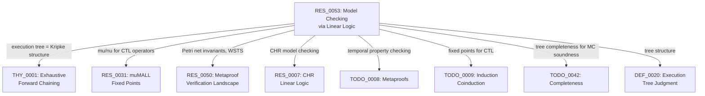

# Symbolic Model Checking via Linear Logic

CALC's exhaustive forward-chaining engine (`symexec.js:explore()`) builds a tree of all reachable states from an initial linear context under a set of forward rules. This tree IS a Kripke structure over multiset states with linear resource transitions. Adding temporal property checking (CTL/LTL) over these trees makes CALC a model checker for linear logic programs.

This document surveys the theory connecting linear logic to model checking, identifies the most concrete implementation paths, and proposes a roadmap.

---

## 1. CALC's Execution Trees as Kripke Structures

### 1.1 The Correspondence

A **Kripke structure** is a tuple `M = (S, S_0, R, L)` where S is a set of states, S_0 the initial states, R the transition relation, and L a labeling function mapping states to atomic propositions.

CALC's execution tree maps directly:

| Kripke Structure | CALC |
|---|---|
| State `s in S` | Multiset of linear facts `state.linear` + persistent facts `state.persistent` |
| Initial state `S_0` | Initial state passed to `explore()` |
| Transition `(s, s')` | Forward rule application: `mutateState(s, consumed, theta, produced)` |
| Labeling `L(s)` | Predicates present in `s` (e.g., "state contains `error`", "state contains `gas(0)`") |
| Path | Root-to-leaf trace through the execution tree |

### 1.2 Branching Structure

CALC's tree has two kinds of branching:

- **Rule nondeterminism (forall-branching):** When multiple rules can fire on a state, the tree branches over all of them. This is universal quantification over nondeterministic choices. In the tree, `branch` nodes with multiple `children` where each child corresponds to a different rule.

- **Additive choice (plus-branching):** When a rule consequent contains `oplus`, the tree forks into alternative consequents. This is also explored exhaustively, but semantically represents disjunctive outcomes. In the tree, children with `choice: i` indices.

Both types produce branching in the Kripke structure. For CTL model checking, the distinction matters: rule nondeterminism is genuine nondeterminism (the environment or scheduler decides), while plus-branching may represent determined-but-unknown outcomes (e.g., symbolic comparison results).

### 1.3 Terminal Nodes

| Tree Node | Kripke Analog | CTL Significance |
|---|---|---|
| `leaf` (quiescent) | Terminal state, no successors | Deadlock / normal termination |
| `cycle` (back-edge) | Loop to previously seen state | Infinite path (for liveness) |
| `bound` (depth limit) | Unexplored beyond depth k | Bounded model checking truncation |

---

## 2. The Petri Net Connection

### 2.1 Linear Logic Programs ARE Petri Nets

The correspondence between linear logic and Petri nets was established by three foundational works:

**Girard** observed that provability in propositional linear logic directly encodes Petri net reachability: linear facts are tokens, forward rules are transitions, multiset states are markings.

**Engberg & Winskel (1990)** gave a systematic correspondence between individual Petri nets and linear logic theories, showing individual Petri nets form models of intuitionistic linear logic.

**Kanovich (1995)** proved the definitive result: the `!`-Horn fragment of MELL (multiplicative exponential linear logic) is equivalent to Petri net reachability. Any nondeterministic concurrent computation expressible in one formalism can be simulated in the other.

### 2.2 CALC as a Petri Net

| Petri Net | CALC | ILL |
|---|---|---|
| Place | Predicate type (`token`, `pc`, `gas`) | Atomic formula |
| Token | Linear fact instance | Linear resource |
| Marking | `state.linear` multiset | Linear context Delta |
| Transition | Forward rule | `A -o {B}` |
| Read arc (test arc) | Persistent antecedent (`!P`) | Banged formula |
| Firing | `mutateState` | loli-left / cut |
| Free-choice net | oplus branching | Additive disjunction |

**Incidence matrix:** Each forward rule contributes a column. For predicate `p`: consumed instances give `-1`, produced instances give `+1`. The incidence matrix `C` encodes the net change per rule.

### 2.3 Coverability and Reachability

The distinction between coverability and exact reachability is fundamental:

- **Coverability:** "Can a state *containing* formula X be reached?" (upward-closed target). Asks: is there a reachable marking `M >= M_target`?
- **Reachability:** "Can the *exact* state S be reached?" Asks: is marking `M_target` reachable?

| Problem | Decidable? | Complexity | Practical for CALC? |
|---|---|---|---|
| Coverability | Yes | EXPSPACE-complete (Rackoff 1978) | Yes -- safety properties |
| Boundedness | Yes | EXPSPACE | Yes -- resource bounds |
| Exact reachability | Yes | Non-elementary (Czerwinski et al. 2019) | Only for small state spaces |
| LTL model checking | Decidable for WSTS | Depends on fragment | Via backward analysis |

**Coverability is the right target for CALC.** Safety properties ("can the system reach a bad state?") reduce to coverability. Exact reachability's non-elementary complexity makes it impractical except for very small nets.

---

## 3. Well-Structured Transition Systems (WSTS)

### 3.1 CALC States Are Well-Quasi-Ordered

**Finkel & Schnoebelen (2001)** established the WSTS framework: a transition system `(S, ->, <=)` is well-structured if:
1. `<=` is a well-quasi-ordering (WQO) on states
2. `->` is compatible with `<=`: if `s1 <= s2` and `s1 -> s1'`, then there exists `s2'` with `s2 -> s2'` and `s1' <= s2'`

CALC's state space (finite multisets of content-addressed hashes) under multiset inclusion is a WQO by Dickson's Lemma. The transition relation (forward rule application) is monotone: if state `s1` is a submultiset of `s2`, then any rule fireable on `s1` is also fireable on `s2` (with at least as many matching facts), and the resulting states preserve the inclusion ordering.

### 3.2 Decidable Properties

Being a WSTS gives CALC:

- **Decidable coverability:** Via backward set-saturation. Start from the target upward-closed set, iteratively compute predecessors until a fixpoint is reached or the initial state is covered.
- **Decidable boundedness:** Is the token count for each place bounded across all reachable markings?
- **Decidable termination:** For bounded systems (finite reachability set), termination is decidable.
- **Decidable LTL model checking:** For very-WSTS (stronger monotonicity), LTL model checking of downward-closed properties is decidable (Finkel & Schnoebelen).

### 3.3 The Backward Coverability Algorithm

```
Input: WSTS (S, ->, <=), initial state s0, target upward-closed set U
Output: Is s0 in Pre*(U)?

1. I := U
2. Repeat:
   I' := I union Pre(I)  -- compute predecessors
   If I' = I: return "s0 not in Pre*(U)" -- fixpoint: SAFE
   If s0 in I': return "s0 in Pre*(U)" -- UNSAFE
   I := I'
```

Termination guaranteed by WQO: the sequence of upward-closed sets `U, Pre(U), Pre^2(U), ...` stabilizes in finitely many steps.

For CALC: `Pre(U)` for a rule `r: A -o {B}` is the set of states containing `A` whose successor (after applying `r`) is in `U`. This requires inverting rules -- given a target fact set, find which initial fact sets could produce it.

### 3.4 The Forward Karp-Miller Tree

An alternative to backward analysis: the **Karp-Miller tree** (1969) computes a finite overapproximation of the reachability set by introducing "omega" (unbounded) for places that grow without bound. This is the forward-analysis analog of backward set-saturation.

For CALC: this would detect predicates whose count can grow unboundedly (e.g., a rule that produces more facts than it consumes). CALC's symexec `explore()` with cycle detection is already a variant of this -- cycle nodes indicate potential unboundedness.

---

## 4. The Mu-Calculus and CTL

### 4.1 The Modal Mu-Calculus

The modal mu-calculus (Kozen 1983) extends propositional modal logic with least (`mu`) and greatest (`nu`) fixed point operators:

```
phi ::= p | ~phi | phi1 & phi2 | phi1 | phi2
      | <>phi     -- diamond: "there exists a successor satisfying phi"
      | []phi     -- box: "all successors satisfy phi"
      | mu X. phi(X)  -- least fixed point
      | nu X. phi(X)  -- greatest fixed point
```

The mu-calculus subsumes CTL, CTL*, LTL, and PDL. Model checking mu-calculus formulas against Kripke structures is in quasipolynomial time (Calude et al., STOC 2017) and equivalent to solving parity games.

### 4.2 CTL Operators as Fixed Points

Every CTL operator has a direct characterization as a mu-calculus fixed point. The key insight: temporal operators satisfy recursive equations whose solutions are fixed points.

| CTL Operator | Meaning | Fixed Point | Type |
|---|---|---|---|
| **EX** phi | exists a successor with phi | `<>phi` | (primitive) |
| **AX** phi | all successors have phi | `[]phi` | (primitive) |
| **EF** phi | exists a path where phi holds eventually | `mu X. phi \| <>X` | Least |
| **AF** phi | on all paths, phi holds eventually | `mu X. phi \| []X` | Least |
| **EG** phi | exists a path where phi always holds | `nu X. phi & <>X` | Greatest |
| **AG** phi | on all paths, phi always holds | `nu X. phi & []X` | Greatest |
| **E[phi U psi]** | exists path where phi until psi | `mu X. psi \| (phi & <>X)` | Least |
| **A[phi U psi]** | all paths: phi until psi | `mu X. psi \| (phi & []X)` | Least |

The pattern:
- **Least fixed points (mu)** capture *eventuality* / *reachability* -- something MUST happen in finitely many steps
- **Greatest fixed points (nu)** capture *invariance* / *safety* -- something holds FOREVER along some/all paths
- **Diamond `<>`** = existential next = EX (some successor)
- **Box `[]`** = universal next = AX (all successors)

### 4.3 CTL Model Checking Algorithm

The standard CTL model checking algorithm (Clarke, Emerson & Sistla 1986) works bottom-up on the parse tree of the CTL formula:

```
For each subformula phi, compute Sat(phi) = { s in S | s |= phi }

Base: Sat(p) = { s | p in L(s) }
Boolean: Sat(phi & psi) = Sat(phi) intersect Sat(psi)
EX:  Sat(EX phi) = Pre_exists(Sat(phi))
AX:  Sat(AX phi) = Pre_forall(Sat(phi))
EF:  Sat(EF phi) = lfp(Z. Sat(phi) union Pre_exists(Z))
AF:  Sat(AF phi) = lfp(Z. Sat(phi) union Pre_forall(Z))
EG:  Sat(EG phi) = gfp(Z. Sat(phi) intersect Pre_exists(Z))
AG:  Sat(AG phi) = gfp(Z. Sat(phi) intersect Pre_forall(Z))
```

Where:
- `Pre_exists(T) = { s | exists s'. s -> s' and s' in T }` (some successor in T)
- `Pre_forall(T) = { s | forall s'. s -> s' implies s' in T }` (all successors in T)
- `lfp` = iterate from empty set until fixpoint (least fixed point)
- `gfp` = iterate from full state set until fixpoint (greatest fixed point)

**Complexity:** O(|phi| * (|S| + |R|)) -- linear in formula size times graph size.

### 4.4 Application to CALC's Execution Tree

CALC's execution tree is already the explicit Kripke structure. The predecessor functions `Pre_exists` and `Pre_forall` are computable directly from the tree's parent-child edges. The CTL model checking algorithm applies directly:

1. **Atomic propositions:** "state contains predicate `p`" -- check via `state.linear[h]` where `h` matches predicate `p`
2. **EX/AX:** Immediate from tree structure (child states)
3. **EF/AF/EG/AG:** Fixed-point iteration over tree nodes
4. **Cycle handling:** Cycle nodes create infinite paths. For EG (exists a path with phi always), a cycle back to a phi-satisfying state witnesses an infinite phi-path. For AF (all paths eventually phi), a cycle to a non-phi state means AF fails.

---

## 5. muMALL: Fixed Points in Linear Logic

### 5.1 The System

muMALL (Baelde & Miller, LPAR 2007, TOCL 2012) extends MALL with least fixed point `mu X. B(X)` and greatest fixed point `nu X. B(X)`. Key properties:

- **Cut elimination** (weak normalization)
- **Complete focused proof system**
- **Exponentials as fixed points:** `!A = nu X. A & X`, `?A = mu X. A oplus X`
- **Strictly more expressive** than MALL with exponentials

### 5.2 Encoding CTL in muMALL

The standard mu-calculus encoding of CTL (Section 4.2) can be lifted to muMALL. The key adaptation: replace modal operators (diamond/box) with linear logic connectives that express "next state" transitions.

In CALC's setting, the "next state" operator is **forward rule application**. Define:

```
-- "After some rule application, phi holds" (existential next / diamond)
EX(phi) := exists r in Rules. (antecedent(r) consumed) tensor phi(new_state)

-- "After every rule application, phi holds" (universal next / box)
AX(phi) := forall r in Rules. (antecedent(r) consumed) -o phi(new_state)
```

With these, the CTL operators transfer:

```
-- Safety: phi holds at every reachable state on every path
AG(phi) := nu X. phi & AX(X)

-- Reachability: phi holds at some state on some path
EF(phi) := mu X. phi oplus EX(X)

-- Inevitability: on every path, phi eventually holds
AF(phi) := mu X. phi oplus AX(X)

-- Persistence: there exists a path where phi always holds
EG(phi) := nu X. phi & EX(X)
```

The polarity aligns with muMALL's focusing:
- `mu` is positive -- `EF` and `AF` decompose eagerly (search for a witness)
- `nu` is negative -- `AG` and `EG` decompose lazily (check at each step)

### 5.3 The Bedwyr Approach: Proof-Search Model Checking

Bedwyr (Baelde, Gacek, Miller, Nadathur, Tiu, CADE 2007) implements model checking as proof search in intuitionistic logic with (co)inductive definitions:

- **Finite success** = reachability (EF phi): a proof exists
- **Finite failure** = safety (AG phi): no counterexample exists
- **Tabling** for fixed point computation:
  - Loop over inductive predicate (mu) -> failure (no finite witness)
  - Loop over coinductive predicate (nu) -> success (infinite invariance)

This maps directly to CALC's execution tree:
- State visited before on current path (cycle node) + inductive property = fail (cannot find new witness)
- State visited before on current path (cycle node) + coinductive property = succeed (property holds on loop)

CALC already has the infrastructure: `pathVisited` hash set for cycle detection, `computeNumericHash` for O(1) state comparison.

---

## 6. Connection to CHR Model Checking

### 6.1 CHR as Model Checking

CHR programs are state transition systems (constraint stores evolving under rule application). The CHR community has explored verification:

- **Fruhwirth (2014):** "Automatic Test Data Generation and Model Checking with CHR" -- uses CHR for state-space exploration in verification of satellite control software.
- **De Angelis et al. (2017):** Program verification via constrained Horn clauses, using CHR for constraint propagation during verification.
- **Betz (2014):** Phase semantics verification of CHR programs via their linear logic translation -- verify properties by checking them in all phase models.

### 6.2 CALC's Advantage over CHR for Model Checking

CALC extends CHR with features relevant to model checking:

1. **Exhaustive exploration:** CHR uses committed choice (one execution). CALC's symexec explores all executions (the full Kripke structure).
2. **Content-addressed state hashing:** O(1) state equality for cycle detection. CHR systems lack this.
3. **Additive branching (oplus):** CHR-v adds disjunction but without systematic exhaustive exploration. CALC natively supports it.
4. **Proof objects:** CALC's execution tree is a proof object in Stephan's omega_l system. CHR derivations are less structured.

---

## 7. Decidability Landscape

### 7.1 Summary of Decidability Results

| Property | Fragment | Decidable? | Complexity | Reference |
|---|---|---|---|---|
| Coverability | Propositional (ground) | Yes | EXPSPACE | Rackoff 1978 |
| Exact reachability | Propositional | Yes | Non-elementary | Czerwinski+ 2019 |
| Boundedness | Propositional | Yes | EXPSPACE | Karp & Miller 1969 |
| Termination | Bounded systems | Yes | Decidable | Finkel & Schnoebelen 2001 |
| LTL (downward-closed) | Very-WSTS | Yes | Decidable | Finkel & Schnoebelen 2001 |
| CTL | Finite-state | Yes | O(phi * S) | Clarke+ 1986 |
| CTL (WSTS) | Upward-closed | Partial | Safety only | Via coverability |
| muMALL validity | General | No | Pi^0_1-hard | Das+ FSCD 2022 |
| muMALL circ. validity | Circular proofs | Yes | PSPACE | Doumane 2017 |

### 7.2 What This Means for CALC

For **finite-state** CALC programs (e.g., EVM with bounded gas): all temporal properties are decidable over the explicit execution tree. CALC already computes the full tree; CTL checking is a tree traversal.

For **infinite-state** CALC programs (unbounded nonces, recursive structures): only safety properties (reducible to coverability) and bounded liveness (bounded model checking) are practical. Full CTL model checking requires WSTS-based algorithms.

For **symbolic** CALC programs (variables in states): model checking is undecidable in general, but bounded model checking (unfold to depth k, check property) is always termination.

### 7.3 The Practical Sweet Spot

CALC's most valuable model checking use case is **finite-state programs with bounded resources** -- EVM smart contracts being the prime example. Here:
- Gas provides a natural bound
- The execution tree is finite (and already computed)
- All CTL properties are checkable in O(|tree| * |formula|)
- Counterexample traces are extractable from the tree

---

## 8. Implementation Roadmap for CALC

### Phase 1: CTL Checking over Explicit Trees (~200 LOC)

Implement CTL model checking directly over CALC's execution tree. No changes to the core engine needed -- pure read-only analysis.

**Required components:**

```javascript
// lib/engine/model-check.js

// Atomic proposition: predicate presence in state
function hasPredicate(state, predName) { ... }

// EX: some child satisfies phi
function checkEX(node, phi) {
  if (node.type !== 'branch') return false;
  return node.children.some(c => phi(c.child));
}

// AX: all children satisfy phi
function checkAX(node, phi) {
  if (node.type === 'leaf') return true;  // vacuously true
  if (node.type !== 'branch') return false;
  return node.children.every(c => phi(c.child));
}

// EF: exists path to phi (least fixed point)
function checkEF(tree, phi) {
  // BFS/DFS: find any node satisfying phi
  // Cycle nodes: EF fails (no new states to explore)
}

// AG: phi holds everywhere on all paths (greatest fixed point)
function checkAG(tree, phi) {
  // Check phi at every reachable node
  // Cycle nodes: AG succeeds if phi held at the cycle target
}

// AF: on all paths, phi eventually holds (least fixed point)
function checkAF(tree, phi) {
  // Bottom-up: leaf satisfies AF(phi) iff phi holds there
  // Branch: AF(phi) iff phi holds OR all children satisfy AF(phi)
  // Cycle: AF fails (infinite path without phi)
}

// EG: exists path where phi always holds (greatest fixed point)
function checkEG(tree, phi) {
  // A path where phi holds at every node
  // Cycle: EG succeeds if phi holds on cycle
}
```

**Cycle handling is the key subtlety:**
- `cycle` nodes represent back-edges to previously visited states (infinite paths)
- For **EF/AF** (eventuality): a cycle means the eventuality is NOT satisfied on that path (stuck in a loop without reaching phi)
- For **EG/AG** (invariance): a cycle means the invariance IS satisfied on that path (phi holds forever on the loop) -- provided phi held at every node on the path to the cycle

### Phase 2: Property DSL Integration (~50 LOC)

Connect CTL formulas to TODO_0008's property DSL:

```javascript
// Express temporal properties
const gasEventuallyZero = AF(s => hasPredicate(s, 'gas') &&
  extractArg(s, 'gas', 0) === zeroHash);

const noReentrancy = AG(s => !hasPredicate(s, 'reentrant'));

const eventuallyHalts = AF(s => hasPredicate(s, 'halted'));
```

### Phase 3: Bounded Model Checking (~80 LOC)

For programs where full exploration is too expensive, check properties only up to depth k:

```javascript
function boundedCheckAG(tree, phi, k) {
  // Check AG(phi) only on paths up to depth k
  // Bound nodes treated as unknown (neither safe nor unsafe)
}
```

This is sound for safety properties: if a violation is found within depth k, it's a real violation. If no violation is found, the property holds up to depth k (but may fail deeper).

### Phase 4: Backward Coverability (~300 LOC)

Implement the backward set-saturation algorithm for safety checking WITHOUT building the full execution tree:

```javascript
function checkSafety(rules, initialState, badPredicate) {
  // Compute Pre*(bad states) via backward analysis
  // If initialState in Pre*(bad): UNSAFE (return witness trace)
  // If fixpoint reached without covering initial: SAFE
}
```

This is especially valuable for programs where the execution tree is too large to compute explicitly.

### Phase 5: muMALL Integration (Future, ~400 LOC)

When CALC adds mu/nu fixed points (TODO_0009 Phase 4):
- Express temporal properties natively in the logic
- Use proof search for model checking (Bedwyr approach)
- Tabling for automatic fixed-point computation

### Estimated Effort Summary

| Phase | LOC | Prerequisites | Value |
|---|---|---|---|
| 1: CTL over trees | ~200 | None | High -- temporal checking |
| 2: Property DSL | ~50 | Phase 1 + TODO_0029 | Medium -- user interface |
| 3: Bounded MC | ~80 | Phase 1 | Medium -- scalability |
| 4: Backward coverability | ~300 | None | High -- infinite-state |
| 5: muMALL | ~400 | TODO_0009 Phase 4 | Very high -- native logic |
| **Total** | **~1030** | | |

---

## 9. Useful Temporal Properties for CALC Programs

### 9.1 EVM Smart Contract Properties

| Property | CTL Formula | Meaning |
|---|---|---|
| Termination | `AF(halted)` | Every execution path eventually halts |
| Gas exhaustion | `AF(gas = 0 \| halted)` | Gas always reaches zero or program halts |
| No reentrancy | `AG(~reentrant)` | No reachable state has the reentrancy flag |
| Eventually transfers | `EF(transferred)` | Some execution path performs a transfer |
| Access control | `AG(admin_op => authorized)` | Admin operations only when authorized |
| Deadlock freedom | `AG(~deadlock)` | No reachable state is a deadlock |
| Value conservation | `AG(sum_tokens = CONST)` | Token supply constant everywhere |

### 9.2 General Linear Logic Program Properties

| Property | CTL Formula | Type |
|---|---|---|
| Safety | `AG(phi)` | Greatest fixed point (nu) |
| Reachability | `EF(phi)` | Least fixed point (mu) |
| Liveness | `AF(phi)` | Least fixed point (mu) |
| Persistence | `EG(phi)` | Greatest fixed point (nu) |
| Fairness | `AG(AF(phi))` | Nested: always eventually phi |
| Response | `AG(request => AF(response))` | Every request eventually answered |
| Until | `A[phi U psi]` | phi holds until psi holds, on all paths |

---

## 10. Relationship to Existing CALC Documents

### Connection Map



### Key Insight Chain

1. **THY_0001** establishes that CALC's execution tree is a proof object (Q5) with forall/exists branching (Q6)
2. **This document** shows the tree is also a Kripke structure suitable for temporal model checking
3. **RES_0031** provides the logic (muMALL) for expressing temporal properties natively
4. **TODO_0009** will implement the fixed points needed for native CTL encoding
5. **TODO_0008** provides the property checking infrastructure that model checking extends

---

## 11. Open Questions

### Q1: Linear Resources in Temporal Formulas

Standard CTL is interpreted over propositional Kripke structures. CALC's states are *multisets* with multiplicity. How should CTL formulas account for resource quantities? Options:
- **Propositional abstraction:** Project each state to predicates present/absent (ignore multiplicity). Simple but loses information.
- **Counting extension:** Allow formulas like `count(token) >= 5` as atomic propositions. Standard for data-aware model checking.
- **Full linear formulas:** Atomic propositions are linear logic formulas evaluated against the multiset state. Most expressive but potentially undecidable.

### Q2: Symbolic States

When CALC states contain symbolic values (metavariables), states are not concrete markings but constraint sets. Model checking symbolic states requires:
- **Symbolic model checking** (BDD-based or SMT-based)
- **Predicate abstraction** (CEGAR loop, see RES_0050 Section 8)
- **Parametric verification** ("for all possible values of X, AG phi holds")

### Q3: Additive Branching Semantics

Should oplus-branching be treated as nondeterminism (the environment decides) or as underspecification (we don't know which but exactly one happens)? This affects:
- **EX/AX:** Does oplus-branching count as "some successor" or "all successors"?
- **Fairness:** Should both oplus branches be considered fair?

For EVM symbolic execution: oplus-branches represent comparison outcomes that ARE determined by concrete values we don't know. The correct treatment is likely **demonic nondeterminism for safety** (assume worst case) and **angelic for liveness** (assume best case).

### Q4: Compositionality

Can temporal properties of a composed system be derived from properties of its components? In linear logic, this relates to the cut rule: if module A establishes AG(phi) and module B preserves phi, does the composition satisfy AG(phi)?

### Q5: Connection to Game Semantics

QCHR (Barichard & Stephan, TOCL 2025) gives game-tree semantics where exists = player A and forall = player B. CTL model checking is closely related to game solving (mu-calculus model checking = parity games). Can CALC's execution tree be viewed as a game where the model checker plays against the system?

---

## 12. Bibliography

### Foundational: Linear Logic and Petri Nets

1. Girard, J.-Y. (1987). "Linear Logic." TCS 50(1):1-102.
2. Engberg, U. & Winskel, G. (1990). "Petri Nets as Models of Linear Logic." CAAP'90, LNCS 431, pp. 147-161.
3. Kanovich, M.I. (1995). "Petri Nets, Horn Programs, Linear Logic, and Vector Games." Annals of Pure and Applied Logic 75(1-2), pp. 107-135.
4. Kanovich, M.I. (1994). "Horn Programming in Linear Logic Is NP-Complete." CSL'94.

### muMALL: Fixed Points in Linear Logic

5. Baelde, D. & Miller, D. (2007). "Least and Greatest Fixed Points in Linear Logic." LPAR'07, LNCS 4790.
6. Baelde, D. (2012). "Least and Greatest Fixed Points in Linear Logic." ACM TOCL 13(1), Article 2.
7. Doumane, A. (2017). "On the Infinitary Proof Theory of Logics with Fixed Points." PhD Thesis, Universite Paris Diderot.
8. Doumane, A. (2018). "Local Validity for Circular Proofs in Linear Logic with Fixed Points." CSL 2018, LIPIcs.
9. Das, A., De, A. & Saurin, A. (2022). "Decision Problems for Linear Logic with Least and Greatest Fixed Points." FSCD 2022.

### Model Checking: Mu-Calculus and CTL

10. Kozen, D. (1983). "Results on the Propositional Mu-Calculus." TCS 27(3):333-354.
11. Clarke, E.M., Emerson, E.A. & Sistla, A.P. (1986). "Automatic Verification of Finite-State Concurrent Systems Using Temporal Logic Specifications." ACM TOPLAS 8(2):244-263.
12. Emerson, E.A. & Jutla, C.S. (1991). "Tree Automata, Mu-Calculus and Determinacy." FOCS'91.
13. Bradfield, J. & Walukiewicz, I. (2018). "The Mu-Calculus and Model Checking." In: Handbook of Model Checking, Springer, pp. 871-919.
14. Calude, C., Jain, S., Khoussainov, B., Li, W. & Stephan, F. (2017). "Deciding Parity Games in Quasipolynomial Time." STOC'17.
15. Dam, M. (1994). "CTL* and ECTL* as Fragments of the Modal Mu-Calculus." TCS 126(1):77-96.

### Petri Net Verification

16. Rackoff, C. (1978). "The Covering and Boundedness Problems for Vector Addition Systems." TCS 6(2):223-231.
17. Karp, R.M. & Miller, R.E. (1969). "Parallel Program Schemata." JCSS 3(2):147-195.
18. Czerwinski, W., Lasota, S., Lazic, R., Leroux, J. & Mazowiecki, F. (2019). "The Reachability Problem for Petri Nets Is Not Elementary." STOC'19.
19. Leroux, J. & Schmitz, S. (2019). "Reachability in Vector Addition Systems Is Primitive-Recursive in Fixed Dimension." LICS'19.
20. Esparza, J. (1998). "Decidability and Complexity of Petri Net Problems -- An Introduction." Lectures on Petri Nets I, LNCS 1491.

### Well-Structured Transition Systems

21. Finkel, A. & Schnoebelen, P. (2001). "Well-Structured Transition Systems Everywhere!" TCS 256(1-2):63-92.
22. Abdulla, P.A., Cerans, K., Jonsson, B. & Tsay, Y.-K. (1996). "General Decidability Theorems for Infinite-State Systems." LICS'96.
23. Blondin, M., Finkel, A. & Goubault-Larrecq, J. (2017). "Forward Analysis for WSTS, Part III: Karp-Miller Trees." FSTTCS 2017, LIPIcs.

### Multiset Rewriting and Security

24. Cervesato, I., Durgin, N., Lincoln, P., Mitchell, J. & Scedrov, A. (1999). "A Meta-Notation for Protocol Analysis." CSFW'99.
25. Durgin, N., Lincoln, P., Mitchell, J. & Scedrov, A. (2004). "Multiset Rewriting and the Complexity of Bounded Security Protocols." JCS 12(2):247-311.
26. Cervesato, I. & Scedrov, A. (2009). "Relating State-Based and Process-Based Concurrency through Linear Logic." Inf. Comput. 207(10):1044-1077.

### Model Checking Linear Logic Specifications

27. Kanovich, M.I. & Vauzeilles, J. (2003). "Model Checking Linear Logic Specifications." Preprint, arXiv:cs/0309003. (See also: TPLP, Cambridge Core.)
28. Kanovich, M.I. & Vauzeilles, J. (2003). "Coping Polynomially with Numerous but Identical Elements within Planning Problems." CSL'03, LNCS 2803.

### Bedwyr and Proof-Search Model Checking

29. Baelde, D., Gacek, A., Miller, D., Nadathur, G. & Tiu, A. (2007). "The Bedwyr System for Model Checking over Syntactic Expressions." CADE'07, LNCS 4603.
30. Gacek, A., Miller, D. & Nadathur, G. (2012). "A Two-Level Logic Approach to Reasoning About Computations." JAR 49(2):241-273.
31. Heath, Q. & Miller, D. (2019). "A Proof Theory for Model Checking." JAR 63(4):857-885.

### CHR Analysis and Verification

32. Betz, H. & Fruhwirth, T. (2013). "Linear-Logic Based Analysis of Constraint Handling Rules with Disjunction." ACM TOCL 14(1).
33. Stephan, I. (2018). "A New Proof-Theoretical Linear Semantics for CHR." ICLP 2018, OASIcs 4:1-4:17.
34. Barichard, V. & Stephan, I. (2025). "Quantified Constraint Handling Rules." ACM TOCL 26(3):1-46.
35. Fruhwirth, T. (2009). *Constraint Handling Rules.* Cambridge University Press.
36. Fruhwirth, T. (2014). "Automatic Test Data Generation and Model Checking with CHR." arXiv:1406.2122.

### Ceptre and Linear Logic Programming

37. Martens, C. (2015). "Programming Interactive Worlds with Linear Logic." PhD Thesis, CMU-CS-15-132.
38. Martens, C. (2015). "Ceptre: A Language for Modeling Generative Interactive Systems." AIIDE'15.

### SPIN and NuSMV

39. Holzmann, G.J. (2004). *The SPIN Model Checker.* Addison-Wesley.
40. Cimatti, A., Clarke, E., Giunchiglia, F. & Roveri, M. (1999). "NuSMV: A New Symbolic Model Verifier." CAV'99, LNCS 1633.

### Existing Model Checkers (Comparison)

41. Mazzanti, F. & Ferrari, A. (2018). "Ten Diverse Formal Models for a CBTC Automatic Train Supervision System." FormaliSE'18.

### CALC Internal References

- THY_0001 -- Exhaustive Forward Chaining (execution tree judgment, Q5-Q6)
- RES_0007 -- CHR and Linear Logic survey
- RES_0031 -- muMALL: Fixed Points in Linear Logic
- RES_0050 -- Metaproof & Verification Landscape
- TODO_0008 -- Metaproofs (program property verification)
- TODO_0009 -- Induction and Coinduction (fixed points)
- TODO_0042 -- Completeness of Exhaustive Exploration
- DEF_0020 -- Execution Tree Judgment
