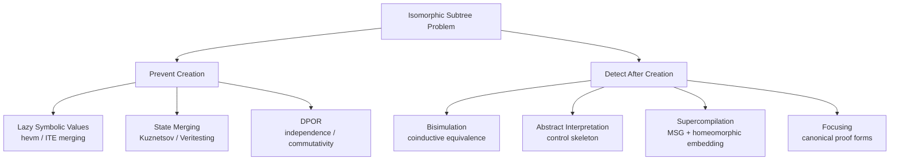

# RES_0065: Isomorphic Subtree Reduction in Symbolic Execution Trees

## Problem Statement

In symbolic execution of programs (especially EVM bytecode), execution trees contain isomorphic subtrees that differ only in accumulated path constraints. A multisig contract checking 7 member bits produces 7 structurally identical subtrees after each member check --- the "threshold reached" subtree has the same branching structure regardless of which member was checked. Exploring all 7 is redundant.

The question: what are the theoretical foundations for detecting and eliminating this redundancy? This survey covers seven approaches, each with a different formal basis.

---

## 1. State Merging in Symbolic Execution

### Core Idea

Standard symbolic execution **forks** the state at every conditional branch, producing an exponential tree. **State merging** collapses two states at the same program point into a single state whose variables are guarded by if-then-else (ITE) expressions:

```
state1: x = 5, path: P1
state2: x = 7, path: P2
merged: x = ITE(P1, 5, 7), path: P1 ∨ P2
```

This is exactly the SSA phi-function from compiler theory applied to symbolic states. The merged state represents both execution paths simultaneously. The trade-off: fewer states to explore, but each constraint query becomes harder (disjunctive path conditions, ITE-laden expressions stress SMT solvers).

### The Kuznetsov Design Space (PLDI 2012)

Kuznetsov et al. define a **generic algorithm** parameterized by three functions:

1. **Scheduling function** --- determines which state executes next
2. **State similarity relation** --- defines when two states are "close enough" to merge
3. **Branch checker** --- verifies feasibility of branches after merging

Different instantiations of these parameters recover known techniques as special cases:

| Instantiation | Scheduling | Similarity | Result |
|---|---|---|---|
| **KLEE/DART** | heuristic | never merge | Pure forking SE |
| **BMC** | topological | always merge at joins | Bounded model checking |
| **VCG** | topological | always merge | Verification condition generation |
| **Function summaries** | per-function | merge at return | Compositional SE |

The key insight: **forking and merging are endpoints of a spectrum**, not fundamentally different techniques. Every symbolic analysis sits somewhere between "never merge" (exponential states, simple queries) and "always merge" (linear states, exponential query complexity).

### Query Count Estimation (QCE)

QCE is a static preprocessing step that estimates the **impact of each symbolic variable on future solver queries**. For each variable at each program point, it counts how many downstream branch conditions reference that variable. Variables with high query count should NOT be merged (merging them creates ITE expressions that appear in many queries, slowing the solver). Variables with low query count can be safely merged.

Formally, for a variable `v` at merge point `p`, QCE computes:

```
cost(merge v at p) ≈ Σ (branch conditions downstream of p that reference v)
```

States are merged only when the estimated cost is below a threshold. This gives **orders of magnitude speedup** over both pure forking and unconditional merging.

### Dynamic State Merging (DSM)

DSM extends QCE by integrating merging into the exploration scheduler. Instead of merging only at statically identified CFG join points, DSM "fast-forwards" similar states to find merge opportunities dynamically. The key property: DSM interacts well with search heuristics (coverage-guided, depth-first, etc.), while static merging at all join points can interfere with exploration strategy.

### Veritesting (ICSE 2014)

Avgerinos et al. observe that some code regions are "easy" (straight-line, simple branching) while others are "hard" (system calls, indirect jumps, pointer aliasing). **Veritesting** switches between dynamic symbolic execution (DSE) and static symbolic execution (SSE):

- **DSE mode**: fork at every branch, explore concretely (KLEE-style)
- **SSE mode**: at "easy" regions, compute a single verification condition over the entire region (merge all paths through it), then feed the merged condition back into DSE

The transition criterion: enter SSE when the CFG subgraph ahead is a DAG with no system calls, unresolved indirect jumps, or complex memory operations. Exit SSE at "transition nodes" where any of these complications arise.

Veritesting finds 2x more bugs and explores orders of magnitude more paths than pure DSE. The theoretical contribution: a **hybrid that adaptively selects the optimal merge granularity** based on local code structure.

### MultiSE / Value Summaries (ESEC/FSE 2015)

Sen et al. introduce **value summaries**: each variable maps to a set of guarded expressions `{(guard_i, value_i)}`. The program counter itself is a guarded value. This enables **incremental merging at every assignment**, not just at join points. Key advantages:

1. No auxiliary symbolic variables introduced (unlike ITE-based merging)
2. Works with solver-opaque operations (function pointers, dynamic dispatch)
3. Concrete operations remain concrete (guards collapse when ground)

Value summaries are equivalent to ITE merging in expressive power but avoid the "query bloat" problem because the guards are factored out rather than nested.

### Z-Equivalence (TOSEM 2014)

Li et al. define **Z-equivalence**: two symbolic states at the same program point are Z-equivalent if they are indistinguishable to all callers of the enclosing procedure. Formally, states `s1, s2` are Z-equivalent if for every continuation `K`, `K(s1)` and `K(s2)` produce the same observable behavior. This is an **observational equivalence** specialized to symbolic states.

The practical test: two state constraints are Z-equivalent if they differ only in variables that are not visible at procedure boundaries. Implementation in Sym-JVM gives significant scaling improvements.

### Generalizes?

Yes. State merging is domain-independent. The core mechanism (ITE-guarded values + disjunctive path conditions) works for any imperative execution model.

### Applicability to Forward-Chaining Linear Logic

**Direct applicability: moderate.** The key challenge is that linear logic states are multisets of resources, not variable-to-value maps. "Merging" two linear logic states would mean creating a state where each resource is guarded by which path produced it. This is feasible but requires:

1. A notion of "program point" in forward chaining (control predicates like `pc` serve this role in CALC)
2. ITE-guarded terms in the content-addressed store (currently all terms are concrete)
3. A way to propagate guards through rule matching and substitution

The QCE idea translates well: estimate how many future rule firings depend on a given symbolic value, and merge only when the cost is low.

### Key References

- Kuznetsov, Kinder, Bucur, Candea. *Efficient State Merging in Symbolic Execution*. PLDI 2012.
- Avgerinos, Rebert, Cha, Brumley. *Enhancing Symbolic Execution with Veritesting*. ICSE 2014.
- Sen, Necula, Gong, Choi. *MultiSE: Multi-Path Symbolic Execution using Value Summaries*. ESEC/FSE 2015.
- Li, Cheung, Zhang, Liu. *Scaling Up Symbolic Analysis by Removing Z-Equivalent States*. TOSEM 2014.
- Scheurer, Hahnle, Bubel. *A General Lattice Model for Merging Symbolic Execution Branches*. ICFEM 2016.

---

## 2. Equivalence Modulo Theory

### Core Idea

Two symbolic execution states are **equivalent modulo a background theory T** if they satisfy the same set of formulas in T. Formally, let `s = (pc, σ, π)` be a state with program counter `pc`, store `σ`, and path condition `π`. States `s1 = (pc, σ1, π1)` and `s2 = (pc, σ2, π2)` are T-equivalent if:

```
T ⊨ π1 ↔ π2  and  T ⊨ ∀x. (π1 → σ1(x) = σ2(x))
```

That is, the path conditions are equisatisfiable, and under those conditions, the stores agree on all observable variables.

### The Lattice Model (Scheurer, Hahnle, Bubel 2016)

This work provides the cleanest formal framework. They define:

1. **Abstract domain A**: a join-semilattice of "possible values" (e.g., sign lattice `{⊥, -, 0, +, ⊤}`, interval domain, full symbolic expressions)
2. **State merge operator ⊔**: the join in the lattice, applied pointwise to all variables
3. **Soundness criterion**: the merged state must be a **sound overapproximation** --- every concrete execution of the original states must be a concrete execution of the merged state

The key theorem: **merging is sound if the merge operator is a join in a lattice that forms a Galois connection with the concrete domain**. This directly connects state merging to abstract interpretation.

Different instantiations of the lattice give different trade-offs:

| Lattice | Precision | Cost |
|---|---|---|
| Full symbolic (ITE) | Exact | High solver load |
| Predicate abstraction | Coarse | Low solver load |
| Sign/interval | Very coarse | No solver needed |

Their empirical result: predicate abstraction merging produces proof obligations 15% smaller than no merging and 25% smaller than ITE merging.

### Connection to CALC

In CALC, two states at the same control point are "equivalent modulo constraint theory" if:

1. They have the same linear resources (up to renaming of existential variables)
2. Their accumulated `eq`/`neq` constraints are equisatisfiable in the EqNeqSolver theory
3. Their persistent facts agree (up to renaming)

The structural memoization in CALC (Stage 14) is a crude approximation: it checks only `(PC, SH)` equality, ignoring constraint state entirely. A full T-equivalence check would compare constraint solver states, detecting that two paths with different `eq`/`neq` constraints still produce isomorphic subtrees if the constraints don't affect future branching.

### Key References

- Scheurer, Hahnle, Bubel. *A General Lattice Model for Merging Symbolic Execution Branches*. ICFEM 2016.
- Scheurer. *From Trees to DAGs: A General Lattice Model for Symbolic Execution*. TU Darmstadt 2015.

---

## 3. Bisimulation

### Core Idea

Two states `p` and `q` in a labeled transition system (LTS) are **bisimilar** (written `p ~ q`) if there exists a relation `R` such that:

1. `(p, q) ∈ R`
2. If `(p, q) ∈ R` and `p --a--> p'`, then there exists `q'` such that `q --a--> q'` and `(p', q') ∈ R`
3. Symmetrically for `q`

Bisimulation is the finest equivalence that identifies states which can **simulate each other's transitions step by step, preserving branching structure**. This is exactly what "isomorphic subtrees" means: two states are bisimilar if their entire future execution trees are structurally identical.

### The van Glabbeek Spectrum

Van Glabbeek's linear time-branching time spectrum organizes behavioral equivalences by discriminating power:

```
trace equiv ⊂ completed trace ⊂ failures ⊂ ready sim ⊂ 2-nested sim ⊂ bisimulation
```

For detecting isomorphic subtrees, **bisimulation is the right level**: it preserves branching structure (unlike trace equivalence, which only compares linearizations). Two states with the same set of traces but different branching patterns (nondeterministic choices resolve differently) are trace-equivalent but not bisimilar.

### Symbolic Bisimulation

Standard bisimulation requires enumerating all transitions, which is problematic when transitions are parameterized by symbolic inputs. **Symbolic bisimulation** (Hennessy & Lin 1995, extended by Boreale & De Nicola for pi-calculus) replaces concrete transitions with symbolic ones:

- A symbolic transition `p --(α, φ)--> p'` means "p can do action α under constraint φ"
- Two states are symbolically bisimilar if for every symbolic transition of one, the other has a matching symbolic transition with equivalent constraints

This avoids the infinite branching problem. In the pi-calculus, symbolic bisimulation avoids quantifying over all possible names.

### Application to Execution Trees

Model the symbolic execution engine as an LTS where:
- **States** = forward-chaining states (linear + persistent multisets)
- **Actions** = rule applications (labeled by rule name + substitution)
- **Transitions** = `state --rule(θ)--> state'`

Two states are bisimilar if they produce the same tree of rule applications. The structural memo in CALC approximates this: if `(PC, SH)` determines the available transitions, then states with the same `(PC, SH)` are bisimilar (assuming symbolic values don't affect which rules fire).

### Coinductive Characterization

Bisimilarity is defined **coinductively** --- it is the greatest fixed point of the bisimulation functional. This means we can verify bisimilarity by constructing a relation and checking it satisfies the bisimulation conditions, without needing to enumerate the entire tree. For finite-state systems, bisimilarity is decidable in **O(m log n)** time (Paige-Tarjan partition refinement).

### Generalizes?

Fully general. Bisimulation applies to any labeled transition system. The theory is well-developed for both finite and infinite state systems, with decidability results, axiomatizations, and logical characterizations (Hennessy-Milner logic).

### Applicability to Forward-Chaining Linear Logic

**Strong applicability.** Forward chaining in linear logic is naturally an LTS:
- States are multisets of linear resources + sets of persistent facts
- Transitions are rule applications consuming/producing resources

Two proof search states are bisimilar if every rule applicable in one is applicable in the other (with matching substitutions) and the resulting states are again bisimilar. Focusing discipline helps: invertible (don't-care) rule applications can be factored out, reducing the transition labels to focus choices.

The concrete approach for CALC: define bisimulation up to renaming of existential variables and up to constraint equivalence. Two states `s1, s2` are bisimilar if:
1. Same control predicates (same set of applicable rules)
2. For each rule application in `s1`, there is a matching application in `s2` leading to bisimilar successors
3. Constraint states are compatible (don't force different branching)

### Key References

- Milner. *Communication and Concurrency*. Prentice Hall 1989.
- Sangiorgi. *Introduction to Bisimulation and Coinduction*. Cambridge 2012.
- Sangiorgi, Walker. *The Pi-Calculus: A Theory of Mobile Processes*. Cambridge 2001.
- Hennessy, Lin. *Symbolic Bisimulations*. TCS 1995.
- Van Glabbeek. *The Linear Time-Branching Time Spectrum I & II*. 1990/1993.
- Paige, Tarjan. *Three Partition Refinement Algorithms*. SIAM J. Computing 1987.

---

## 4. Abstract Interpretation

### Core Idea

Abstract interpretation (Cousot & Cousot 1977) provides a framework for **sound approximation** of program semantics. The key structure is a **Galois connection** between concrete and abstract domains:

```
(C, ⊆) <--γ-- (A, ⊑) --α--> (C, ⊆)
        --α-->          <--γ--

where: α(c) ⊑ a  ⟺  c ⊆ γ(a)
```

- `C` is the concrete domain (sets of concrete states)
- `A` is the abstract domain (abstract states)
- `α` is the abstraction function (concrete → abstract)
- `γ` is the concretization function (abstract → concrete)
- `⊑` is the abstract partial order

### Abstracting Away Data to Keep Control

To detect isomorphic subtrees, we want an abstract domain that **retains control flow structure but discards data values**. Define:

```
α_control(state) = { f | f ∈ state, f is a control predicate }
```

This maps a full state to just its control predicates. The Galois connection is:

```
γ(abstract) = { state | α_control(state) = abstract }
```

The abstract transition system then has:
- **Abstract states** = sets of control predicates
- **Abstract transitions** = rule applications (abstracting away data substitutions)

Two concrete states that map to the same abstract state produce the same abstract transition tree. This is a sound overapproximation: if the abstract trees are identical, the concrete trees are "equivalent up to data."

### Widening for Termination

Standard abstract interpretation uses **widening** to ensure fixpoint computation terminates. For symbolic execution trees, the analog is: when the abstract state space has been fully explored (all abstract control configurations reached), further concrete exploration with new data values is redundant.

This is precisely what CALC's structural memo does: `controlHash(stateIndex)` abstracts the state to `(PC, SH)`, and the memo table records which abstract states have been fully explored.

### Predicate Abstraction

A more refined approach: instead of abstracting to control predicates only, use **predicate abstraction** to track a finite set of data properties. For each state, record which predicates from a fixed set `{p1, ..., pk}` hold. States with the same predicate valuations are merged.

For CALC, relevant predicates might include:
- `pc = N` (program counter value)
- `sh = H` (stack hash)
- `fired = 0` / `fired = 1` (contract-level flags)
- `threshold_reached` / `not_reached`

This would give a finer-grained memo than pure control hash, while still abstracting away member-specific values.

### Simmons & Pfenning: Linear Logical Approximations (PEPM 2009)

This work directly connects abstract interpretation to forward chaining in linear logic. Key idea: represent operational semantics as forward-chaining linear logic programs (substructural operational semantics, SSOS). Then derive **sound approximations** by manipulating the logic program:

1. **Contraction approximation**: allow a linear resource to be used multiple times (add implicit contraction). This overapproximates reachable states.
2. **Weakening approximation**: allow resources to be silently discarded. This overapproximates by permitting more transitions.
3. **Predicate collapsing**: merge multiple predicates into one, losing information but reducing state space.

The resulting approximation is a **terminating forward-chaining program** that overapproximates all reachable states of the original. This is abstract interpretation instantiated for linear logic.

### Generalizes?

Fully general. Abstract interpretation is the most mature framework for program approximation. The Galois connection framework applies to any semantic domain.

### Applicability to Forward-Chaining Linear Logic

**Very strong.** Simmons & Pfenning's work shows this is already done. The specific instantiation for CALC:

1. Define the concrete domain as multisets of linear facts + sets of persistent facts
2. Define the abstract domain as control predicates (or a predicate abstraction thereof)
3. The Galois connection maps concrete states to their control-predicate projection
4. The abstract transition system captures the "control skeleton" of execution
5. Memoization on the abstract domain gives sound subtree sharing

The formal guarantee: if two concrete states have the same abstract image, and the abstract transition system is deterministic (focusing ensures this for invertible phases), then the concrete subtrees are isomorphic.

### Key References

- Cousot, Cousot. *Abstract Interpretation: A Unified Lattice Model for Static Analysis*. POPL 1977.
- Cousot, Cousot. *Comparing the Galois Connection and Widening/Narrowing Approaches*. PLILP 1992.
- Simmons, Pfenning. *Linear Logical Approximations*. PEPM 2009.
- Simmons, Pfenning. *Substructural Operational Semantics as Ordered Logic Programming*. LICS 2009.
- Amadini. *Abstract Interpretation, Symbolic Execution and Constraints*. 2021.

---

## 5. Partial Evaluation and Supercompilation

### Core Idea: Partial Evaluation

A **partial evaluator** specializes a program `P(x, y)` with respect to known input `x = a`, producing a residual program `P_a(y)` that is equivalent to `P(a, y)` but potentially more efficient. The key operations:

1. **Unfolding**: inline function calls when the function is known
2. **Folding**: detect when a specialized configuration matches a previously seen one, and generate a recursive call instead of re-specializing
3. **Memoization**: cache specialized results indexed by their "static" inputs

**Folding is exactly subtree sharing.** When specializing `P(a, y)` leads to a configuration that is alpha-equivalent to a previously seen configuration `P(b, y)`, the partial evaluator recognizes this and reuses the previous result.

### Supercompilation and the Process Tree

Turchin's **supercompilation** (1986) generalizes partial evaluation. It builds a **process tree** where:

- **Nodes** are **configurations** (program states with symbolic inputs)
- **Edges** are computation steps (unfolding)
- The tree is explored depth-first

Three operations control the tree:

1. **Driving**: unfold one computation step, extending the tree
2. **Folding**: if the current configuration is a **renaming** of a previous node, create a back-edge (the tree becomes a graph). This detects exact structural equivalence.
3. **Generalization**: if the current configuration is "too similar" to a previous one (homeomorphic embedding), **generalize** both to their most specific generalization (MSG), and restart from the generalized configuration.

### Homeomorphic Embedding (The Whistle)

The **homeomorphic embedding** relation `⊴` on terms is defined inductively:

```
s ⊴ f(t1, ..., tn)  if  s ⊴ ti  for some i          (diving)
f(s1, ..., sn) ⊴ f(t1, ..., tn)  if  si ⊴ ti  for all i  (coupling)
```

Intuitively, `s ⊴ t` means `s` can be obtained from `t` by erasing some subterms. **Kruskal's tree theorem** guarantees: in any infinite sequence of terms `t1, t2, t3, ...`, there exist `i < j` with `ti ⊴ tj`. This means the whistle **always eventually fires**, ensuring termination.

When `ti ⊴ tj` (the whistle fires), the current configuration `tj` is "growing" compared to `ti`. The supercompiler computes their **most specific generalization (MSG)** --- the most specific term that is more general than both --- and continues from there.

### Most Specific Generalization (MSG)

Given terms `s` and `t`, their MSG `g = msg(s, t)` satisfies:

1. `g` generalizes both: `s = gθ1`, `t = gθ2` for some substitutions `θ1, θ2`
2. `g` is the most specific such term (any other common generalization is more general than `g`)

MSG for first-order terms is computed by anti-unification (Plotkin 1970, Reynolds 1970). For the multisig example:

```
state_member1 = { pc 42, sh H, eq Sender M1, ... }
state_member2 = { pc 42, sh H, eq Sender M2, ... }
msg(state_member1, state_member2) = { pc 42, sh H, eq Sender X, ... }
```

The MSG abstracts away the member identity, producing a generic "member X" state. The subtree from this generalized state covers all members.

### Distillation

Hamilton's **distillation** extends supercompilation with a stronger notion of equivalence. Where supercompilation folds only on renamings, distillation can fold on **homeomorphic embeddings with compatible structure**. This catches more cases of structural similarity at the cost of potentially less efficient residual programs.

### Generalizes?

Yes. Partial evaluation and supercompilation are fully general program transformation frameworks. They apply to any computational system with a notion of "configuration" and "computation step."

### Applicability to Forward-Chaining Linear Logic

**Strong applicability, especially MSG.** The analogy is direct:

| Supercompilation | CALC Forward Chaining |
|---|---|
| Configuration | State (linear + persistent multiset) |
| Driving | Applying one forward rule |
| Folding | Memo hit (exact state match) |
| Generalization | Abstract state to control predicates + MSG |
| Whistle | Homeomorphic embedding on state terms |

The MSG approach offers something CALC's current structural memo doesn't: instead of a binary "same control hash or not," MSG computes the **precise common structure** of two states, identifying exactly which parts differ (member identity) and which are shared (control flow). This could enable:

1. **Automatic control predicate discovery**: compute MSG of states at the same depth, extract the common structure as the "control skeleton"
2. **Generalized memoization**: memo on the MSG rather than on a handpicked hash
3. **Termination guarantee**: Kruskal's theorem ensures the whistle fires in any infinite branch

### Key References

- Turchin. *The Concept of a Supercompiler*. TOPLAS 1986.
- Jones, Gomard, Sestoft. *Partial Evaluation and Automatic Program Generation*. Prentice Hall 1993.
- Mitchell, Runciman. *A Supercompiler for Core Haskell*. IFL 2008.
- Sorensen, Gluck, Jones. *A Positive Supercompiler*. JFP 1996.
- Leuschel. *Homeomorphic Embedding for Online Termination of Symbolic Methods*. 2002.
- Plotkin. *A Note on Inductive Generalization*. Machine Intelligence 5, 1970.

---

## 6. hevm's Approach

### Architecture

hevm (CAV 2024, Dxo et al.) uses a fundamentally different execution model than CALC:

1. **Lazy symbolic expressions**: values are `Expr EWord` trees, not content-addressed ground terms. `AND(Nonce, VoteBit)` produces the expression node `And(Var "nonce", Lit voteBit)`, not a fresh existential variable.

2. **ITE at the value level**: at JUMPI, hevm doesn't fork into two separate states. Instead, it creates an `ITE` node in the expression tree: `ITE(condition, trueResult, falseResult)`. The branching is embedded in the data representation.

3. **Expr End as a tree**: the final result of symbolic execution is a single `Expr End` value --- a tree of ITE branches with final states (Success/Failure) as leaves. Each leaf carries path conditions (a list of `Prop`).

### How hevm Avoids Branch Explosion

hevm's key insight is that **branching happens at the value level, not the state level**. For the multisig `getMemberBit` function:

- CALC: forks 7 times (once per member), creating 7 separate states with 7 separate execution continuations
- hevm: produces a single symbolic expression `ITE(EQ(caller, M1), 247, ITE(EQ(caller, M2), 246, ...))` as the bit position value. Execution continues with this single symbolic value.

The branching collapses because **the bit position is never pattern-matched concretely** in subsequent code. It flows into `AND(nonce, ShiftLeft(1, bitPos))`, producing another symbolic expression. Only at the final JUMPI (threshold check, deadline check) does execution genuinely branch into different behaviors.

Result: 7 nodes in hevm vs 2125 in CALC for the same contract.

### Simplification Passes

Before SMT analysis, hevm applies cheap rewrite rules:

1. **Constant folding**: `Add(Lit 3, Lit 5)` → `Lit 8`
2. **Canonicalization**: ensure constants are first arguments (enables further rewrites)
3. **Equivalence propagation**: if path condition forces `Var "a" = Lit 5`, substitute `Lit 5` for `Var "a"` everywhere
4. **Dead branch elimination**: if a condition is determined by the path condition, prune the impossible branch

These are applied during and after exploration, before any SMT calls.

### Theoretical Framing

hevm's approach is equivalent to **unconditional state merging at every join point** (the BMC endpoint of Kuznetsov's spectrum), but with the crucial optimization that merging happens at the **expression level** (via ITE constructors in the value domain) rather than at the state level. The Haskell runtime's lazy evaluation means ITE expressions are only materialized when needed.

This is also equivalent to the **value summary** representation of MultiSE: each variable is implicitly a guarded value set. hevm's GADT-based `Expr` type is essentially a typed value summary.

### Why CALC Can't Directly Do This

CALC's execution model is fundamentally different:

1. **Content-addressed terms are ground.** Every term in the store has a unique hash. Symbolic ITE values would require a new term constructor and pervasive changes to matching, substitution, and the store.

2. **Forward-chaining rules pattern-match on term structure.** A rule like `evm/and: stack SH (and X Y Z) -o ...` needs to decompose the stack value. If the value is `ITE(cond, X1, X2)`, every rule must case-split.

3. **Linear resource consumption is all-or-nothing.** You can't partially consume a guarded resource.

The structural memo (Stage 14) is CALC's current answer: instead of preventing the branching, detect it after the fact and skip redundant subtrees.

### The Architectural Lesson

hevm demonstrates that the "right" solution to isomorphic subtrees is **not to create them in the first place**. Lazy symbolic values prevent branching until behaviorally necessary. This requires:

- A symbolic value representation (ITE expressions, not ground terms)
- A constraint solver (SMT, not union-find)
- Lazy evaluation (branch only when the value is pattern-matched)

These are the foundations for TODO_0002 (symbolic value representation) and TODO_0003 (SMT integration) in the CALC roadmap.

### Key References

- Dxo, Soos, Paraskevopoulou, Lundfall, Brockman. *Hevm, a Fast Symbolic Execution Framework for EVM Bytecode*. CAV 2024.
- hevm architecture documentation: https://hevm.dev/architecture.html
- hevm source: https://github.com/ethereum/hevm

---

## 7. Linear Logic and Proof Search Equivalence

### Permutation Equivalence in Sequent Calculus

In sequent calculus, two derivations that differ only in the **order of rule applications** are considered **permutation equivalent**. Linear logic has particularly rich permutation theory because resource sensitivity constrains which reorderings are valid.

**Proof nets** (Girard 1987) are an equivalence class of sequent calculus derivations modulo permutation. A proof net represents the "essential structure" of a proof, abstracting away the order in which rules were applied. Two sequent calculus proofs that correspond to the same proof net are "the same proof, differently presented."

### Focusing (Andreoli 1992)

Focusing provides a **canonical form** for proof search in linear logic, eliminating spurious choice:

1. **Invertible (negative) rules**: rules whose application is **don't-care nondeterministic**. Applying them in any order gives the same result. These include: right-introduction of `⊸` (loli), `&` (with); left-introduction of `⊗` (tensor), `1` (one), `!` (bang).

2. **Non-invertible (positive) rules**: rules whose application involves **don't-know nondeterminism**. A choice must be made, and different choices lead to different proofs. These include: right-introduction of `⊗`, `⊕` (oplus); left-introduction of `⊸`.

3. **Focus discipline**: apply all invertible rules first (inversion phase), then choose a formula to focus on and apply non-invertible rules until the focus is fully decomposed (focus phase). This eliminates redundant interleavings of invertible rules.

The focusing theorem: **every provable sequent has a focused proof**. The search space of focused proofs is exponentially smaller than unfocused search.

### Forward Chaining as Proof Search

In CALC's forward engine, each state is a sequent (linear context + persistent context ⊢ goal). Each rule application is an inference step. The execution tree is a **proof search tree**.

Two states in the search tree are "equivalent" in the proof-theoretic sense if:

1. They contain the same multiset of linear resources (up to permutation)
2. They have the same persistent facts
3. They are at the same point in the focusing discipline (same focus, same inversion status)

Permutation equivalence means: if two derivation branches apply the same rules in different orders to reach the same multiset of resources, they are equivalent.

### CLF and Monadic Encapsulation

The Concurrent Logical Framework (CLF, Watkins, Cervesato, Pfenning, Walker 2002) directly addresses this. CLF uses **monadic types** to encapsulate forward-chaining computation:

```
{A1 ⊗ A2 ⊗ ... ⊗ An}
```

The monadic expression `{...}` represents a **concurrent computation** --- the order of resource production within the monad is irrelevant. CLF's **definitional equality identifies computations that differ only in the order of independent steps**.

This is exactly permutation equivalence for forward chaining. Two forward-chaining traces that apply independent rules in different orders produce the same CLF monadic expression.

### Application to Isomorphic Subtrees

For CALC's symexec, the relevant notion is **trace equivalence of forward-chaining states**: two states produce the same set of possible outcomes (quiescent states) regardless of the execution order.

The proof-theoretic machinery gives us:

1. **Focusing reduces branching.** Invertible rules (don't-care nondeterminism) can be applied eagerly without branching. Only at focus choices (oplus elimination) does genuine branching occur. CALC already implements this via the focusing discipline in its prover.

2. **Multiset equality is state equality.** Two states with the same multiset of resources are equal, regardless of how they arrived there. This is the linear logic analog of "same program point with same variable values."

3. **Permutation equivalence reduces the search space.** If two orderings of rule applications commute (independence), only one needs to be explored. This is exactly **partial order reduction** (DPOR) applied to forward-chaining proof search.

### DPOR for Linear Logic

Flanagan & Godefroid's DPOR (POPL 2005) applies directly to forward chaining:

- **Independence**: two rule applications are independent if they consume/produce disjoint sets of resources
- **Dependence**: two rule applications are dependent if one consumes a resource the other produces (or they compete for the same resource)
- **Reduction**: explore only one ordering of independent rule applications

For CALC's symexec (which currently does DFS over all nondeterministic choices), DPOR would reduce the number of explored orderings at `branch` nodes where multiple rules are applicable. This is orthogonal to isomorphic subtree detection but complementary: DPOR reduces branching from rule ordering, while structural memo reduces branching from symmetric data.

### Key References

- Andreoli. *Logic Programming with Focusing Proofs in Linear Logic*. JLC 1992.
- Watkins, Cervesato, Pfenning, Walker. *A Concurrent Logical Framework I: Judgments and Properties*. CMU-CS-02-101, 2002.
- Cervesato, Scedrov. *Relating State-Based and Process-Based Concurrency through Linear Logic*. IC 2009.
- Simmons, Pfenning. *Linear Logical Algorithms*. ICALP 2008.
- Girard. *Linear Logic*. TCS 1987.
- Flanagan, Godefroid. *Dynamic Partial-Order Reduction for Model Checking Software*. POPL 2005.
- Miller. *An Overview of Linear Logic Programming*. 2004.

---

## Synthesis: A Unified View

All seven approaches address the same underlying phenomenon, seen from different angles:



### The Two Strategies

**Strategy A: Don't create isomorphic subtrees.** Replace concrete branching with symbolic values (hevm), merge states at join points (Kuznetsov), or eliminate commuting choices (DPOR). Requires symbolic value representation.

**Strategy B: Detect and skip isomorphic subtrees.** Compare states by bisimulation, abstract to control skeleton (AI), generalize via MSG (supercompilation), or canonicalize via focusing. Works with ground terms.

CALC currently uses Strategy B (structural memo via control hash). The research suggests a progression:

### Short-Term (Strategy B, refined)

1. **Configurable control predicates** (`@control pc sh`): the abstract interpretation approach, where the user declares which predicates constitute the "control skeleton." Already planned.

2. **Automatic MSG-based control discovery**: compute MSG of states at branch points. The common structure IS the control skeleton. No user annotation needed. The homeomorphic embedding whistle detects when new branch patterns emerge.

3. **Constraint-aware bisimulation**: extend the control hash to include the constraint solver's abstract state (which symbolic equalities are known). This catches cases where control is the same but constraint states differ.

### Long-Term (Strategy A, architectural)

4. **Symbolic value representation** (TODO_0002): introduce ITE-guarded terms in the store. Rules that produce `oplus` with symmetric alternatives create a single symbolic value instead of branching. This is the hevm approach adapted to content-addressed terms.

5. **SMT integration** (TODO_0003): replace EqNeqSolver with a full theory solver. Enables constraint-based pruning, equivalence propagation, and sound branch elimination.

6. **Lazy branching**: branch only when a rule **pattern-matches** on a symbolic value's alternatives. If no rule distinguishes the alternatives, the execution continues with the merged value. This is the value summary approach.

### The Formal Unification

All approaches can be captured in a single framework. Define:

- **State space** `S` with transition relation `→`
- **Equivalence relation** `≈` on `S` (bisimulation, abstract equivalence, MSG equality, ...)
- **Quotient system** `S/≈` with induced transitions

The quotient system is a **sound abstraction** of the original: every behavior of the original is represented (possibly multiple original behaviors map to one abstract behavior). The different approaches differ in how `≈` is defined and how efficiently the quotient can be computed.

| Approach | Equivalence `≈` | Computation | Precision |
|---|---|---|---|
| Control hash | same PC, SH | O(1) hash lookup | Coarse |
| Predicate abstraction | same abstract predicates | O(k) predicate evaluation | Medium |
| MSG | same MSG modulo renaming | O(n) anti-unification | Fine |
| Bisimulation | coinductive equivalence | O(m log n) partition refinement | Exact |
| Full symbolic | ITE-merged values | no quotient needed (prevented) | Exact |

---

## Summary Table

| Approach | Core Theory | Generalizes? | Applicability to CALC | Effort |
|---|---|---|---|---|
| State merging | ITE-guarded values at join points | Yes | Requires symbolic values | High (architectural) |
| Equivalence modulo T | Lattice of abstract domains | Yes | Extend EqNeqSolver to lattice | Medium |
| Bisimulation | Coinductive step-by-step equivalence | Yes | Natural LTS from forward chaining | Medium (partition refinement) |
| Abstract interpretation | Galois connection, control skeleton | Yes | Already done: control hash = abstraction | Low (refine existing) |
| Supercompilation | MSG + homeomorphic embedding | Yes | MSG for automatic control discovery | Medium |
| hevm approach | Lazy symbolic expressions + ITE | EVM-specific impl, general theory | Requires symbolic values (TODO_0002) | High (architectural) |
| Linear logic focusing | Canonical proof forms, permutation equiv | Linear logic specific | Already implemented in prover | Low (extend to symexec) |
