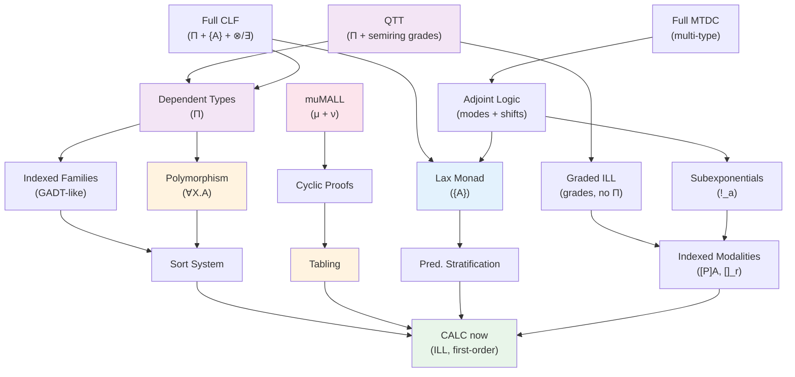

# Higher-Order Expressiveness Survey

This document surveys the landscape of type-theoretic and proof-theoretic extensions to Intuitionistic Linear Logic (ILL), with the goal of understanding: what does CALC need, what can it get, and how do the various extensions relate to each other?

## 1. The Four Orthogonal Axes

The extensions fall along four **mostly orthogonal** axes. Different use cases draw from different axes, and you can mix and match.

### Axis 1 — Term-Level Type Discipline

Controls what the type system can express about terms.

```
Level 0:  Untyped first-order terms (CALC now)
Level 1:  Sort system (multi-sort boundary, arity checking)
Level 2:  Polymorphism ∀X.A (parametric types, erasure-based)
Level 3:  Indexed families (GADT-like, predicates with index constraints)
Level 4:  Dependent types Π x:A. B (type families indexed by terms)
Level 5:  Full QTT (Π + semiring grades on every variable)
```

Each level strictly contains the ones below. Polymorphism (∀X.A) is a degenerate case of Π where the domain is a universe: `∀X.A = Πx:Type.A`. But polymorphism is dramatically simpler to implement because it requires no dependent computation in types.

### Axis 2 — Structural/Modal Expressiveness

Controls how many modes of truth the logic distinguishes.

```
Level 0:  Single ! (CALC now — two zones: linear + cartesian)
Level 1:  Indexed modalities [P]A, []_r A (syntactic wrappers)
Level 2:  Subexponentials !_a (Nigam-Miller, indexed with preorder)
Level 3:  Adjoint logic (modes with adjunctions F ⊣ U)
Level 4:  Full MTDC (multi-type display calculus, arbitrary bridge rules)
Level 5:  Graded MTDC (+ semiring grades on structural rules)
```

The relationships between levels 2-4 are not strictly linear — they are different frameworks that can express similar phenomena, with MTDC being the most general proof-theoretic framework.

### Axis 3 — Fixed-Point Expressiveness

Controls recursion and (co)induction in the logic.

```
Level 0:  No fixed points (CALC now — only backward clause recursion)
Level 1:  Tabling/memoization (loop = success or failure by polarity)
Level 2:  Cyclic proofs (back-edges + global trace condition)
Level 3:  muMALL (μ/ν connectives — least/greatest fixed points)
```

With arithmetic available (CALC has it via FFI), cyclic proofs ≡ explicit induction (Berardi-Tatsuta 2017). muMALL is strictly more expressive than having only exponentials: `!A = νX. A & X`, `?A = μX. A ⊕ X` (Baelde 2012).

### Axis 4 — Forward/Backward Integration

Controls how the two proof search modes interact.

```
Level 0:  Separate (CALC now — engine vs prover, different entry points)
Level 1:  Predicate stratification (ad-hoc rule ordering, not logically principled)
Level 2:  Lax monad {A} (backward→forward mode switch, quiescence, CLF)
Level 3:  Nested modes (SLS, forward within backward within forward)
Level 4:  Full CLF (Π + {A} + concurrent objects + definitional equality)
```

---

## 2. Subsumption Map

### 2.1 Strict Subsumptions (A makes B unnecessary)

| Stronger (A) | Weaker (B) | Why |
|---|---|---|
| muMALL (μ/ν) | Exponentials (!/?) | !A = νX. A & X; ?A = μX. A ⊕ X (Baelde 2012) |
| Π types | ∀X.A polymorphism | ∀X.A = Πx:Type.A (universe as domain) |
| QTT {0,1,ω} | ILL {1,ω} | CALC's linear/persistent = QTT's {1,ω} fragment |
| MTDC | Adjoint logic | Adjoint logic is a specific MTDC instance |
| Adjoint logic | Subexponentials | Subexponentials are a specific adjoint mode theory |
| Lax monad {A} | Simple stages | Backward chaining sequences forward phases naturally |
| Cyclic proofs + arith | Explicit induction + arith | Berardi & Tatsuta LICS 2017 |

### 2.2 Non-Subsumptions (Orthogonal — need both)

| A | B | Why orthogonal |
|---|---|---|
| muMALL | Lax monad | Fixed points = recursive types/proofs; monad = mode switching. Neither encodes the other. |
| muMALL | Dependent types | Recursion ≠ indexing. Can have μ-types without Π and vice versa. |
| MTDC | muMALL | Multiple modes ≠ fixed points. Can have multimodal μMALL. |
| Polymorphism | Fixed points | ∀X.A gives parametric types; μX.A gives recursive types. Independent (combined in System Fμ). |
| Lax monad | Dependent types | CLF has both as independent features. |
| Polymorphism | Modalities | [P](∀X.A) vs ∀X.[P]A — the two commute freely. |

### 2.3 Partial Overlaps

**muMALL partially overlaps stages:** The greatest fixed point `νX. (phase_body ⊗ X)` can model cyclic phases (game turns, reactive loops). But complex multi-phase sequencing with data flow between phases is more naturally expressed by the lax monad (backward chaining binds results between forward phases).

**QTT partially overlaps MTDC:** QTT's grades can distinguish 0-use (erased) vs 1-use (linear) vs ω-use (unrestricted), which captures some multimodal distinctions. But QTT grades are on a single semiring — it cannot express principal-indexed ownership `[Alice]A` or hierarchical location modalities `@L A`, which require parametric indices at the term level.

**Adjoint logic partially captures {lax monad, !}:** In adjoint logic with modes `U` (unrestricted) and `L` (linear) connected by `F ⊣ U`: the bang `!A = F(U(A))` and the lax monad `{A} = ↑(↓A)`. This is elegant but adjoint logic doesn't give fixed points or polymorphism — those remain orthogonal.

---

## 3. Each Extension in Detail

### 3.1 Polymorphism (∀X.A)

**What it is:** Universal quantification over types. `∀X. X ⊸ X` is the type of the polymorphic identity function. Terms: `ΛX.M` (type abstraction) and `M[A]` (type application).

**What it buys:**
- Generic rules: `∀X. list(X) ⊸ list(X)` (works for any element type)
- Type-safe containers: `array(X)` parameterized by element type
- Reusable libraries: define operations once, instantiate at many types

**What it costs (in CALC):**
- Parser extension: `forall X. ...` at the type level (already have `forall` for terms)
- Store: new tag for `forall_type` (or reuse quantifier infrastructure)
- Unification: type variables unify like term metavariables (erasure-based)
- ~300 LOC, well-understood theory

**Relationship to ILL:** Polymorphic ILL (second-order ILL) has been studied since Girard's original work. System F with linear types (Wadler 1993 "A taste of linear logic") is well-understood. In the focusing framework, ∀ is negative (asynchronous) — it's invertible on the right.

**Key insight for CALC:** Polymorphism is by far the cheapest type-level extension with the highest payoff. It enables generic programming patterns without any of the complexity of dependent types. TODO_0063 (arrlit) doesn't strictly need it (bin is universal), but future type-safe patterns benefit enormously.

### 3.2 Dependent Types (Π x:A.B)

**What it is:** The type `Π x:A. B` is a function where the return type `B` depends on the argument value `x`. When `B` doesn't mention `x`, this degenerates to `A → B` (or `A ⊸ B` linearly).

**The LF/LLF/CLF hierarchy:**
- LF (Harper-Honsell-Plotkin 1993): Π types over a simply-typed lambda calculus. Purpose: encode syntax and judgments of other logics. Key property: **adequacy** — bijection between LF terms of type `A` and mathematical objects being encoded.
- LLF (Cervesato-Pfenning 1996): LF + linear types (`⊸`, `&`, `⊤`). Purpose: encode stateful systems where resources are consumed.
- CLF (Watkins et al. 2004): LLF + lax monad `{S}` + synchronous connectives (`⊗`, `1`, `!`, `∃`). Purpose: encode concurrent systems with forward chaining.

**What dependent types buy:**
1. **Type families indexed by terms:** `vec : nat → type` — vectors indexed by length
2. **Adequate encodings:** Bijection between LF terms and mathematical objects
3. **Judgments-as-types:** `nd : prop → type` — "A has a proof" is itself a type
4. **Mechanized metatheory:** Twelf's totality checker verifies coverage + termination

**What they cost (in CALC):**
- Kind system (`type`, `Π x:A. K`) — ~200 LOC
- Hereditary substitution (maintain canonical forms) — ~200 LOC
- Bidirectional type checker (check/synth modes) — ~400 LOC
- Higher-order pattern unification (Miller's pattern fragment, decidable + linear time) — ~400 LOC
- Type reconstruction (implicit argument inference) — ~500 LOC
- **Total: ~2200 LOC** — significant but bounded

**Critical question for CALC:** Is adequacy needed? CALC verifies derivations via the prover kernel (L1), not the type system. For EVM/financial domains, runtime verification suffices. Π becomes essential when CALC needs to answer "is this user-defined logic sound?" — i.e., if it becomes a general logical framework like Twelf.

**The Ceptre precedent:** Ceptre drops Π entirely (simple types only), uses first-order terms with predicates, and successfully models game mechanics, interactive narratives, and process algebras. This is strong evidence that Π is not required for practical linear logic programming.

### 3.3 QTT (Quantitative Type Theory)

**What it is:** Atkey (LICS 2018) and McBride: dependent types where every variable in the context carries a **grade** from a semiring (R, +, ·, 0, 1). The grade tracks how many times the variable is used.

**The semiring:** Any semiring works. Key examples:
- `{0, 1, ω}` — Idris 2's choice. 0 = erased (compile-time only), 1 = linear (exactly once), ω = unrestricted
- `{0, 1}` — affine (at most once)
- `ℕ` — exact usage counting
- Pacioli group `[d // c]` — CALC's own proposed semiring (debit/credit accounting)

**Typing judgment:** `Γ ⊢^σ M : A` where `σ` is a vector of grades, one per context entry. The key rule:

```
  Γ ⊢^σ M : A    Γ, x:^ρ A ⊢^τ N : B
  ─────────────────────────────────────
  Γ ⊢^(σ·ρ + τ) (let x = M in N) : B
```

Grades multiply through substitution and add across parallel uses.

**What QTT buys:**
- Unifies linear/affine/relevant/unrestricted under one framework
- Dependent types with resource tracking (Idris 2 does this)
- 0-graded types exist at compile time but are erased at runtime (type-level computation without runtime cost)
- Can track quantities (how many tokens, not just "some")

**What QTT costs:** Requires dependent types FIRST (Π), then grading on top. Total: ~3000+ LOC. The grade checking adds complexity to every type rule.

**CALC's position:** CALC already has the `{1, ω}` fragment: linear facts (grade 1) and persistent facts (grade ω). Full QTT would unify this with dependent types. But the cost is extreme for current use cases.

**Graded ILL (without Π):** Granule (Orchard et al.) implements graded types WITHOUT dependent types. This is much simpler: just add grade annotations to the existing ILL type system. CALC could get graded resource tracking (~500 LOC) without the Π complexity. This is the sweet spot if precise resource counting is needed.

### 3.4 muMALL (Fixed Points in Linear Logic)

**What it is:** Baelde & Miller (LPAR 2007, TOCL 2012) extend MALL with least (`μ`) and greatest (`ν`) fixed-point operators:

```
A ::= ... | μX.B(X) | νX.B(X)
```

`μX.B(X)` is the least pre-fixed point of `B`. `νX.B(X)` is the greatest post-fixed point.

**Proof rules:**
- **μ-unfolding** (right): prove `B(μX.B)` to prove `μX.B`
- **μ-induction** (left): given invariant S closed under B, derive from S
- **ν-unfolding** (left): decompose `νX.B` via `B(νX.B)`
- **ν-coinduction** (right): provide coinvariant S that is a post-fixed point

**Focusing and polarity:** μ is positive (synchronous), ν is negative (asynchronous). This extends CALC's existing polarity table naturally.

**Key encodings:**
```
Nat       = μX. 1 ⊕ X
List(A)   = μX. 1 ⊕ (A ⊗ X)
Stream(A) = νX. A ⊗ X
!A        = νX. A & X        ← exponential as fixed point
?A        = μX. A ⊕ X        ← dual exponential
```

**What muMALL buys for CALC:**
1. Inductive data types (natural numbers, lists, trees) as first-class formulas
2. Coinductive processes (streams, services) expressible in the logic
3. Inductive reasoning (safety proofs, conservation laws)
4. Coinductive reasoning (bisimulation, liveness)
5. Temporal properties: `Safety = νX. safe ∧ AX(X)`, `Liveness = μX. goal ∨ EX(X)`
6. Exponentials as derived (simplifies core logic if desired)

**The invariant problem:** The induction rule requires an invariant S that can be ANY closed formula. This makes proof search undecidable (Π₁⁰-hard). Cyclic proofs avoid this — see next section.

**Cut elimination:** Holds (Baelde 2012). The focused system is complete. muMALL is well-behaved proof-theoretically.

### 3.5 Cyclic Proofs

**What they are:** Instead of requiring an explicit invariant for induction, allow the proof tree to have **back-edges** (buds linked to earlier companions). A global trace condition (GTC) ensures soundness: on every infinite path through the unfolded tree, some formula progresses infinitely often through a μ-unfolding.

**Why they matter for CALC:** CALC's `symexec.explore()` already detects cycles (back-edges in execution trees). Cyclic proofs are the proof-theoretic account of exactly this: a cycle in the execution tree IS a back-edge in a cyclic proof. The GTC IS the termination/progress guarantee.

**Complexity:** GTC checking is PSPACE-complete (Nollet-Saurin-Tasson 2019, via reduction to/from size-change termination). But polynomial heuristics exist (E-Cyclist, Stratulat 2021).

**Curry-Howard for cyclic proofs:** Kuperberg-Pinault-Pous (POPL 2021) showed cyclic proofs with contraction correspond to System T (provably total functions of Peano Arithmetic), and without contraction (affine/linear) correspond to primitive recursive functions. CALC's linear discipline keeps things primitive recursive; `!` unlocks full recursion.

### 3.6 Lax Monad {A}

**What it is:** CLF's central innovation. The type `{S}` partitions formulas into:
- Asynchronous (outside monad): `⊸`, `&`, `⊤` — invertible right-rules → backward chaining
- Synchronous (inside monad): `⊗`, `1`, `!`, `∃` — choice-requiring right-rules → forward chaining

Entering `{S}` switches from backward to forward mode. The forward engine runs to **quiescence** (no rules fire), then exits the monad.

**CALC's implicit monad:** CALC already has this — `run()` returns at quiescence, `provePersistentGoals` calls backward chaining inside forward rules. The monad is implicit in the code structure.

**What making it explicit buys:**
1. Mixed-mode programs (backward proves goals, then forward executes state machines)
2. Principled staging (sequences forward phases via backward chaining)
3. Type-level distinction between forward and backward rules
4. Formal bridge between THY_0001 (forward theory) and the prover (L1-L3)

**CALC's extensions beyond CLF:**
- Lolis inside monad `{A ⊸ B}` — CLF forbids this; CALC uses it for conditional production
- Additives inside monad `{A ⊕ B}` — CLF excludes; CALC uses for symbolic branching
- Exhaustive exploration — CLF uses committed choice; CALC explores all paths

These extensions break CLF's definitional equality (commuting independent let-bindings) but CALC doesn't need it (no concurrent computation model).

### 3.7 MTDC (Multi-Type Display Calculus)

**What it is:** Greco & Palmigiano's framework for designing sequent calculi with multiple types of structures (formulas, contexts). Each type has its own structural rules. Bridge rules connect types.

**CALC's current MTDC:** The LNL (Linear/Non-Linear) adjunction `F ⊣ G` between cartesian and linear types is already an MTDC instance. The `bang_L` rule IS the bridge rule.

**What a proper/generalized MTDC buys:**
1. Type-uniform sequents (formal structural rules for each type)
2. Generic cut elimination (provable by design using Belnap's conditions)
3. Arbitrary new types: ownership, location, grades, temporal
4. Modular extension: add new modalities without re-proving cut-elim

**Alternatives:** Adjoint logic (Reed-Pfenning, Licata-Shulman) achieves similar goals with modes + adjunctions. Subexponentials (Nigam-Miller) achieve it with indexed exponentials. All three are different presentations of "multiple structural zones."

### 3.8 Adjoint Logic

**What it is:** Reed & Pfenning, Licata & Shulman, Pruiksma et al. A logic with **modes** (abstract categories) and **adjunctions** between them. Each mode has its own structural rules. Shift operators `↓` (downshift, F-direction) and `↑` (upshift, U-direction) move formulas between modes.

**Key encodings:**
- `!A = F(U(A))` — promotion from linear to cartesian mode
- `{A} = ↑(↓A)` — lax monad = enter forward mode, then exit
- `[P]A` — ownership as a mode indexed by principal P

**Relationship to CALC:** Option C in TODO_0006 proposes adjoint logic as the most general framework. It would unify `!`, `{A}`, and future modalities under one mechanism. But it's ~1500 LOC and overengineered for current needs.

### 3.9 Subexponentials

**What it is:** Nigam & Miller (2009). Replace the single `!` with a family `!_a` indexed by labels from a preordered set. Each label determines which structural rules apply:

```
!_a A  where:  contraction(a), weakening(a) determined by the label a
```

**What they encode:**
- `a ≤ b` means `!_a A ⊢ !_b A` (promotion along the preorder)
- Different levels of persistence/reusability
- Spatial/temporal/principal modalities as different index sets

**Relationship to adjoint logic:** Every subexponential system can be presented as an adjoint logic instance. Adjoint logic is more general (allows non-exponential connectives between modes).

---

## 4. Expressiveness Partial Order



**Legend:** Green = CALC now. Orange = easy extensions. Blue = medium. Pink/purple = hard/very hard.

**Reading the graph:** An arrow A → B means "A is strictly more expressive than B" or "A subsumes B." Nodes without a path between them are orthogonal (can be combined independently).

---

## 5. What Each Use Case Needs

### 5.1 Typed Arrays (TODO_0063 arrlit)

| Need | Minimum | Better | Best |
|---|---|---|---|
| Compact bytecode | arrlit FFI (no type change) | — | — |
| Element type safety | Sort system (predicate arity) | ∀X. array(X) | Π n:Nat. array(X,n) |
| Length-indexed arrays | Indexed families | Π types | — |

**Verdict:** arrlit works with NO type extensions. `bin` is universal. Polymorphism helps future use but is not blocking.

### 5.2 Stages/Phases (TODO_0010)

| Need | Minimum | Better | Best |
|---|---|---|---|
| Ordered rule execution | Predicate stratification | Lax monad {A} | muMALL νX |
| Data flow between phases | Manual fact passing | Backward binds results | Fixed-point iteration |
| Cyclic phases (game turns) | Loop in rule set | ν-type reactive loop | Full SLS nesting |

**Verdict:** Lax monad is the sweet spot. Predicate stratification is a cheap stopgap. muMALL adds cyclic phases but is overkill for most staging needs.

### 5.3 Metaproofs (TODO_0008)

| Need | Minimum | Better | Best |
|---|---|---|---|
| Conservation laws | P-invariant analysis | Induction over rules | muMALL μ |
| Safety invariants | Execution tree walk | Cyclic proofs | muMALL + temporal |
| Termination | Ranking functions | Size-change principle | — |
| Bisimulation | Tree comparison | Tabling + coinduction | muMALL ν |
| Temporal properties | — | — | muMALL μ/ν = CTL |

**Verdict:** Start with P-invariants + ranking functions (no new logic). Tabling and cyclic proofs add major capability. muMALL unlocks temporal reasoning.

### 5.4 Ownership/Authorization (TODO_0014)

| Need | Minimum | Better | Best |
|---|---|---|---|
| Principal-indexed types | [P]A as syntax sugar | MTDC bridge rules | Adjoint logic modes |
| Authorization (says) | Predicate `says(P, φ)` | Modal operator ⟨P⟩A | Dependent modality |
| Delegation (speaks-for) | Forward rules | Adjoint reindexing | — |
| Graded quantities | Term-level `coin(eth, 100)` | Graded modality []_r | QTT semiring |

**Verdict:** Indexed modalities as syntax ([P]A wrappers) cover 80% of needs. Proper MTDC for principled multi-type. Full adjoint logic or QTT only if formal guarantees are needed.

### 5.5 Induction/Coinduction (TODO_0009)

| Need | Minimum | Better | Best |
|---|---|---|---|
| Detect infinite loops | Cycle detection (have it) | Tabling | Cyclic proofs |
| Prove properties | Ranking functions | Cyclic proofs | muMALL induction |
| Recursive data types | Term constructors | — | muMALL μ |
| Infinite processes | Cycle nodes | Tabling (coinductive) | muMALL ν |

**Verdict:** Tabling is the cheapest high-value addition. Cyclic proofs build on it. muMALL is the full solution.

---

## 6. Key Theoretical Relationships

### 6.1 Can the Lax Monad Be Encoded in muMALL?

**Partially.** The lax monad `{A}` can be seen as a greatest fixed point over "compute one step then continue":

```
{A} ≈ νX. (A ⊕ (step ⊗ X))
```

where `step` is one forward-chaining step. But this encoding is awkward because:
- The monad is fundamentally **operational** (mode switch), not definitional
- muMALL fixed points are **logical** (structural properties), not operational
- The monad involves quiescence detection, which is not expressible as a formula

**Verdict:** They are complementary, not interchangeable.

### 6.2 Can muMALL Encode Stages?

**Yes, for cyclic/reactive stages.** A repeating game phase:

```
GameLoop = νX. (Phase1 ⊗ Phase2 ⊗ X)
```

This naturally models "play Phase1, then Phase2, then repeat." For linear (non-cyclic) sequencing: use the monad instead.

### 6.3 Can Adjoint Logic Unify Everything?

**Almost.** Adjoint logic can express:
- `!` as `F(U(A))` (cartesian→linear adjunction)
- `{A}` as `↑(↓A)` (backward→forward adjunction)
- `[P]A` as a mode shift to principal-P mode

But adjoint logic does NOT give:
- Fixed points (μ/ν) — need to add separately
- Polymorphism (∀X.A) — orthogonal
- Dependent types (Π) — orthogonal

So adjoint logic is the right framework for Axis 2 (modalities) but doesn't address Axes 1 or 3.

### 6.4 Does QTT Make Everything Else Unnecessary?

**No.** QTT is the most expressive single system on Axes 1+2 combined, but:
- QTT doesn't include fixed points (no μ/ν — need muMALL separately)
- QTT doesn't include the lax monad (no operational forward/backward — need {A} separately)
- QTT is designed for type checking, not proof search. CALC is a proof search engine. The tension between type checking (QTT's strength) and proof search (CALC's strength) is fundamental.

### 6.5 What Is the "Maximum" System?

The theoretical maximum would be: **muMALL + Π + {A} + adjoint modes + QTT grades**. This exists in no implementation. Each piece is well-understood individually; the interactions are partially explored:

- muMALL + Π: studied (Baelde's thesis mentions it)
- Π + {A}: that's CLF (implemented in Celf)
- Adjoint + muMALL: partially studied (Derakhshan-Pfenning on adjoint session types with recursion)
- QTT + {A}: unexplored
- QTT + μ/ν: unexplored

---

## 7. Comparison with Existing Systems

| System | Axis 1 | Axis 2 | Axis 3 | Axis 4 | Forward Engine |
|---|---|---|---|---|---|
| CALC (now) | Untyped | Single ! | None | Separate | Yes (main strength) |
| Twelf | Full Π | Single ! | None | Backward only | No |
| Celf | Full Π | Single ! | None | {A} (CLF) | Yes (committed) |
| Ceptre | Untyped | Single ! | None | {A} simplified | Yes (committed) |
| LolliMon | Untyped | Single ! | None | {A} | Yes (committed) |
| Bedwyr | Untyped | None | Tabling | Backward only | No |
| Abella | Full Π | None | Induction | Backward only | No |
| Beluga | Full Π | None | Recursion | Backward only | No |
| Idris 2 | QTT | Graded | Recursion | N/A (compiler) | No |
| Granule | Graded | Graded | None | N/A (compiler) | No |
| Maude | Untyped | None | None | Forward only | Yes |

**CALC's unique position:** No other system combines a forward engine with exhaustive exploration (symexec). The closest are Ceptre (committed choice, no exhaustive) and Maude (term rewriting, no linear logic). This makes CALC's extensions uniquely interesting — adding muMALL to a forward engine, or adding {A} to exhaustive exploration, would be novel.

---

## 8. Presentation Status: Sequent Calculus vs Natural Deduction

A key practical question for CALC (which IS a sequent calculus): do the extensions we want have sequent calculus formulations?

### 8.1 What Has Sequent Calculus Presentations

| Extension | Sequent Calculus? | Notes |
|-----------|------------------|-------|
| **Polymorphism ∀X.A** | **Yes** — Girard 1987 | Second-order quantifiers in LL were presented in sequent calculus from day one. CALC already has the rules (ill.rules:61-69). |
| **muMALL μ/ν** | **Yes** — Baelde 2012 | Full focused sequent calculus. μ is positive, ν is negative. |
| **Cyclic proofs** | **Yes** — Doumane 2017 | Sequent calculus with back-edges + GTC. |
| **Subexponentials** | **Yes** — Nigam-Miller 2009, SELLF | Focused sequent calculus (SELLF). |
| **Adjoint logic** | **Yes** — Pruiksma 2018/2024 | Three presentations: ADJE (explicit), ADJI (implicit), ADJF (focused). |
| **MTDC** | **Yes** — Greco-Palmigiano 2023 | Display calculus (a generalization of sequent calculus). |

### 8.2 What Does NOT Have Sequent Calculus Presentations

| Extension | Presentation | Notes |
|-----------|-------------|-------|
| **CLF** | Natural deduction only | Watkins et al. 2002/2004. Type theory λΠ⊸&⊤{}. No published sequent calculus for full CLF. |
| **LLF** | Natural deduction | Cervesato-Pfenning 1996. Focusing discipline is sequent-calculus-like but formally natural deduction. |
| **Krishnaswami's dependent linear types** | Natural deduction | POPL 2015. LNL adjunction with dependent types on intuitionistic side. |
| **Full Π in linear logic** | Neither | No complete syntactic system with normalization proof and sequent calculus. QTT is the closest (type theory, not sequent calculus). |

### 8.3 Implication for CALC

This is good news. Everything in Phases 1-3 of the roadmap has clean sequent calculus presentations. Full Π (Phase 4) is the only extension that would require moving away from sequent calculus or developing novel proof theory. Since CALC is built on sequent calculus, the Phase 1-3 extensions can be added naturally to ill.rules.

---

## 9. Higher-Order Linear Logic: The HOL Question

In classical/intuitionistic logic, there's a well-known split:
- **Dependent types school** (Coq, Lean, Agda) — Martin-Löf type theory, Calculus of Constructions
- **HOL school** (Isabelle/HOL, HOL4, HOL Light) — Church's simple type theory + higher-order quantification

Is there an HOL equivalent for linear logic?

### 9.1 The Linear Logic Hierarchy

| Level | Quantify Over | System |
|-------|--------------|--------|
| **First-order LL** | terms/individuals | CALC, Lolli |
| **Second-order LL** | propositions (polymorphism) | Girard's original LL (1987) |
| **Higher-order LL** | predicates, predicate transformers | Forum (Miller 1996) |
| **Dependent linear TT** | types depend on terms | LLF, CLF |

### 9.2 Forum: The Closest to "Linear HOL"

**Forum** (Miller 1996) is higher-order linear logic programming. It extends λ-Prolog to linear logic:
- Multiple-conclusion logic (unlike Lolli which is single-conclusion)
- Higher-order quantification over predicates and propositions
- Modularly extends λ-Prolog, Lolli, and LO (Linda-like Objects)
- Operational semantics based on uniform proofs

Forum is the closest thing to a "linear HOL" but never got a major implementation or user community.

### 9.3 The Lolli → LolliMon → Ceptre Lineage

| System | Year | Key Feature | Forward? |
|--------|------|-------------|----------|
| **Lolli** | 1994 | Backward chaining ILL, higher-order terms | No |
| **LolliMon** | 2005 | Backward outside {}, forward inside {} | **Yes** |
| **SLS** | 2012 | Ordered linear lax logic, formalized focusing | Yes |
| **Ceptre** | 2015 | Forward only, stages replace monad boundary | Yes |

**CALC sits at the LolliMon level**: backward chaining (prove.js) outside the monad, forward chaining (forward.js) inside. The `-o { ... }` syntax in .ill files is literally LolliMon's monadic bracket.

### 9.4 Why the HOL School Didn't Develop for Linear Logic

1. **Forum** exists but never got adoption — higher-order unification is undecidable, making proof search impractical.
2. **HOAS** (Higher-Order Abstract Syntax) via LF already provides the key HOL benefit (clean binding representation) without full higher-order quantification.
3. The **judgments-as-types** methodology (encoding logics in a meta-logic) fundamentally needs dependent types, not just higher-order quantification. LLF/CLF was the natural combination.
4. Linear logic's resource discipline makes **simple types** (the HOL foundation) less natural than dependent types — you often want to track resource properties in the type itself.

### 9.5 Practical Consequence for CALC

The practical path is **second-order** (polymorphism), not higher-order quantification. Quantifying over predicates (∀P. ...) creates undecidable unification — terrible for automated proof search. Polymorphism (quantifying over propositions) has decidable unification (in Miller's pattern fragment) and covers practical needs.

---

## 10. CALC's Type Status: LF Syntax, No Checking

An important self-assessment: what IS CALC on the type spectrum?

CALC's bin.ill uses LF-style declarations:
```
bin: type.                              ← LF base type
plus: bin -> bin -> bin -> type.         ← LF type family
plus/z1: plus e e e.                    ← LF object (inhabitant of type)
```

This IS exactly LF syntax. But CALC doesn't type-check these declarations. The loader reads them only for:
1. Registering constructor names and arities (for parsing)
2. Distinguishing predicates from constructors (for tag assignment)

Nothing prevents writing `plus empty_mem (bit0 z) X` — it just won't match any clause.

```
Prolog          CALC               LLF/CLF           Idris 2
─────────────────────────────────────────────────────────────
no types        LF syntax,         LF types,          full dependent
                no checking        full checking       types + linear
                                                       + grades
```

CALC is "Prolog with LF syntax" — type annotations exist but are ornamental (metadata, not enforcement).

---

## 11. Literature Pointers

### Higher-Order Linear Logic Programming
- Miller (1996). "Forum: A multiple-conclusion specification logic." TCS 165(1). (Higher-order linear logic programming.)
- Hodas & Miller (1994). "Logic programming in a fragment of intuitionistic linear logic." I&C. (Lolli.)
- Lopez, Pfenning, Polakow, Watkins (2005). "Monadic concurrent linear logic programming." PPDP. (LolliMon — backward outside monad, forward inside.)
- Simmons (2012). "Substructural Logical Specifications." PhD thesis, CMU. (SLS — ordered linear lax logic.)
- Martens (2015). "Programming Interactive Worlds with Linear Logic." PhD thesis, CMU. (Ceptre — stages via quiescence.)

### Polymorphism in Linear Logic
- Girard (1987). "Linear Logic." TCS 50. (Second-order linear logic, System F with linearity.)
- Wadler (1993). "A taste of linear logic." (Linear types in functional programming.)
- Benton-Bierman-de Paiva-Hyland (1993). "A term calculus for IL." TLCA. (Polymorphic ILL.)
- Barber (1996). "Dual Intuitionistic Linear Logic." (DILL — clean treatment of ∀ with linearity.)

### Dependent Types and Linearity
- Cervesato & Pfenning (2002). "A linear logical framework." I&C.
- Krishnaswami et al. (2015). "Integrating linear and dependent types." POPL.
- Valiron et al. (2017). "A linear-non-linear model for a computational call-by-value lambda calculus." LICS.

### QTT and Graded Types
- Atkey (2018). "Syntax and Semantics of Quantitative Type Theory." LICS.
- McBride (2016). "I Got Plenty o' Nuttin'." (A type theory with usage tracking.)
- Orchard-Liepelt-Eades (2019). "Quantitative program reasoning with graded modal types." ICFP.

### muMALL
- Baelde & Miller (2007). "Least and greatest fixed points in linear logic." LPAR.
- Baelde (2012). "Least and greatest fixed points in linear logic." TOCL 13(1).
- Doumane (2017). PhD thesis — cyclic proofs for muMALL. (Gilles Kahn Prize.)
- Das & Saurin (2022). "Decision problems for linear logic with least and greatest fixed points." FSCD.

### Adjoint Logic
- Pruiksma, Chargin, Pfenning, Reed (2018). "Adjoint Logic."
- Licata & Shulman (2016). "Adjoint logic with a 2-category of modes." LFMTP.
- Derakhshan & Pfenning (2020). "Circular proofs as session-typed processes." FSCD.

### MTDC
- Greco & Palmigiano (2023). "Lattice logic properly displayed." (Proper multi-type display calculus.)
- Benton (1994). "A mixed linear and non-linear logic." (The LNL adjunction model.)
- Ciabattoni, Ramanayake (2016). "Power and limits of structural rules in sequent calculi."

### Subexponentials
- Nigam & Miller (2009). "Algorithmic specifications in linear logic with subexponentials." PPDP.
- Nigam (2012). "A framework for linear authorization logics." TCS.

### CLF and Forward Chaining
- Watkins et al. (2004). "A concurrent logical framework." TYPES 2003.
- Simmons (2012). "Substructural Logical Specifications." PhD thesis, CMU.
- Lopez, Pfenning, Polakow, Watkins (2005). "Monadic concurrent linear logic programming." PPDP.
