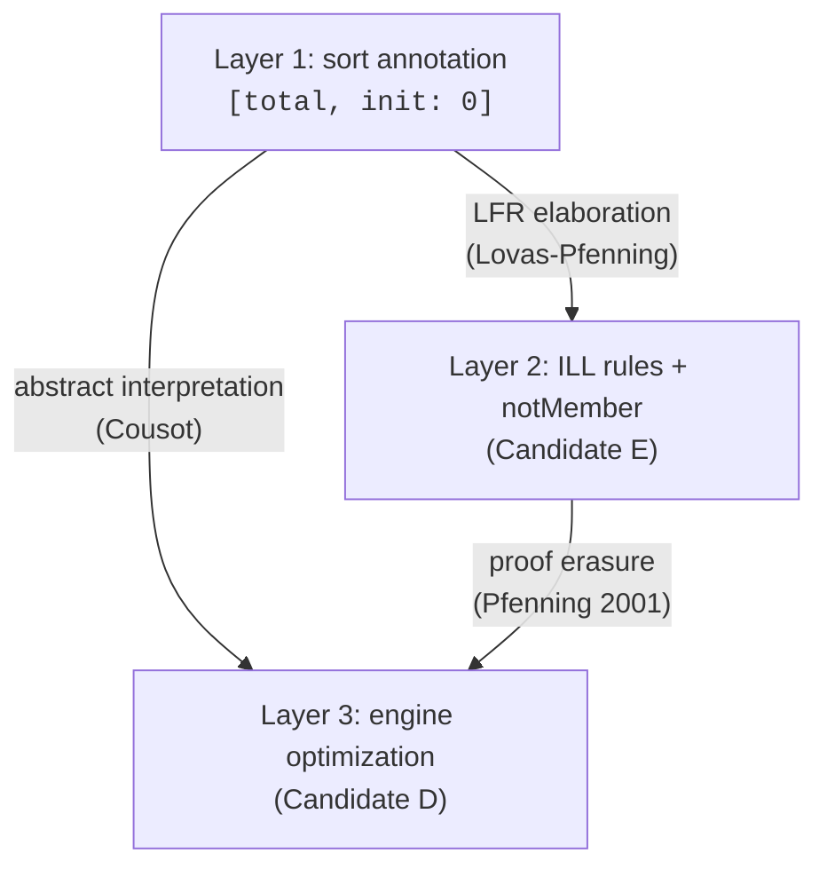

# Total Maps with Default Values in Linear Logic: Object-Level Solutions

## The Problem

In ILL forward chaining (multiset rewriting), storage is modelled as linear facts `storage(K, V)` — one per key. Read operations consume and re-produce the fact; writes consume and replace. The problem: **what if key K has no fact?** The EVM semantics says "return 0." But pure ILL has no notion of "absent key defaults to 0."

The current CALC solution is a meta-level hack: declare `[default: _ 0]` and lazily inject `storage(K, 0)` into the linear state when first accessed. This is operational, not logical — it lives outside the object logic.

We want a **clean, object-level solution**: a declaration internal to the logic itself that says "for any key K not in the store, the value is 0."

---

## Candidate Approaches

### 1. mu-MALL: Greatest Fixed Points and Coinductive Storage

**Source:** Baelde & Miller, *Least and Greatest Fixed Points in Linear Logic* (TOCL 2012). Extended by Heath & Miller, *A Proof Theory for Model Checking* (JAR 2019).

**Core idea:** mu-MALL extends MALL with least fixed point operators (µ) and greatest fixed point operators (ν). The ν operator is coinductive — its proofs may be infinite, and it represents structures that always have "more to give."

**Key insight from the Proof Theory Blog (2024):** `!A` (bang) can be encoded as `νX.(1 & A & (X ⊗ X))`, using the coinduction rule (νR). This shows that the exponential can be seen as a stream of available copies.

**Direct application:** Define storage as a greatest fixed point — a coinductive total map:

```
Map(K, V, Default) := νX. (lookup(K) ⊸ (storage(K, V) ⊗ X))
                    & (lookup(K) ⊸ (storage(K, Default) ⊗ X))
```

Or more practically: represent the infinite default-everywhere store as a coinductive stream indexed by keys:

```
DefaultStore := νX. ∀K. (storage(K, 0) & X)
```

The ν/coinduction rule (νR in Baelde's system) says: to prove `νB`, it suffices to find a coinvariant S such that `S ⊸ B[S/X]`. This allows "lazy unrolling" — proving that reading any key produces 0 by coinductive step, without ever materializing all values.

**Verdict:** Theoretically sound. Greatest fixed points genuinely represent infinite, always-available structures. The proof of a coinductive proposition is an infinite proof object (or a circular proof with a productivity check). The key question for forward chaining is **computational**: the νR rule requires finding a coinvariant, which is like supplying a loop invariant. In proof *search*, νL (left elimination of a coinductive hypothesis) unfolds one step at a time, which operationally corresponds to "look up from the infinite store, taking the current key's value."

**Problem:** Standard mu-MALL is a proof theory framework, not directly a rewriting engine. Encoding forward chaining inside nu requires circular proof search, which is complex. The ν type introduces proof obligations (productivity) absent from the current CALC engine.

---

### 2. Subexponentials (SELL): Weakening-Only Modality as "Optional Resources"

**Source:** Nigam & Miller, *Algorithmic Specifications in Linear Logic with Subexponentials* (PPDP 2009). Nigam, *On Subexponentials, Focusing and Modalities in Concurrent Systems* (TCS).

**Core idea:** SELL (Subexponential Linear Logic) adds a pre-ordered family of exponentials `!_i` (and `?_i`) where each index `i` may or may not allow contraction (C) and weakening (W). The subexponential signature is a tuple `⟨I, ≤, W, C⟩`.

**Affine subexponential:** An index `a ∈ I` with `a ∈ W, a ∉ C` gives `!_a A` the rule:
- **Weakening** (`!_a W`): `!_a A` can be dropped without use.
- **No contraction**: `!_a A` cannot be duplicated; it can be used *at most once*.
- **Dereliction** (`!_a D`): from `!_a A`, derive `A` (consuming the `!_a A`).

This is exactly the **affine modality**: resources available zero or one times.

**Direct application:** Wrap each default storage value in an affine subexponential:

```
!_a storage(K, 0)   -- for each key K
```

An affine-boxed default is: (a) available for dereliction (use once → becomes linear `storage(K,0)`); (b) discardable (weakening: if never accessed, silently dropped); (c) not duplicable (no contraction: cannot get two copies of the default).

This is **exactly the desired semantics**: inject infinitely many `!_a storage(K, 0)` for all keys, and by weakening the unused ones are automatically garbage-collected at the end of execution.

**Concretely:** The rewrite rule for "read storage K when absent":

```
!_a storage(K, 0) ⊸ (storage(K, 0) ⊗ storage_val(K, 0))
```

The dereliction of `!_a storage(K, 0)` fires, producing one linear `storage(K, 0)` plus the result. The remaining (unused) `!_a storage(K', 0)` for all other `K'` are weakened away at the end.

**Verdict:** This is the most **operationally practical** approach. The affine subexponential has direct proof rules, the forward chaining semantics is clear, and it maps neatly onto SELL's focused proof search. The "infinite injection" is handled lazily: in practice you only create `!_a storage(K, 0)` for the K actually queried, because SELL's proof search is demand-driven (backward chain to find the relevant `!_a` modality). The problem is representing "for all K" — this requires a first-order version of SELL (FELL?) or a schema declaration.

---

### 3. Adjoint Logic (Pruiksma & Pfenning, 2018): Mode-Stratified Defaults

**Source:** Pruiksma, Chargin, Pfenning & Reed, *Adjoint Logic* (2018, CMU Tech Report). Lecture notes by Pfenning (CMU 15-836, 2023).

**Core idea:** Adjoint logic unifies multiple logics with different structural properties through **modes**, each with a structural rule set `σ(m) ⊆ {W, C}`:

| Mode | W | C | Interpretation |
|------|---|---|----------------|
| L (Linear) | — | — | Exactly once |
| A (Affine) | ✓ | — | At most once |
| U (Unrestricted) | ✓ | ✓ | Any number of times |

Modal operators `↑_m^n` (up-shift from mode n to m) and `↓_m^n` (down-shift) let propositions move between modes. The preorder `m ⊑ n` means "m is at most as permissive as n."

**Direct application:** Declare default storage in affine mode A, real storage in linear mode L:

```
[mode A]  default_storage(K : key) : storage_cell(K, 0)   -- for all K
[mode L]  storage(K, V) : storage_cell(K, V)              -- one per K
```

A "read with default" rule operates in linear mode but can shift down to affine mode to obtain the default:

```
read_default(K) : ↓_A^L storage_cell(K, 0) ⊸ storage_cell(K, 0) ⊗ val(K, 0)
```

The `↓_A^L` down-shift from affine A to linear L means: "extract one linear use of the affine default." Because A has weakening, unused defaults vanish. Because A lacks contraction, only one copy per key can be extracted.

**Verdict:** Clean and principled. Adjoint logic is already identified as subsuming both LNL and SELL (Pruiksma et al. note: "Linear logic, affine logic, strict logic, normal judgmental S4, lax logic, LNL, and normal intuitionistic subexponential linear logic can all be directly embedded in adjoint logic"). The mode-based reading gives a genuine object-level account. Implementation requires multi-mode proof search, which is more complex than single-mode ILL.

---

### 4. Bunched Implications (BI): Additive Context for Defaults

**Source:** O'Hearn & Pym, *The Logic of Bunched Implications* (BSL 1999). Reynolds, *Separation Logic* (LICS 2002).

**Core idea:** BI has *two* conjunctions with equal logical status:
- **Multiplicative (separating) conjunction** `A * B`: contexts split (linear-like, resource-sensitive)
- **Additive (sharing) conjunction** `A ∧ B`: contexts shared (intuitionistic-like, allows weakening + contraction)

Contexts in BI are *bunches* — trees with nodes labeled by either `;` (additive, shareable) or `,` (multiplicative, separating).

**Direct application:** Place default storage values in the *additive* (intuitionistic) zone of the context, and actual storage values in the *multiplicative* (linear) zone:

```
Γ_add ; Δ_lin ⊢ P
```

Where `Γ_add` contains `∀K. storage_default(K, 0)` (weakening + contraction available) and `Δ_lin` contains the actual `storage(K, V)` facts (consumed linearly).

A read rule first checks `Δ_lin` for `storage(K, _)` (multiplicative); if absent, falls back to `Γ_add` for `storage_default(K, 0)` (additive). Writes go to `Δ_lin`.

**Verdict:** BI already underpins separation logic, which has been used to reason about heap-like structures. The two-zone context is natural and well-studied. The "default context" is genuinely object-level: it's a standard additive hypothesis. The difficulty is that BI's forward chaining semantics has not been developed to the degree that ILL's has — existing tools (Ceptre, CLF, etc.) work in ILL, not BI.

---

### 5. LNL (Benton's Linear/Non-Linear Adjunction): Cartesian Defaults Projected into Linear World

**Source:** Benton, *A Mixed Linear and Non-Linear Logic: Proofs, Terms and Models* (CSL 1994). nLab: *linear-nonlinear logic*.

**Core idea:** LNL decomposes `!A` into an adjunction `F ⊣ G` between:
- `C`: a *cartesian* category (full weakening + contraction; models intuitionistic logic)
- `L`: a *symmetric monoidal closed* category (no structural rules; models linear logic)

`F : C → L` sends a cartesian type to a linear type, with `FA` carrying exactly the structural rules needed. The unit `η : Id → GF` and counit `ε : FG → Id` mediate between worlds.

**Direct application:** The default storage total function `f : Key → Val` lives in `C` (cartesian world — total, freely copyable). Project it into `L` via `F`:

```
F(default_store) : L
```

In `L`, `F(default_store)` has the structural rules inherited from `C` via `F` (specifically, `F(A)` is isomorphic to `!A` in standard presentations). The proof rule:

```
Dereliction: F(A) ⊢_L A    (consume one copy)
Weakening:   Γ ⊢_L P  →  Γ, F(A) ⊢_L P  (discard unused)
```

The total default function is `F(λK. 0)` — a cartesian function projected into linear context. Each access consumes one copy; projection from `C` can only produce a new copy if you explicitly ask (this is the `!` promotion rule).

**Verdict:** LNL makes the `!` modality a derived construct from an underlying adjunction. In terms of object-level cleanliness, this is arguably the most foundational approach: the cartesian world genuinely houses "total, freely available" data, and the adjunction functor `F` is the principled mechanism for bringing it into the linear world. Implementation in CALC would require extending the engine to handle two contexts (linear + cartesian) and the `F`/`G` shift operators.

---

### 6. The Additive "With" Connective (&): Lazy Default Choice

**Source:** Girard, *Linear Logic* (TCS 1987). Andreoli, *Logic Programming with Focusing Proofs in Linear Logic* (JLC 1992).

**Core idea:** `A & B` ("with") is the additive conjunction: the proof system provides both `A` and `B`, but the environment *chooses* which to use — only one branch is ever exploited.

**Application attempt:** Consider `∀K. (storage(K, 0) & 1)`:

- The `storage(K, 0)` branch: use this default value (consume it).
- The `1` branch (unit): discard it without producing any storage fact.

This says: "For each key K, you may either take the default storage(K,0), or discard this offer entirely."

**More directly:** In a backward-chaining proof goal `storage(K, ?V)`:
- If there exists `storage(K, V)` in the linear context: use it (multiplicative)
- Otherwise: unfold `∀K. (storage(K, 0) & 1)`, choosing the left branch to get `storage(K, 0)`

In forward chaining with the lollimon-style rules: add a persistent (unrestricted) axiom:

```
∀K V. storage_or_default(K, V) ⊸ (storage(K, V) & storage_result(K, 0))
```

**Verdict:** The `&` connective's semantics does provide "choose one branch" behavior, but it doesn't directly solve the forward chaining problem because `&` is a *choice offered by the prover to the environment*, not a conditional check. In backward proof search, the focused proof system handles `&R` by splitting goals — this doesn't help forward chaining. More importantly, `∀K. (storage(K,0) & 1)` requires the `∀K` to range over an infinite domain (all possible keys), which creates the same infinite-injection problem as the meta-level hack. The & approach is more useful in a backward-chaining context, not forward.

---

### 7. Graded Modal Types (Granule / QTT): Semiring-Based Optional Resources

**Source:** Orchard & Liepelt, *Quantitative Program Reasoning with Graded Modal Types* (ICFP 2019). Brady, *Idris 2: Quantitative Type Theory in Practice* (ECOOP 2021). Vollmer et al., *A Mixed Linear and Graded Logic: Proofs, Terms, and Models* (CSL 2025, arXiv 2024).

**Core idea:** In Quantitative Type Theory (QTT) and graded type systems, variables carry **usage grades** drawn from a semiring `(R, +, ×, 0, 1)`. The zero-one-many semiring `{0, 1, ω}` (used in Idris 2) distinguishes:

- Grade `0`: erased at runtime (irrelevant); can be weakened freely
- Grade `1`: used exactly once (linear)
- Grade `ω`: used any number of times (unrestricted)

The **interval semiring** `[0..1]` (or more generally `{0, 1}` under addition saturating at 1) directly captures "zero or one" usage — precisely affine behavior.

In the mixed linear/graded logic (mGL) of Vollmer et al., sequents have the form:

```
δ ⊙ ∆ ; Γ ⊢ A
```

where `δ` is a grade vector, `∆` is a graded context, and `Γ` is a linear context. **Weakening** is via the zero grade: `[0]A` can be discarded. **Contraction** is via semiring addition: `[r]A, [s]A` combine to `[r+s]A`.

**Direct application:** Declare defaults with grade `[0..1]` (interval semiring, or equivalently grade 0 in the 0-1-ω semiring with the interpretation "0 means present but unused"):

```
∀K : Key. [0..1] storage(K, 0)
```

This typing says: each default `storage(K, 0)` may be used zero or one times. On any execution path:
- If K is accessed and has no explicit `storage(K, V)` fact, consume the grade-1 use of `[0..1] storage(K, 0)`.
- If K is never accessed, the grade-0 case applies (free weakening).
- The grade can never become 2+ (no contraction under the `[0..1]` semiring).

**Verdict:** QTT-style graded types give the cleanest type-theoretic account. The Vollmer et al. (2025) paper directly provides the mixed linear+graded calculus. However, like adjoint logic, this requires a richer calculus than plain ILL. The semiring grade on the default hypothesis replaces the meta-level annotation with a type-level annotation — arguably the most principled type-theoretic approach available.

---

### 8. Polarized Linear Logic: Negative Types as Lazy Demand

**Source:** Girard, *On the Unity of Logic* (1993). Laurent, *Polarized Linear Logic* (2002).

**Core idea:** In polarized linear logic (LLP), formulas are either **positive** (synchronous, eager) or **negative** (asynchronous, lazy). Negative connectives (`&`, `⊤`, `⅋`, `?`, `⊸`) are invertible — their right rules decompose immediately, without choices. Positive connectives (`⊗`, `⊕`, `1`, `0`, `!`) require synchronous focusing.

**Application:** Represent the default storage as a **negative** (lazy) type. A negative formula `storage_neg(K, 0)` does not materialize until demanded — its introduction rule is invertible (always applicable without committing), and the proof engine "unfolds" it lazily when the goal requires `storage(_, _)`.

In focusing proofs: a negative formula in the context is *always available* to be unfolded. A positive literal `storage(K, V)` is consumed. So:

- Active `storage(K, V)`: positive, synchronous, consumed on use
- Default `storage_neg(K, 0)`: negative, asynchronous, always present but lazy

The key property: negative formulas in the context sit in the "stable zone" — they're never consumed and can be unfolded as many times as needed. This is exactly `?A` (why-not) or `!A` (of-course) semantics.

**Verdict:** Polarized linear logic doesn't add the structural rules we need — `?A` (negative exponential) still allows unbounded contraction. What we want is "use at most once but lazily." Negative polarity alone doesn't solve the default problem; it clarifies the proof-search dynamics, but the fundamental issue of at-most-once use requires additional structure (grading or subexponentials). Polarization is relevant for the *implementation* of any of the above approaches within the CALC focused proof search.

---

### 9. The "Why Not" (?) Modality: Duality to Bang

In classical linear logic, `?A` (why-not) is the de Morgan dual of `!A`. Where `!A` admits promotion (Γ, !A ⊢ B ↔ Γ ⊢ B with contraction+weakening for B), `?A` admits similar structural rules on the left. In ILL (without classical negation), `?A` is less studied.

**Key property:** `?A` admits weakening and contraction just like `!A`. It does *not* give us at-most-once semantics. `?A` is not what we want for defaults: `?A` is "I have infinitely many A", not "I have zero or one A".

**Verdict:** Not directly useful for the default problem. The dual `?` does not provide the "at most once" constraint.

---

### 10. Separation Logic (magic wand): Conditional Default via —*

**Source:** Reynolds, *Separation Logic* (LICS 2002). O'Hearn, *Separation Logic* (CACM 2019).

**Core idea:** The magic wand `P —* Q` ("if you give me P, I will give you Q, consuming P"). In separation logic over a *partial heap*, if key K is absent, `storage(K, ?)` is simply undefined — no value exists.

The "total heap" approach makes heaps total functions from addresses to values (possibly with a distinguished "uninitialized" value). Yang's work shows that total vs partial heap semantics are isomorphic up to explicit initialization tracking.

**Application attempt:** Define a total storage proposition:

```
TotalStorage := ∀K. (storage(K, ?) -* storage_answer(K))
```

Where `storage_answer(K)` resolves to `V` if `storage(K,V)` is present, or `0` if absent. The problem: the magic wand `P -* Q` in separation logic has *decidability issues* (Brotherston et al. show it quickly leads to undecidability). Furthermore, `—*` in linear logic is just `⊸` — the linear implication. So `storage(K, ?) —* storage_answer(K)` is just a loli/rule, not a default specification.

**Verdict:** Separation logic over total heaps handles the "default value" case by having all keys present (with a sentinel for "uninitialized"). This is isomorphic to the meta-level injection hack: you pre-populate the "heap" with zeros. No fundamental gain. The magic wand does not help because it's just implication, not a conditional presence check.

---

### 11. First-Order Quantification + Bang: The `!∀K. storage(K, 0)` Approach

In plain ILL with first-order quantifiers, the cleanest internal declaration is:

```
!∀K : Key. (storage(K, 0) & 1)
```

Or equivalently as a persistent (unrestricted) rule schema:

```
Γ, !∀K. storage(K, 0) ⊢_ILL P
```

The `!∀K` says: for any key K, a `storage(K, 0)` fact is always available (contraction) and discardable (weakening). However, this has a **double-use problem**: `!` with contraction allows extracting *multiple* copies of `storage(K, 0)` for the same K, leading to multiplicities > 1 which break the single-copy invariant of storage facts.

To fix this: `storage(K, 0) & 1` (additive with unit) means "use it or discard it" — but still allows contraction via `!` to get multiple copies of `(storage(K,0) & 1)`.

The only way to prevent duplication while allowing discarding in pure ILL is to combine `!` with the `& 1` form *and* add a side condition (meta-level again) that each key's default is used at most once — or move to a richer calculus.

**Verdict:** This approach fails in pure ILL because `!` provides both weakening *and* contraction. To get weakening-only, you need affine subexponentials (approach 2), adjoint logic (approach 3), or graded modalities (approach 7).

---

### 12. Dependent Linear Types + Irrelevance

**Source:** McBride, *Idris 2: Quantitative Type Theory in Practice*. Atkey, *Syntax and Semantics of Quantitative Type Theory* (LICS 2018). Wood & Atkey, *A Linear Algebra Approach to Linear Metatheory* (2022).

**Core idea:** In dependent type theories with usage grades (QTT), a grade-0 variable is computationally *irrelevant* — present in the type but erased from terms. In a dependent linear type system:

```
(K : Key)[0] → storage(K, 0)   -- the K is irrelevant at grade 0
```

"Irrelevance" here means: the *index* K is not used to compute a term, it's only used for typing. An irrelevant hypothesis can be freely weakened (never consumed) or specialized (instantiated).

**For defaults:** If the default `storage(K, 0)` has its key K at grade 0 (irrelevant), then: (a) the fact can be weakened (K is not actually used to run code, only to type the fact); (b) the fact itself still needs a usage grade. Grade `[1]storage(K, 0)` with grade-0 index K would mean "use this storage fact exactly once, but the key K is erased." This doesn't quite capture "for all keys, use at most once."

**Verdict:** Dependent irrelevance applies to *indices* (keys), not to the facts themselves. It doesn't directly solve the at-most-once problem for individual key slots. Combined with the interval semiring (approach 7), it could express "for all keys K (irrelevantly indexed), a `[0..1]`-graded `storage(K, 0)` fact".

---

## Synthesis and Ranking

The following ranks the candidates by (a) theoretical cleanliness, (b) proximity to CALC's existing architecture, (c) practicality for forward-chaining multiset rewriting:

| Approach | Theory | Object-Level? | Practical for FC? | Notes |
|---|---|---|---|---|
| **Affine subexponentials (SELL)** | SELL | ✓ | Best | Weakening-only `!_a`: directly encodable in focused proof search. Most practical extension. |
| **Adjoint logic (modes)** | Adjoint Logic | ✓ | Good | Subsumes SELL; affine mode is the right level. Multi-mode engine needed. |
| **Graded types ([0..1] semiring)** | mGL / QTT | ✓ | Good | Cleanest type-theoretic formulation; needs semiring-aware engine. |
| **LNL adjunction** | LNL | ✓ | Moderate | `F(default)` is principled; needs two-context engine. |
| **BI logic (additive context)** | BI | ✓ | Moderate | Two-zone context; semantically natural but BI engine unavailable. |
| **mu-MALL (ν fixed points)** | mu-MALL | ✓ | Hard | Correct but needs circular/coinductive proof search. |
| **& additive choice** | ILL | ✓ | Partial | Works backward, not forward; `∀K` over infinite domain is problematic. |
| **Polarized LL (negative types)** | PLL | ✓ | Auxiliary | Clarifies dynamics but doesn't add structural rules. |
| **? why-not modality** | CLL | ✗ | No | Contraction + weakening — too strong. |
| **Dependent irrelevance** | QTT | Partial | Auxiliary | Handles key indices but not value slots. |
| **Separation logic —*** | SL | Partial | No | Isomorphic to meta-level injection. |
| **Pure ILL `!∀K`** | ILL | ✗ | No | Contraction breaks single-copy invariant. |

---

## The Cleanest Object-Level Solution

**Candidate E (initializedStorage + constructive notMember)** is the first fully object-level ILL solution found across four rounds of research. Unlike the SELL affine approach (Candidate B) which requires a modality outside standard ILL, E works within pure ILL using positive tracking and constructive disequality.

The affine subexponential (B) remains the cleanest solution *if you extend the logic* — `!_aff` with weakening-only gives exactly the right structural rules. But B has an unsolved quantifier problem for infinite domains and requires SELL machinery. E sidesteps this by not requiring any logic extension.

**Candidate D (sort-directed elaboration)** is the natural engine optimization of E — it implements the same semantics by observing `dom(Γ_storage)` directly instead of running `notMember` backward clauses. The relationship: E is theory, D is implementation, following CALC's "FFI is optimization, theory is semantics" principle at the sort-discipline level.

---

## Round 2: Dependent Linear Types, CLL Negation, Infinite Products

Second literature survey (30+ papers) covering angles not explored in round 1.

### 13. Classical Linear Logic Negation (A⊥)

**Source:** Girard, *Linear Logic* (TCS 1987). Paykin & Zdancewic, *A Linear/Producer/Consumer Model of Classical Linear Logic* (2015).

CLL has involutive negation `A⊥` with De Morgan dualities. The question: can `storage(K,V)⊥` express "absence of storage(K,V)"?

**Answer: No.** `A⊥` is the *dual demand* — "a hole that `A` fills." Having both `A` and `A⊥` annihilates to `1` (producer/consumer interaction). `storage(K,V)⊥` means "I need a storage(K,V)", not "storage(K,V) is absent." This is a communication channel model, not a default-value mechanism.

### 14. Differential Linear Logic Co-Weakening

**Source:** Ehrhard, *An Introduction to Differential Linear Logic* (MSCS 2018). Ehrhard & Regnier, *Differential Interaction Nets* (TCS 2006).

DiLL adds dual rules to exponentials: co-weakening `⊢ !A` (produce `!A` from nothing), co-dereliction `A ⊢ !A` (promote single copy). Co-weakening literally produces a resource from the empty context — the "zeroth-order approximation" in the Taylor expansion interpretation.

**Application attempt:** `co-weakening_a: ⊢ !_a storage(K, 0)` — produce an affine default from nothing. Combined with SELL's `!_a`, this could justify where the default resource "comes from."

**Verdict:** Re-derives Candidate B (SELL affine) with a different justification for the resource's origin. The co-weakening says WHY the default exists (it's the zero/empty approximation), but the quantifier problem remains identical.

### 15. Dependent Linear Types — The Literature Landscape

Comprehensive survey of dependent linear type theory:

- **LLF (Cervesato & Pfenning, 1996/2002):** Dependent Π + linear ⊸. Foundation for combining dependent types with linear resources. Linear context remains finite in any derivation. No infinite families.
- **Krishnaswami, Pradic & Benton (POPL 2015):** Dependent LNL. Can write `(k : Key) → linear(store(k))` — one resource per key when instantiated. But this is a function type (sequential access), not a simultaneously-held collection.
- **Vákár (arXiv:1405.0033, 2014):** Full linear dependent types. Introduces **multiplicative dependent quantifiers** Π⁺/Σ⁺. `Π⁺_{k:Key} B(k)` is a linear product — one resource of type `B(k)` for every `k` simultaneously. Categorical semantics via indexed symmetric monoidal categories with comprehension. **Closest to the target**: the multiplicative Π-type is the type-theoretic reading of "one linear resource per element of Key."
- **Atkey (QTT, LICS 2018):** Semiring multiplicities on bindings. `f : (k :_ω Key) →_1 Store(k)` — per-call linearity, not spatial family.
- **Furuseth & Rios (LICS 2020):** Fibration model for quantum linear families. Per-circuit-per-parameter linearity.
- **Doré (ICFP 2025):** Dependent multiplicities via Dialectica embedding. The most advanced work — finite n keys with n linear resources. Implemented in Agda. Does not extend to infinite domains without coinduction.

**Key insight from Vákár:** `Π⁺_{k:Key} storage(k, 0)` is exactly the type of "one linear storage fact per key, for all keys simultaneously." For finite Key, this is a standard multiplicative product. For infinite Key (like 2^256), it becomes an **infinite multiplicative product** — `⊗_{k ∈ 2^256} storage(k, 0)`. This is well-defined in categorical semantics (Day convolution in the presheaf model) but not finitely representable as a formula.

### 16. Iris Resource Algebras (Total Map RA)

**Source:** Jung et al., *Iris from the Ground Up* (JFP 2018).

Iris uses Cameras (CMRAs) for ghost state. The `gmap_view` CMRA represents partial maps — absent keys have no fragments, no default. A total-map RA over `K → V` with default 0 is possible as a custom algebra but is not a standard Iris primitive. No paper was found implementing this specific construction.

### 17. Game Semantics

**Source:** Abramsky & Jagadeesan, *Games and Full Completeness for MLL* (JSL 1994). Abramsky, Honda & McCusker, *A Fully Abstract Game Semantics for General References* (LICS 1998).

Game semantics for mutable state models read/write as strategy interactions. Each cell is a separate game component. No default-value mechanism — strategies respond to moves, they don't provide absent-key defaults.

### 18. Bounded Linear Logic (Graded Exponentials)

**Source:** Girard, Scedrov & Scott, *Bounded Linear Logic* (TCS 1992).

Grades `!` with numeric bounds: `!_n A` = use A at most n times. The indices are usage counts per formula, not per-element-of-a-domain. Does not address indexed resource families.

---

## The Total Map / Partial Map Distinction

A key reframing emerged from the second survey:

**EVM storage = total map** `2^256 → uint256` — every key has a value (0 by default). Linear logic facts model **partial maps** — `storage(K, V)` entries for allocated keys; absent keys undefined.

Every EVM implementation stores a partial map (trie, hashmap) with implicit default 0. The "totality" is specification-level; "partiality + default" is computation-level. The question is: what proof-theoretic object justifies this representation?

### Candidate C: Infinite Multiplicative Product + Lazy Evaluation

The EVM initial storage, expressed in linear logic via Vákár's multiplicative Π:

```
S₀ = Π⁺_{k ∈ 2^256} storage(k, 0) ≡ ⊗_{k ∈ 2^256} storage(k, 0)
```

Each factor is an independent linear resource. SLOAD consumes and re-produces. SSTORE replaces. The product is commutative (factors independent).

**Lazy evaluation:** The engine holds a finite prefix (materialized entries). When key `k` is accessed and absent from Γ, one factor unfolds:

```
S₀ = storage(k, 0) ⊗ S₀\{k}
```

The invariant: `materialized(Γ) ⊗ unmaterialized(S₀ \ dom(Γ)) = S₀`.

**Why this is sound:**
1. Factors are independent and commutative — unfolding order irrelevant
2. Each factor unfolds exactly once — linearity prevents double extraction (fact now in Γ)
3. SSTORE replaces the factor's value — factor count invariant
4. Backtracking (explore): materialization recorded in Arena undo log

**Comparison to other candidates:**
- vs Candidate B (SELL affine): No new modality. No `!_a`. No third context. Standard linear logic, just infinite initial context with lazy evaluation.
- vs Candidate A (structural write-log): Flat facts (O(unique keys), no history bloat). Same operational behavior as B but cleaner theory.
- The `[total, init: 0]` declaration is finitary notation for the infinite product — the same pattern as axiom schemas in first-order logic.

**Categorical grounding:** The infinite tensor `⊗_{k ∈ K} A(k)` is well-defined as:
- Day convolution product in the presheaf model over the resource monoid
- Inverse limit in Chu spaces
- Product of denotations in commutative monoid models

**Evolution problem (fatal flaw):** S₀ cannot express its own evolution. After extracting key 42, the residual `S₁ = ⊗_{k ∈ K\{42}} storage(k, 0)` is a set-indexed family requiring dependent coinductive types `ν X(S). ∀K. (K ∉ S) → (storage(K, 0) ⊗ X(S ∪ {K}))` — already rejected. Good semantic description, not a proof-theoretic object. **Superseded by Candidate D.**

---

## Round 3: Refinement Types, Sort-Directed Elaboration

Third survey (20+ papers) focused on whether refinement types can express context invariants for linear logic.

### The gap in the literature

Lovas & Pfenning (LMCS 2010) define sort refinements for LF (intuitionistic logical framework) — datasort classifications with associated elaboration. This has NOT been extended to the linear setting (LLF/CLF). Simmons (CMU 2012) defines generative invariants for SLS (linear forward chaining) — structural properties preserved by transitions — but cannot express absence-dependent defaults. No existing refinement type system allows the refinement predicate to inspect the linear context.

### Key papers surveyed

- **Lovas & Pfenning (LMCS 2010):** Sort refinements for LF. Datasort classifications, bidirectional sort checking, proof irrelevance interpretation. NOT extended to LLF/CLF.
- **Simmons (CMU thesis 2012):** Generative invariants for SLS. Can express shape properties ("at most one storage(k,_) per key"). CANNOT express "if absent, value is 0."
- **Das & Pfenning (Rast, CONCUR 2020):** Arithmetic refinements on linear session types. Index layer is pure/persistent, separate from linear layer. Architecture relevant.
- **CN (Pulte et al., POPL 2023):** Separation-logic refinement types for C. Iterated separating conjunction `∀k. k ↦ v(k)` for heap map totality. Closest to expressing the invariant but for verification, not execution.
- **Vazou et al. (ESOP 2013):** Abstract refinement types. `Map<λk v. p(k,v)>` for functional maps.
- **Baltazar et al. (LINEARITY 2012):** Linearly refined session types. Refinements as MLL resources — most direct combination of refinements with linearity.
- **Toninho, Caires, Pfenning (PPDP 2011):** Dependent session types via intuitionistic linear type theory.
- **Nanevski, Pfenning, Pientka (TOCL 2008):** Contextual modal type theory. Internalizes open terms with contexts.
- **Schack-Nielsen & Schürmann (2011):** Linear contextual modal type theory. Extends CMTT to handle linear hypotheses.
- **Aberlé (arXiv 2024):** Foundations of substructural dependent type theory via monoidal fibrations.

### Candidate D: Sort-directed elaboration — PREFERRED

**Core insight:** The "Used" set that Candidates B and C struggle to track IS ALREADY the linear context `dom(Γ_storage)`. No phantom state needed — the context itself is the tracker.

**Mechanism:** The declaration `storage: bin -> bin -> type [total, init: 0]` is a SORT ANNOTATION — it classifies the predicate as a total map. When pattern matching for `storage(k, V)` fails and k is ground, the failure constitutes a sort-level observation: "k is absent from dom(Γ_storage)." The sort discipline triggers elaboration: inject `storage(k, 0)` into Γ.

**Why this is NOT negation-as-failure:** NAF is an object-level deduction ("couldn't prove P, therefore ¬P" — unsound in ILL). Sort-directed elaboration is a meta-level sort discipline (like focusing's context inspection or Twelf's mode checking). The failed match is structural context analysis, not logical reasoning.

**The evolution is clean:**
- SLOAD 42 → miss → elaborate storage(42,0) → dom = {42}
- SSTORE 42 1 → dom = {42}
- SLOAD 7 → miss → elaborate storage(7,0) → dom = {42, 7}
- SLOAD 42 → hit (v=1) → no elaboration

Double-materialization prevention is FREE: once storage(42,_) exists in Γ, the sort check "42 ∉ dom(Γ_storage)" fails automatically. No separate tracking needed.

**Positioning:** D extends Lovas-style sort refinements from intuitionistic LF to the linear setting — a novel contribution filling an identified gap. Soundness is a generative invariant (Simmons-style): "for all reachable states, the totality+default property holds." Architecture follows Rast (Das & Pfenning): persistent sort/index layer governing linear-layer behavior.

**D supersedes C.** Same engine implementation, but D has clean evolution semantics (no residual tracking) and principled meta-theoretical positioning.

---

## Round 4: Object-Level Solution via Positive Tracking

Fourth survey round, motivated by the observation that no impossibility proof exists for per-element linearity over infinite domains — the gap in the literature is an open problem, not a proven limitation.

### Candidate E: initializedStorage + constructive notMember — LEADING

**Core idea:** Track initialized keys positively via an `initializedStorage` linear fact containing a list of keys already materialized. Absence checking uses constructive `notMember` backward clauses — NO negation-as-failure, NO meta-level mechanisms. 100% object-level ILL.

**Two rules per storage-accessing opcode:**

```
% SLOAD: key already has a storage fact
evm/sload:
  ... storage KEY V ...
  -o { ... storage KEY V ... }.

% SLOAD: key not yet initialized — default to 0
evm/sload_init:
  ... initializedStorage ISET * !notMember KEY ISET ...
  -o { ... storage KEY 0 * initializedStorage (cons KEY ISET) ... }.
```

**Constructive notMember (backward clauses):**

```
notMember/base: notMember K ae.
notMember/step: notMember K (cons H T) <- neq K H <- notMember K T.
```

Pure structural recursion with disequality. `notMember K ISET` succeeds constructively iff K is not in ISET. This is NOT negation-as-failure — it's a positive proof that K differs from every element.

**Mutual exclusivity by invariant:** `storage(K, V) ∈ Γ ⟺ K ∈ ISET`. The two rules cannot fire simultaneously for the same key.

**Performance:** O(|ISET|) via backward clauses. O(1) via FFI hash-set cache (incrementally updated, only grows). Follows CALC's FFI principle.

**The two-layer architecture (E + D):**
- **E** = object-level theory (what the logic says)
- **D** = engine optimization (how the engine implements it efficiently)

D's sort-directed elaboration can observe `dom(Γ_storage)` directly, skipping `notMember` resolution. This is the FFI principle at a higher level — the sort discipline optimizes the object-level theory.

### Comparison: Sort-Directed Elaboration (D) vs Ceptre's `qui`

Ceptre's `qui` predicate (Martens 2015) is a runtime-injected token when no stage rules fire. Martens acknowledges: "pure linear logic programming cannot express" this. Key distinction:

- **`qui` is non-conservative**: Programs that diverge without `qui` terminate with it. It changes derivability.
- **Sort-directed elaboration is conservative**: Pre-populating all keys gives identical derivations. The mechanism avoids materializing them eagerly, but doesn't change what's derivable.

The test: "if you pre-populated everything, would you still need the mechanism?" No for D, Yes for `qui`.

### Candidate F: Structural storage trie — REJECTED

Single `storageRoot TRIE` linear fact with binary trie nodes (`snode`, `sval`, `sempty`). Default from base case `storage_read sempty _ 0`. ONE rule per opcode — eliminates E's two-rule duplication.

With FFI, reads are O(1) (JS Map cache). Writes need O(depth) Store.put calls for path rebuild, but with Patricia path compression, depth ≈ O(log(unique_keys)) — negligible.

**Fatal flaw: kills symbolic execution.** `to_bits KEY BITS` requires KEY to be ground — symbolic keys (unbound metavars) have no bits to walk. Flat `storage(KEY, V)` facts handle symbolic keys naturally via unification — the FactSet matches any key against the metavar. A structural trie cannot do this. Since CALC's core value proposition is symbolic exploration, F is rejected.

This establishes a fundamental architectural insight: **flat facts are required for symbolic execution.** The FactSet's sorted Int32Array structure with fingerprint indexing is not just a performance optimization — it's the only representation that supports both concrete key lookup AND symbolic key unification.

### Oplus unification — proven impossible

Can the two rules in Candidate E be merged using additive disjunction (oplus)? No — the two rules consume DIFFERENT linear resources on the LHS: `storage KEY V` (existing key) vs `initializedStorage ISET` (new key). Oplus branches the output (RHS), not the input (LHS). Expressing "consume A or consume B" in a single ILL rule would require additive disjunction on the left (`A & B ⊢ C`), which is a different connective with different proof-search behavior. The two-rule pattern is inherent to having different consumption patterns.

### Three-layer cake architecture

The two-rules-per-opcode duplication is resolved by separating syntax from theory:

1. **Surface syntax**: `storage [total, init: 0]` + one rule per opcode
2. **Object theory (E)**: two rules auto-generated by compiler desugaring
3. **Engine optimization (D)**: sort-directed elaboration bypasses `notMember`

User writes clean rules, compiler generates sound theory, engine runs it fast. See Round 6 below for theoretical foundations.

### Open Problem: No Impossibility Proof

The claim "no finitary logic can express per-element linearity over infinite domains" is an observation about known systems, NOT a proven impossibility. No negative result exists showing this CANNOT be done at the object level. Candidate E demonstrates that with the right encoding (positive tracking + constructive disequality), significant progress is possible within standard ILL.

---

## Round 6: Three-Layer Cake — Theoretical Foundations

Sixth survey round. The three-layer architecture (surface annotation → object theory → engine optimization) turns out to connect to seven distinct bodies of work. Each is explained from first principles below, with CALC-specific examples showing the connection. 120+ searches across all areas; ~40 papers fetched and analyzed.

### The Expressiveness Gap Is Formally Real

**Background: Petri nets and linear logic.** A Petri net is a graph with *places* (circles holding tokens) and *transitions* (bars that fire when input places have enough tokens). Every ILL forward-chaining program is a Petri net: facts are tokens, rules are transitions. Kanovich (1994) proved this correspondence exactly: propositional MELL (the multiplicative-exponential fragment) has the same computational power as Petri nets.

**What an inhibitor arc is.** A normal Petri net transition fires when tokens ARE present. An *inhibitor arc* is a special arrow that fires when a place is EMPTY — it tests for absence. Standard example: "if the counter has zero tokens, do X." Petri nets with inhibitor arcs are Turing-complete (can compute anything). Standard Petri nets without them are strictly weaker.

**What this means for CALC.** Our SLOAD default rule says: "if `storage(KEY, _)` is NOT in the context, return 0." This is literally an inhibitor arc — a rule that fires on absence. Kanovich's result says: **ILL cannot express inhibitor arcs natively**. There is no formula in ILL that means "A is not in the context." The expressiveness gap is not a limitation of our encoding — it's a proven property of the logic.

**CALC example:**

```
% This is an inhibitor arc — cannot be one ILL rule:
evm/sload_init:
  ... !notMember KEY ISET ...    ← the absence test
  -o { ... storage KEY 0 ... }.
```

Layer 2's constructive `notMember` encodes the inhibitor arc as a positive proof: instead of "KEY absent from context" (impossible in ILL), we prove "KEY differs from every element in ISET" (possible in ILL). Layer 3 then restores the intended inhibitor-arc behavior operationally — the engine checks absence directly.

### The Commuting Triangle

The three layers are connected by three independently studied transformations that form a commuting triangle — this specific diagram does not appear in any paper:



Each edge is a well-studied transformation from the literature. The triangle commutes: going L1→L2→L3 produces the same result as going L1→L3 directly. The subsections below explain each edge.

### 1. Proof Irrelevance — Why the notMember Proof Can Be Erased

**The concept in plain terms.** Sometimes you need to prove something is true, but you don't care *how* you proved it. If I ask "is 7 prime?" the answer is yes, and it doesn't matter whether you checked by trial division or by looking it up — the proof method contributes nothing to the answer. That's *proof irrelevance*: the proof exists for validation, but its content is computationally meaningless.

**Pfenning (LICS 2001)** formalized this as a modal type theory where terms can be marked *irrelevant*. An irrelevant term can be type-checked (its existence is verified) but erased from the compiled program. The key rule: you cannot use an irrelevant assumption to produce a relevant computation. This makes erasure safe — if nothing depends on the proof's content, deleting it changes nothing.

**Lovas & Pfenning (LMCS 2010)** proved that LF *sort refinements* — annotations that further classify types into sorts — are exactly proof-irrelevant predicates. The sort annotation says "this term satisfies property P"; the elaborator generates a proof witness; but the witness is squashed (made irrelevant) because the sort itself guarantees the property. Their theorem:

> "A term `t` inhabits sort `s` if and only if there exists a core LF proof of the refinement predicate — and that proof is irrelevant."

**CALC connection.** Our `notMember KEY ISET` proof is in exactly this irrelevant position:

```
% Layer 2: the proof exists and is checked
evm/sload_init:
  ... !notMember KEY ISET ...    ← proof witness (irrelevant)
  -o { ... storage KEY 0 ... }.  ← conclusion (relevant)
```

The `notMember` proof justifies firing the rule, but it contributes nothing to the conclusion — the output is `storage KEY 0` regardless of *how* notMember was proved. The proof could be a 1-step check (KEY ≠ only element) or a 100-step recursion (KEY ≠ each of 100 elements) — same output either way.

Layer 3 erases this proof. The engine directly checks whether `storage(KEY, _)` exists in the FactSet — an O(1) fingerprint lookup. This is Lovas-Pfenning erasure: the sort annotation `[total, init: 0]` guarantees the invariant (every key is either in storage or defaults to 0), so the engine doesn't need the proof object.

**The full path mirrors Lovas-Pfenning exactly:**

| Lovas-Pfenning | CALC three-layer cake |
|---|---|
| Surface: term with sort annotation | Layer 1: rule with `[total, init: 0]` |
| Core: LF term + proof-irrelevant witness | Layer 2: ILL rule + `notMember` proof |
| Erased: LF term, witness deleted | Layer 3: engine match, proof skipped |

Lovas-Pfenning argue this isn't mere syntax sugar: "the interpretation and its correctness proof are surprisingly complex, lending support to the claim that refinement types are a *fundamental construct*." The surface annotation is semantically primitive — not just a shorthand for the two-rule form.

**Also relevant:** Agda's `@0` / `@erased` annotation (runtime irrelevance), which marks values that "should not exist at execution time." The GHC backend removes erased arguments entirely. Idris 2's Quantitative Type Theory (QTT, Brady ECOOP 2021) generalizes this: every variable has a *quantity* (0 = erased, 1 = linear, ω = unrestricted). Our `notMember` proof would have quantity 0 — verified but erased at runtime.

### 2. Default Logic — The notMember Guard as a Reiter Justification

**The concept in plain terms.** Reiter (1980) invented *default logic* for common-sense reasoning. A default rule has three parts:

```
prerequisite : justification / conclusion
```

Meaning: "if the prerequisite holds, and the justification is *consistent* (not contradicted), then conclude the conclusion." The justification is only checked for consistency — it never appears in the conclusion. It's a guard that blocks application, nothing more.

**Classic example:** "Birds typically fly."

```
bird(X) : can_fly(X) / can_fly(X)
```

"If X is a bird, and it's consistent to assume X can fly (no evidence of broken wings), then conclude X can fly." The justification `can_fly(X)` is checked for non-contradiction but contributes no information beyond what the conclusion already states.

**Moore (1985)** recognized that Reiter's justifications are *autoepistemic* — they are propositions about the agent's own knowledge state. "It is consistent that X can fly" means "I don't know that X can't fly." The agent inspects its own beliefs.

**CALC connection.** Our default storage rule is a Reiter default:

```
prerequisite:  (KEY is a storage key being accessed)
justification: M(¬storage(KEY, _))    ← "consistent to assume KEY is absent"
conclusion:    storage(KEY, 0)
```

The justification says: "it is consistent with my current beliefs (the linear context) that `storage(KEY, _)` does not exist." Layer 2 makes this constructive via `notMember KEY ISET`. Layer 3 makes it autoepistemic — the engine literally inspects its own state (the FactSet) to check whether `storage(KEY, _)` is present.

**The three layers replay the Reiter→Moore evolution:**

| Historical development | CALC layer |
|---|---|
| Informal default: "absent keys are 0" | Layer 1: `[total, init: 0]` |
| Reiter formalization: constructive justification | Layer 2: `notMember KEY ISET` |
| Moore autoepistemic: agent inspects own beliefs | Layer 3: engine inspects FactSet |

**Why the justification is proof-irrelevant.** In Reiter's framework, the justification is *never used* in the conclusion — it only blocks rule application. This is exactly proof irrelevance. Our `notMember` proof justifies the default injection but appears nowhere in `storage(KEY, 0)`. Layer 3 recognizes this: since the justification contributes nothing to the output, it can be replaced by a direct context check.

### 3. Focusing — The notMember Guard as an Invertible Rule

**The concept in plain terms.** Andreoli (1992) discovered that proof search in linear logic wastes enormous effort on choices that don't matter. Consider: if you need to prove `A ⊗ B`, you must prove both `A` and `B` — the order doesn't affect the outcome. Focusing says: apply *invertible* rules (where there's only one possible choice) eagerly, without deliberation. Save actual decision-making for *non-invertible* rules (where the choice matters).

**The focusing phases:**

```
Asynchronous (invertible): apply eagerly, no choice needed
  Example: A ⊗ B on the right → must prove A and B
  Example: A & B on the right → must prove both components

Synchronous (non-invertible): must choose, "focus" on one formula
  Example: A ⊕ B on the right → must pick left or right
  Example: which linear fact to consume → must choose
```

**CALC connection.** Consider our two SLOAD rules matching against a state where KEY has no storage fact:

```
evm/sload:      needs storage KEY V   → can't match (V doesn't exist)
evm/sload_init: needs notMember KEY ISET → always succeeds (KEY not in ISET)
```

The `notMember` check is *invertible* in the focusing sense: whenever KEY is absent from storage, exactly one rule applies (sload_init). There is no choice — the mutual exclusivity invariant (`storage(K,V) ∈ Γ ⟺ K ∈ ISET`) ensures exactly one rule can fire for any given KEY. The "choice" between the two rules is structurally determined by the context.

Layer 3 recognizes this invertibility. Since the outcome is determined by context shape alone, the engine skips the proof and directly picks the right rule. This is the focusing discipline applied at the object level: the sort annotation makes the `notMember` guard decision-irrelevant, so the engine applies it eagerly.

**Zeilberger's hierarchy (thesis 2009).** Zeilberger developed a five-layer hierarchy where each transition makes some "choice" irrelevant by exploiting structure. Our three-layer cake is an instance: Layer 1 declares the invariant, Layer 2 implements the choice as a proof, Layer 3 observes that the proof is invertible and erases it.

### 4. Normalization by Evaluation — The Engine as Metalanguage

**The concept in plain terms.** NbE is a trick for simplifying expressions. Instead of rewriting `(λx. x + x)(3)` step by step in the object language (`3 + 3 → 6`), you *evaluate* it in the host language (JavaScript, OCaml, whatever), get the result (6), and *read back* the simplified form. The host language's own evaluation mechanism handles all the simplification "for free."

The key insight: the host language (metalanguage) *knows more* than the object language. JavaScript can compute `3 + 3` directly; the lambda calculus needs multiple reduction steps. NbE exploits this gap — it reflects into a richer domain, computes there, and reifies back.

**Berger & Schwichtenberg (1991)** discovered this for the Minlog proof assistant. The pattern:

```
Object-level term → eval into metalanguage values → reify back to normal form
```

**CALC connection.** Layer 3 is NbE applied to proof search rather than term reduction:

```
Object-level proof query: "does notMember(KEY, ISET) hold?"
  ↓ eval (reflect into engine's semantic domain)
Engine observation: "is there a storage(KEY, _) fact in the FactSet?"
  ↓ reify (read back the answer)
Boolean result: yes/no → pick sload or sload_init
```

The engine (JavaScript + FactSet) is the metalanguage. The ILL backward-clause proof search is the object language. The engine doesn't *execute* the notMember proof step-by-step — it reflects the question into a richer domain (the FactSet with its sorted Int32Array groups and fingerprint index), where the answer is trivially observable in O(1), and reads back the result.

**Why the metalanguage "knows more."** The ILL backward-clause resolution for `notMember KEY (cons H T)` must recurse: check `neq KEY H`, then `notMember KEY T` — this is O(|ISET|). The FactSet's fingerprint hash directly answers "does tag `storage` have a fact with first arg = KEY?" in O(1). The metalanguage's data structure collapses what the object language must laboriously compute.

**CALC-specific example:**

```
% Object-level (Layer 2): backward clause resolution
notMember 42 (cons 7 (cons 13 (cons 99 ae)))
  ← neq 42 7 ✓
  ← notMember 42 (cons 13 (cons 99 ae))
    ← neq 42 13 ✓
    ← notMember 42 (cons 99 ae)
      ← neq 42 99 ✓
      ← notMember 42 ae ✓   (base case)
  Total: 7 proof steps

% Meta-level (Layer 3): FactSet lookup
factSet.groupForPred(storageTag)  →  check fingerprint for key=42
  Total: 1 step (O(1) hash check)
```

Both produce the same answer ("42 is not in storage"). The engine computes it via the richer metalanguage. This is exactly NbE: the meta-level evaluation bypasses the object-level grinding.

**The NbE correctness argument.** NbE is correct because the metalanguage's `eval` is a correct denotation of the object language. Our Layer 3 is correct because the sort-indexed FactSet is a correct representation of the linear context. The invariant (`storage(K,V) ∈ Γ ⟺ K ∈ ISET`) is proved once as a metatheoretic lemma — not re-derived at each proof-search step.

### 5. Partial Evaluation and Staging — The Annotation as Compile-Time Knowledge

**The concept in plain terms.** A *partial evaluator* (or *specializer*) takes a program and some of its inputs, and produces a simpler program that only needs the remaining inputs. Classic example: an interpreter given a specific program becomes a compiled executable — all interpretation overhead is removed because the program structure is known at specialization time.

**Futamura (1971)** showed three projections:
- 1st: `specialize(interpreter, program) = compiled_code`
- 2nd: `specialize(specialize, interpreter) = compiler`
- 3rd: `specialize(specialize, specialize) = compiler_compiler`

**Binding-time analysis (BTA):** Before specializing, you classify every sub-expression as *static* (known at specialization time) or *dynamic* (unknown, must stay in residual). Static branches are folded away; dynamic ones remain.

**CALC connection (L1→L2).** The annotation `[total, init: 0]` is a binding-time annotation — it classifies the `notMember` guard as *statically resolvable* given context shape. The compiler is a first-projection partial evaluator:

```
specialize(generic_sload_interpreter, [total, init: 0])
= two specialized rules (sload + sload_init)
```

The "interpreter" is a generic rule template for total-map storage access. The static input is the totality annotation. The output is two residual rules — one for each binding-time case (key present vs absent).

**Davies-Pfenning □ modality (JACM 2001).** They proved that staged computation corresponds to the modal logic S4. The □ (box) modality means "available at all future stages" — i.e., computed at compile time, usable at runtime for free. Their theorem: binding-time correctness = modal correctness.

```
□ [total, init: 0]     ← stage 0 (compile time): the annotation
↓ elaboration
notMember KEY ISET      ← stage 1 (runtime): the proof
↓ □-elimination
O(1) FactSet check      ← □-knowledge eliminates runtime work
```

The annotation is □-typed: it is known before any rule fires and carries forward. Layer 3's optimization is □-elimination: compile-time knowledge (`[total, init: 0]`) makes the runtime proof (`notMember`) unnecessary.

**CALC connection (L2→L3): NOT classical PE.** Standard partial evaluation stays within the object language — it executes static sub-computations at compile time but produces residual code in the same language. Layer 3 exits the object language entirely — it replaces the ILL proof with a direct engine-level check. This is where NbE takes over from PE: the meta-level realizes what the object-level would compute, rather than executing it faster within the same language.

**The precise characterization:** L1→L2 is offline partial evaluation (first Futamura projection). L2→L3 is normalization by evaluation for proof search (metalanguage bypasses object language).

### 6. CHR Refined Operational Semantics — Guard Optimization

**The concept in plain terms.** Constraint Handling Rules (CHR, Frühwirth 1998) is a rule-based programming language. CHR has three rule types: simplification (remove constraints), propagation (add without removing), and simpagation (both). CHR implementations have two semantics:

- **Abstract semantics (ω_a):** What is logically derivable — all possible rule orderings
- **Refined semantics (ω_r):** How the engine actually executes — deterministic, ordered rule matching

Duck et al. (2004) proved that the refined semantics correctly implements the abstract semantics for confluent programs.

**Guard optimization.** CHR rules have *guards* — conditions checked before firing. Van Weert (ICLP 2008) showed that for *non-reactive* rules (rules that cannot be re-triggered by built-in constraint changes), guards can be simplified or removed when the refined execution order guarantees they hold. The engine knows from its execution history that the guard is true — so it skips the check.

**CALC connection.** Our architecture maps directly:

| CHR | CALC three-layer cake |
|---|---|
| Abstract semantics (ω_a): rules + guards | Layer 2: ILL rules + `notMember` guard |
| Refined semantics (ω_r): optimized engine | Layer 3: sort-directed elaboration |
| Guard optimization: skip redundant guards | L2→L3: skip `notMember` proof |

The `notMember` guard is *non-reactive* in Van Weert's sense: once `storage(KEY, 0)` is injected, the guard `notMember KEY ISET` is permanently false for that KEY (the key is added to ISET). The engine knows this from context shape — it doesn't need to re-evaluate the guard.

**CALC-specific example:**

```
% CHR-style reading of our two rules:
sload_existing @ storage(K,V) \ sload(K) <=> push(V).    % simpagation
sload_default @ initializedStorage(S) \ sload(K) <=>
  guard: notMember(K, S) | push(0), storage(K,0), initializedStorage(cons(K,S)).

% CHR guard optimization says: if the refined semantics tries sload_existing
% first and it fails (no storage(K,V)), the guard notMember(K,S) is
% GUARANTEED true. Skip it.
```

This is exactly what Layer 3 does. The difference from CHR: CHR's guard optimization is informal (an implementation trick), while our architecture has the proof-irrelevance theory (Lovas-Pfenning) behind it.

### 7. SELL and Ceptre — Nearest Existing Mechanisms

Two existing systems come closest to our architecture. Neither captures it fully.

**SELL (Subexponential Linear Logic, Nigam & Miller 2009).** SELL adds indexed exponentials `!_l` where each index `l` is a "location" with its own structural properties. The promotion rule `!_l A` can only fire when certain locations are *empty*. This is the only *logical* mechanism found for testing context emptiness.

```
% SELL promotion: to promote A to location l, location l' must be empty
!_l A   requires   Δ_l' = ∅
```

**Limitation:** SELL tests whole-location emptiness, not per-atom absence. "Is the storage location empty?" is expressible. "Is key 42 absent from storage?" is not — because key 42 is an individual atom within a location, not a separate location. Our architecture needs per-key precision that SELL lacks.

**Ceptre's `qui` (Martens 2015).** Ceptre injects a `qui` token when no rules in the current stage can fire (global quiescence). User rules consume `qui` to trigger stage transitions.

```ceptre
% Ceptre: stage transition on quiescence
game_over : qui * stage play -o stage score.
```

**Limitation:** `qui` tests whole-stage quiescence, not per-predicate absence. It's coarser than what we need. And critically, Martens notes `qui` is *non-conservative*: it changes what's derivable (programs that diverge without `qui` terminate with it). Our sort-directed elaboration is *conservative*: if you pre-populated all keys eagerly, the same derivations would hold.

**CALC's Layer 3 is a refinement of both:** per-key precision (vs SELL's whole-location), logical soundness (vs Ceptre's non-conservatism), justified by sort annotation (neither SELL nor Ceptre has).

### 8. Abstract Interpretation — The Sort as an Abstract Domain

**The concept in plain terms.** Abstract interpretation (Cousot & Cousot, 1977) is a framework for analyzing programs by running them on simplified ("abstract") values. Instead of tracking exact numbers, track their signs (+/−/0). The abstract version is cheaper but still sound — if the abstract analysis says "no division by zero," then the concrete program has no division by zero either.

The formalism: a *Galois connection* `(α, γ)` between concrete and abstract domains, where `α` (abstraction) maps concrete to abstract and `γ` (concretization) maps back. Correctness: `α(concrete_result) ⊑ abstract_result` — the abstract analysis safely over-approximates.

**Cousot (POPL 1997)** proved that type systems ARE abstract interpretations. Types abstract away concrete values: `int` abstracts `{..., -1, 0, 1, 2, ...}`, `bool` abstracts `{true, false}`. Type checking = running an abstract interpreter.

**CALC connection.** The sort annotation `[total, init: 0]` is an abstract interpretation of the linear context at rule-application time:

```
Concrete domain: the FactSet contents (which storage(K,V) facts exist)
Abstract domain: {present, absent} per key, with default value annotation

α: "does storage(KEY, _) exist in FactSet?" → present/absent
γ: present → some storage(KEY, V) exists; absent → default is 0
```

Layer 2's `notMember` is the concrete computation — it iterates through ISET proving KEY differs from each element. Layer 3's FactSet check is the abstract computation — it directly answers "present or absent?" without the concrete proof.

**The unusual property.** Normally, abstract interpretation *loses* precision (the Galois connection is a proper adjunction, not an equivalence). Our case is *exact*: `α` and `γ` are inverses. The `initializedStorage` list and `dom(Γ_storage)` contain identical information — they're isomorphic. When a Galois connection is an isomorphism, the abstract interpretation is fully precise. This is why Layer 3 is an *exact* optimization, not an approximation.

```
% The isomorphism:
initializedStorage (cons 42 (cons 7 ae))  ←→  dom(Γ_storage) = {42, 7}

% α: given FactSet, read off which keys exist
% γ: given ISET, reconstruct which keys exist
% α ∘ γ = id, γ ∘ α = id → exact, no precision loss
```

### Synthesis: What Is Novel

Each component exists independently in the literature. The specific combination does not:

**1. No paper connects LFR sorts to default logic.** Lovas-Pfenning study sort annotations for LF. Reiter studies default rules. Our `[total, init: 0]` is both — a sort annotation that declares a Reiter default. This connection is new.

**2. No paper applies proof erasure to CHR-style guard optimization.** CHR's guard optimization is an implementation technique. Pfenning's proof irrelevance is a type-theoretic concept. Our architecture shows they are the same phenomenon: the `notMember` guard is proof-irrelevant in Pfenning's sense AND redundant in Van Weert's CHR sense. This bridge is new.

**3. The commuting triangle is new.** Three well-studied transformations (LFR elaboration, Cousot abstract interpretation, Pfenning proof erasure) forming a commuting triangle on the same architecture does not appear in any paper.

**4. NbE for proof search in a forward-chaining engine is new.** NbE normalizes terms; we apply the same structure to normalize proof-search queries. The FactSet is the semantic domain; backward-clause resolution is the object language; the engine's match pipeline is the eval/reify pair.

**5. The "ascending optimization" is unusual.** In standard compilation (CompCert, GCC, LLVM), every optimization pass *descends* in abstraction — high-level IR → low-level IR → machine code. Our Layer 3 *ascends*: it uses higher-level sort information to bypass lower-level proof computation. The closest precedent is Lovas-Pfenning's sort-directed elaboration (which also ascends), but applied to a logical framework, not a forward-chaining engine.

### Three-Layer Cake: Summary Characterization

> The three-layer cake is a proof-irrelevant elaboration scheme where a sort annotation (LFR) desugars into constructive zero-test witnesses (Reiter defaults), which the engine erases via normalization-by-evaluation on the match pipeline (autoepistemic context inspection).

Or more concretely: **PROPERTY declaration → WITNESS construction → ERASURE.**

- Layer 1 declares a property: "storage is total with default 0"
- Layer 2 constructs a witness: "here's a proof that KEY is absent"
- Layer 3 erases the witness: "the engine can see absence directly"

The cycle is `proof-irrelevant annotation → proof-relevant elaboration → proof-irrelevant optimization`. Start and end at the same level of irrelevance — the proof exists only in the middle layer.

---

## Summary Table (All Rounds)

| # | Approach | Object-Level? | Handles Infinite Domain? | Practical for FC? |
|---|---|---|---|---|
| 1 | μMALL coinduction | Yes | Yes (ν unfolds lazily) | Hard (circular proofs) |
| 2 | SELL affine `!_a` | Yes (modality) | Schema (infinite context) | Best existing theory |
| 3 | Adjoint logic modes | Yes | Schema | Good (multi-mode engine) |
| 4 | BI two-zone context | Yes | Additive zone | Moderate (no BI engine) |
| 5 | LNL adjunction | Yes | Cartesian side | Moderate (two-context) |
| 6 | Additive `&` choice | Yes | ∀K problematic | Partial (backward only) |
| 7 | QTT graded `[0..1]` | Yes | Schema | Good (semiring engine) |
| 8 | Polarized LL | Auxiliary | N/A | Auxiliary |
| 9 | `?` why-not | No | N/A | No (too strong) |
| 10 | Sep logic `—*` | Partial | Total heap iso | No (just ⊸) |
| 11 | Pure ILL `!∀K` | No | Yes but unsound | No (contraction) |
| 12 | Dependent irrelevance | Partial | Indices only | Auxiliary |
| 13 | CLL negation `A⊥` | No | N/A | No (dual demand) |
| 14 | DiLL co-weakening | Partial | Same as #2 | Re-derives #2 |
| 15 | Dependent linear Π⁺ | Yes (type) | Infinite product | No practical system |
| 16 | Iris total-map RA | Framework-specific | Custom RA | Iris only |
| 17 | Game semantics | No | N/A | No |
| 18 | Bounded LL `!_n` | No | Counts, not indices | No |
| C | Infinite ⊗ + lazy eval | Categorical | Yes (Day conv.) | Superseded by D |
| D | Sort-directed elaboration | Sort discipline (meta) | Yes (context = tracker) | Engine optimization of E |
| **E** | **initializedStorage + notMember** | **Yes (100% object-level)** | **Yes (cons-list + FFI)** | **LEADING** |
| F | Structural binary trie | Yes (structural) | Yes (path walk) | Rejected: kills symbolic exec |

---

## Key References

- Baelde & Miller, *Least and Greatest Fixed Points in Linear Logic*, TOCL 2012. [arXiv:0910.3383](https://arxiv.org/abs/0910.3383)
- Nigam & Miller, *Algorithmic Specifications in Linear Logic with Subexponentials*, PPDP 2009. [PDF](https://www.lix.polytechnique.fr/~dale/papers/ppdp09.pdf)
- Nigam, *On Subexponentials, Focusing and Modalities in Concurrent Systems*, TCS. [PDF](http://nigam.info/docs/tcs-sellU.pdf)
- Pruiksma, Chargin, Pfenning & Reed, *Adjoint Logic*, CMU 2018. [PDF](https://www.cs.cmu.edu/~fp/papers/adjoint18b.pdf)
- Benton, *A Mixed Linear and Non-Linear Logic*, CSL 1994. [SpringerLink](https://link.springer.com/chapter/10.1007/BFb0022251)
- O'Hearn & Pym, *The Logic of Bunched Implications*, BSL 1999. [CambridgeCore](https://www.cambridge.org/core/journals/bulletin-of-symbolic-logic/article/abs/logic-of-bunched-implications/74E6C2D31AED03DAD066432061BF6B78)
- Vollmer, Marshall, Eades & Orchard, *A Mixed Linear and Graded Logic*, CSL 2025. [arXiv:2401.17199](https://arxiv.org/abs/2401.17199)
- Orchard & Liepelt, *Quantitative Program Reasoning with Graded Modal Types*, ICFP 2019. [PDF](https://www.cs.kent.ac.uk/people/staff/dao7/publ/granule-icfp19.pdf)
- Heath & Miller, *A Proof Theory for Model Checking*, JAR 2019. [HAL](https://inria.hal.science/hal-01814006/document)
- Proof Theory Blog, *Exponentials vs Fixed Points in Linear Logic*, 2024. [Link](https://prooftheory.blog/2024/06/27/exponentials-vs-fixed-points-in-linear-logic/)
- Atkey, *Syntax and Semantics of Quantitative Type Theory*, LICS 2018. [PDF](https://bentnib.org/quantitative-type-theory.pdf)
- Brady, *Idris 2: Quantitative Type Theory in Practice*, ECOOP 2021. [arXiv:2104.00480](https://arxiv.org/abs/2104.00480)
- Cervesato & Pfenning, *A Linear Logical Framework*, LICS 1996 / I&C 2002
- Krishnaswami, Pradic & Benton, *Integrating Linear and Dependent Types*, POPL 2015
- Vákár, *Syntax and Semantics of Linear Dependent Types*, arXiv:1405.0033, 2014
- Furuseth & Rios, *Linear Dependent Type Theory for Quantum Programming Languages*, LICS 2020
- Doré, *Linear Types with Dynamic Multiplicities in Dependent Type Theory*, ICFP 2025
- Doré, *Dependent Multiplicities in Dependent Linear Type Theory*, arXiv:2507.08759, 2025
- Ehrhard, *An Introduction to Differential Linear Logic*, MSCS 2018. [arXiv:1606.01642](https://arxiv.org/abs/1606.01642)
- Ehrhard & Regnier, *Differential Interaction Nets*, TCS 2006
- Paykin & Zdancewic, *A Linear/Producer/Consumer Model of Classical Linear Logic*, 2015. [arXiv:1502.04770](https://arxiv.org/abs/1502.04770)
- de Paiva, *Linear Logic Model of State Revisited*, Logic Journal of the IGPL 22(5), 2014
- Jung et al., *Iris from the Ground Up*, JFP 2018
- Abramsky & Jagadeesan, *Games and Full Completeness for MLL*, JSL 1994
- Abramsky, Honda & McCusker, *A Fully Abstract Game Semantics for General References*, LICS 1998
- Girard, Scedrov & Scott, *Bounded Linear Logic*, TCS 1992
- Reynolds, *Separation Logic: A Logic for Shared Mutable Data Structures*, LICS 2002
- Barber, *Dual Intuitionistic Linear Logic*, LFCS-97-371, Edinburgh, 1996
- Lovas & Pfenning, *Refinement Types for Logical Frameworks and Their Interpretation as Proof Irrelevance*, LMCS 2010. [arXiv:1009.1861](https://arxiv.org/abs/1009.1861)
- Freeman & Pfenning, *Refinement Types for ML*, PLDI 1991
- Simmons, *Substructural Logical Specifications*, CMU thesis 2012
- Pfenning & Simmons, *Substructural Operational Semantics as Ordered Logic Programming*, LICS 2009
- Das & Pfenning, *Session Types with Arithmetic Refinements*, CONCUR 2020
- Das & Pfenning, *Rast: A Language for Resource-Aware Session Types*, LMCS 2022. [arXiv:2012.13129](https://arxiv.org/abs/2012.13129)
- Baltazar, Mostrous & Vasconcelos, *Linearly Refined Session Types*, LINEARITY 2012. [arXiv:1211.4099](https://arxiv.org/abs/1211.4099)
- Toninho, Caires & Pfenning, *Dependent Session Types via Intuitionistic Linear Type Theory*, PPDP 2011
- Pulte et al., *CN: Verifying Systems C Code with Separation-Logic Refinement Types*, POPL 2023
- Sammler et al., *RefinedC: Automating the Foundational Verification of C Code with Refined Ownership Types*, PLDI 2021
- Vazou, Rondon & Jhala, *Abstract Refinement Types*, ESOP 2013
- Nanevski, Pfenning & Pientka, *Contextual Modal Type Theory*, TOCL 2008
- Schack-Nielsen & Schürmann, *Linear Contextual Modal Type Theory*, 2011
- Aberlé, *Foundations of Substructural Dependent Type Theory*, arXiv:2401.15258, 2024

Round 6 references:
- Pfenning, *Intensionality, Extensionality, and Proof Irrelevance in Modal Type Theory*, LICS 2001. [PDF](https://www.cs.cmu.edu/~fp/papers/lics01.pdf)
- Mishra-Linger, *Irrelevance, Polymorphism, and Erasure in Type Theory*, PhD thesis, Portland State, 2008. [Link](https://pdxscholar.library.pdx.edu/open_access_etds/2674/)
- Reiter, *A Logic for Default Reasoning*, Artificial Intelligence 13, 1980
- Moore, *Semantical Considerations on Nonmonotonic Logic*, Artificial Intelligence 25, 1985
- Andreoli, *Logic Programming with Focusing Proofs in Linear Logic*, JLC 2(3), 1992. [PDF](https://www.cs.cmu.edu/~fp/courses/15816-s12/misc/andreoli92jlc.pdf)
- Zeilberger, *The Logical Basis of Evaluation Order and Pattern-Matching*, PhD thesis, CMU, 2009. [PDF](https://noamz.org/thesis.pdf)
- Berger & Schwichtenberg, *An Inverse of the Evaluation Functional for Typed Lambda Calculus*, LICS 1991
- Abel, *Normalization by Evaluation: Dependent Types and Impredicativity*, habilitation, Chalmers, 2013. [PDF](https://www.cse.chalmers.se/~abela/habil.pdf)
- Futamura, *Partial Evaluation of Computation Process*, Systems Computers Controls 2(5), 1971
- Jones, Gomard & Sestoft, *Partial Evaluation and Automatic Program Generation*, Prentice Hall, 1993
- Davies & Pfenning, *A Modal Analysis of Staged Computation*, JACM 48(3), 2001. [PDF](https://www.cs.cmu.edu/~fp/papers/jacm00.pdf)
- Kovacs, *Staged Compilation with Two-Level Type Theory*, ICFP 2022. [arXiv:2209.09729](https://arxiv.org/abs/2209.09729)
- Duck, Stuckey, García de la Banda & Holzbaur, *Optimizing Compilation of CHR in HAL*, TPLP 2004
- Van Weert, *Optimization of CHR Propagation Rules*, ICLP 2008
- Frühwirth, *Theory and Practice of Constraint Handling Rules*, JLP 1998
- Cousot & Cousot, *Abstract Interpretation: A Unified Lattice Model*, POPL 1977
- Cousot, *Types as Abstract Interpretations*, POPL 1997. [PDF](https://www.irif.fr/~mellies/mpri/mpri-ens/articles/cousot-types-as-abstract-interpretations.pdf)
- Darais, Labich, Nguyen & Van Horn, *Constructive Galois Connections*, JFP 2017. [arXiv:1807.08711](https://arxiv.org/abs/1807.08711)
- Kanovich, *Petri Nets, Horn Programs, Linear Logic, and Vector Games*, LICS 1994
- Cervesato & Scedrov, *Relating State-Based and Process-Based Concurrency through Linear Logic*, I&C 207(10), 2009
- Martens, *Programming Interactive Worlds with Linear Logic*, PhD thesis, CMU, 2015. [PDF](https://www.cs.cmu.edu/~cmartens/thesis.pdf)
- Liang & Miller, *Focusing and Polarization in Linear, Intuitionistic, and Classical Logics*, TCS 410(46), 2009
- Bolingbroke & Peyton Jones, *Supercompilation by Evaluation*, Haskell Symposium, 2010
- Turchin, *The Concept of a Supercompiler*, ACM TOPLAS 8(3), 1986
- Leroy, *Formal Verification of a Realistic Compiler*, CACM 52(7), 2009. [PDF](https://xavierleroy.org/publi/compcert-CACM.pdf)
- Fukuda, *A Linear-Logical Reconstruction of Intuitionistic Modal Logic S4*, arXiv:1904.10605, 2019
