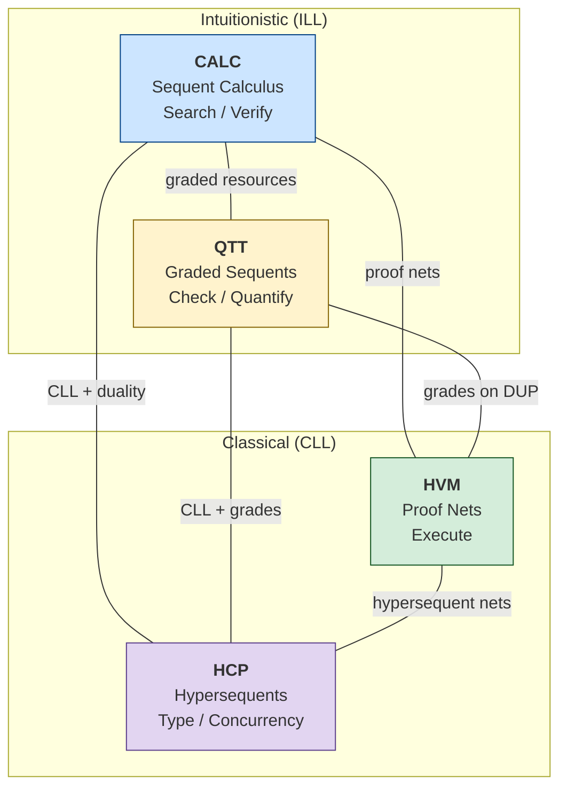
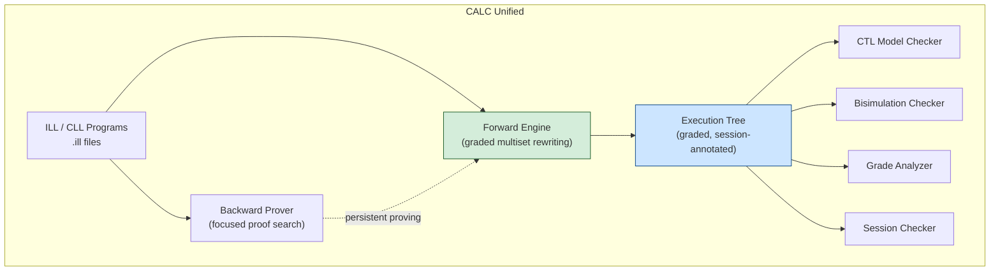

# A Unified Linear Logic Perspective: CALC, HVM, HCP, and QTT

Four systems -- CALC, HVM, HCP, and QTT -- are built on linear logic. Each occupies a different vertex of a design space whose axes are logic flavor, proof presentation, operational mode, and resource granularity. This document maps the shared structure, identifies concrete synergies between the systems, and derives a phased roadmap for CALC.

---

## 1. The Four Systems

### 1.1 CALC -- Verification via Proof Search

CALC is a proof engine for Intuitionistic Linear Logic (ILL) in sequent-calculus presentation. Its forward engine implements multiset rewriting: linear facts are tokens consumed and produced by rules. The exhaustive explorer (`symexec.js`) builds a tree of ALL reachable states (THY_0001). Its backward prover (L1--L3) searches for proofs by goal-directed decomposition with Andreoli focusing.

- **Logic:** ILL (multiplicatives, additives, exponentials, lax monad)
- **Presentation:** Sequent calculus
- **Mode:** Search (find all proofs / all executions)
- **Resources:** Binary -- linear (grade 1) vs persistent (grade omega)
- **Strength:** Exhaustive state-space exploration, verification, model checking

### 1.2 HVM -- Computation via Optimal Reduction

HVM (Higher-order Virtual Machine) compiles functional programs into interaction nets -- Lafont's graphical formalism where computation proceeds by local rewriting of agent pairs. The three interaction combinators (CON, DUP, ERA) are universal (RES_0057 Section 2.2). Cut elimination in linear logic proof nets IS interaction in the net.

- **Logic:** CLL (multiplicative-exponential fragment, via proof nets)
- **Presentation:** Proof nets / interaction nets
- **Mode:** Execute (reduce to normal form, optimally)
- **Resources:** Graph-level -- DUP for copying, ERA for erasure
- **Strength:** Automatic parallelism, optimal sharing, no GC

### 1.3 HCP -- Concurrency via Session Types

HCP (Hypersequent Classical Processes) extends Wadler's CP with hypersequents -- multisets of sequents separated by `|` -- to type concurrent processes with independent parallel composition. The mix rule `G | H` types `P || Q` when P and Q share no channels (RES_0058 Section 3).

- **Logic:** CLL + hypersequent extension
- **Presentation:** Hypersequent calculus
- **Mode:** Type (verify session fidelity, deadlock freedom)
- **Resources:** Session-typed channels (linear, replicated, or closed)
- **Strength:** Deadlock freedom by construction, process equivalence (fully abstract LTS semantics)

### 1.4 QTT -- Quantitative Typing via Graded Contexts

QTT (Quantitative Type Theory) annotates every variable binding with a semiring grade: `x :_r A` means "x is used r times." The semiring `(R, +, *, 0, 1)` unifies linear (1), erased (0), and unrestricted (omega) in a single framework (RES_0056 Section A). Idris 2 implements QTT with the `{0, 1, omega}` semiring.

- **Logic:** Graded linear logic (dependent types with semiring annotations)
- **Presentation:** Natural deduction / sequent calculus (no published sequent calculus for full QTT)
- **Mode:** Check (verify that grades are consistent)
- **Resources:** Semiring-graded -- arbitrary precision on usage counts
- **Strength:** Erasure, dependent types, quantitative reasoning

---

## 2. The Linear Logic Foundation

All four systems are projections of linear logic. Their connectives are the same concepts under different names.

### 2.1 Connective Correspondence

| Linear Logic | CALC | HVM | HCP | QTT |
|---|---|---|---|---|
| **Tensor** `A * B` | Resource pair (both available) | CON node (multiplicative pair) | Send A, continue with B | Sigma pair `(A, B)` |
| **Loli** `A -o B` | Linear function / continuation | CON node (dual: application) | Session channel (receive A, output B) | Pi type at grade 1: `(x :_1 A) -> B` |
| **With** `A & B` | External choice (offer) | N/A (additive, no proof-net encoding) | Offer choice to peer | N/A directly |
| **Oplus** `A + B` | Internal choice (select) | N/A (additive) | Select branch | N/A directly |
| **Bang** `!A` | Persistent resource (unlimited) | DUP node (incremental copying) | Server / replication | Grade omega: `x :_omega A` |
| **One** `1` | Unit fact | ERA target | Close channel | Unit type |
| **Par** `A par B` | N/A (ILL has no par) | CON node (dual reading) | Receive A, continue with B | N/A |
| **Negation** `A^perp` | N/A (ILL has no involution) | Wire reversal (dual port) | Dual session type | N/A |

### 2.2 Structural Operations as System Features

| Operation | CALC | HVM | HCP | QTT |
|---|---|---|---|---|
| **Cut** | Forward rule application (consume + produce) | Active pair annihilation | Channel communication | Substitution (scaled by grade) |
| **Identity** | Forwarding (axiom) | Wire (direct connection) | Link process `x <-> y` | Variable use at grade 1 |
| **Contraction** | Persistent fact copied | DUP-CON commutation | Not in CLL (not a structural rule) | Grade omega (unrestricted) |
| **Weakening** | Fact unused (permitted for persistent) | ERA propagation | Not in CLL | Grade 0 (erasure) |
| **Context split** | Multiset partition for tensor-R | Wire topology | Hypersequent components | Pointwise addition `Gamma_1 + Gamma_2` |

### 2.3 Cut Elimination = Computation

The deepest correspondence: **cut elimination** in linear logic is the universal computational mechanism, but each system realizes it differently.

- **CALC forward chaining:** A cut between a rule `A -o {B}` and a fact `A` in state produces `B`. This is `mutateState`: consume antecedents, produce consequents.
- **HVM interaction:** A cut between two proof-net nodes connected at a cut link triggers an interaction rule. CON-CON annihilates (tensor meets its destructor); CON-DUP commutes (copying).
- **HCP communication:** A cut between two processes sharing a channel triggers message exchange. `x[y].P` (send on x) meets `x(y).Q` (receive on x); the channel reduces.
- **QTT substitution:** A cut between `Gamma |- A` and `Delta, x :_r A |- C` produces `Gamma + r * Delta |- C`. The grade scales the substituted context.

---

## 3. The Axes of Variation

The four systems differ along five independent axes. Each axis represents a design choice, not a quality ranking.

### 3.1 Axis 1: Intuitionistic vs Classical

```
Intuitionistic (ILL)                Classical (CLL)
   CALC, QTT                        HVM, HCP
   |                                |
   Single succedent                 Multiple succedent / one-sided
   No par, no negation              Par, negation, duality
   Resource consumption model       Communication model
```

ILL captures the "consumer" perspective: use resources to produce a single result. CLL captures the "communication" perspective: both endpoints of a channel are typed. CALC and QTT sit on the intuitionistic side; HVM and HCP on the classical side.

### 3.2 Axis 2: Proof Presentation

```
Sequent Calculus          Proof Nets          Hypersequents
   CALC, QTT               HVM                  HCP
   |                        |                    |
   Explicit rules           Graph rewriting      Multiset of sequents
   Easy search              Optimal sharing      Parallel composition
   Commutative cases        Quotient by perm.    Independence structure
```

Sequent calculus has explicit rule applications (good for search and verification). Proof nets quotient away irrelevant rule orderings (good for computation). Hypersequents add parallel composition as structure.

### 3.3 Axis 3: Operational Mode

```
Search (find all)        Execute (reduce one)        Check (verify given)
   CALC                      HVM                         QTT, HCP
   |                          |                           |
   Nondeterministic          Deterministic               Decidable
   Execution trees           Normal forms                Type judgments
   Verification              Computation                 Certification
```

CALC explores all possible executions (universal quantification over rule choices). HVM finds the single normal form (deterministic, confluent). QTT and HCP verify that a given term/process is well-typed.

### 3.4 Axis 4: Resource Granularity

```
Binary {1, omega}         Graded {0, 1, ..., omega}        Graph-level
   CALC (current)              QTT, Granule                    HVM
   |                            |                               |
   Linear vs persistent        Semiring-indexed                DUP/ERA agents
   Simple, fast                Quantitative, expressive        Incremental
```

CALC distinguishes only linear and persistent. QTT uses semiring grades for arbitrary precision. HVM implements resource control at the graph level via explicit DUP and ERA agents.

### 3.5 Axis 5: Sequential vs Parallel

```
Sequential                Embarrassingly Parallel        Fine-Grained Parallel
   CALC (current)              CALC (potential)               HVM
   |                            |                              |
   DFS with undo              Fork branches                  Atomic linker
   Single-threaded             Coarse: per-branch             Fine: per-interaction
```

CALC's exploration is sequential (mutation+undo DFS). Its branches are embarrassingly parallel (independent after forking). HVM achieves fine-grained parallelism via the atomic linker: independent active pairs reduce simultaneously.

### 3.6 The Cube Diagram



Each edge represents a research direction: moving from one vertex toward another by importing the neighboring system's features.

---

## 4. Synergies and Cross-Pollination

The four-system structure reveals eight synergies. Each combines insights from two or more research documents to produce something none of them contains individually.

### 4.1 Graded Sessions (RES_0054 + RES_0058)

**Combines:** QTT's semiring grades with HCP's session types.

**Result:** Session channels annotated with bounded usage: "this channel is used at most 3 times." A loli continuation `!_3 G -o {B}` fires up to 3 times, then exhausts its grade. Das and Pfenning's Nomos (RES_0033) implements a version of this with amortized resource analysis; the contribution here is connecting Nomos-style resource annotations to QTT's semiring framework rather than AARA's potential annotations.

**For CALC:** Extend loli continuations with grade annotations. A graded loli `!_r G -o {B}` fires when G is available, consuming one unit of its grade per firing. At grade 0, the loli is erased. At grade omega, it behaves as today's persistent rules. This requires RES_0054 Option B (grade tracking in the engine) plus the session-typed loli formalization from RES_0058 Direction D.

**Concreteness:** For EVM verification, a `CALL` instruction that invokes an external contract could be modeled as a graded session: `!_n call(target, value) -o {callback(result)}` where `n` bounds reentrancy depth. Checking `AG(call_depth <= n)` via RES_0055's CTL model checker verifies bounded reentrancy.

### 4.2 Parallel Model Checking (RES_0055 + RES_0057)

**Combines:** CALC's CTL model checking with HVM's parallelism.

**Result:** CTL evaluation over execution trees, with independent subtrees checked in parallel. The fixed-point iterations (EF, AG, AF, EG) operate bottom-up on the tree; independent subtrees have no data dependency during the iteration.

**For CALC:** After implementing RES_0055 Phase 1 (CTL over explicit trees), parallelize the evaluation. Each subtree's Sat(phi) computation is independent until results merge at branch nodes. HVM's atomic linker is overkill here; Web Workers or Node worker threads suffice for CALC's coarse-grained parallelism.

**Concreteness:** For the EVM multisig contract (210-node tree), checking `AG(sum_tokens = CONST)` traverses all 210 nodes. With 4 workers, each handles ~50 nodes. Speedup is modest for small trees but significant for programs with millions of reachable states.

### 4.3 Session Bisimulation (RES_0053 + RES_0058)

**Combines:** CALC's tree-based bisimulation with HCP's session-typed process equivalence.

**Result:** Type-directed bisimulation checking. HCP's fully abstract semantics (bisimilarity = denotational equivalence = barbed congruence) means that for session-typed programs, bisimulation checking can exploit the session type to prune the comparison. Two processes whose session types differ are immediately non-bisimilar; processes with the same session type need checking only at the points where the session type permits choice (oplus/with).

**For CALC:** When comparing two execution trees (RES_0053 Section 2), if both programs are annotated with session types (RES_0058 Direction C), the bisimulation check can skip subtrees where the session type guarantees identical behavior (deterministic protocol steps). Only branching points (oplus/with) require actual tree comparison.

**Concreteness:** Two EVM contracts implementing the same ERC-20 interface (session type) can be checked for behavioral equivalence by comparing only their transfer/approve/allowance paths, skipping internal computation steps that the session type abstracts away.

### 4.4 Graded Model Checking (RES_0054 + RES_0055)

**Combines:** QTT grades with CTL temporal properties.

**Result:** Temporal properties about resource quantities. Instead of checking `AG(phi)` where phi is a predicate, check `AG(grade(resource) >= 0)` or `AF(grade(gas) = 0)`. The grades provide the atomic propositions for CTL formulas.

**For CALC:** Implement RES_0054 Option C (post-hoc resource counting) first, producing per-node grade annotations on the execution tree. Then feed these annotations as atomic propositions to RES_0055's CTL checker. The property `AG(gas_count >= 0)` (gas never goes negative) becomes a CTL safety check over a graded execution tree.

**Concreteness:** "On all paths, the total token supply is conserved" = `AG(sum(token_grades) = INITIAL_SUPPLY)`. This combines P-invariant checking (RES_0050) with temporal model checking, expressed cleanly via graded CTL.

### 4.5 Proof-Net Forward Chaining (RES_0057 + THY_0001)

**Combines:** HVM's interaction nets with CALC's forward engine.

**Result:** Forward chaining on proof nets instead of multisets. Rather than maintaining a bag of facts and rewriting via pattern matching, represent the state as an interaction net and advance by local graph rewriting. Each rule application becomes a sequence of interactions. The sharing structure of the proof net captures common subexpressions that multiset representation misses.

**For CALC:** This is a deep architectural change -- not near-term. The value lies in two areas: (a) optimal sharing of persistent resources (HVM's DUP-based lazy copying vs CALC's eager persistent fact access), and (b) potential compilation of CALC programs to HVM for execution after verification.

**Concreteness:** CALC proves `AG(phi)` for a program via exhaustive exploration. The verified proof term (a lambda term via Curry-Howard) is translated to an interaction net. HVM executes the interaction net optimally. The proof guarantees correctness; HVM guarantees efficient execution.

### 4.6 Session-Typed Execution Trees (RES_0058 + THY_0001)

**Combines:** HCP's session types with CALC's execution tree constructors.

**Result:** Each branch of the execution tree is a session-typed process. The tree's `step` nodes are protocol steps; `fork` nodes are additive choices (oplus); `branch` nodes are nondeterministic selections. A stuck leaf (unfired lolis) is a deadlock; a quiescent leaf (no lolis) is successful termination.

**For CALC:** Annotate the execution tree judgment `Sigma; Delta |-_fwd T : A` with session types on loli continuations. At each `step` node, the session type advances. At `fork` nodes, the session type branches (oplus). Stuck leaves are flagged as session-type violations with logical explanations: "Process A is waiting to receive X, but no process offers X."

**Concreteness:** The EVM `iszero` rule produces a loli continuation `(!eq V 0 -o {stack SH 1}) + (!neq V 0 -o {stack SH 0})`. The session type is `select(eq_branch, neq_branch)`. If neither branch fires (a bug in the persistent proving layer), the execution tree has a stuck leaf that the session annotation identifies precisely.

### 4.7 QTT-Graded Interaction Nets (RES_0056 + RES_0057)

**Combines:** QTT grades with HVM's DUP nodes.

**Result:** Bounded duplication. Standard interaction combinators allow unbounded DUP (copy as many times as needed). QTT grades restrict this: `!_r A` means at most `r` copies. In interaction net terms, a DUP node with grade `r` can produce at most `r` copies before becoming an ERA (no more duplication).

**For CALC:** This is primarily a theoretical contribution -- connecting bounded linear logic (Girard-Scedrov-Scott 1992) with interaction combinators. The practical value is in bounding execution: a graded DUP prevents infinite copying, giving a natural termination guarantee for interaction net reduction. For CALC's forward engine, this corresponds to the grade-based pruning in RES_0054 Option B: don't explore branches where a bounded resource is exhausted.

### 4.8 Hypersequent Model Checking (RES_0055 + RES_0058)

**Combines:** HCP's hypersequents with CTL model checking.

**Result:** Verify temporal properties of concurrent systems where processes are typed by hypersequent components. Each component evolves independently (mix rule); components that share channels co-evolve (cut rule). CTL properties can be checked per-component (local properties) and across components (global properties).

**For CALC:** After implementing the CLL calculus (RES_0058 Direction A) and CTL checking (RES_0055 Phase 1), combine them. A hypersequent execution tree has branches at two levels: within-component (rule nondeterminism) and across-component (communication nondeterminism). CTL formulas like `AG(not deadlock)` hold structurally by HCP's type system; other properties (`AF(all_channels_closed)`) require explicit checking.

**Concreteness:** A multi-party smart contract (e.g., auction with bidders, auctioneer, and escrow) is modeled as a hypersequent with one component per party. `AG(escrow_balance >= sum(bids))` is a safety property checked per-component. `AF(auction_resolved)` is a liveness property requiring cross-component analysis.

---

## 5. The Unified Vision for CALC

### 5.1 CALC's Current Position

CALC sits at the verification vertex: it searches for proofs and explores all executions. Its forward engine is a Petri net (multiset rewriting); its backward prover is focused proof search. The exhaustive execution tree is the core data structure enabling bisimulation, model checking, and graded analysis.

### 5.2 What CALC Becomes

The unified vision: **CALC as a resource-aware verification engine for concurrent linear logic programs.** The system absorbs the best ideas from the other three vertices:

**From QTT: Quantitative Resource Tracking.** Replace the binary persistent/linear split with semiring-graded contexts. Every fact carries a grade; every rule application consumes and produces graded resources. The `{0, 1, omega}` semiring is backward-compatible with today's system. Natural numbers, intervals, and the tropical semiring unlock gas analysis, usage counting, and cost bounds.

**From HCP: Concurrency Structure.** Model concurrent programs as session-typed processes. Loli continuations become session channels. The execution tree gains a parallel dimension: independent branches are hypersequent components composed via mix. Deadlock detection becomes session-type violation reporting.

**From HVM: Parallel Execution.** Parallelize the exhaustive explorer across independent branches. Use content-addressed hashing as the synchronization mechanism (converging branches are detected by hash equality). Long-term: compile verified programs to interaction nets for optimal execution.

**From Bisimulation (RES_0053): Program Equivalence.** Compare programs by comparing their execution trees. Content-addressed hashing gives O(1) state equality. Up-to techniques (persistent context, rule ordering) reduce the comparison space.

**From Model Checking (RES_0055): Temporal Properties.** CTL formulas over execution trees verify safety, liveness, and fairness. The tree IS the Kripke structure; no additional exploration needed.

**From Graded Resources (RES_0054): Quantitative Analysis.** Post-hoc resource counting on execution trees, evolving to grade-aware execution and grade-based pruning.

### 5.3 The Resulting System



The execution tree remains the central data structure. Four analysis modules read the tree:
1. **CTL model checker** -- temporal properties (RES_0055)
2. **Bisimulation checker** -- program equivalence (RES_0053)
3. **Grade analyzer** -- quantitative resource statistics (RES_0054)
4. **Session checker** -- protocol conformance and deadlock detection (RES_0058)

---

## 6. Concrete Roadmap

Dependencies flow downward. Each phase builds on the previous. Effort estimates assume a single developer.

### Phase 1: Post-Hoc Analysis (no engine changes)

Post-hoc analysis modules that read the existing execution tree. Zero risk to the engine. Immediately useful for EVM verification.

| Item | Source | LOC | Prerequisites | Priority |
|---|---|---|---|---|
| **CTL model checker** | RES_0055 Phase 1 | ~200 | None | HIGH |
| **Graded resource counter** | RES_0054 Option C | ~150 | None | HIGH |
| **Bisimulation checker** | RES_0053 Section 8 | ~80 | None | MEDIUM |
| **Session trace analyzer** | RES_0058 Direction C | ~200 | None | MEDIUM |

**CTL model checker** (`lib/engine/model-check.js`): Implement EX, AX, EF, AF, EG, AG over the explicit execution tree. Cycle nodes require careful handling: cycles satisfy greatest-fixed-point properties (EG, AG) but violate least-fixed-point properties (EF, AF). Atomic propositions are predicate presence/absence in state, with optional counting extensions for graded CTL (Synergy 4.4).

**Graded resource counter** (`lib/engine/analyze.js`): Walk the execution tree, accumulate per-path resource counts. For each fact type, compute min/max across paths (interval semiring). Report per-rule firing counts (natural number semiring). Verify conservation at leaves (P-invariant check from RES_0050).

**Bisimulation checker** (`lib/engine/bisim.js`): Compare two execution trees by synchronized traversal. Use content-addressed hashing for O(1) state equality. Implement strong bisimulation and trace equivalence. Report first divergence point with path context.

**Session trace analyzer** (`lib/engine/session-check.js`): Given a session type specification (sequence of expected inputs/outputs), verify each execution trace against it. Report non-conforming traces with the divergence point. Works with ILL session types (loli-based, Caires-Pfenning style) -- no CLL required.

### Phase 2: Engine Extensions

Extend the forward engine with graded resources and parallel exploration. These touch engine internals but are backward-compatible: programs without grades work as before.

| Item | Source | LOC | Prerequisites | Priority |
|---|---|---|---|---|
| **Graded contexts in engine** | RES_0054 Option B / RES_0056 Path 1 | ~300 | Phase 1 grade counter | HIGH |
| **Parallel branch exploration** | RES_0057 Section 7.1 | ~400 | None | MEDIUM |
| **Session-typed loli continuations** | RES_0058 Direction D | ~250 | Phase 1 session analyzer | MEDIUM |
| **Bounded model checking** | RES_0055 Phase 3 | ~80 | Phase 1 CTL checker | LOW |

**Graded contexts in engine:** Merge `state.linear` and `state.persistent` into `state.resources` with per-fact grade annotations. `provePersistentGoals` checks `grade >= needed`. `applyMatch` updates grades on consumption. The `{0, 1, omega}` semiring is the default (backward-compatible). Natural numbers and intervals are additional options. Grade-based pruning in symexec: skip branches where a resource is exhausted.

**Parallel branch exploration:** Fork independent branches to Web Workers (browser) or worker threads (Node). Each worker gets a state snapshot (O(1) via content-addressed sharing). Workers explore subtrees and return results. The coordinator merges subtree results into the full execution tree. No shared mutable state between workers.

**Session-typed loli continuations:** Annotate loli continuations with session types during forward execution. Track session progress: as lolis fire, the session type advances. Stuck sessions (unfired lolis whose triggers are never produced) are flagged as violations.

**Bounded model checking:** Check CTL properties only to depth k. Sound for safety: violations within k steps are real. For liveness: inconclusive beyond k.

### Phase 3: New Calculi

Extend CALC's calculus definitions to support CLL and hypersequents. The prover layers (L1-L3) are already calculus-generic; the main work is in sequent representation.

| Item | Source | LOC | Prerequisites | Priority |
|---|---|---|---|---|
| **CLL calculus definition** | RES_0058 Direction A | ~300 | Sequent generalization | MEDIUM |
| **Sequent generalization** | RES_0058 Section 5.4 | ~200 | None | MEDIUM |
| **Hypersequent extension** | RES_0058 Direction B | ~500 | CLL calculus | LOW |
| **muMALL fixed points** | RES_0055 Phase 5 | ~400 | TODO_0009 Phase 4 | LOW |

**CLL calculus definition:** Define `cll.calc` (par, bot, why-not, linear negation) and `cll.rules` (two-sided sequent rules). The prover layers pick up new connectives automatically. Polarity/invertibility are inferred from rules.

**Sequent generalization:** Extend `lib/kernel/sequent.js` from single-succedent to multi-succedent (for CLL) and to hypersequents (multisets of sequents). This is the key engineering prerequisite for CLL support.

**Hypersequent extension:** Add H-MIX and H-CUT as structural rules. The focused prover gains a macro-level choice (which component) on top of the micro-level choice (which formula).

**muMALL fixed points:** Add least (mu) and greatest (nu) fixed-point operators to MALL. Express CTL operators natively in the logic. Use proof search for model checking (Bedwyr approach). Depends on the coinduction infrastructure from TODO_0009.

### Phase 4: Deep Integration

Longer-term research directions requiring substantial theoretical and engineering work.

| Item | Source | Effort | Prerequisites | Priority |
|---|---|---|---|---|
| **Dependent types** | RES_0056 Path 2 | VERY HIGH | Graded contexts | LOW |
| **Proof net compilation** | RES_0057 Scenario 2 | HIGH | CLL calculus | LOW |
| **HVM as normalization backend** | RES_0057 Scenario 3 | HIGH | Proof net compilation | LOW |
| **Backward coverability** | RES_0055 Phase 4 | ~300 LOC | None | MEDIUM |

**Dependent types:** Implement Pi and Sigma types in the kernel. Requires terms-in-types, type-level substitution, universe hierarchy, and a normalizer for definitional equality (RES_0056 Sections D.1-D.7). This is essentially building a new type theory.

**Proof net compilation:** Translate CALC's content-addressed formulas to interaction net nodes. The proof net representation captures sharing structure that content-addressed hashing misses (beta-equivalent terms have different hashes but the same proof net normal form).

**HVM as normalization backend:** When CALC needs to normalize terms (for QTT's definitional equality), HVM's optimal reducer serves as the normalization engine. CALC constructs terms; HVM normalizes them; CALC checks equality on normal forms.

**Backward coverability:** Implement the backward set-saturation algorithm for safety checking WITHOUT building the full execution tree. Start from bad states, compute predecessors until fixpoint or initial state is covered. Valuable for infinite-state programs.

---

## 7. Open Research Questions

### Q1: How do grades interact with focusing?

Andreoli's focusing partitions connectives by polarity. In graded linear logic, `!_0 A` is always invertible (erased), `!_1 A` follows linear focusing, `!_omega A` follows standard bang focusing. But what about `!_3 A`? Is dereliction invertible at grade 3? The answer depends on whether the grade permits further use, creating a dynamic polarity that depends on the grade value rather than the connective alone. No published focusing result covers this (noted in RES_0054 Section 9 and RES_0056 Section H.4). A focusing discipline for graded linear logic would be a genuine theoretical contribution.

### Q2: Can forward chaining be defined on proof nets?

CALC's forward engine operates on multiset states. HVM operates on interaction nets. Is there a natural notion of "forward chaining" on proof nets? The idea: rather than maintaining a bag of facts and rewriting via pattern matching, represent the state as a proof net and advance by local graph rewriting. The challenge: multiset rewriting is inherently nondeterministic (multiple rules can fire), while interaction net reduction is confluent (deterministic). Encoding don't-know nondeterminism in a confluent system requires care -- perhaps via superpositions (HVM's DUP) representing unexplored branches.

### Q3: What is the right session type for a linear logic program?

Given a set of forward rules, can we automatically infer a session type that characterizes the program's communication behavior? This is analogous to grade inference (RES_0056 Section H.5) but for session types rather than resource grades. The program's loli continuations define the channel endpoints; the session type would capture the protocol they implement. Automatic inference reduces to a fixed-point computation over the rule structure.

### Q4: Can hypersequents work with ILL?

HCP uses CLL. Could hypersequents be added to ILL directly? ILL lacks par and duality, so the mix rule's interaction with CLL duality would be absent. But the structural aspect -- recording independence -- could still apply: an ILL hypersequent `G1 | G2` means "these sequents use disjoint resources." This would model CALC's independent execution branches without requiring CLL (RES_0058 Section 10 Q1).

### Q5: Is there a graded-session bisimulation?

Combining Synergies 4.1 and 4.3: if session channels carry grades and two programs have the same graded session type, is there a natural bisimulation that respects both the session structure and the grade bounds? Yoshida, Honda, and Berger (2002) showed that linearity makes bisimulation strictly coarser (easier to establish). Grades should make it even coarser: two programs that differ only in how many times they internally copy a graded resource are equivalent if the final grade counts match.

### Q6: How does QCHR's game-tree semantics relate to CTL model checking?

QCHR (Barichard & Stephan, TOCL 2025) gives game-tree semantics where exists = player A and forall = player B. CALC's execution tree is a game tree where CALC always plays the forall role (explore everything). CTL model checking is closely related to game solving (mu-calculus model checking = parity games). Can CALC's execution tree be viewed as a game where the model checker plays against the system? The connection would unify THY_0001's execution tree judgment with RES_0055's CTL checking.

### Q7: What is the interaction between parallel exploration and cycle detection?

CALC's cycle detection uses `pathVisited` (a set of content-addressed state hashes on the current DFS path). In parallel exploration, each worker has its own path. But cycles might cross worker boundaries: worker A explores state S, worker B later encounters S on a different path. The workers need a shared cycle-detection structure -- but sharing defeats the purpose of parallelism. Content-addressed hashing helps: workers can share a lock-free hash set of visited states. The question is whether this introduces false negatives (missed cycles) or false positives (spurious back-edges).

---

## 8. New TODOs

The following TODO items should be created, ordered by dependency and priority.

### High Priority (Phase 1)

1. **TODO: CTL Model Checking over Execution Trees**
   - Implement `lib/engine/model-check.js` with EX, AX, EF, AF, EG, AG
   - Handle cycle nodes correctly for fixed-point semantics
   - Add property DSL for EVM-specific properties
   - References: RES_0055 Phase 1, Synergy 4.2, Synergy 4.4
   - Depends on: nothing

2. **TODO: Post-Hoc Graded Resource Analysis**
   - Implement `lib/engine/analyze.js` with per-path resource counting
   - Support natural number, interval, and tropical semirings
   - Verify P-invariants at leaves
   - References: RES_0054 Option C, Synergy 4.4
   - Depends on: nothing

3. **TODO: Bisimulation Checker for Execution Trees**
   - Implement `lib/engine/bisim.js` with strong bisimulation and trace equivalence
   - Report first divergence point with path context
   - Content-addressed O(1) state comparison
   - References: RES_0053 Section 8, Synergy 4.3
   - Depends on: nothing

### Medium Priority (Phase 1-2)

4. **TODO: Session Trace Analysis**
   - Implement `lib/engine/session-check.js` for trace-vs-session-type checking
   - Work with ILL session types (loli-based)
   - Detect stuck lolis as session violations
   - References: RES_0058 Direction C, Synergy 4.6
   - Depends on: nothing

5. **TODO: Graded Contexts in Forward Engine**
   - Merge `state.linear` and `state.persistent` into `state.resources`
   - Per-fact semiring grade annotations
   - Grade-aware `provePersistentGoals` and `applyMatch`
   - Grade-based symexec pruning
   - References: RES_0054 Option B, RES_0056 Path 1, Synergy 4.1
   - Depends on: TODO 2 (validates grade model before engine changes)

6. **TODO: Parallel Branch Exploration**
   - Fork independent branches to worker threads
   - State snapshots via content-addressed sharing
   - Shared cycle-detection hash set
   - References: RES_0057 Section 7.1, Synergy 4.2, Open Question Q7
   - Depends on: nothing (but benefits from TODO 1 for parallel CTL)

### Lower Priority (Phase 3-4)

7. **TODO: CLL Calculus Definition**
   - Define `cll.calc` and `cll.rules`
   - Generalize `sequent.js` for multi-succedent / one-sided sequents
   - References: RES_0058 Direction A, RES_0057 Section 3
   - Depends on: nothing

8. **TODO: Session-Typed Loli Continuations**
   - Annotate lolis with session types in the forward engine
   - Track session progress during execution
   - References: RES_0058 Direction D, Synergy 4.6
   - Depends on: TODO 4 (validates session model)

9. **TODO: Backward Coverability Analysis**
   - Implement backward set-saturation for safety checking
   - No execution tree required -- works on rules directly
   - References: RES_0055 Phase 4
   - Depends on: nothing

10. **TODO: muMALL Fixed Points**
    - Add mu/nu operators to MALL
    - Express CTL natively in the logic
    - Proof-search-based model checking (Bedwyr approach)
    - References: RES_0055 Phase 5, TODO_0009 Phase 4
    - Depends on: TODO_0009 coinduction infrastructure

---

## References

### Primary Sources (This Synthesis)
- RES_0053 -- Bisimulation via Execution Trees
- RES_0054 -- Graded Resource Analysis for Linear Logic
- RES_0055 -- Symbolic Model Checking via Linear Logic
- RES_0056 -- Quantitative Type Theory: Sequent Calculus and Gap Analysis for CALC
- RES_0057 -- HVM and Interaction Nets: Optimal Reduction, Linear Logic, and CALC
- RES_0058 -- Hypersequent Classical Processes: CLL, Session Types, and Deadlock-Free Concurrency
- THY_0001 -- Exhaustive Forward Chaining in MALL with the Lax Monad

### Architecture
- `doc/documentation/architecture.md` -- Prover lasagne (L1-L5)
- `doc/documentation/forward-chaining-engine.md` -- Forward engine modules

### External (Foundational)
- Girard (1987) -- Linear Logic. TCS 50(1):1-102
- Lafont (1990) -- Interaction Nets. POPL 1990
- Lafont (1997) -- Interaction Combinators. I&C 137(1):69-101
- Andreoli (1992) -- Focusing Proofs in Linear Logic. JLC 2(3):297-347
- Watkins, Cervesato, Pfenning, Walker (2004) -- CLF. LNCS 3085
- Wadler (2014) -- Propositions as Sessions. JFP 24(2-3):384-418
- Kokke, Montesi, Peressotti (2019) -- Better Late Than Never (HCP). POPL 2019
- McBride (2016) -- I Got Plenty o' Nuttin' (QTT). LNCS 9600
- Atkey (2018) -- Syntax and Semantics of Quantitative Type Theory. LICS 2018
- Taelin (2023) -- HVM2: A Parallel Evaluator for Interaction Combinators
- Clarke, Emerson, Sistla (1986) -- Automatic Verification (CTL). TOPLAS 8(2)
- Sangiorgi (2012) -- Introduction to Bisimulation and Coinduction. CUP
